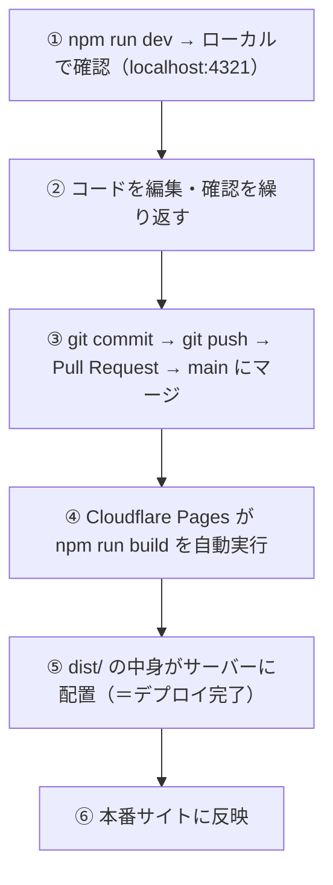

# Astro

## Astroとは

**Webサイトを効率よく作るためのフレームワーク** です。

> **フレームワークとは？**  
> ゼロから家を建てる代わりに、あらかじめ柱や壁の仕組みが用意されたキットを使う、というイメージです。  
> よく使う機能がすでに用意されているので、一から作るよりも速く・安全に開発できます。

Astro はブログやコーポレートサイトなど「コンテンツ重視のサイト」に特化しており、最終的には **通常の HTML/CSS ファイルとして出力されるため、表示が非常に高速** です。

---

## はじめて読む人へ

Astro は、静的サイトを作るためのフレームワークです。HTML/CSS/JavaScript を部品化し、ページやレイアウトを整理して管理できます。


### 読む前に押さえること

- ファイルの場所が URL と対応するため、ページ構造を追いやすいです。
- コンポーネントは、再利用できる画面の部品です。
- レイアウトは、ヘッダーやフッターなど共通部分をまとめる仕組みです。

### 読み終えたら説明できること

- Astro のフォルダ構造を説明できる。
- ページ、コンポーネント、レイアウトの役割を区別できる。
- 開発サーバーを起動してページを確認できる。

---

## プロジェクト構造

`ota_hp` を開くと、以下のようなフォルダ構成になっています。

Astro では、ファイルの置き場所が役割を表します。最初にフォルダ構造を読めるようになると、「ページを直すのか」「部品を直すのか」「記事を追加するのか」を迷いにくくなります。

```
ota_hp/
├── public/          # 画像・フォント・favicon など「そのまま使うファイル」
├── src/
│   ├── components/  # ヘッダー・フッターなど、繰り返し使うパーツ
│   ├── layouts/     # ページ全体の枠組み（共通レイアウト）
│   ├── pages/       # 各ページのファイル（URLと対応する）
│   └── content/     # お知らせ・ブログ記事などのコンテンツ
├── astro.config.mjs # Astroの設定ファイル（基本的に触らない）
└── package.json     # 使用しているパッケージの一覧（基本的に触らない）
```

`src/pages` は URL と対応するページ、`src/components` は再利用部品、`src/layouts` はページ全体の枠、`src/content` は記事データを置く場所です。

### どこを主に触るか

| やりたいこと | 触るフォルダ |
|-------------|------------|
| ページの内容を変える | `src/pages/` |
| ヘッダー・フッターを変える | `src/components/` |
| お知らせを追加する | `src/content/` |
| 画像を追加する | `public/` |

---

## URL とファイルの対応

`src/pages/` に置いたファイルが、そのままサイトの URL になります。

| ファイルのパス | サイトのURL |
|----------------|------------|
| `src/pages/index.astro` | `/`（トップページ） |
| `src/pages/about.astro` | `/about` |
| `src/pages/news/index.astro` | `/news` |

---

## 開発サーバーを起動する

コードを編集しながらブラウザでリアルタイムに確認する方法です。

開発サーバーは、手元の PC だけで動く確認用サーバーです。ファイルを保存するたびに変更を反映してくれるため、編集と確認を素早く繰り返せます。

```bash
# ota_hp フォルダに移動してから
npm run dev
```

ターミナルに `http://localhost:4321` と表示されたら、ブラウザでそのアドレスを開いてください。  
ファイルを保存するたびに、ブラウザが自動で更新されます。

> **localhost とは？**  
> 自分の PC の中だけで動いているサーバーのことです。インターネットには公開されていないので、安心して変更を確認できます。

終了するときは、ターミナルで `Ctrl + C` を押してください。

---

## .astro ファイルの基本構造

Astro のページファイルは `.astro` という拡張子で、大きく 2 つの部分に分かれています。

`.astro` ファイルでは、上部のフロントマターでデータや JavaScript の処理を用意し、下部のテンプレートで HTML として表示します。

```astro
---
// ① フロントマター（JavaScript を書く場所）
const title = "会社概要";
const year = new Date().getFullYear();
---

<!-- ② HTML テンプレート（ページの見た目を書く場所） -->
<html lang="ja">
  <head>
    <title>{title}</title>
  </head>
  <body>
    <h1>{title}</h1>
    <p>© {year} 近江テック・アカデミー</p>
  </body>
</html>
```

`---` で囲まれた上の部分に JavaScript を書き、下の HTML テンプレートの中で `{変数名}` として使えます。

この例では、`title` と `year` をフロントマターで作り、HTML 内で `{title}`、`{year}` として表示しています。データと見た目を同じファイル内で近くに置けるのが Astro の読みやすさです。

---

## コンポーネントを使う

コンポーネントは、画面の一部を再利用できる部品として切り出したものです。たとえばヘッダー、カード、ボタン、記事一覧などは、複数のページで使い回す可能性があります。

同じHTMLを何度もコピーすると、あとで修正が必要になったときに全ての場所を直さなければなりません。コンポーネントにしておくと、部品を1か所直すだけで、それを使っているページ全体に反映できます。

ヘッダーやフッターなど **複数のページで共通して使うパーツ** は、コンポーネントとして切り出します。  
一箇所を修正するだけで、すべてのページに反映されるので便利です。

次の例では、`Header.astro` と `Footer.astro` を読み込み、ページ内でタグのように使っています。コンポーネントは HTML の部品を自作タグとして扱う感覚です。

```astro
---
// 他のファイルからコンポーネントを読み込む
import Header from '../components/Header.astro';
import Footer from '../components/Footer.astro';
---

<Header />

<main>
  <h1>ページの内容</h1>
</main>

<Footer />
```

`import Header from ...` は、別ファイルで定義されたコンポーネントを読み込む文です。`<Header />` と書いた位置に、そのコンポーネントの内容が差し込まれます。

---

## レイアウト（共通の枠組み）

複数のページで同じヘッダー・フッター・`<head>` タグを使いたい場合は、 **レイアウト** を使います。

レイアウトは、ページ全体の共通枠です。各ページで毎回 `<html>`、`<head>`、ヘッダー、フッターを書く代わりに、共通部分を 1 つのファイルへまとめます。

```astro
<!-- src/layouts/BaseLayout.astro -->
---
interface Props {
  title: string;
  description?: string;
}
const { title, description = "近江テック・アカデミー公式サイト" } = Astro.props;
---

<html lang="ja">
  <head>
    <meta charset="UTF-8" />
    <meta name="description" content={description} />
    <title>{title} | 近江テック・アカデミー</title>
    <link rel="stylesheet" href="/styles/global.css" />
  </head>
  <body>
    <header><!-- 共通ヘッダー --></header>

    <main>
      <slot />  <!-- ← ここに各ページの内容が挿入される -->
    </main>

    <footer><!-- 共通フッター --></footer>
  </body>
</html>
```

`<slot />` は、レイアウトを使うページ側の内容が入る場所です。レイアウトは額縁、ページ固有の本文はその中に入る絵のように考えると分かりやすいです。

各ページからレイアウトを使う：

ページ側では、レイアウトコンポーネントで本文を囲みます。`title="会社概要"` のように、レイアウトへ必要な情報を渡します。

```astro
<!-- src/pages/about.astro -->
---
import BaseLayout from '../layouts/BaseLayout.astro';
---

<BaseLayout title="会社概要">
  <h1>会社概要</h1>
  <p>近江テック・アカデミーについて...</p>
</BaseLayout>
```

`<slot />` の位置にページ固有のコンテンツが差し込まれます。

---

## 動的ルーティング

記事ページのように「URL が動的に変わるページ」は、ファイル名を `[slug].astro` のように角括弧で囲むことで実現します。

> **slug とは：** URL に使われる記事の識別子です。`/news/2024-spring-camp` の `2024-spring-camp` の部分がスラッグです。スペースや日本語を含まず、ハイフン区切りの短い文字列で表現します。

```
src/pages/news/[slug].astro
→ /news/2024-spring-camp
→ /news/2024-open-campus
など、すべての記事に対応
```

`[slug].astro` は、1 つのファイルで複数の URL を担当するための書き方です。記事が増えても、記事ごとにページファイルを手で作る必要がありません。

### getStaticPaths でページを生成する

> **静的サイト生成（SSG：Static Site Generation）とは：** サーバーにアクセスするたびにページを作るのではなく、**ビルド時に全ページの HTML をあらかじめ生成しておく**方式です。生成済みの HTML をそのまま返すだけなので表示が速く、サーバーの負荷も小さいのが特徴です。Astro はデフォルトで SSG を採用しています。

静的サイトでは、ビルド時にどの URL のページを生成するかを `getStaticPaths` で明示します。

次のコードでは、`news` コレクションから全記事を取得し、それぞれの `slug` に対応するページをビルド時に生成しています。

```astro
<!-- src/pages/news/[slug].astro -->
---
import { getCollection } from 'astro:content';
import BaseLayout from '../../layouts/BaseLayout.astro';

// ビルド時に呼ばれ、生成するURLの一覧を返す
export async function getStaticPaths() {
  const allNews = await getCollection('news');
  return allNews.map((item) => ({
    params: { slug: item.slug },   // URL の [slug] 部分
    props: { item },               // ページに渡すデータ
  }));
}

const { item } = Astro.props;
const { Content } = await item.render();
---

<BaseLayout title={item.data.title}>
  <article>
    <h1>{item.data.title}</h1>
    <time>{item.data.date}</time>
    <Content />   <!-- Markdown の本文 -->
  </article>
</BaseLayout>
```

`params` は URL の `[slug]` 部分、`props` はページに渡すデータです。`item.render()` は Markdown 本文を Astro コンポーネントとして描画できる形に変換します。

---

## コンテンツを管理する（お知らせ・ブログなど）

`src/content/` フォルダに Markdown ファイルを置くことで、お知らせや記事を管理できます。

> **Markdown とは？**  
> `#` で見出し、`**` で太字など、シンプルな記号で文章を装飾できる書き方のルールです。  
> この Wiki も Markdown で書かれています。

```
src/content/
└── news/
    ├── 2024-01-15.md   ← お知らせ記事
    └── 2024-02-01.md   ← お知らせ記事
```

`src/content/news` に Markdown ファイルを追加すると、お知らせ記事として扱えます。ファイルごとに 1 件の記事を表す、と考えると管理しやすくなります。

各ファイルの先頭に、タイトルや日付などの情報を書きます。

Markdown ファイルの先頭にある `---` で囲まれた部分はフロントマターです。記事のタイトルや日付など、本文ではなくメタデータとして使う情報を書きます。

```md
---
title: "春のオープンキャンパスのお知らせ"
date: 2024-03-01
---

本文をここに書きます。**太字**や[リンク](https://example.com)も使えます。
```

フロントマターは一覧ページや記事ページで使われます。本文は Markdown として書き、ビルド時に HTML へ変換されます。

---

## よく使うコマンド

> **情報工学メモ：ビルドとは何か（ソースコード→成果物の変換）**  
> **ビルド** とは、人間が書いたソースコード（`.astro`・`.ts`・`.css` など）をブラウザやサーバーが実行できる形式（HTML・JavaScript・CSS）に変換するプロセス全体を指します。Astro の `npm run build` では、TypeScript のトランスパイル、コンポーネントの展開、Markdown のレンダリング、画像の最適化、ファイルの圧縮（minify）などが一括で行われ、`dist/` フォルダに配置可能な成果物が出力されます。開発時の `npm run dev` はファイルを保存するたびに即時変換するため速いですが、最適化は省略されています。本番デプロイ前には必ずビルドが必要です。

次のコマンドは、Astro 開発でよく使う npm script です。`dev` は開発用、`build` は本番用、`preview` は本番用にビルドした結果の確認に使います。

```bash
npm install        # パッケージをインストール（初回・package.json が変わったとき）
npm run dev        # 開発サーバーを起動（localhost のみ・デプロイなし）
npm run build      # 本番用にビルド → dist/ フォルダに HTML/CSS/JS を出力
npm run preview    # ビルド結果をローカルでプレビュー（本番に近い状態を確認）
```

### 開発からデプロイまでの流れ

Astro では、手元で確認したコードを GitHub に送り、main にマージされたら Cloudflare Pages が自動でビルド・公開します。次の図はその一連の流れです。



> `npm run build` は手動で実行する必要はありません。main ブランチへのマージをきっかけに Cloudflare Pages が自動で実行します。ローカルで事前にビルドを確認したい場合（エラーの予防など）のみ手動実行します。

---

## よくある疑問

**Q. `.astro` ファイルと `.html` ファイルの違いは？**  
A. `.astro` ファイルはビルド時に `.html` に変換されます。JavaScript で動的な処理を書けたり、コンポーネントを使えたりするのが利点です。

**Q. 画像はどこに置く？**  
A. `public/images/` フォルダに置くのが一般的です。`public/` に置いたファイルは `src` 属性でそのまま参照できます（例：``）。

---


## 確認問題

1. Astro は、何の問題を解決するための考え方・道具ですか。
2. このページで出てきた重要語を 3 つ選び、それぞれ 1 文で説明してください。
3. コード例やコマンド例がある場合、入力・処理・出力を分けて説明してください。
4. このページの内容が、前後の STEP や自分の作りたいものにどうつながるか説明してください。

---

## 関連ページ

- [HTML / CSS](HTML-CSS) — テンプレート内で使う基礎知識
- [Docker](Docker) — ローカル開発環境の構築
- [Cloudflare](Cloudflare) — ビルド・デプロイの仕組み

---

[← ホームへ](Home)
