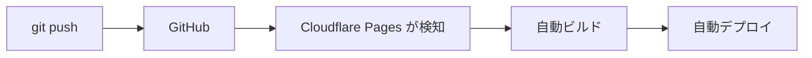

# CI/CD

## CI/CD とは

**コードの変更を自動的にテスト・ビルド・デプロイする仕組み** のことです。

| 略語 | 正式名称 | 意味 |
|------|----------|------|
| **CI** | Continuous Integration | 継続的インテグレーション：コードを統合するたびに自動でテストを実行します |
| **CD** | Continuous Delivery/Deployment | 継続的デリバリー/デプロイ：テストが通ったら自動でデプロイします |

### なぜ CI/CD が必要か

手動でやっていると：
- デプロイ前にテストを忘れます
- 環境の違いで「自分の PC では動いた」問題が起きます
- デプロイ作業が属人化します（担当者しかできません）

CI/CD があると：
- プッシュするたびに自動でテストが走ります
- 問題があればすぐ通知が来ます
- ボタン一つ（またはマージするだけ）でデプロイできます

---

## はじめて読む人へ

CI/CD は、コードを変更したときに自動でチェックし、必要なら自動で公開する仕組みです。人間の手作業を減らし、ミスを早く見つけるために使います。


### 読む前に押さえること

- CI は、テストやLintを自動で実行する仕組みです。
- CD は、確認済みの変更を公開環境へ届ける仕組みです。
- GitHub Actions では、YAML に自動化の手順を書きます。

### 読み終えたら説明できること

- CI と CD の違いを説明できる。
- GitHub Actions の基本構造を読める。
- テストやビルドが失敗したときにログを確認できる。

---

## このプロジェクトの CI/CD

`ota_hp` はすでに CI/CD が動いています。

このプロジェクトでは、GitHub に変更が入り、Cloudflare Pages がそれを検知してビルド・デプロイします。つまり、人が手でサーバーへファイルを置くのではなく、変更履歴を起点に自動化されています。



Cloudflare Pages との連携がそのまま CD（継続的デプロイ）になっています。

このページでは、**GitHub Actions** を使って CI（自動テスト・チェック）を追加する方法を学びます。

---

## GitHub Actions とは

GitHub に組み込まれた **CI/CD ツール** です。リポジトリに設定ファイルを置くだけで、様々な自動処理を実行できます。

設定ファイルは `.github/workflows/` フォルダに YAML 形式で書きます。

---

## YAML の基本

YAML は、設定を階層構造で書くための形式です。GitHub Actions では、どのタイミングで、どんな環境を用意し、どのコマンドを実行するかを YAML で表します。

インデントが構造を表すため、スペースのずれに注意が必要です。Python と同じように、見た目の字下げが意味を持ちます。エラーが出たときは、まずインデントとキー名を確認します。

GitHub Actions の設定は **YAML**（ヤムル）形式で書きます。インデント（字下げ）で構造を表します。

> **YAML とは：** 設定ファイルをシンプルに書くためのデータ形式です。JSON と同じ用途ですが、`{}` や `"` が少なく人が読み書きしやすい設計です。Python の辞書・リストとよく似た構造を持ちます。
> ```
> # JSON の書き方          # YAML の書き方
> {                        name: ビルド
>   "name": "ビルド",      branches:
>   "branches": ["main"]    - main
> }
> ```

GitHub Actions の設定は **ワークフロー → ジョブ → ステップ** の 3 階層で構成されます。

| 単位 | 意味 |
|------|------|
| **ワークフロー** | 自動化の全体定義。`.github/workflows/*.yml` 1 ファイル = 1 ワークフロー |
| **ジョブ** | ワークフロー内の独立した処理単位。並列実行できます |
| **ステップ** | ジョブ内の各コマンド。上から順に実行されます |

次の最小例では、`main` ブランチへ push されたときに、Ubuntu 環境で `echo "Hello!"` を実行します。まずは YAML の形と、どこにトリガー・環境・コマンドを書くかを見てください。

```yaml
name: 設定の名前          # ワークフロー名

on:                        # いつ実行するか（トリガー）
  push:
    branches:
      - main

jobs:                      # ジョブの定義
  build:                   # ジョブ名（任意）
    runs-on: ubuntu-latest # このジョブを動かす OS
    steps:                 # ステップの列挙
      - name: ステップの名前
        run: echo "Hello!" # 実行するコマンド
```

> **インデントに注意！**  
> YAML はインデントで構造を表します。スペースとタブを混在させるとエラーになります。必ずスペースを使ってください。

---

## 基本的なワークフロー

### コードの品質チェック（Lint）

Lint は、コードの書き方や潜在的なミスを自動でチェックする仕組みです。人間のレビュー前に機械的に見つけられる問題を減らせます。

```yaml
# .github/workflows/lint.yml
name: Lint

on:
  push:
    branches: [main]
  pull_request:
    branches: [main]

jobs:
  lint:
    runs-on: ubuntu-latest

    steps:
      - name: リポジトリをチェックアウト
        uses: actions/checkout@v4

      - name: Node.js をセットアップ
        uses: actions/setup-node@v4
        with:
          node-version: '20'

      - name: 依存パッケージをインストール
        run: npm install

      - name: Lint を実行
        run: npm run lint
```

このワークフローは `main` ブランチへの push または Pull Request 時に自動実行されます。

`actions/checkout` はリポジトリのコードを CI 環境に取り込み、`actions/setup-node` は Node.js を用意します。その後、依存関係を入れて `npm run lint` を実行します。

### Astro のビルドチェック

ビルドチェックは、Pull Request の変更が本番用に変換できるかを確認するための CI です。ローカルでは動いたように見えても、ビルド時に型エラーや import エラーが出ることがあります。

```yaml
# .github/workflows/build.yml
name: Build Check

on:
  pull_request:
    branches: [main]

jobs:
  build:
    runs-on: ubuntu-latest

    steps:
      - uses: actions/checkout@v4

      - uses: actions/setup-node@v4
        with:
          node-version: '20'

      - run: npm install

      - name: ビルドが通るか確認
        run: npm run build
```

Pull Request を出したとき、ビルドが成功するかを自動確認します。マージ前に問題を発見できます。

---

## ワークフローの画面で確認する

1. GitHub リポジトリの **Actions** タブを開きます
2. 実行されたワークフロー一覧が表示されます
3. クリックして詳細（どのステップで何が起きたか）を確認します

| アイコン | 意味 |
|---------|------|
| ✅ 緑のチェック | 成功 |
| ❌ 赤の × | 失敗（エラーあり） |
| 🟡 黄色の丸 | 実行中 |

---

## よく使うアクション（`uses:`）

GitHub Actions には公式・コミュニティ製の再利用可能なアクションがあります。

| アクション | 用途 |
|-----------|------|
| `actions/checkout@v4` | リポジトリのコードを取得します |
| `actions/setup-node@v4` | Node.js 環境を準備します |
| `actions/setup-python@v5` | Python 環境を準備します |
| `actions/cache@v4` | キャッシュで実行を高速化します |

---

## シークレット（秘密情報）の使い方

API キーなど秘密情報をワークフロー内で使う場合、**GitHub Secrets** に登録します。

**登録方法：**
リポジトリの Settings → Secrets and variables → Actions → New repository secret

**使い方：**

Secrets に登録した値は、ワークフロー内で `${{ secrets.名前 }}` として参照します。ログに直接出さない、コードに書かない、という扱いが基本です。

```yaml
steps:
  - name: デプロイ
    env:
      API_KEY: ${{ secrets.API_KEY }}  # Secrets から読み込みます
    run: ./deploy.sh
```

コードに直接書かず、`${{ secrets.変数名 }}` で参照します。

---

## キャッシュで実行を高速化

`npm install` はパッケージのダウンロードに時間がかかります。キャッシュを使うと 2 回目以降が大幅に速くなります。

キャッシュは、毎回同じ依存パッケージを最初からダウンロードしないための仕組みです。`package-lock.json` が変わっていなければ、前回保存したキャッシュを再利用します。

```yaml
steps:
  - uses: actions/checkout@v4

  - uses: actions/setup-node@v4
    with:
      node-version: '20'

  - name: npm キャッシュを使う
    uses: actions/cache@v4
    with:
      path: ~/.npm
      key: ${{ runner.os }}-npm-${{ hashFiles('**/package-lock.json') }}
      restore-keys: |
        ${{ runner.os }}-npm-

  - run: npm install
  - run: npm run build
```

`package-lock.json` が変わったときだけ再ダウンロードし、変わっていなければキャッシュを使います。

---

## 複数ジョブの並列実行

別々のジョブは並列で実行されます。lint と build を同時に走らせると時間を節約できます。

ジョブを分けると、独立したチェックを同時に実行できます。最後の `deploy-check` のように、前のジョブが成功した後だけ実行したい場合は `needs` を使います。

```yaml
jobs:
  lint:
    runs-on: ubuntu-latest
    steps:
      - uses: actions/checkout@v4
      - uses: actions/setup-node@v4
        with: { node-version: '20' }
      - run: npm install
      - run: npm run lint

  build:
    runs-on: ubuntu-latest
    steps:
      - uses: actions/checkout@v4
      - uses: actions/setup-node@v4
        with: { node-version: '20' }
      - run: npm install
      - run: npm run build

  # lint と build が通った後にだけ実行するジョブ
  deploy-check:
    runs-on: ubuntu-latest
    needs: [lint, build]   # ← 依存関係を指定します
    steps:
      - run: echo "lint と build が両方通りました！"
```

`needs: [lint, build]` は、`lint` と `build` の両方が成功してから `deploy-check` を実行するという依存関係です。

---

## 失敗時に Slack へ通知する

ビルドが失敗したとき、Slack に自動通知できます。

通知を入れると、Actions 画面を見に行かなくても失敗に気づけます。特に本番デプロイや定期実行では、失敗を早く知ることが重要です。

```yaml
jobs:
  build:
    runs-on: ubuntu-latest
    steps:
      - uses: actions/checkout@v4
      - run: npm install
      - run: npm run build

      - name: 失敗時に Slack 通知
        if: failure()   # ← 前のステップが失敗したときだけ実行します
        uses: slackapi/slack-github-action@v1
        with:
          payload: |
            {
              "text": "❌ ビルド失敗: ${{ github.repository }} (${{ github.ref_name }})"
            }
        env:
          SLACK_WEBHOOK_URL: ${{ secrets.SLACK_WEBHOOK_URL }}
```

`if: failure()` のほかに `if: success()` や `if: always()` も使えます。

Slack の Webhook URL は秘密情報なので、GitHub Secrets に保存します。ワークフローに直接 URL を書くと漏洩リスクがあります。

---

## Pull Request と CI の連携

CI を設定すると、Pull Request の画面でテスト結果が確認できます。

PR の画面にチェック結果が表示されると、レビューする人は「少なくとも自動チェックは通っているか」をすぐ判断できます。

!!! info ""
    ```
    Pull Request #5: トップページのビジュアルを更新
    ─────────────────────────────────────────
    ✅ Lint         通過 (12秒)
    ✅ Build Check  通過 (45秒)
    
    マージ可能な状態です ✅
    ```

チームのルールとして「CI が通らない PR はマージしない」とすることで、コード品質を保てます。

---

## よくある疑問

**Q. GitHub Actions は有料？**  
A. パブリックリポジトリは無料、プライベートリポジトリは月 2000 分まで無料です（2024 年時点）。通常の使い方では無料枠で十分です。

**Q. ワークフローが失敗したらどうする？**  
A. Actions タブで失敗したステップのログを確認します。エラーメッセージを読んで原因を特定しましょう。よくある原因は「パッケージのインストール失敗」「コードの書き間違い」です。

**Q. Cloudflare Pages との違いは？**  
A. Cloudflare Pages は CD（デプロイ）を担当し、GitHub Actions は CI（テスト・チェック）を担当します。両方組み合わせることで完全な CI/CD パイプラインになります。

---


## 確認問題

1. CI/CD は、何の問題を解決するための考え方・道具ですか。
2. このページで出てきた重要語を 3 つ選び、それぞれ 1 文で説明してください。
3. コード例やコマンド例がある場合、入力・処理・出力を分けて説明してください。
4. このページの内容が、前後の STEP や自分の作りたいものにどうつながるか説明してください。

---

## 関連ページ

- [GitHub](GitHub) — Actions タブの場所・リポジトリ設定
- [セキュリティ](セキュリティ) — シークレットの管理
- [Cloudflare](Cloudflare) — CD（自動デプロイ）の仕組み
- [Linux 基礎](Linux基礎) — Ubuntu 環境でのコマンド実行

---

[← ホームへ](Home)
