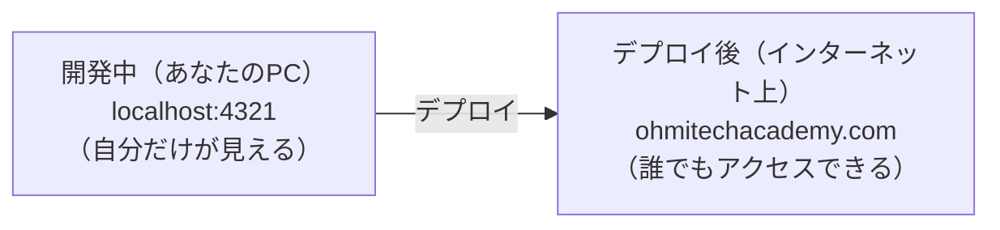
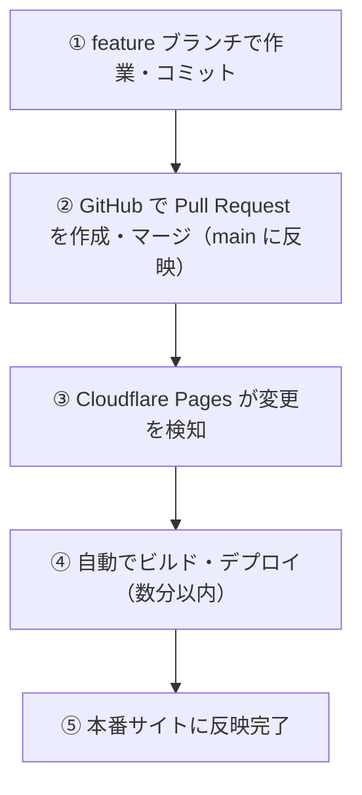

# Cloudflare

## デプロイとは

**作ったものを、実際にユーザーが使える状態にすること**です。

開発中のコードはあなたの PC の中だけにあります（`localhost`）。デプロイすることで、インターネット上のサーバーにそのコードを置き、世界中からアクセスできる状態になります。

次の図は、手元だけで見える開発環境と、インターネット上で誰でも見られる公開環境の違いを表しています。



`localhost` は自分の PC の中だけの住所です。デプロイ後は、Cloudflare が管理するサーバーに成果物が配置され、ドメインを通じて外部からアクセスできるようになります。

### デプロイで起きていること

デプロイは大きく3つの工程に分かれます。

| 工程 | 意味 | ota_hp での担当 |
|------|------|----------------|
| **ビルド** | ソースコード → ブラウザが読めるファイルに変換 | Cloudflare Pages が自動実行 |
| **転送** | 生成したファイルをサーバーに置く | Cloudflare Pages が自動実行 |
| **公開** | ドメインと紐づけて外部からアクセス可能にする | Cloudflare DNS が管理 |

> **「ビルド」が必要な理由：** Astro で書いたコードは `.astro` という特殊な形式です。ブラウザは `.astro` を直接読めないため、標準的な HTML/CSS/JS ファイルに変換（ビルド）してからサーバーに置く必要があります。

---

## はじめて読む人へ

Cloudflare は、作ったWebサイトをインターネットに公開し、速く安全に届けるためのサービスです。GitHub と連携すると、push した変更を自動でデプロイできます。


### 読む前に押さえること

- デプロイは、手元のコードを公開環境へ反映する作業です。
- ドメインは、Webサイトの人間向けの住所です。
- ビルドログは、デプロイ失敗の原因を読むための重要な情報です。

### 読み終えたら説明できること

- Cloudflare Pages の役割を説明できる。
- 自動デプロイの流れを理解できる。
- ビルド失敗時にログを確認できる。

---

## Cloudflareとは

**Web サービスをインターネット上で高速・安全に届けるためのクラウドサービス** です。

このプロジェクトでは、主に **Cloudflare Pages** という機能を使っています。

---

## Cloudflare Pages とは

GitHub のリポジトリと連携して、 **コードを自動でビルドしてインターネット上に公開してくれる** ホスティングサービスです。

> **「ビルド」とは？**  
> Astro などのフレームワークで書いたコードは、そのままではブラウザで表示できません。  
> ビルドとは、コードをブラウザが読める HTML/CSS/JS ファイルに変換する作業のことです。  
> Cloudflare Pages はこの作業を自動でやってくれます。

---

## 自動デプロイの仕組み

自動デプロイでは、GitHub に push した変更をきっかけに、Cloudflare 側でビルドと公開が実行されます。手元のファイルを直接サーバーへコピーしているわけではありません。

この仕組みでは、GitHub の main ブランチが公開環境の元になります。だからこそ、main に入れる前に Pull Request やビルド確認を行い、壊れた状態を公開しないようにします。

一番大切な仕組みがこれです。 **コードを GitHub の `main` ブランチにマージするだけで、サイトが自動更新されます。**

次の流れでは、人間がサーバーにファイルを手でアップロードしていません。GitHub の変更をきっかけに、Cloudflare Pages がビルドと公開を自動で行います。



つまり、普段の作業では **Cloudflare のダッシュボードを直接触ることはほとんどありません。**

その代わり、`main` にマージする前の Pull Request とビルド確認が重要になります。`main` が公開環境につながっているため、壊れた変更を入れない運用が必要です。

---

## デプロイ状況の確認方法

「サイトが更新されているかな？」と確認したいときは：

1. [Cloudflare ダッシュボード](https://dash.cloudflare.com) にログイン
2. 左メニューの **Workers & Pages** をクリック
3. プロジェクト名（`ota_hp` など）をクリック
4. **Deployments** タブを開く

ここに最新のデプロイ履歴が表示されます。

| ステータス | 意味 |
|------------|------|
| ✅ Success | デプロイ成功・サイトに反映済み |
| 🔄 Building | ビルド中（数分待ってください） |
| ❌ Failed | ビルドエラー（コードに問題がある可能性） |

---

## ドメインとは

**ドメイン** とは、サイトの住所にあたる文字列のことです。

例：`https://example.com` の `example.com` の部分がドメインです。

Cloudflare Pages でデプロイすると、最初は `xxx.pages.dev` という URL でアクセスできます。  
独自のドメイン（`ohmitechacademy.com` など）を使いたい場合は、カスタムドメインの設定が必要です。

### カスタムドメインの設定手順

1. Cloudflare ダッシュボード → Pages プロジェクト → **Custom domains** タブ
2. **「Set up a custom domain」** をクリック
3. 使用するドメインを入力（例：`ohmitechacademy.com`）
4. 指示に従って DNS の設定を行う

> ドメインが Cloudflare で管理されている場合、DNS の設定は自動で行われます。

---

## 初期セットアップ（参考）

> すでにセットアップ済みのため、通常は不要です。新しいプロジェクトを作る場合の参考にしてください。

1. [Cloudflare ダッシュボード](https://dash.cloudflare.com) にログイン
2. **Workers & Pages** → **Create application** → **Pages** → **Connect to Git**
3. GitHub アカウントを連携してリポジトリを選択
4. ビルド設定を入力する：

| 項目 | 値 |
|------|----|
| Framework preset | Astro |
| Build command | `npm run build` |
| Build output directory | `dist` |

5. **「Save and Deploy」** をクリック → 初回デプロイが始まります

---

## ビルド失敗時のデバッグ

デプロイが ❌ Failed になったときの調査手順です。

### 1. ビルドログを確認する

1. Deployments タブで赤い **Failed** をクリック
2. **「View build log」** をクリック
3. ログを下にスクロールし、赤字のエラーを探す

### 2. よくあるエラーパターン

**型エラー（TypeScript）：**

型エラーは、TypeScript が「期待している型と実際の型が違う」と検出したものです。該当するファイル名と行番号がログに出ている場合は、まずそこを確認します。

```
error TS2345: Argument of type 'string' is not assignable to parameter of type 'number'
```
→ TypeScript の型が合っていません。該当箇所を修正してください。

**モジュールが見つからない：**

モジュールエラーは、必要なパッケージが入っていない、import 名が間違っている、設定ファイルが不足しているときに起きます。

```
Cannot find module 'astro:content'
```
→ `npm install` が必要か、`astro.config.mjs` の設定が間違っています。

**環境変数が未設定：**

環境変数エラーは、API キーなどの値が Cloudflare 側に設定されていないときに起きます。ローカルでは `.env` にある値が、本番には存在しないというケースがよくあります。

```
Error: Missing required environment variable: API_KEY
```
→ Cloudflare Pages の **Settings → Environment variables** に変数を追加してください。

**ビルドコマンドのエラー：**

このエラーは、`npm run build` 全体が失敗したことを表します。原因はこの行より前のログに出ていることが多いため、上にさかのぼって最初のエラーを探します。

```
Command 'npm run build' exited with code 1
```
→ ローカルで `npm run build` を実行して同じエラーが出るか確認してください。ローカルで再現できればデバッグしやすくなります。

### 3. ローカルでビルドを確認する習慣

push する前にローカルでビルドが通ることを確認すると、Cloudflare 上でのエラーを減らせます。

ローカルで同じビルドを実行しておくと、Cloudflare に push する前に問題を見つけられます。`preview` は、ビルド済みの成果物が本番に近い形で表示されるかを確認するために使います。

```bash
npm run build      # ビルドしてみる
npm run preview    # ビルド結果をブラウザで確認
```

---

## 環境変数の設定

本番環境でのみ必要な API キーなどは Cloudflare Pages で管理します。

**設定手順：**
1. [Cloudflare ダッシュボード](https://dash.cloudflare.com) → Pages プロジェクト
2. **Settings** タブ → **Environment variables**
3. **「Add variable」** をクリック
4. 変数名（例：`API_KEY`）と値を入力 → **「Save」**

**プレビュー環境と本番環境を分けることも可能：**

| 環境 | 用途 |
|------|------|
| **Production** | `main` ブランチへのデプロイ（本番サイト） |
| **Preview** | それ以外のブランチへのデプロイ（確認用） |

コード側では `import.meta.env.変数名` でアクセスします（Astro の場合）。

環境変数は、コードに秘密情報を直接書かず、実行環境から値を渡すための仕組みです。本番とプレビューで違う値を使いたい場合にも役立ちます。

```js
const apiKey = import.meta.env.API_KEY;
```

このコードでは、`API_KEY` という環境変数の値を Astro から参照しています。実際のキー文字列は Git に含めません。

---

## よくある疑問

**Q. ビルドが失敗したらどうすれば？**  
A. 上の「ビルド失敗時のデバッグ」セクションを参照してください。まずビルドログを確認し、ローカルで `npm run build` を試すのが最速の解決方法です。

**Q. 手動でデプロイしたい場合は？**  
A. Deployments タブの右上に **「Retry deployment」** ボタンがあります。

---


## 確認問題

1. Cloudflare は、何の問題を解決するための考え方・道具ですか。
2. このページで出てきた重要語を 3 つ選び、それぞれ 1 文で説明してください。
3. コード例やコマンド例がある場合、入力・処理・出力を分けて説明してください。
4. このページの内容が、前後の STEP や自分の作りたいものにどうつながるか説明してください。

---

## 関連ページ

- [GitHub](GitHub) — マージの操作方法
- [Astro](Astro) — ビルドされるサイトのフレームワーク

---

[← ホームへ](Home)
