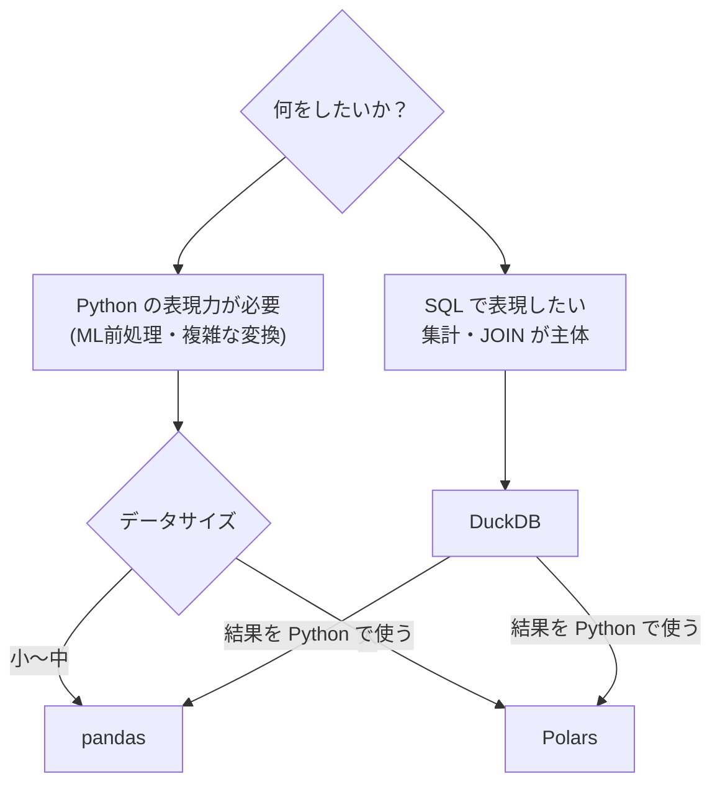

# DuckDB

ラップトップで動く高速な分析用インメモリ SQL データベースです。CSV・Parquet・JSON を直接 SQL で分析でき、pandas/Polars と Python 上でシームレスに統合できます。「データウェアハウスの機能をローカルで」という設計で、2024 年以降データエンジニアリングの現場に急速に普及しています。

---

## はじめて読む人へ

「100GB の Parquet ファイルを SQL で集計したい」「Python の pandas で JOIN が遅い」——DuckDB なら SQLite のように手軽に使えて、Spark のような速度が出ます。インストールは `pip install duckdb` だけで、サーバーの起動も不要です。

### 読む前に押さえること

- [データベース基礎](データベース基礎) — SELECT・JOIN・GROUP BY の基本
- [NumPy / pandas 基礎](pandas-sklearn) — DataFrame の概念

### 読み終えたら説明できること

- DuckDB が OLTP（SQLite）と OLAP（Redshift）の中間に位置する理由を説明できる
- Parquet・CSV を直接 SQL で分析できることを実演できる
- Python（pandas/Polars）と DuckDB を使い分ける基準を説明できる

---

## DuckDB の位置づけ

### データベースの分類

| DB の種類 | 用途 | 例 |
|---------|------|-----|
| OLTP（行指向）| トランザクション処理 | PostgreSQL・MySQL・SQLite |
| OLAP（列指向）| 大規模集計・分析 | BigQuery・Redshift・Snowflake |
| **DuckDB（列指向）** | **ローカル大規模分析** | DuckDB |

DuckDB は OLAP のための列指向設計をラップトップ上で実現します。サーバーレス・デプロイ不要・外部依存なしが大きな特徴です。

---

## 基本的な使い方

```python
import duckdb

# 接続（インメモリ）
con = duckdb.connect()

# またはファイルベース
con = duckdb.connect("analytics.duckdb")

# SQL を直接実行
result = con.execute("SELECT 42 AS answer").df()  # pandas DataFrame を返す
```

### CSV・Parquet を直接 SQL で読む

```python
# CSV を直接クエリ（ファイルをDBにロードしなくていい）
df = con.execute("""
    SELECT city, AVG(age) as avg_age, COUNT(*) as cnt
    FROM 'data.csv'
    GROUP BY city
    ORDER BY avg_age DESC
""").df()

# Parquet（複数ファイルのグロブも可能）
df = con.execute("""
    SELECT * FROM 'data/*.parquet'
    WHERE date >= '2024-01-01'
""").df()

# S3 上の Parquet も直接読める（httpfs 拡張）
```

### pandas / Polars との統合

```python
import pandas as pd

df_pandas = pd.DataFrame({"a": [1, 2, 3], "b": [4, 5, 6]})

# pandas DataFrame を直接 SQL で使う
result = duckdb.execute("SELECT a, b, a+b as sum FROM df_pandas").df()

# Polars との統合
import polars as pl
df_pl = pl.DataFrame({"x": [1, 2, 3]})
result_pl = duckdb.execute("SELECT * FROM df_pl WHERE x > 1").pl()
```

---

## 主要な SQL 機能

### Window 関数

```sql
SELECT
    name,
    city,
    salary,
    AVG(salary) OVER (PARTITION BY city) AS city_avg,
    RANK() OVER (PARTITION BY city ORDER BY salary DESC) AS rank_in_city,
    salary - LAG(salary) OVER (ORDER BY hire_date) AS salary_diff
FROM employees
```

### PIVOT・UNPIVOT

```sql
-- ワイドフォーマットへの変換
PIVOT sales ON month USING SUM(amount);

-- ロングフォーマットへの戻し
UNPIVOT wide_table ON jan, feb, mar INTO NAME month VALUE amount;
```

### 正規表現・文字列関数

```sql
SELECT
    regexp_extract(email, '([^@]+)@(.+)', 1) AS username,
    regexp_extract(email, '([^@]+)@(.+)', 2) AS domain
FROM users
```

### JSON 関数

```sql
SELECT
    json_extract(metadata, '$.user.name') AS user_name,
    json_extract_string(metadata, '$.tags[0]') AS first_tag
FROM events
```

---

## パフォーマンス

### pandas との比較

| 操作 | pandas | DuckDB |
|------|--------|--------|
| 1 億行 GroupBy | ~60 秒 | ~2 秒 |
| 大テーブル JOIN | ~90 秒 | ~4 秒 |
| CSV 読み込み（1GB）| ~15 秒 | ~3 秒 |

DuckDB はベクトル化実行エンジン + 列指向ストア + 並列処理の組み合わせで高速化しています。

### なぜ速いのか

```
DuckDB の実行パイプライン:

クエリ → パーサー → 論理プラン → 最適化（述語プッシュダウン等）
       → 物理プラン → ベクトル化実行（SIMD）→ 結果

ベクトル化実行: 1行ずつでなく 2048行のチャンクをまとめて処理
→ CPU の SIMD 命令を活用
→ 分岐予測のミスを削減
```

---

## ユースケース

### ローカル分析パイプライン

```python
# BigQuery や Redshift を使わずローカルで大規模分析
result = duckdb.execute("""
    WITH daily_revenue AS (
        SELECT
            DATE_TRUNC('day', created_at) AS date,
            SUM(amount) AS revenue
        FROM 'transactions/*.parquet'
        WHERE created_at >= '2024-01-01'
        GROUP BY 1
    )
    SELECT
        date,
        revenue,
        SUM(revenue) OVER (ORDER BY date) AS cumulative_revenue
    FROM daily_revenue
    ORDER BY date
""").pl()  # Polars で返す
```

### DuckDB + dbt

データ変換ツール dbt のバックエンドとして DuckDB を使うと、ローカルでエンタープライズ品質のデータパイプラインを開発できます。

```
開発: DuckDB（ローカル・無料・高速）
本番: BigQuery / Snowflake（同じ SQL が動く）
```

### Jupyter でのインタラクティブ分析

```python
# マジックコマンド（duckdb-engine + JupySQL）
%load_ext sql
%sql duckdb:///:memory:
%%sql
SELECT * FROM 'large_file.csv' LIMIT 10
```

---

## pandas / Polars / DuckDB の使い分け



3 つは競合ではなく**補完関係**です。DuckDB で集計 → Polars で変換 → scikit-learn でモデリング、というパイプラインが現代的なベストプラクティスです。

---

## 確認問題

1. DuckDB が「サーバーレス・デプロイ不要」にもかかわらず大規模集計が速い理由を説明してください。
2. Parquet ファイルを直接 SQL で読めることが、データ分析のワークフローをどう変えるか説明してください。
3. DuckDB と pandas を使い分ける基準を 3 つ挙げてください。

---

## 関連ページ

- [データベース基礎](データベース基礎) — SQL・JOIN・GROUP BY の基礎
- [SQL実践問題](SQL実践問題) — Window 関数・CTE の実践
- [Polars](Polars) — DataFrame の高速処理
- [データエンジニアリング](データエンジニアリング) — Parquet・データパイプライン
- [NumPy / pandas 基礎](pandas-sklearn) — DuckDB と連携する基本ツール

---

[← ホームへ](Home)
