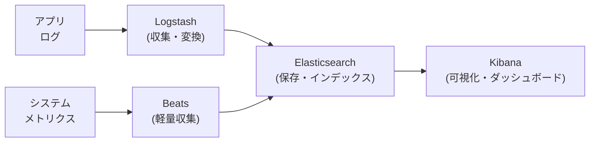

# Elasticsearch・全文検索

分散型の全文検索・分析エンジンです。転置インデックスによる高速な全文検索・集計分析・ログ管理・近年はベクトル検索（kNN）もサポートしています。AWS CloudSearch・Elastic Cloud など多くのマネージドサービスでも利用されており、中大規模の検索基盤の事実上の標準です。

---

## はじめて読む人へ

「この商品の名前を含む商品を検索する」「エラーログから ERROR を含む行を素早く探す」——これらは全文検索エンジンが得意とする処理です。SQL の LIKE 検索は全件スキャンになりますが、Elasticsearch は転置インデックスで高速に検索できます。

### 読む前に押さえること

- [データベース基礎](データベース基礎) — SQL・インデックスの概念
- [ベクトルデータベース](ベクトルデータベース) — ベクトル検索の基礎（ハイブリッド検索との比較のため）

### 読み終えたら説明できること

- 転置インデックスの仕組みを説明できる
- BM25 スコアリングの考え方を説明できる
- ベクトル検索（kNN）との組み合わせ（ハイブリッド検索）を説明できる

---

## 転置インデックス

### 全文検索の課題

SQL の `LIKE '%error%'` は全件スキャンで $O(N \cdot L)$（$N$：ドキュメント数、$L$：ドキュメント長）かかります。

### 転置インデックスの仕組み

!!! info ""
    ドキュメント:
      doc1: "The quick brown fox"
      doc2: "The fox jumps high"
      doc3: "Brown bears are quick"
    
    転置インデックス（各単語→出現ドキュメントのリスト）:
      "the"   → [doc1, doc2]
      "quick" → [doc1, doc3]
      "brown" → [doc1, doc3]
      "fox"   → [doc1, doc2]
      "jumps" → [doc2]
      "high"  → [doc2]
      "bears" → [doc3]
    
    検索 "quick fox":
      "quick" → {doc1, doc3}
      "fox"   → {doc1, doc2}
      共通 → {doc1}（両方含むドキュメント）

インデックス構築に時間がかかりますが、検索は $O(\log N)$ 程度に高速化されます。

### テキスト解析パイプライン


| 処理 | 説明 |
|------|------|
| **小文字化** | "Quick" → "quick" |
| **ストップワード削除** | "the"・"a"・"is" など高頻度語を除外 |
| **ステミング** | "running" → "run"（語幹に変換）|
| **形態素解析（日本語）** | 「日本語検索」→「日本語」「検索」|

---

## BM25 スコアリング

「検索クエリにどれほど関連するか」をスコア化するアルゴリズムです。Elasticsearch のデフォルトです。

$$
\text{BM25}(D, Q) = \sum_{t \in Q} \text{IDF}(t) \cdot \frac{f(t, D) \cdot (k_1 + 1)}{f(t, D) + k_1 \cdot \left(1 - b + b \cdot \frac{|D|}{avgdl}\right)}
$$

**各項の意味：**

| 要素 | 意味 |
|------|------|
| $\text{IDF}(t) = \log\frac{N - n(t) + 0.5}{n(t) + 0.5}$ | 珍しい単語ほど重要（逆文書頻度） |
| $f(t, D)$ | ドキュメント内の単語頻度 |
| $k_1$（通常 1.2）| 単語頻度の飽和度（何回も出ても無制限に加算しない）|
| $b$（通常 0.75）| 文書長の正規化（長いドキュメントにペナルティ）|
| $avgdl$ | 平均ドキュメント長 |

---

## Elasticsearch の基本操作

### インデックスの作成とドキュメント登録

```python
from elasticsearch import Elasticsearch

es = Elasticsearch("http://localhost:9200")

# インデックス作成（スキーマ定義）
es.indices.create(index="products", body={
    "mappings": {
        "properties": {
            "name":        {"type": "text", "analyzer": "standard"},
            "description": {"type": "text"},
            "price":       {"type": "float"},
            "category":    {"type": "keyword"},  # 完全一致・ファセット用
        }
    }
})

# ドキュメント登録
es.index(index="products", id=1, body={
    "name": "MacBook Pro 16インチ",
    "description": "高性能ノートパソコン",
    "price": 298000,
    "category": "laptop"
})
```

### 検索クエリ

```python
# 全文検索
result = es.search(index="products", body={
    "query": {
        "multi_match": {
            "query": "高性能 ノートパソコン",
            "fields": ["name^2", "description"]  # name は重み 2 倍
        }
    }
})

# フィルタ付き検索（bool クエリ）
result = es.search(index="products", body={
    "query": {
        "bool": {
            "must": [{"match": {"description": "高性能"}}],
            "filter": [
                {"term": {"category": "laptop"}},
                {"range": {"price": {"lte": 300000}}}
            ]
        }
    },
    "sort": [{"price": "asc"}]
})
```

---

## 集計分析（Aggregation）

SQL の GROUP BY に相当します。

```json
{
  "aggs": {
    "by_category": {
      "terms": {"field": "category"},  ← カテゴリ別集計
      "aggs": {
        "avg_price": {"avg": {"field": "price"}},
        "price_hist": {
          "histogram": {"field": "price", "interval": 50000}
        }
      }
    }
  }
}
```

---

## ベクトル検索（kNN）との統合

Elasticsearch 8.x 以降は dense_vector フィールドでベクトル検索をサポートします。

### ハイブリッド検索

```python
# ベクトル検索 + キーワード検索の組み合わせ
result = es.search(index="products", body={
    "query": {
        "bool": {
            # キーワード検索（BM25）
            "should": [
                {"match": {"description": query_text}}
            ]
        }
    },
    # ベクトル検索（kNN）
    "knn": {
        "field": "embedding",
        "query_vector": embed(query_text),
        "k": 10,
        "num_candidates": 100
    },
    "rank": {"rrf": {}}  # Reciprocal Rank Fusion で統合
})
```

**RRF（Reciprocal Rank Fusion）：** BM25 と kNN の 2 つのランキングを統合する手法。各文書のスコアを `1/(k + rank)` として合算します。

---

## ログ分析（ELK スタック）

Elasticsearch は元々ログ分析のために設計されました。



---

## Elasticsearch vs ベクトルデータベース

| 観点 | Elasticsearch | 専用ベクトル DB（Qdrant等）|
|------|-------------|----------------------|
| 全文検索 | ✅ 得意 | ❌ 基本的になし |
| ベクトル検索 | △ 対応（8.x以降）| ✅ 最適化済み |
| ハイブリッド検索 | ✅ | △ |
| 学習コスト | 高い（設定が複雑）| 低い |
| 用途 | 検索 + ログ + 分析 | ベクトル検索特化 |

**選択基準：** 既存の全文検索基盤がある場合は Elasticsearch にベクトル検索を追加、純粋な意味検索・RAG なら専用ベクトル DB を選ぶ。

---

## 確認問題

1. 転置インデックスが SQL の LIKE 検索より高速な理由を計算量で説明してください。
2. BM25 で「珍しい単語（IDF 高）」のスコアが高くなる理由を情報理論的に説明してください。
3. ハイブリッド検索（BM25 + kNN）が固有名詞の検索に有効な理由を説明してください。

---

## 関連ページ

- [ベクトルデータベース](ベクトルデータベース) — 意味検索・RAG の基盤
- [データベース詳解](データベース詳解) — インデックスの一般概念
- [LLMエージェント・RAG詳解](LLMエージェント-RAG) — ハイブリッド検索の RAG への応用
- [データエンジニアリング](データエンジニアリング) — ログパイプライン・ELK スタック
- [モニタリング・可観測性](モニタリング-可観測性) — Kibana によるログ可視化

---

[← ホームへ](Home)
