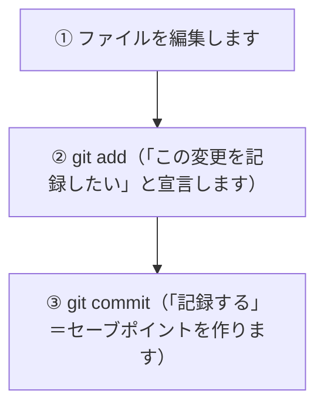
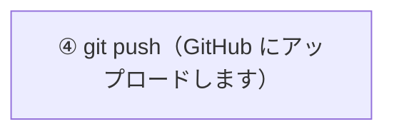
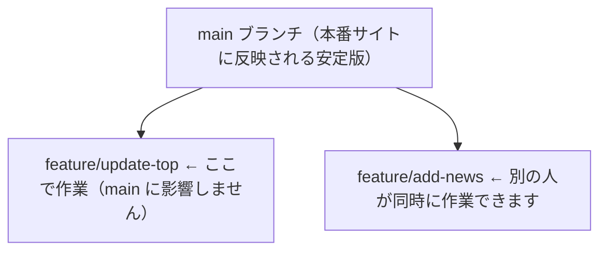
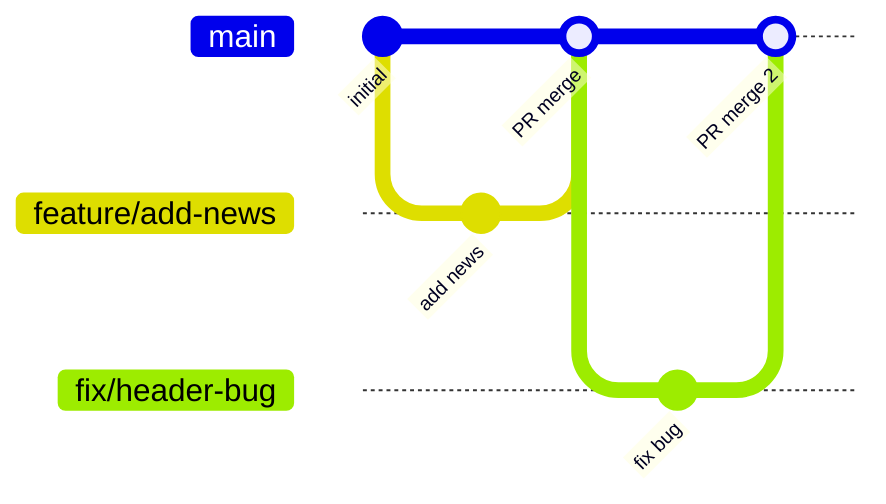
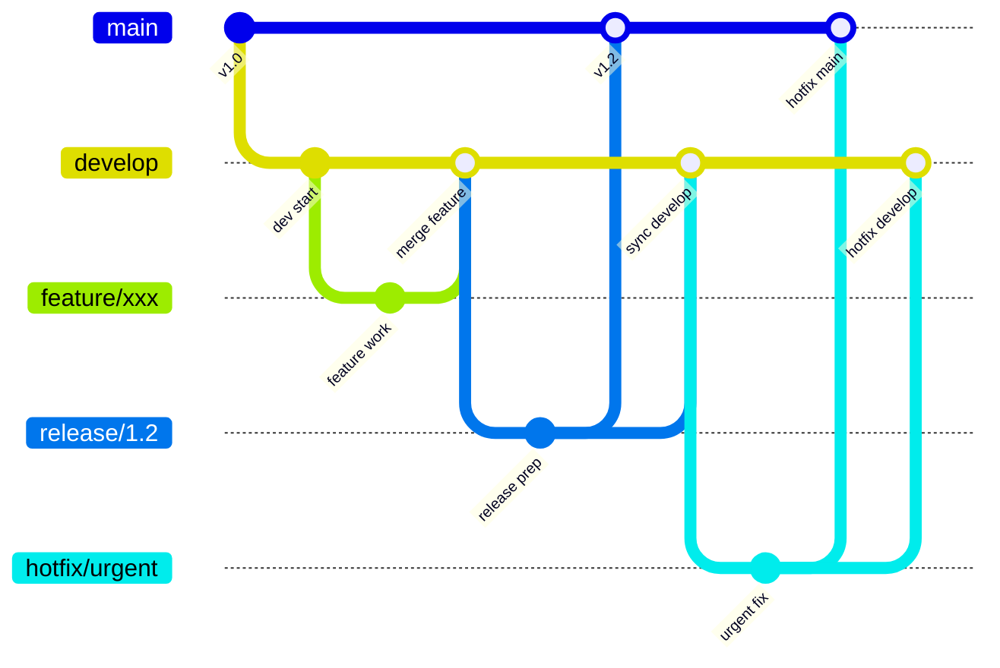

# Git

## Git とは

**ファイルの変更履歴を記録・管理するツール** です。

たとえば、レポートを書いているとき、こんな経験はありませんか？

次の例は、手作業でバージョン管理しようとしたときによく起こる状態です。ファイル名で履歴を表そうとすると、どれが最新で、何を変えたのかが分からなくなります。

レポート_最終版.docx
レポート_最終版2.docx
レポート_本当に最終版.docx
レポート_先生に出したやつ.docx
ファイルを何度もコピーして「どれが最新か分からなくなる」問題を解決するのが Git です。  
「いつ・誰が・何を変えたか」をすべて記録してくれるので、古いバージョンにいつでも戻せます。

> **Google ドキュメントで例えると：**  
> Google ドキュメントには「変更履歴」機能があり、過去の状態に戻せますよね。Git はそれをコードやテキストファイル全般でできるようにしたツールです。

> **情報工学メモ：バージョン管理の仕組み（スナップショット vs 差分、ハッシュ関数、DAG）**  
> バージョン管理の方法には「差分を記録する」方式と「スナップショット（全体の状態）を記録する」方式があります。Git は後者で、コミットのたびにその時点のファイル全体の状態を保存します。各コミットには **SHA-1 ハッシュ関数** で計算された 40 文字の ID（例：`a3f9c12...`）が付与され、ファイルの内容が 1 文字でも変わると全く異なる ID になるためデータの改ざんを検知できます。コミット同士は「どのコミットから派生したか」という親子関係でつながっており、これが **DAG（有向非巡回グラフ）** と呼ばれる木構造を形成します。ブランチはこのグラフの特定のコミットを指すポインタです。

---

## はじめて読む人へ

Git は、ファイルの変更履歴を保存するための道具です。単にバックアップを取るだけでなく、「いつ」「誰が」「なぜ」変更したかを追えるようにします。


### 読む前に押さえること

- コミットは、作業のまとまりに名前を付けて保存することです。
- ブランチは、main を壊さずに試すための作業場所です。
- 差分を読む習慣があると、バグの原因を見つけやすくなります。

### 読み終えたら説明できること

- add、commit、push の違いを説明できる。
- ブランチを作って安全に作業できる。
- コミットメッセージに変更の意図を書ける。

---

## Git を使う前の準備

### インストールの確認

ターミナル（Mac では「ターミナル」アプリ）を開いて、次のコマンドを入力してください。

まずは、Git が自分の PC で使える状態か確認します。バージョンが表示されれば、コマンドとして認識されています。

```bash
git --version
```

`git version 2.xx.x` のように表示されればインストール済みです。

### 自分の名前とメールアドレスを登録する

Git は「誰がこの変更を加えたか」を記録します。最初に一度だけ設定してください。

この設定は、今後作るコミットに「作者情報」として残ります。GitHub のアカウントと同じメールアドレスを使うと、GitHub 上でも自分の変更として表示されます。

```bash
git config --global user.name "山田 太郎"
git config --global user.email "taro@example.com"
```

---

## 基本的な流れ

Git の基本は、作業ディレクトリ、ステージングエリア、リポジトリの3段階で考えると分かりやすくなります。ファイルを編集しただけではまだ履歴に残らず、`git add` で記録候補に入れ、`git commit` で履歴として保存します。

この3段階があるため、変更したファイルを全部まとめて記録するのではなく、「今回のコミットに入れる変更」を選べます。これが、後から読みやすい履歴を作るために重要です。

Git での作業は、次の 3 ステップが基本です。

次の図は、編集したファイルが履歴として保存されるまでの流れです。`add` は「次のコミットに含める候補へ入れる」、`commit` は「履歴として確定する」と考えてください。



さらに GitHub（クラウド）と連携する場合：

ローカルの履歴は自分の PC の中にあります。チームで共有したり、GitHub に保存したりするには `push` が必要です。



---

## よく使うコマンド

> コマンドとは、ターミナルに文字で入力する「命令」のことです。

### リポジトリを作る・取得する

**リポジトリ** とは、Git が管理するフォルダのことです。

新しく Git 管理を始める場合は `git init`、すでに GitHub にあるプロジェクトを手元に持ってくる場合は `git clone` を使います。

```bash
git init
```
> 今いるフォルダを Git の管理下に置きます（新しく始めるとき）。

```bash
git clone https://github.com/ohmitechacademy/ota_hp.git
```
> GitHub にあるリポジトリをまるごとダウンロードします（既存のプロジェクトに参加するとき）。

---

### 変更を記録する

変更を記録するときは、まず状態を確認し、次に記録したいファイルを選び、最後にコミットします。この順番を習慣にすると、不要なファイルを誤ってコミットしにくくなります。

```bash
git status
```
> どのファイルが変更されているかを確認します。まず最初にこれを実行する習慣をつけましょう。

```bash
git add index.html
```
> `index.html` というファイルを「記録する対象」として選びます。

```bash
git add .
```
> 変更したすべてのファイルを一括で選びます（`.` は「すべて」の意味）。

```bash
git commit -m "トップページのタイトルを変更"
```
> セーブポイントを作ります。`" "` の中はそのセーブポイントの説明（**コミットメッセージ**）です。  
> 後から「何を変えたのか」が分かるよう、具体的に書くのがコツです。

---

### 過去を確認する

コミット履歴を見ると、プロジェクトがどのように変わってきたかを追えます。バグがいつ入ったか、どの変更で機能が追加されたかを調べる入口になります。

```bash
git log --oneline
```
> これまでのコミット（セーブポイント）一覧を表示します。
> 
> 表示例：
> ```
> a3f9c12 お知らせページを追加
> b7e2d01 フッターのデザインを修正
> c1a8e93 初回コミット
> ```

---

### GitHub と同期する

`push` と `pull` は、手元のリポジトリと GitHub 上のリポジトリを同期するためのコマンドです。チーム開発では、自分の変更を上げるだけでなく、他の人の変更を取り込むことも必要です。

```bash
git push origin main
```
> ローカル（自分の PC）の変更を GitHub にアップロードします。

```bash
git pull origin main
```
> GitHub の最新状態を自分の PC に取り込みます。  
> 他のメンバーが変更を加えたときは、作業を始める前にこれを実行しましょう。

---

## ブランチとは

**ブランチ** とは、作業を本流から切り離して進めるための仕組みです。

ゲームで例えると「別データでプレイしてみる」イメージです。うまくいかなければ元のデータには影響がありません。

ブランチは、コミット履歴の流れを分けるための仕組みです。`main` を安定版として保ち、新しい機能や修正は別ブランチで進めます。



### ブランチを使う手順

次の流れでは、現在のブランチを確認し、新しい作業ブランチを作って切り替え、そのブランチを GitHub へ送ります。

```bash
# 現在のブランチを確認します
git branch

# 新しいブランチを作って切り替えます
git switch -c feature/update-top-page

# 作業してコミット後、GitHub にプッシュします
git push origin feature/update-top-page

# GitHub で Pull Request を作成 → レビュー → main にマージします
```

`git switch -c` は「新しいブランチを作成して、そのブランチへ移動する」コマンドです。作業前にブランチを分けることで、`main` を直接壊すリスクを避けられます。

---

## ブランチ戦略

チームで Git を使うとき、「どのようなブランチを作り、どう運用するか」のルールを **ブランチ戦略** と呼びます。代表的な 2 つを紹介します。

---

### GitHub Flow（このプロジェクトで採用）

**シンプルで小規模チームに向いている**戦略です。

GitHub Flow では、`main` を常に安定した状態に保ち、作業は短い feature ブランチで行います。作業が終わったら Pull Request を作り、レビュー後に `main` へ統合します。



**ルール：**
- `main` は常にデプロイできる状態を保ちます
- 作業は必ず feature ブランチで行い、PR 経由でマージします
- `main` への直接 push は禁止です

> **「常にデプロイできる状態」とは：** `main` にマージした瞬間、Cloudflare Pages が自動でビルド・デプロイを実行し、本番サイトが更新されます。つまり `main` = 本番サイトに直結しています。壊れたコードを `main` にマージすると即座に本番サイトが壊れるため、必ずレビューと動作確認を経てからマージします。

---

### Git Flow（大規模プロジェクト向け）

複数の安定バージョンを並行管理する場合に使います。`ota_hp` では不要ですが、知識として覚えておきましょう。

Git Flow は、リリース準備や緊急修正のブランチを分ける、より複雑な運用です。大規模な製品開発では役に立ちますが、小さなチームでは管理コストが高くなりがちです。



---

## ブランチ命名規則

ブランチ名は `種別/作業内容` の形式で統一します。

| 種別 | 用途 | 例 |
|------|------|-----|
| `feature/` | 新機能の追加 | `feature/add-news-page` |
| `fix/` | バグ修正 | `fix/header-layout` |
| `hotfix/` | 本番の緊急修正 | `hotfix/broken-link` |
| `docs/` | ドキュメント・文章のみの変更 | `docs/update-readme` |
| `refactor/` | 機能を変えないコードの整理 | `refactor/cleanup-styles` |
| `chore/` | ツール設定・依存関係の更新 | `chore/update-astro` |

**命名のコツ：**
- 小文字・ハイフン区切りで統一します（スペース・アンダースコアは使いません）
- 何をするブランチか一目でわかる名前にします
- 長くなりすぎないようにします（3〜5 単語程度）

---

## コミットメッセージの書き方

良いコミットメッセージは「なぜこの変更をしたか」が伝わります。

### 基本ルール

種別: 変更内容の要約（50 文字以内）

（任意）詳細な説明
なぜこの変更が必要だったかを書きます。
### 種別プレフィックス

| 種別 | 用途 |
|------|------|
| `feat:` | 新機能の追加 |
| `fix:` | バグ修正 |
| `docs:` | ドキュメントのみの変更 |
| `style:` | コードの動作に影響しない変更（空白・整形など） |
| `refactor:` | バグ修正でも機能追加でもないコード変更 |
| `chore:` | ビルドや設定ファイルの変更 |

**例：**

次の例では、良いコミットメッセージと悪いコミットメッセージを比較しています。良いメッセージは、あとから履歴を読んだ人が変更内容を想像できます。

```bash
# 良い例
git commit -m "feat: トップページにお知らせセクションを追加"
git commit -m "fix: モバイルでヘッダーが崩れる問題を修正"
git commit -m "docs: 環境構築手順に WSL2 の説明を追記"
git commit -m "chore: Astro を 4.0 から 4.5 にアップデート"

# 悪い例
git commit -m "修正"           # 何を修正したか不明です
git commit -m "いろいろ変更"   # 粒度が大きすぎます
git commit -m "WIP"            # 未完成のままコミットしません
```

> **コミットの粒度：** 「一つのこと」が完了したらコミットします。複数の変更を 1 コミットに詰め込むと、後で問題箇所を特定しにくくなります。

---

## このプロジェクトのルール

| ブランチ | 役割 |
|----------|------|
| `main` | 本番サイトに反映されます。直接編集しません |
| `feature/xxx` | 機能追加・修正作業はここで行います |
| `fix/xxx` | バグ修正はここで行います |

### 基本的な作業フロー

このプロジェクトでは、`main` を直接編集せず、作業ブランチを作って Pull Request 経由で反映します。次のコマンド列は、1 つの機能追加を進める典型的な流れです。

```bash
# 1. 最新の状態を取得します
git pull origin main

# 2. 作業ブランチを作成します（種別/内容 の形式で）
git switch -c feature/add-news-section

# 3. ファイルを編集し、適切な粒度でコミットします
git add src/pages/index.astro
git commit -m "feat: トップページにお知らせセクションを追加"

# 4. さらに変更があればコミットを重ねます
git add src/components/NewsCard.astro
git commit -m "feat: お知らせカードコンポーネントを作成"

# 5. GitHub にプッシュします
git push origin feature/add-news-section

# 6. GitHub で Pull Request を作成します（次のページへ）
```

ポイントは、作業前に最新の `main` を取り込み、作業単位ごとにコミットし、最後に作業ブランチを push することです。Pull Request では、差分を読み、レビューを受けてから `main` に入れます。

---

## よくある疑問

**Q. コミットはどのくらいの頻度でする？**  
A. 「一つの作業が完了したら」がおすすめです。小さくこまめにコミットすると、どこで問題が起きたか追いやすくなります。

**Q. コミットメッセージは日本語でいい？**  
A. チーム内のルールに従ってください。このプロジェクトでは日本語 OK です。

**Q. 間違えてコミットした場合は？**  
A. `main` にプッシュする前であれば対処できます。まずチームメンバーに相談しましょう。

---


## 確認問題

1. Git は、何の問題を解決するための考え方・道具ですか。
2. このページで出てきた重要語を 3 つ選び、それぞれ 1 文で説明してください。
3. コード例やコマンド例がある場合、入力・処理・出力を分けて説明してください。
4. このページの内容が、前後の STEP や自分の作りたいものにどうつながるか説明してください。

---

## 関連ページ

- [GitHub](GitHub) — リモートリポジトリの管理・Pull Request
- [アジャイル開発](アジャイル開発) — ブランチ戦略・PR レビュー・チーム開発

---

[← ホームへ](Home)
