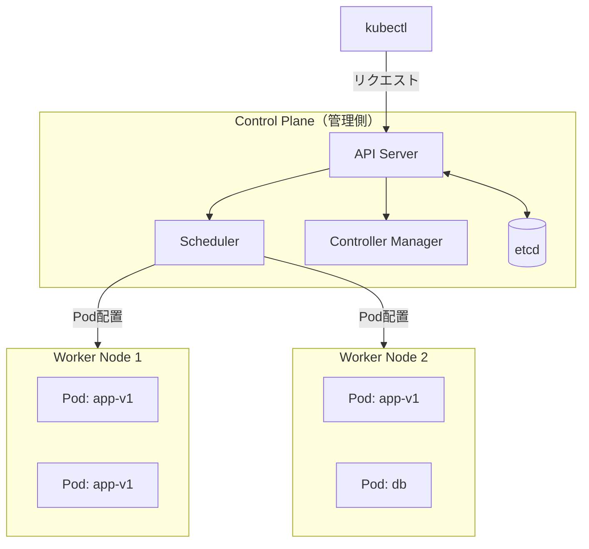

# Kubernetes

複数のコンテナを「まとめて管理・運用する」プラットフォームです。Docker が「1 つのコンテナを動かす道具」なら、Kubernetes（k8s）は「数十〜数百のコンテナを安定して動かし続ける仕組み」です。

---

## はじめて読む人へ

Docker だけでは、コンテナが落ちたときに自動で再起動したり、アクセスが増えたときにコンテナを増やしたりする仕組みがありません。Kubernetes はそれを自動化します。

### 読む前に押さえること

- [Docker](Docker.md) のイメージ・コンテナ・docker-compose の基本

### 読み終えたら説明できること

- Pod / Deployment / Service の役割の違いを説明できる
- `kubectl get pods` など基本コマンドを使える
- Deployment の YAML を読んで何をしているか説明できる

---

## なぜ Kubernetes が必要か

Docker Compose で複数コンテナを動かせますが、本番環境では不足が出ます。

| 問題 | Docker Compose | Kubernetes |
|------|---------------|------------|
| コンテナが落ちたら | 手動で再起動 | 自動再起動 |
| アクセス増加 | 手動でスケール | 自動スケール |
| 複数サーバーに分散 | できない | できる |
| ローリングアップデート | 停止が必要 | 無停止で更新 |
| ヘルスチェック | なし | 組み込み |

---

## アーキテクチャの全体像



**Control Plane（コントロールプレーン）**：クラスター全体の頭脳です。
- **API Server**：`kubectl` コマンドを受け取る窓口
- **Scheduler**：新しい Pod をどの Node に置くかを決定
- **etcd**：クラスターの全状態を保存する KV ストア

**Worker Node**：実際にコンテナが動く場所です。

---

## コアリソース

### Pod（最小単位）

1つ以上のコンテナをまとめた最小デプロイ単位です。同じ Pod 内のコンテナは `localhost` で通信できます。

```yaml
apiVersion: v1
kind: Pod
metadata:
  name: my-app
spec:
  containers:
    - name: app
      image: nginx:1.25
      ports:
        - containerPort: 80
```

```bash
kubectl apply -f pod.yaml
kubectl get pods
kubectl logs my-app
kubectl exec -it my-app -- /bin/sh
```

Pod は通常、直接作りません。後述の Deployment を通じて管理します。

---

### Deployment（Pod の管理）

「この Pod を N 個動かし続ける」という宣言です。Pod が落ちると自動で作り直します。

```yaml
apiVersion: apps/v1
kind: Deployment
metadata:
  name: app-deployment
spec:
  replicas: 3              # Pod を 3 つ維持する
  selector:
    matchLabels:
      app: my-app
  template:
    metadata:
      labels:
        app: my-app
    spec:
      containers:
        - name: app
          image: my-app:v1.2
          ports:
            - containerPort: 8000
          resources:
            requests:
              memory: "64Mi"
              cpu: "250m"
            limits:
              memory: "128Mi"
              cpu: "500m"
```

```bash
kubectl apply -f deployment.yaml
kubectl get deployments
kubectl rollout status deployment/app-deployment

# ローリングアップデート（停止なし）
kubectl set image deployment/app-deployment app=my-app:v1.3
kubectl rollout undo deployment/app-deployment  # ロールバック
```

---

### Service（Pod へのネットワーク接続）

Pod は再起動のたびに IP が変わります。Service は「複数の Pod に対する固定エンドポイント」を提供します。

```yaml
apiVersion: v1
kind: Service
metadata:
  name: app-service
spec:
  selector:
    app: my-app           # このラベルの Pod を対象にする
  ports:
    - port: 80            # Service が受け付けるポート
      targetPort: 8000    # Pod のポート
  type: ClusterIP         # クラスター内部からのみアクセス可
```

**Service の種類：**

| type | アクセス範囲 | 用途 |
|------|------------|------|
| ClusterIP | クラスター内部のみ | サービス間通信 |
| NodePort | ノードの IP:ポート | 開発・検証 |
| LoadBalancer | 外部ロードバランサー経由 | 本番環境の公開 |

---

### Namespace（リソースの分離）

クラスター内に仮想的な「区画」を作ります。開発・ステージング・本番を同じクラスターで分離するときに使います。

```bash
kubectl create namespace staging
kubectl get pods -n staging
kubectl apply -f deployment.yaml -n staging
```

---

## ConfigMap と Secret

環境変数や設定値をコンテナに渡す仕組みです。

```yaml
# ConfigMap：非機密の設定値
apiVersion: v1
kind: ConfigMap
metadata:
  name: app-config
data:
  APP_ENV: "production"
  LOG_LEVEL: "info"
---
# Secret：機密情報（base64 エンコード）
apiVersion: v1
kind: Secret
metadata:
  name: app-secret
type: Opaque
data:
  DATABASE_URL: cG9zdGdyZXNxbDovLy4uLg==  # base64
```

```yaml
# Deployment で参照する
spec:
  containers:
    - name: app
      envFrom:
        - configMapRef:
            name: app-config
        - secretRef:
            name: app-secret
```

---

## kubectl 基本コマンド

```bash
# リソース一覧
kubectl get pods
kubectl get deployments
kubectl get services
kubectl get all                   # 全リソース

# 詳細確認
kubectl describe pod <pod-name>   # イベント・エラーの確認
kubectl logs <pod-name>           # ログ
kubectl logs -f <pod-name>        # ログのストリーミング

# 操作
kubectl apply -f manifest.yaml    # 作成・更新
kubectl delete -f manifest.yaml   # 削除
kubectl exec -it <pod-name> -- bash  # コンテナに入る

# スケール
kubectl scale deployment app-deployment --replicas=5
```

---

## ローカル開発：minikube

手元のマシンで Kubernetes クラスターを動かすツールです。

```bash
# インストール（Mac）
brew install minikube

# クラスター起動
minikube start

# クラスター確認
kubectl cluster-info
kubectl get nodes

# Docker イメージをクラスターに読み込む
minikube image load my-app:latest

# ダッシュボード
minikube dashboard
```

---

## Helm（パッケージマネージャー）

Kubernetes マニフェストのテンプレートエンジンです。同じアプリを開発・本番で設定を変えてデプロイするときに使います。

```bash
# Helm インストール
brew install helm

# Chart（パッケージ）を検索・インストール
helm repo add bitnami https://charts.bitnami.com/bitnami
helm install my-postgres bitnami/postgresql

# 自前の Chart を作る
helm create my-app-chart
helm install my-app ./my-app-chart --set image.tag=v1.3
```

---

## 確認問題

1. Pod と Deployment の違いを「自動復旧」の観点から説明してください。
2. ClusterIP・NodePort・LoadBalancer の違いと、それぞれどんなときに使うかを説明してください。
3. `kubectl rollout undo` はいつ使いますか？どんな問題を解決しますか？

---

## 関連ページ

- [Docker](Docker.md) — コンテナの基礎
- [CI/CD](CI-CD.md) — Kubernetes へのデプロイパイプライン
- [クラウド・インフラ](クラウド-インフラ.md) — AWS EKS / GCP GKE などのマネージド k8s
- [MLデプロイ](MLデプロイ.md) — モデルサービングを k8s で運用する場面
