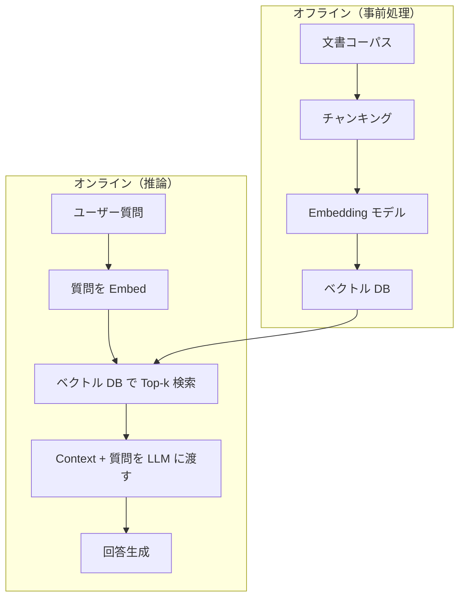
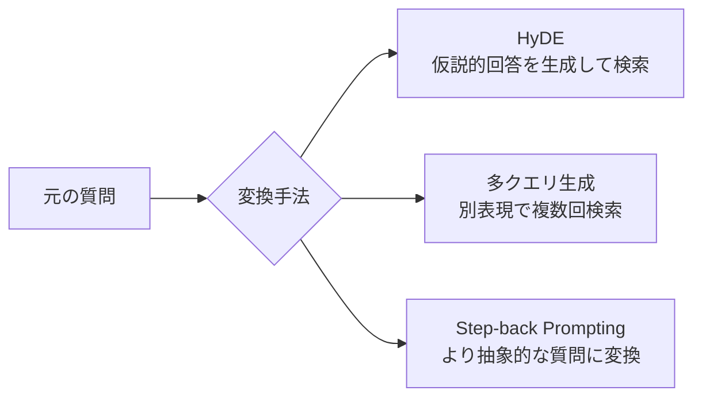
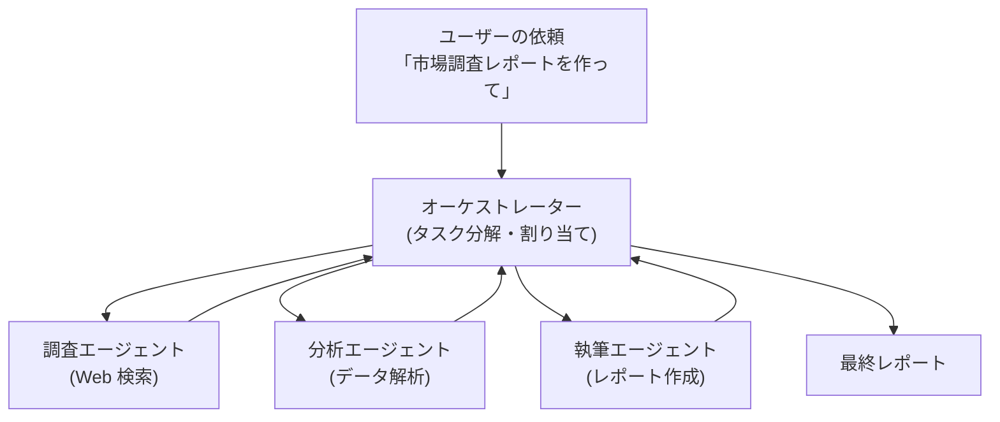

# LLM エージェント・RAG 詳解

LLM を「推論エンジン」として使い、外部ツール・データベース・API を組み合わせて複雑なタスクを自律的に解決するシステムです。RAG（検索拡張生成）・Function Calling・ReAct・マルチエージェントの仕組みを体系的に解説します。

---

## はじめて読む人へ

ChatGPT に「この PDF を読んで要約して」と言えるのは、裏でベクトル検索が PDF を検索し、その内容を LLM に渡しているからです（RAG）。「今日の天気を調べて旅行計画を立てて」と言えるのは、LLM が外部 API を呼び出す「エージェント」の機能があるからです。このページではその仕組みを解説します。

### 読む前に押さえること

- [LLM活用入門](LLM活用入門) — プロンプトエンジニアリングの基礎
- [ベクトルデータベース](ベクトルデータベース) — 意味検索の仕組み
- [Transformer・Attention](Transformer-Attention) — LLM の基礎構造

### 読み終えたら説明できること

- RAG の各コンポーネントの役割を説明できる
- Function Calling で LLM がツールを呼び出す仕組みを説明できる
- ReAct パターンの「推論 → 行動 → 観察」サイクルを説明できる

---

## RAG（Retrieval-Augmented Generation）

### なぜ RAG が必要か

| 問題 | LLM 単体 | RAG |
|------|---------|-----|
| 最新情報 | 学習カットオフ以降は知らない | 検索で最新情報を取得可能 |
| 社内文書 | 学習に含まれていない | 独自 DB から検索して回答 |
| ハルシネーション | 知らないことを生成してしまう | 根拠のある文書に基づいて回答 |
| コスト | 全文書を Fine-tuning | 検索して必要部分だけ渡す |

### RAG のアーキテクチャ



### プロンプトテンプレート

!!! info ""
    [システム]
    あなたは丁寧なアシスタントです。
    以下のコンテキストに基づいて質問に答えてください。
    コンテキストに答えがない場合は「分かりません」と答えてください。
    
    [コンテキスト]
    {retrieved_chunks}
    
    [質問]
    {user_question}
    
    [回答]

### RAG の評価指標

| 指標 | 意味 | 評価ツール |
|------|------|---------|
| **Faithfulness** | 回答がコンテキストに基づいているか | RAGAS |
| **Answer Relevance** | 回答が質問に関連しているか | RAGAS |
| **Context Precision** | 取得したチャンクが関連しているか | RAGAS |
| **Context Recall** | 正解に必要なチャンクを取得できているか | RAGAS |

---

## Advanced RAG

### ナイーブ RAG の問題

1. **クエリの曖昧さ：** 「彼の業績は？」→ 誰のこと？
2. **チャンクの不完全性：** 分割で文脈が切れる
3. **ランキングの不正確さ：** 関連性は高いが答えに直結しないチャンクが上位に

### クエリ変換



**HyDE（Hypothetical Document Embeddings）：** 「この質問への理想的な回答は？」を LLM で生成し、その仮説的回答でベクトル検索します。実際の答えに近い表現で検索するため、より関連性の高いチャンクを取得できます。

### リランキング

初期検索で Top-50 件を取得し、Cross-encoder で精密にスコアリングして Top-5 を選びます。

| 手法 | 速度 | 精度 | 用途 |
|------|------|------|------|
| Bi-encoder（ANN） | 速い | 中 | 初期候補取得 |
| Cross-encoder | 遅い | 高 | 精密なリランキング |

**Cohere Rerank・BGE Reranker** が代表的なリランキングモデルです。

---

## Function Calling（ツール呼び出し）

### 仕組み

LLM に「使えるツールの一覧（関数定義）」を渡すと、必要に応じてツールの呼び出しを JSON で出力します。

```json
// ツール定義（LLM に渡す）
{
  "name": "get_weather",
  "description": "指定した都市の現在の天気を取得する",
  "parameters": {
    "city": {"type": "string", "description": "都市名"},
    "unit": {"type": "string", "enum": ["celsius", "fahrenheit"]}
  }
}

// LLM の出力（ツール呼び出しを指示）
{
  "tool_calls": [{
    "name": "get_weather",
    "arguments": {"city": "東京", "unit": "celsius"}
  }]
}
```

アプリケーション側でツールを実行し、結果を LLM に戻して最終回答を生成します。

### OpenAI API での実装例

```python
from openai import OpenAI
import json

client = OpenAI()

tools = [{
    "type": "function",
    "function": {
        "name": "search_docs",
        "description": "社内文書を検索する",
        "parameters": {
            "type": "object",
            "properties": {
                "query": {"type": "string"}
            },
            "required": ["query"]
        }
    }
}]

response = client.chat.completions.create(
    model="gpt-4o",
    messages=[{"role": "user", "content": "有給休暇の申請方法を教えて"}],
    tools=tools,
    tool_choice="auto"
)

# LLM がツール呼び出しを選んだ場合
if response.choices[0].finish_reason == "tool_calls":
    tool_call = response.choices[0].message.tool_calls[0]
    query = json.loads(tool_call.function.arguments)["query"]
    result = search_docs(query)  # 実際の検索処理
    # 結果を会話履歴に追加して再度 LLM に渡す
```

---

## ReAct（Reasoning + Acting）

### 基本パターン

!!! info ""
    Thought: 何をすべきかを考える（推論）
    Action: ツールを呼び出す（行動）
    Observation: ツールの結果を受け取る（観察）
    → 繰り返し、最終的に答えを出力

**例：「2024 年の Apple の売上と利益率を教えて」**

!!! info ""
    Thought: まず Apple の 2024 年の売上を検索する必要がある
    Action: search("Apple 2024 annual revenue")
    Observation: Apple's FY2024 revenue was $391 billion...
    
    Thought: 次に利益率を計算するため純利益を調べる
    Action: search("Apple 2024 net income")
    Observation: Apple's FY2024 net income was $93.7 billion...
    
    Thought: 利益率 = 93.7/391 = 24% と計算できる
    Final Answer: Apple の 2024 年売上は 3910 億ドル、利益率は約 24% です。

ReAct は「中間ステップの透明性」が高く、何がうまくいかなかったかをデバッグしやすいです。

---

## LangChain / LlamaIndex

### LangChain

LLM・ツール・チェーン・エージェントを組み合わせるフレームワークです。

**主要コンポーネント：**

| コンポーネント | 役割 |
|-------------|------|
| LLM | OpenAI・Anthropic・ローカルモデルの抽象化 |
| Chain | 複数処理のパイプライン |
| Retriever | ベクトル DB への検索インターフェース |
| Agent | ツール選択と ReAct ループ |
| Memory | 会話履歴の管理 |

### LlamaIndex

文書の取り込み・インデックス・クエリに特化したフレームワークです。

```python
from llama_index.core import VectorStoreIndex, SimpleDirectoryReader

# PDF・テキストファイルを自動的に読み込んでインデックス作成
documents = SimpleDirectoryReader("./docs").load_data()
index = VectorStoreIndex.from_documents(documents)

# 質問応答エンジン
query_engine = index.as_query_engine()
response = query_engine.query("会社の休暇ポリシーは？")
print(response)
```

---

## マルチエージェント

複数の専門エージェントが協力してタスクを解決します。



**代表的なフレームワーク：**

| フレームワーク | 特徴 |
|-------------|------|
| **AutoGen** | Microsoft 製。エージェント間の会話ループ |
| **CrewAI** | 役割ベースのエージェント協調 |
| **LangGraph** | グラフベースのエージェントワークフロー |

---

## 数学的導出

### RAG の検索精度とコンテキスト長のトレードオフ

LLM のコンテキストウィンドウを $C$ トークン、各チャンクを $c$ トークンとすると、渡せるチャンク数は $k = \lfloor C / c \rfloor$ です。

Recall（必要な情報を取得できる確率）は $k$ に依存しますが、Precision（取得した情報が有用な割合）は $k$ が大きいほど下がります。また LLM の「Lost in the Middle」問題（コンテキストの中間部分の情報を無視しやすい）から、$k$ を大きくしすぎると品質が下がります。最適な $k$ はデータと LLM に依存します。

---

## 確認問題

1. Fine-tuning と RAG の使い分け基準を「最新性・コスト・カスタマイズ性」の観点で説明してください。
2. HyDE（仮説的回答埋め込み）が通常のクエリ検索より有効な場面を説明してください。
3. ReAct の「Thought-Action-Observation」ループが単純な Function Calling より優れる理由を説明してください。
4. マルチエージェントシステムが単一エージェントより有効な場面を具体例で説明してください。

---

## 関連ページ

- [ベクトルデータベース](ベクトルデータベース) — RAG の検索基盤
- [LLM活用入門](LLM活用入門) — プロンプトエンジニアリングの基礎
- [ファインチューニング詳解](ファインチューニング詳解) — RAG と Fine-tuning の使い分け
- [Transformer・Attention](Transformer-Attention) — LLM の基礎構造
- [Elasticsearch・全文検索](Elasticsearch) — ハイブリッド検索

---

[← ホームへ](Home)
