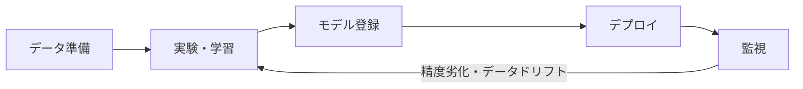
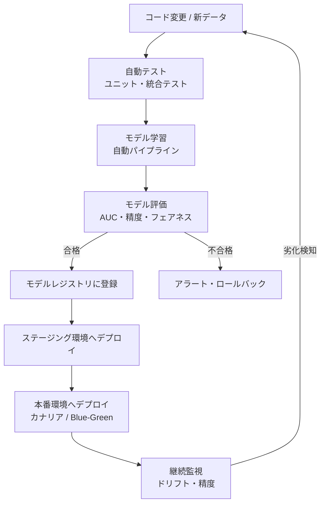

# MLOps 概要

機械学習モデルを「実験で終わらせず、本番環境で継続的に動かし続ける」ための実践領域です。ソフトウェアエンジニアリングの DevOps 思想を機械学習に適用したものです。

---

## はじめて読む人へ

Jupyter Notebook でモデルを作っても、それは「あなただけが使えるプロトタイプ」に過ぎません。MLOps は「同じコードを誰でも・いつでも・どこでも動かせ、性能が劣化したら検知して自動で再学習できる」仕組みを作る技術です。

### 読む前に押さえること

- [モデル評価・チューニング](モデル評価-チューニング.md) — 何を記録・監視するかを理解するために
- [FastAPI](FastAPI.md) — モデルを API として公開するフレームワーク
- [Docker](Docker.md) — 環境を固定して再現性を確保するために

### 読み終えたら説明できること

- MLOps が必要な理由を「再現性・デプロイ・監視」の 3 軸で説明できる
- ML 開発ライフサイクルの各フェーズで使われるツールを挙げられる
- MLOps 成熟度レベル 0〜2 の違いを説明できる

---

## なぜ MLOps が必要か

Jupyter Notebook でモデルを作っても、それは「あなただけが使えるプロトタイプ」に過ぎません。本番運用では次の問題が発生します。

| 問題 | 症状 | MLOps での対処 |
|------|------|--------------|
| **再現性がない** | 誰かが別のマシンで実行すると結果が違う | 実験管理・環境の固定 |
| **どの実験が良かったかわからない** | パラメータを変えすぎて最良条件を忘れる | 実験トラッキング |
| **モデルを他のシステムから使えない** | Notebook のコードをそのまま他人が使えない | API 化・デプロイ |
| **モデルの精度が時間で劣化する** | データの分布が変わるのに気づかない | 監視・再学習パイプライン |

---

## ML 開発のライフサイクル



1. **実験管理**：パラメータ・メトリクス・モデルをセットで記録・比較する
2. **デプロイ**：学習済みモデルを API として公開し、他システムから利用できるようにする
3. **基盤・監視**：推論の速度・精度・データドリフトを継続的に観測し、必要なら再学習する

---

## MLOps 成熟度レベル

Google が提唱する 3 段階の成熟度モデルが広く参照されます。

### レベル 0：手動プロセス

!!! info ""
    実験 → 手動でモデルを pkl ファイルにエクスポート → サーバーに手動アップロード

- モデルのバージョン管理なし
- デプロイは手作業
- 再学習タイミングも手動判断
- **典型的な初期フェーズ、小規模チームに多い**

### レベル 1：ML パイプラインの自動化

!!! info ""
    新データ到着 → 自動で再学習パイプラインが動く → 評価後に自動デプロイ

- 学習パイプラインがコードで管理されている
- データドリフト検知が自動化されている
- モデルレジストリでバージョン管理
- **多くの ML プロダクトが目指すレベル**

### レベル 2：CI/CD パイプラインの自動化

!!! info ""
    コード変更をプッシュ → テスト → 学習 → 評価 → Blue-Green デプロイ

- モデルコードの変更が自動的にテスト・デプロイされる
- A/B テストやカナリアリリースが組み込まれている
- **大規模チーム・頻繁な更新が必要なプロダクトに適する**

---

## MLOps ツールエコシステム

各フェーズで使われる主要ツールを整理します。

### データ管理

| ツール | 用途 |
|--------|------|
| DVC | データのバージョン管理（Git の機械学習版） |
| Great Expectations | データ品質の自動チェック |
| Delta Lake / Iceberg | 大規模データのバージョン管理とトランザクション |

### 実験管理

| ツール | 用途 |
|--------|------|
| MLflow | ローカル〜クラウドで使える OSS トラッキングツール |
| Weights & Biases (wandb) | 可視化が豊富なクラウドトラッキング |
| Neptune | チーム向け実験管理 |

### パイプライン・オーケストレーション

| ツール | 用途 |
|--------|------|
| Airflow | データパイプライン全般 |
| Prefect / Dagster | Python ネイティブなパイプライン構築 |
| Kubeflow Pipelines | Kubernetes 上の ML パイプライン |

### モデルサービング

| ツール | 用途 |
|--------|------|
| FastAPI | Python で REST API を作る（シンプルな構成に最適） |
| BentoML | モデル管理 + サービング一体型フレームワーク |
| Triton Inference Server | 高スループットの推論サーバー（NVIDIA） |
| TorchServe | PyTorch モデル専用サービング |

### 監視

| ツール | 用途 |
|--------|------|
| Prometheus + Grafana | メトリクス収集・可視化 |
| Evidently | データドリフト・モデル品質の監視 |
| WhyLogs | データログとドリフト検知 |

---

## CD4ML（Machine Learning の継続的デリバリー）

ソフトウェアの CI/CD と同様に、機械学習にも継続的デリバリーの考え方が適用されます。



### モデルのバージョン管理

```python
# MLflow でモデルを登録・バージョン管理する例
import mlflow
import mlflow.sklearn
from sklearn.ensemble import RandomForestClassifier
from sklearn.datasets import load_iris
from sklearn.model_selection import train_test_split

mlflow.set_tracking_uri("http://localhost:5000")
mlflow.set_experiment("iris-classifier")

data = load_iris()
X_train, X_test, y_train, y_test = train_test_split(
    data.data, data.target, test_size=0.2, random_state=42
)

with mlflow.start_run():
    params = {"n_estimators": 100, "max_depth": 5}
    mlflow.log_params(params)
    
    model = RandomForestClassifier(**params, random_state=42)
    model.fit(X_train, y_train)
    
    accuracy = model.score(X_test, y_test)
    mlflow.log_metric("accuracy", accuracy)
    
    # モデルをレジストリに登録
    mlflow.sklearn.log_model(
        model,
        "model",
        registered_model_name="iris-classifier"
    )
    print(f"Accuracy: {accuracy:.4f}")
```

---

## データドリフトとモデル劣化

本番環境でモデルの精度が時間とともに下がる原因は 2 種類あります。

| 種類 | 意味 | 例 |
|------|------|-----|
| **データドリフト** | 入力 X の分布が変わった | コロナ禍で購買行動が変化 |
| **コンセプトドリフト** | X→Y の関係自体が変わった | 新法律でスパム文の特徴が変化 |

```python
# Evidently でドリフトを検知する例
from evidently.report import Report
from evidently.metric_preset import DataDriftPreset
import pandas as pd

# 学習時のデータ（参照データ）と現在のデータを比較
reference_data = pd.DataFrame(...)  # 学習時のデータ
current_data   = pd.DataFrame(...)  # 本番で観測されているデータ

report = Report(metrics=[DataDriftPreset()])
report.run(reference_data=reference_data, current_data=current_data)
report.save_html("drift_report.html")
```

---

## このサブセクションで学ぶこと

| ページ | 内容 |
|--------|------|
| [実験管理](実験管理.md) | MLflow / wandb でパラメータと結果を記録・比較する |
| [MLデプロイ](MLデプロイ.md) | 学習済みモデルを FastAPI で API 化し本番公開する |
| [機械学習基盤](機械学習基盤.md) | 推論サービス・バッチ処理・監視・再学習の設計 |

---

## 確認問題

1. MLOps 成熟度レベル 0 と レベル 1 の最大の違いは何ですか？
2. データドリフトとコンセプトドリフトの違いを具体例を交えて説明してください。
3. モデルをデプロイするとき「Blue-Green デプロイ」を使うとどんなメリットがありますか？

---

## 関連ページ

- [CI/CD](CI-CD.md) — 機械学習パイプラインの自動化
- [データパイプライン](データパイプライン.md) — 再学習に必要なデータの継続的な準備
- [運用・障害対応](運用-障害対応.md) — 本番環境の監視と障害対応
- [Docker](Docker.md) — 再現可能な実行環境の構築
