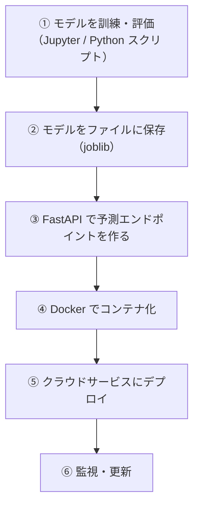

# 機械学習モデルのデプロイ

## デプロイとは（ML 文脈で）

**訓練したモデルを、他のシステムやユーザーが使えるサービスとして公開すること** です。

Jupyter Notebook でモデルを作っただけでは、あなただけしか使えません。デプロイすることで：
- Web アプリケーションから予測を取得できます
- スマートフォンアプリから呼び出せます
- 定期バッチ処理に組み込めます

---

## はじめて読む人へ

機械学習モデルのデプロイは、学習済みモデルを他の人やシステムが使える状態にする作業です。Notebook 上で精度が出るだけではなく、API として安定して予測を返せることが重要になります。


### 読む前に押さえること

- 学習時と推論時で同じ前処理を使う必要があります。
- API では、リクエストを受け取り、モデルで予測し、レスポンスを返します。
- Docker を使うと、モデルを動かす環境をそろえやすくなります。

### 読み終えたら説明できること

- 学習済みモデルを保存して読み込む流れを説明できる。
- FastAPI で推論APIを作る構成を理解できる。
- デプロイ後に確認すべきログやバージョンを説明できる。

---

## デプロイの全体像

機械学習モデルのデプロイは、モデルファイルをサーバーに置くだけではありません。学習したときと同じ前処理を使い、外部から入力を受け取り、予測結果を安定して返し、あとから状態を確認できるようにします。



この流れは、Notebook の実験をサービスへ変えるための道筋です。最初はローカルで API として動かし、次に Docker で環境を固定し、最後にクラウドで公開する、と段階的に進めると理解しやすくなります。

---

## ステップ 1：モデルを訓練して保存する

まず、訓練コードを Notebook から `.py` ファイルへ移します。デプロイでは、同じ手順を何度も実行できることが大切なので、セルの実行順序に依存しないスクリプトにします。

```python
# train.py
import pandas as pd
from sklearn.ensemble import GradientBoostingClassifier
from sklearn.model_selection import train_test_split
from sklearn.pipeline import Pipeline
from sklearn.preprocessing import StandardScaler
from sklearn.metrics import classification_report
import joblib

# データ準備
df = pd.read_csv("data.csv")
X = df.drop("target", axis=1)
y = df["target"]

X_train, X_test, y_train, y_test = train_test_split(
    X, y, test_size=0.2, random_state=42, stratify=y
)

# パイプラインで前処理とモデルを一体化します（本番で前処理を忘れません）
pipeline = Pipeline([
    ("scaler", StandardScaler()),
    ("model", GradientBoostingClassifier(n_estimators=100, random_state=42)),
])

pipeline.fit(X_train, y_train)

# 評価します
y_pred = pipeline.predict(X_test)
print(classification_report(y_test, y_pred))

# 保存します
joblib.dump(pipeline, "model/pipeline.pkl")
print("モデルを保存しました")
```

このコードでは、データ読み込み、訓練・テスト分割、前処理とモデルをまとめた Pipeline の学習、評価、保存を行っています。`Pipeline` として保存しているため、本番 API 側でも同じ標準化が自動で使われます。

`stratify=y` は、分類ラベルの比率が訓練データとテストデータで大きくずれないようにする指定です。分類問題では、評価データのラベル分布が偏ると精度の解釈が難しくなります。

---

## ステップ 2：FastAPI で予測エンドポイントを作る

予測エンドポイントは、外部から特徴量を受け取り、モデルで予測して結果を返す入口です。ここで重要なのは、入力データの形を明確に決めておくことです。

学習時に使った列名や前処理と、API に送られてくるデータの形がずれると、モデルは正しく予測できません。そのため、Pydantic でリクエストの型を定義し、保存した Pipeline を読み込んで同じ前処理を通す設計にします。

次のコードでは、サーバー起動時にモデルを 1 回だけ読み込み、`/predict` に POST された特徴量を使って予測します。API の入口で型を決めることで、不正な入力を早めに検出できます。

```python
# app/main.py
from fastapi import FastAPI, HTTPException
from pydantic import BaseModel
import joblib
import numpy as np
from pathlib import Path

app = FastAPI(title="予測 API", version="1.0.0")

# 起動時にモデルを読み込みます（リクエストごとに読み込まないようにします）
MODEL_PATH = Path("model/pipeline.pkl")
pipeline = joblib.load(MODEL_PATH)

# リクエストの型定義
class PredictionRequest(BaseModel):
    feature1: float
    feature2: float
    feature3: float
    feature4: float

# レスポンスの型定義
class PredictionResponse(BaseModel):
    prediction: int
    probability: float
    label: str

LABELS = {0: "クラスA", 1: "クラスB"}

@app.post("/predict", response_model=PredictionResponse)
def predict(request: PredictionRequest):
    features = np.array([[
        request.feature1,
        request.feature2,
        request.feature3,
        request.feature4,
    ]])

    prediction = pipeline.predict(features)[0]
    proba = pipeline.predict_proba(features)[0].max()

    return PredictionResponse(
        prediction=int(prediction),
        probability=round(float(proba), 4),
        label=LABELS.get(int(prediction), "不明"),
    )

@app.get("/health")
def health_check():
    return {"status": "ok", "model_loaded": pipeline is not None}
```

`PredictionRequest` は入力 JSON の形、`PredictionResponse` は返す JSON の形を表します。入力と出力を型として定義しておくと、API の利用者にも仕様が伝わりやすくなります。

`/health` は、モデルが読み込めているかを確認するためのエンドポイントです。デプロイ後は、予測 API そのものだけでなく、サービスが生きているかを監視するための入口が必要になります。

---

## ステップ 3：Docker でコンテナ化する

Docker 化する前に、プロジェクトのファイル配置を決めます。アプリコード、モデルファイル、依存関係、Dockerfile の位置がそろっていると、ビルド時に何をコピーしているか分かりやすくなります。

!!! info ""
    ```text
    ml-api/
    ├── app/
    │   └── main.py
    ├── model/
    │   └── pipeline.pkl    ← 訓練済みモデル
    ├── Dockerfile
    └── requirements.txt
    ```
`pipeline.pkl` は学習済みモデルです。API コンテナの中にこのファイルを含める場合、モデルを更新するたびにイメージを作り直す必要があります。外部ストレージから起動時に取得する設計もありますが、入門ではまず同梱する形で理解します。

```txt
# requirements.txt
fastapi==0.111.0
uvicorn==0.30.0
scikit-learn==1.4.0
pandas==2.2.0
numpy==1.26.0
joblib==1.4.0
```

`requirements.txt` には、API の実行に必要なパッケージを固定します。学習時と推論時で scikit-learn のバージョンが大きく違うと、保存したモデルを読み込めないことがあります。

```dockerfile
# Dockerfile
FROM python:3.11-slim

WORKDIR /app

# 依存パッケージのインストール（キャッシュを効かせるため先に行います）
COPY requirements.txt .
RUN pip install --no-cache-dir -r requirements.txt

# アプリとモデルをコピーします
COPY app/ ./app/
COPY model/ ./model/

# ポート公開と起動コマンド
EXPOSE 8000
CMD ["uvicorn", "app.main:app", "--host", "0.0.0.0", "--port", "8000"]
```

Dockerfile は、推論 API を動かす環境の作り方です。`COPY requirements.txt .` を先に行うと、依存関係が変わっていない限り Docker のキャッシュが効き、再ビルドが速くなります。

```bash
# ビルドと起動
docker build -t ml-api .
docker run -p 8000:8000 ml-api

# 動作確認
curl -X POST http://localhost:8000/predict \
  -H "Content-Type: application/json" \
  -d '{"feature1": 5.1, "feature2": 3.5, "feature3": 1.4, "feature4": 0.2}'
```

`curl` は、ターミナルから HTTP リクエストを送るためのコマンドです。ここでは JSON を POST し、API が予測結果を返すか確認しています。ブラウザで見るだけでは POST API の動作確認ができないため、`curl` や Swagger UI を使います。

---

## ステップ 4：クラウドへのデプロイ

### 方法 A：Render（無料枠あり・簡単）

1. [render.com](https://render.com) にアカウントを作成します
2. **New** → **Web Service** → GitHub リポジトリを連携します
3. 設定：
   - **Environment** : Docker
   - **Build Command** : （Dockerfile があれば自動検出されます）
4. **Create Web Service** → 数分でデプロイが完了します
5. `https://your-service.onrender.com/predict` でアクセスできます

### 方法 B：Fly.io（無料枠あり・高性能）

Fly.io では、CLI からアプリを作成してデプロイします。Dockerfile があると、そのイメージをもとにサーバー上で起動できます。

```bash
# Fly CLI のインストール
brew install flyctl

# アプリの初期化とデプロイ
fly auth login
fly launch          # アプリを作成します（Dockerfile を自動認識します）
fly deploy          # デプロイします
```

`fly launch` は初期設定を作り、`fly deploy` は現在のコードをクラウドへ反映します。初回はアプリ名、リージョン、設定ファイルの作成について質問されます。

### 方法 C：Google Cloud Run（本番向け・スケーラブル）

Cloud Run は、コンテナ化された Web サービスを自動スケーリング付きで実行できる Google Cloud のサービスです。アクセスがないときにインスタンス数を減らせるため、小〜中規模の API に向いています。

```bash
# Google Cloud CLI でデプロイします
gcloud run deploy ml-api \
  --source . \
  --region asia-northeast1 \
  --allow-unauthenticated
```

`--allow-unauthenticated` は認証なしで公開する指定です。社内向けや個人情報を扱う API では、認証を必ず設計してください。

---

## モデルのバージョン管理

モデルを更新するたびにバージョンを管理する習慣をつけましょう。

モデルはコードと違い、ファイルだけ見ても「どのデータで、どの条件で、どの精度だったか」が分かりません。そこで、モデル本体と一緒にメタデータを保存します。

```python
import joblib
from datetime import datetime

# バージョン情報を含めて保存します
metadata = {
    "version": "1.2.0",
    "trained_at": datetime.now().isoformat(),
    "accuracy": 0.923,
    "features": ["feature1", "feature2", "feature3", "feature4"],
}

joblib.dump({"pipeline": pipeline, "metadata": metadata}, "model/pipeline_v1.2.0.pkl")
```

`metadata` には、モデルのバージョン、学習日時、評価指標、入力特徴量などを入れています。これがあると、後から「どのモデルが本番で動いていたか」を追跡できます。

```python
# API でバージョン情報を返します
@app.get("/model/info")
def model_info():
    return model_data["metadata"]
```

API からモデル情報を返せるようにしておくと、デプロイ後の確認や障害調査が楽になります。予測結果だけでなく、どのモデルが答えたのかも重要な情報です。

---

## モニタリング（本番後のケア）

デプロイした後も、モデルの性能を監視する必要があります。

### よくある問題：データドリフト

訓練時のデータ分布と本番データの分布がずれてくる現象です。

モデルは、訓練データと似た分布の入力に対して性能を発揮します。本番のユーザーや環境が変わると、入力データの分布が変わり、精度が下がることがあります。これを検知するには、予測ログを残す必要があります。

```python
# 予測ログを記録する仕組みを組み込みます
import json
from datetime import datetime

@app.post("/predict")
def predict(request: PredictionRequest):
    prediction = pipeline.predict([features])[0]

    # ログを保存します（後でドリフト分析に使います）
    log = {
        "timestamp": datetime.now().isoformat(),
        "input": request.dict(),
        "prediction": int(prediction),
    }
    with open("logs/predictions.jsonl", "a") as f:
        f.write(json.dumps(log) + "\n")

    return {"prediction": int(prediction)}
```

JSON Lines 形式では、1 行に 1 件の JSON を保存します。後から pandas で読み込みやすく、予測時刻、入力、予測結果を時系列で分析できます。

定期的にログを集計し、精度が落ちていたら再訓練します。

本番では、正解ラベルがすぐに手に入らないこともあります。その場合は、入力特徴量の分布、予測確率の偏り、エラー率、リクエスト数などを監視し、異常な変化を早めに見つけます。

---

## よくある疑問

**Q. Jupyter Notebook のままデプロイできる？**  
A. できません。Notebook は開発ツールであり、Web サーバーではないからです。モデル訓練のコードを `.py` ファイルに書き直し、FastAPI で API 化する必要があります。

**Q. モデルのファイルサイズが大きくて困っている**  
A. tree 系モデル（GradientBoosting, RandomForest）はサイズが大きくなりがちです。軽量化の選択肢：① `n_estimators` を減らす、② `max_depth` を制限する、③ LightGBM/XGBoost を使う（より小さい）。

**Q. 予測が遅い**  
A. sklearn の推論は基本的に高速ですが、バッチ予測（複数サンプルをまとめて予測）で効率化できます。また、モデルをサーバー起動時に 1 回だけ読み込む（コード例の通り）ようにしてください。

---


## 確認問題

1. 機械学習モデルのデプロイ は、何の問題を解決するための考え方・道具ですか。
2. このページで出てきた重要語を 3 つ選び、それぞれ 1 文で説明してください。
3. コード例やコマンド例がある場合、入力・処理・出力を分けて説明してください。
4. このページの内容が、前後の STEP や自分の作りたいものにどうつながるか説明してください。

---

## 関連ページ

- [Python × Web API（FastAPI）](FastAPI) — API の作り方の基礎
- [Docker](Docker) — コンテナ化の詳細
- [Cloudflare](Cloudflare) — 静的サイトのデプロイ（ML API との連携）
- [CI/CD](CI-CD) — モデル更新の自動化

---

[← ホームへ](Home)
