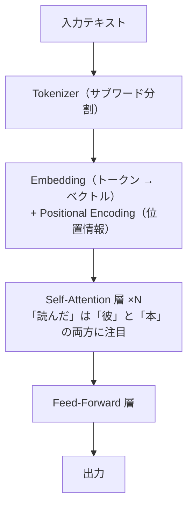

# NLP 基礎

**自然言語処理（Natural Language Processing, NLP）** は、人間の言語（テキスト・音声）をコンピュータで扱う分野です。テキスト分類・感情分析・情報抽出・機械翻訳・質問応答など、多様なタスクをカバーします。

2017 年に Transformer アーキテクチャが登場して以来、NLP の手法は大きく変わりました。従来は「テキストを数値に変換して機械学習モデルに渡す」という手順が必要でしたが、現在は BERT・GPT などの事前学習済みモデルをファインチューニングするか、LLM に直接指示するだけで多くのタスクを解けます。ただし、その土台となる「テキストをどう前処理するか・どう特徴量にするか」の理解は依然として重要です。

---

## はじめて読む人へ

NLP は、人間の言葉をコンピュータで扱うための技術です。文章をそのまま計算することはできないため、単語やトークンに分け、数値ベクトルに変換して処理します。


### 読む前に押さえること

- トークナイズは、文章を処理しやすい単位に分ける作業です。
- TF-IDF や Word2Vec は、単語や文書を数値で表す方法です。
- Transformer は、文中の単語同士の関係を扱う強力なモデルです。

### 読み終えたら説明できること

- 形態素解析、TF-IDF、Word2Vec の目的を説明できる。
- テキスト分類の基本的な流れを理解できる。
- Transformer が近年のNLPで重要な理由を説明できる。

---

## テキストの前処理

コンピュータはテキストをそのまま扱えません。まずテキストを**トークン（意味の最小単位）**に分割し、数値化する必要があります。英語はスペース区切りで単純に分割できますが、日本語は単語の境界が明示されないため、形態素解析が必要です。

### MeCab による日本語形態素解析

形態素解析は文章を形態素（品詞を持つ最小単位）に分割する処理です。MeCab は日本語の形態素解析で最も広く使われるツールです。

次のコードでは、日本語の文章を単語に分け、さらに品詞情報も取り出します。日本語は英語のように単語の間にスペースがないため、この処理が前処理の最初の一歩になります。

```python
# pip install mecab-python3
import MeCab
import re

text = "私はデータサイエンスを勉強しています。MLが楽しいです！"

# -Owakati：空白区切りで単語を出力するモード
tagger = MeCab.Tagger("-Owakati")
tokens = tagger.parse(text).split()
print(tokens)
# ['私', 'は', 'データ', 'サイエンス', 'を', '勉強', 'し', 'て', 'い', 'ます', '。', 'ML', 'が', '楽しい', 'です', '！']

# 詳細な品詞情報が必要な場合
tagger_detail = MeCab.Tagger()
node = tagger_detail.parseToNode(text)
while node:
    if node.surface:
        surface = node.surface          # 表層形（元の単語）
        feature = node.feature.split(",")
        pos = feature[0]                # 品詞（名詞・動詞・助詞など）
        print(f"{surface:10} {pos}")
    node = node.next
```

`-Owakati` は、文章を空白区切りの単語列として出力するモードです。より詳しく見たい場合は `parseToNode` を使い、表層形や品詞を 1 トークンずつ確認できます。

### ストップワードの除去

「は」「を」「に」のような助詞や「です」「ます」のような表現は、文書の意味の区別にほとんど寄与しません。こうした語を**ストップワード**と呼び、除去することでノイズを減らします。

次の例では、トークン列からストップワードと短すぎる語を取り除いています。分類や検索で効きにくい語を減らすことで、特徴量を少し扱いやすくします。

```python
stopwords = {"は", "を", "に", "が", "で", "て", "の", "し", "い", "ます", "です", "た", "も"}
tokens_filtered = [t for t in tokens if t not in stopwords and len(t) > 1]
print(tokens_filtered)
# ['データ', 'サイエンス', '勉強', 'ML', '楽しい']
```

ただし、ストップワードを消せば必ず良くなるわけではありません。文章生成や文法解析では助詞が重要な場合もあるため、タスクに合わせて判断します。

---

## Bag of Words と TF-IDF

Bag of Words は、文章を単語の出現回数で表す方法です。語順は無視しますが、どの単語がどれくらい出たかを数値ベクトルにできます。

TF-IDF は、よく出る単語の中でも、その文書を特徴づける単語を重視する方法です。どの文書にも出る一般的な単語の重みを下げ、特定の文書に多く出る単語の重みを上げます。

テキストを数値ベクトルに変換する最も基本的な方法が Bag of Words です。各文書を「単語の出現回数の配列」として表現します。単語の順序は無視されますが、分類タスクでは十分機能します。

### CountVectorizer

CountVectorizer は、文書集合から語彙を作り、各文書を単語の出現回数ベクトルに変換します。各行が文書、各列が単語になります。

```python
from sklearn.feature_extraction.text import CountVectorizer

corpus = [
    "機械学習は面白い",
    "深層学習はさらに面白い",
    "データサイエンスと機械学習",
]

cv = CountVectorizer()
X_bow = cv.fit_transform(corpus)
print(cv.get_feature_names_out())
# ['さらに' 'データサイエンス' 'と' 'は' 'はさらに' '機械学習' '深層学習' '面白い']
print(X_bow.toarray())
# 各行が文書、各列が単語の出現回数
```

`fit_transform` は、語彙表を作る `fit` と、その語彙表に基づいて文書を数値化する `transform` を同時に行います。学習データで作った語彙表を、テストデータや本番データにも同じように使うことが重要です。

### TF-IDF

CountVectorizer の問題は、「は」「が」のようにどの文書にも登場する単語が高い値を持つことです。**TF-IDF** はこれを解決します。

- **TF（Term Frequency）**：その文書内での単語の出現頻度
- **IDF（Inverse Document Frequency）**：多くの文書に出現する単語ほど低い値にする

つまり「特定の文書にだけよく出てくる単語」が高いスコアを得ます。

次のコードでは、文書を TF-IDF ベクトルに変換しています。TF-IDF は、単語の出現回数だけでなく、その単語がどれくらい珍しいかも考慮します。

```python
from sklearn.feature_extraction.text import TfidfVectorizer
from sklearn.linear_model import LogisticRegression
from sklearn.model_selection import train_test_split

# max_features で語彙サイズを制限
tfidf = TfidfVectorizer(max_features=1000)
X_tfidf = tfidf.fit_transform(corpus)

# テキスト分類の例（実際は大量のデータが必要）
# X_train, X_test, y_train, y_test = train_test_split(X_tfidf, labels, test_size=0.2)
# clf = LogisticRegression(max_iter=1000)
# clf.fit(X_train, y_train)
# print(f"精度: {clf.score(X_test, y_test):.3f}")
```

TF-IDF + ロジスティック回帰はシンプルながら、ニュース分類・スパムフィルタ・レビュー分類などで実用的な精度を出します。ベースラインとして最初に試す価値があります。

`max_features=1000` は、使う語彙数を上位 1000 語に制限する指定です。語彙を増やしすぎると特徴量が非常に高次元になり、計算や過学習の問題が出やすくなります。

---

## spaCy による言語解析

**spaCy** は産業用途に設計された高速な NLP ライブラリです。MeCab が形態素解析に特化しているのに対し、spaCy は品詞タグ付け・固有表現認識（NER）・係り受け解析を統合的に提供します。日本語は `ja_core_news_sm`（小・高速）や `ja_core_news_trf`（大・高精度）モデルを使います。

spaCy を使うには、本体ライブラリと日本語モデルをインストールします。モデルには、品詞や固有表現を推定するための学習済みパラメータが含まれています。

```bash
pip install spacy
python -m spacy download ja_core_news_sm
```

### 基本的な解析

次のコードでは、日本語モデルを読み込み、文章を解析して、各トークンの品詞と基本形を表示しています。

```python
import spacy

nlp = spacy.load("ja_core_news_sm")

text = "滋賀大学データサイエンス学部の田中教授が、京都で開催された学会で発表しました。"
doc = nlp(text)

# トークンと品詞
for token in doc:
    print(f"{token.text:12} {token.pos_:8} {token.lemma_}")
# 滋賀大学        PROPN    滋賀大学
# データサイエンス  NOUN     データサイエンス
# ...
```

`nlp(text)` を実行すると、トークン分割、品詞推定、原形化、固有表現認識などがまとめて行われます。`token.pos_` は品詞、`token.lemma_` は基本形です。

### 固有表現認識（NER）

固有表現認識は、テキスト中の「人名・組織名・地名・日付」などの固有表現を自動的に識別するタスクです。顧客データのクレンジング、ニュース記事の情報抽出、Q&A システムなど広く使われます。

次のコードでは、複数の文章から組織名、人名、地名、日付などを抽出します。文章から構造化データを作る入口としてよく使われます。

```python
import spacy

nlp = spacy.load("ja_core_news_sm")

texts = [
    "ソフトバンクグループの孫正義社長が東京都渋谷区で記者会見を開いた。",
    "2024年3月に滋賀大学で開催されたシンポジウムには200名が参加した。",
    "トヨタ自動車は愛知県豊田市に本社を置く自動車メーカーです。",
]

for text in texts:
    doc = nlp(text)
    print(f"\n文: {text}")
    for ent in doc.ents:
        print(f"  [{ent.label_:8}] {ent.text}")
```

```console
文: ソフトバンクグループの孫正義社長が東京都渋谷区で記者会見を開いた。
  [ORG     ] ソフトバンクグループ
  [PERSON  ] 孫正義
  [GPE     ] 東京都渋谷区

文: 2024年3月に滋賀大学で開催されたシンポジウムには200名が参加した。
  [DATE    ] 2024年3月
  [ORG     ] 滋賀大学
```
主なエンティティラベル：`PERSON`（人名）、`ORG`（組織）、`GPE`（地名・国）、`DATE`（日付）、`MONEY`（金額）、`PRODUCT`（製品）

NER の結果はモデルに依存するため、必ず正しいとは限りません。固有名詞が専門的だったり、新しい名称だったりすると誤認識することがあります。

### 係り受け解析

文中の単語間の依存関係（どの単語がどの単語に係るか）を解析します。

係り受け解析を使うと、文の中で「誰が」「何を」「どこで」「どうした」の関係を調べられます。情報抽出や文構造の理解に役立ちます。

```python
text = "田中さんが大阪で開催された会議に参加した。"
doc = nlp(text)

for token in doc:
    if token.dep_ not in ("punct",):
        print(f"{token.text} --[{token.dep_}]--> {token.head.text}")
# 田中   --[nsubj  ]--> 参加
# 大阪   --[nmod   ]--> 開催
# 会議   --[obl    ]--> 参加
# 参加   --[ROOT   ]--> 参加
```

`token.head` は、その単語が係っている相手の単語です。`ROOT` は文の中心となる述語を表します。

---

## 単語埋め込み（Word Embeddings）

Bag of Words では単語の意味関係を表現できません（「猫」と「ねこ」が別の次元になる）。単語埋め込みは**単語を密な実数ベクトルで表現し、意味が近い単語は空間上でも近くに配置**します。

### Word2Vec

文脈（周辺の単語）から単語の意味を学習します。「東京 - 日本 + フランス ≈ パリ」のように、ベクトル演算で意味の類推ができます。

Word2Vec は、単語の周辺に出てくる単語から意味を学習します。似た文脈に出る単語は似たベクトルになりやすい、という分布仮説に基づいています。

```python
from gensim.models import Word2Vec

# コーパスは単語リストのリストとして渡す
sentences = [
    ["機械学習", "は", "面白い"],
    ["深層学習", "は", "さらに", "面白い"],
    ["データサイエンス", "と", "機械学習"],
]
w2v = Word2Vec(sentences, vector_size=100, window=5, min_count=1, epochs=10)

# 類似単語
print(w2v.wv.most_similar("機械学習", topn=3))

# 単語ベクトルの取得
vec = w2v.wv["データサイエンス"]  # 100 次元のベクトル
print(vec.shape)  # (100,)
```

実用では、自前のコーパスで学習するより日本語 Wikipedia などで事前学習済みのモデルを使う方が精度が高いです。

この例のコーパスは小さすぎるため、意味のある埋め込みはほとんど学習できません。コードの目的は、Word2Vec が「単語リストのリスト」を入力として受け取り、単語ベクトルを作る流れを理解することです。

---

## Transformer の仕組み

現代の NLP モデルのほぼすべては Transformer アーキテクチャに基づいています。Transformer が登場する前は、RNN・LSTM が主流でしたが、長文での情報の「忘れ」と並列計算の困難さが課題でした。

Transformer はこれを **Self-Attention（自己注意機構）** で解決しました。Self-Attention は「文中のすべての単語が、他のすべての単語にどれだけ注目すべきか」を同時に計算します。

### Self-Attention をライブラリのたとえで理解する

文章：「彼女は猫を飼っている。彼女はとても大切にしている。」

問い：「大切にしている」の主語は誰か？
→ 「彼女」が主語（「猫」ではない）

RNN の問題：
右から左に 1 単語ずつ読んでいくため、
文が長いと最初の「彼女」の情報が薄れてしまう（忘却）

Self-Attention の解決策：
「大切にしている」というトークンが
「彼女（0.8）」「は（0.1）」「猫（0.1）」に注目する
→ 離れた位置にある「彼女」との関係を直接学習できる

注目度 = Attention 重み（0〜1, 合計 1）
**Q/K/V の役割（図書館のたとえ）：**

Self-Attention の式が $\text{Attention}(Q,K,V) = \text{softmax}\!\left(\frac{QK^\top}{\sqrt{d_k}}\right)V$ という形になる理由を、直感から順を追って考えましょう。

やりたいことは「あるトークンが他のどのトークンと関係が深いかを計算し、関係の深さに応じて情報を集める」ことです。

図書館で「機械学習の教科書を探したい」とき：

Query (Q) = あなたの「検索クエリ」（「機械学習 教科書」）
Key   (K) = 本棚の各本の「タグ・キーワード」（本の背表紙）
Value (V) = 本の「実際の内容」

処理の流れ：
1. Query と全ての Key の「類似度」を計算（どの本が一致するか）
→ QK^T という内積で計算：類似したベクトルほど内積が大きくなる
2. 類似度を Softmax で「注目度（0〜1）」に変換
→ 合計が 1 になるので「重み」として扱える
→ sqrt(d_k) で割るのは、次元が大きいと内積が大きくなりすぎて
Softmax が「勝者総取り」になるのを防ぐため
3. 注目度に応じて Value を加重平均 → 「関連性の高い情報の合成」
$$\text{Attention}(Q,K,V) = \text{softmax}\!\left(\frac{QK^\top}{\sqrt{d_k}}\right)V$$

この式は「検索クエリ（Q）と各キー（K）の類似度を計算し、それを重みとして情報（V）を合成する」という意味です。

```python
import torch
import torch.nn.functional as F

# 簡単な Self-Attention の実装
def self_attention(Q, K, V):
    d_k = Q.size(-1)
    # Q と K の類似度（内積）を計算し、スケーリング
    scores  = Q @ K.transpose(-2, -1) / d_k ** 0.5
    # Softmax で確率分布（注目度）に変換
    weights = F.softmax(scores, dim=-1)
    # 注目度に応じて V を加重平均
    return weights @ V, weights

# 5 単語の文章、各単語を 8 次元ベクトルで表現
seq_len, d_model = 5, 8
Q = torch.randn(seq_len, d_model)
K = torch.randn(seq_len, d_model)
V = torch.randn(seq_len, d_model)

output, attn_weights = self_attention(Q, K, V)
print(f"出力の形状: {output.shape}")      # (5, 8) — 各単語の新しい表現
print(f"注目度の形状: {attn_weights.shape}")  # (5, 5) — 各単語が他の単語にどれだけ注目するか

# attn_weights[i, j] = i 番目の単語が j 番目の単語に注目する度合い（0〜1）
print("注目度（各行の合計 = 1）:\n", attn_weights.detach().numpy().round(2))
```

次の図は、Transformer が文章を処理する大まかな流れです。テキストをトークンへ分割し、ベクトルへ変換し、位置情報を加え、Self-Attention で単語同士の関係を学習します。



RNN は系列を左から順に処理しますが、Transformer は各トークン間の関係を並列に計算できます。この性質が、大規模な事前学習を可能にしました。

> **情報工学メモ：Self-Attention の計算**  
> 各トークンから Q（クエリ）・K（キー）・V（バリュー）の 3 つのベクトルを計算します。トークン間の注意の重みは $\text{softmax}(QK^\top / \sqrt{d_k})$ で求め、重みで V を加重平均したものが出力です。$\sqrt{d_k}$ はスケールファクタで、内積が大きくなりすぎて softmax が飽和するのを防ぎます。RNN と違い全トークン間を一度に計算できるため、GPU による並列化が可能で大規模学習に適しています。

---

## テキスト分類の実践例（BERT）

事前学習済みの BERT モデルを使うと、少量のデータでも高精度な分類ができます。

次のコードでは、日本語の感情分析モデルを Hugging Face から読み込み、文章ごとにポジティブ・ネガティブを予測します。ここではファインチューニング済みモデルをそのまま推論に使っています。

```python
from transformers import AutoTokenizer, AutoModelForSequenceClassification
import torch

# 日本語感情分析モデル
model_name = "koheiduck/bert-japanese-finetuned-sentiment"
tokenizer = AutoTokenizer.from_pretrained(model_name)
model = AutoModelForSequenceClassification.from_pretrained(model_name)

texts = [
    "この映画はとても面白かったです！",
    "サービスが最悪でした。二度と行きません。",
    "普通でした。特に印象はありません。"
]

for text in texts:
    inputs = tokenizer(text, return_tensors="pt", truncation=True, max_length=512)
    with torch.no_grad():
        outputs = model(**inputs)
        probs = torch.softmax(outputs.logits, dim=1)[0]

    labels = ["Negative", "Positive"]
    pred_idx = probs.argmax().item()
    print(f"[{labels[pred_idx]} {probs[pred_idx]:.2f}] {text}")
```

`tokenizer` は文章をモデル入力の ID 列に変換し、`model` は各クラスのスコア `logits` を出力します。`softmax` をかけると、クラスごとの確率として解釈できます。

---

## 主要タスクと手法の対応

| タスク | ベースライン | 高精度 |
|--------|------------|--------|
| テキスト分類 | TF-IDF + ロジスティック回帰 | BERT ファインチューニング |
| 固有表現認識 | spaCy（ja_core_news_trf） | BERT + Token Classification |
| 感情分析 | TF-IDF + SVM | 日本語 BERT ファインチューニング |
| 機械翻訳 | — | seq2seq Transformer（MarianMT） |
| 要約 | — | BART・T5 |
| 質問応答 | — | BERT + SQuAD ファインチューニング |
| テキスト生成 | — | GPT 系 / LLM API |

---


## 確認問題

1. NLP 基礎 は、何の問題を解決するための考え方・道具ですか。
2. このページで出てきた重要語を 3 つ選び、それぞれ 1 文で説明してください。
3. コード例やコマンド例がある場合、入力・処理・出力を分けて説明してください。
4. このページの内容が、前後の STEP や自分の作りたいものにどうつながるか説明してください。

---

## 関連ページ

- [RNN・時系列](RNN-時系列) — LSTM・GRU（Transformer 以前の NLP 基盤）
- [LLM 活用入門](LLM活用入門) — 大規模言語モデルの実用的な使い方（Tool Use・RAG）
- [Hugging Face 入門](HuggingFace入門) — NLP モデルのライブラリ・ファインチューニング

---

[← ホームへ](Home)
