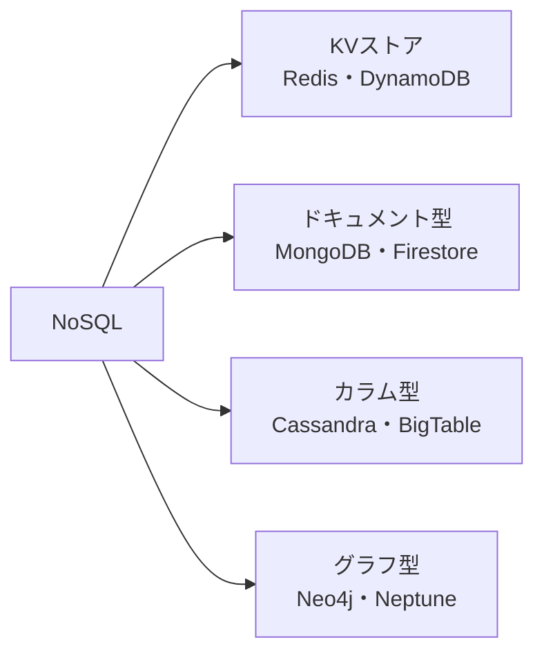

# NoSQL・Redis

リレーショナルデータベース（RDB）が苦手とする「柔軟なスキーマ・大規模分散・超低レイテンシ」を解決するデータストアの総称です。NoSQL は「Not Only SQL」の略で、RDB を否定するものではなく「RDB 以外の選択肢」を指します。

---

## はじめて読む人へ

NoSQL を「RDB の代替」と考えると使いどころを誤ります。「このデータにはどのストレージが最も自然か」という視点で選ぶのが正しいアプローチです。

### 読む前に押さえること

- [データベース基礎](データベース基礎.md) の RDB・正規化・トランザクションの概念

### 読み終えたら説明できること

- RDB と NoSQL の使い分けを「整合性 vs スケール」の観点で説明できる
- Redis をキャッシュとして組み込む理由と実装の流れを説明できる
- MongoDB のドキュメント構造と基本クエリを説明できる

---

## RDB vs NoSQL

| | RDB（PostgreSQL 等）| NoSQL |
|--|-------------------|-------|
| データ形式 | 行・列（テーブル）| ドキュメント・KV・グラフ等 |
| スキーマ | 固定（変更にマイグレーション必要）| 柔軟 |
| 結合 | JOIN が得意 | 基本的に JOIN しない |
| トランザクション | ACID 保証（強整合性）| 多くは結果整合性 |
| スケール方式 | 垂直スケール主体 | 水平スケールが得意 |
| 向いているデータ | 構造が明確・関係が複雑 | スキーマが変わる・大規模・低レイテンシ必須 |

**使い分けの基本：**
- ユーザーデータ・注文・決済 → RDB（整合性が最優先）
- セッション・キャッシュ・ランキング → Redis
- ブログ記事・商品カタログ・ログ → MongoDB
- SNS のフォロー関係・推薦 → グラフ DB（Neo4j）

---

## NoSQL の 4 種類



| 種類 | データの形 | 向いているユースケース |
|------|-----------|---------------------|
| KV ストア | key → value | キャッシュ・セッション・ランキング |
| ドキュメント型 | JSON に近い構造 | 記事・商品・ユーザープロフィール |
| カラム型 | 列を圧縮して保存 | 時系列・大規模分析 |
| グラフ型 | ノード・エッジ | SNS 関係・推薦・不正検知 |

---

## Redis

**インメモリの KV ストア**です。データをメモリに持つため、PostgreSQL の 100〜1000 倍高速な読み書きが可能です。キャッシュ・セッション管理・Pub/Sub・リーダーボードに使われます。

### インストールと接続

```bash
# Mac
brew install redis
brew services start redis

# Python クライアント
pip install redis
```

```python
import redis

r = redis.Redis(host="localhost", port=6379, db=0, decode_responses=True)
r.ping()  # → True
```

### 基本データ型

```python
# --- String（最も基本）---
r.set("user:1:name", "田中")
r.get("user:1:name")           # "田中"
r.set("counter", 0)
r.incr("counter")              # 1（アトミックなインクリメント）
r.expire("session:abc", 3600)  # 1時間後に自動削除

# --- Hash（オブジェクト）---
r.hset("user:1", mapping={"name": "田中", "email": "tanaka@example.com", "age": "25"})
r.hget("user:1", "name")       # "田中"
r.hgetall("user:1")            # {"name": "田中", "email": ..., "age": "25"}

# --- List（キュー・スタック）---
r.rpush("queue:tasks", "task1", "task2", "task3")  # 末尾に追加
r.lpop("queue:tasks")          # "task1"（先頭から取り出し）
r.lrange("queue:tasks", 0, -1) # 全要素を表示

# --- Set（重複なし集合）---
r.sadd("tags:post:1", "python", "redis", "backend")
r.smembers("tags:post:1")      # {"python", "redis", "backend"}
r.sismember("tags:post:1", "python")  # True

# --- Sorted Set（スコア付き順序集合）---
r.zadd("ranking", {"alice": 1200, "bob": 850, "carol": 1500})
r.zrange("ranking", 0, -1, withscores=True, rev=True)
# [("carol", 1500), ("alice", 1200), ("bob", 850)]
```

### キャッシュとして使う（FastAPI との連携）

DB へのクエリ結果をキャッシュし、同じリクエストの DB アクセスを減らします。

```python
import json
import redis
from fastapi import FastAPI
import database  # 自前の DB アクセス層

app = FastAPI()
cache = redis.Redis(host="localhost", port=6379, decode_responses=True)

CACHE_TTL = 300  # 5分

@app.get("/products/{product_id}")
def get_product(product_id: int):
    cache_key = f"product:{product_id}"

    # キャッシュを確認
    cached = cache.get(cache_key)
    if cached:
        return json.loads(cached)  # キャッシュヒット

    # キャッシュミス → DB から取得
    product = database.get_product(product_id)
    cache.set(cache_key, json.dumps(product), ex=CACHE_TTL)
    return product
```

**キャッシュ更新戦略：**

| 戦略 | 方法 | 向いているケース |
|------|------|----------------|
| Cache-Aside | 読み時にキャッシュミスを検知して書く | 読み多・書き少ない |
| Write-Through | 書き込み時に同時にキャッシュも更新 | 常に最新を返したい |
| TTL 設定 | 一定時間後に自動削除 | 多少の古さが許容できる |

### セッション管理

```python
import uuid

def create_session(user_id: int) -> str:
    session_id = str(uuid.uuid4())
    cache.hset(f"session:{session_id}", mapping={
        "user_id": str(user_id),
        "created_at": "2026-06-04"
    })
    cache.expire(f"session:{session_id}", 86400)  # 24時間
    return session_id

def get_session(session_id: str) -> dict | None:
    data = cache.hgetall(f"session:{session_id}")
    return data if data else None
```

### Pub/Sub（メッセージング）

```python
# Publisher（送信側）
r.publish("notifications", json.dumps({"user_id": 1, "message": "注文が完了しました"}))

# Subscriber（受信側）
import threading

def listen():
    pubsub = r.pubsub()
    pubsub.subscribe("notifications")
    for message in pubsub.listen():
        if message["type"] == "message":
            data = json.loads(message["data"])
            print(f"通知受信: {data}")

thread = threading.Thread(target=listen, daemon=True)
thread.start()
```

---

## MongoDB

**ドキュメント型 NoSQL** です。データを JSON に近い **BSON** 形式で保存し、スキーマが柔軟です。`users` コレクションの各ドキュメントが違うフィールドを持っても問題ありません。

### インストールと接続

```bash
pip install pymongo
```

```python
from pymongo import MongoClient

client = MongoClient("mongodb://localhost:27017/")
db = client["myapp"]
users = db["users"]  # コレクション（RDB のテーブルに相当）
```

### CRUD 操作

```python
# Create
result = users.insert_one({
    "name": "田中",
    "email": "tanaka@example.com",
    "tags": ["python", "ml"],
    "address": {"city": "東京", "zip": "100-0001"}
})
print(result.inserted_id)  # ObjectId

# ネストしたドキュメントもそのまま保存できる（RDB では別テーブルが必要）
users.insert_many([
    {"name": "山田", "email": "yamada@example.com", "age": 22},
    {"name": "佐藤", "email": "sato@example.com", "age": 25, "premium": True},
])

# Read
user = users.find_one({"email": "tanaka@example.com"})
all_users = list(users.find({"age": {"$gte": 20}}))  # 20歳以上
tokyo_users = list(users.find({"address.city": "東京"}))  # ネストフィールド検索

# Update
users.update_one(
    {"email": "tanaka@example.com"},
    {"$set": {"age": 26}, "$push": {"tags": "redis"}}
)

# Delete
users.delete_one({"email": "tanaka@example.com"})
```

### クエリ演算子

```python
# 比較
users.find({"age": {"$gt": 20, "$lt": 30}})    # 20超 30未満
users.find({"name": {"$in": ["田中", "山田"]}})  # いずれかに一致

# 論理
users.find({"$or": [{"age": {"$lt": 20}}, {"premium": True}]})

# 正規表現
users.find({"email": {"$regex": "@example.com$"}})

# ソート・件数制限
users.find().sort("age", -1).limit(10)  # 年齢降順で10件
```

### インデックス

```python
# よく検索するフィールドにインデックスを作る
users.create_index("email", unique=True)
users.create_index([("age", 1), ("name", 1)])  # 複合インデックス

# インデックス確認
print(list(users.index_information().keys()))
```

---

## 確認問題

1. 「ユーザーが商品にレビューを書く EC サイト」で、商品データを MongoDB に、セッションを Redis に保存する設計の理由を説明してください。
2. Redis の `expire` を設定し忘れると何が起きますか？
3. MongoDB で `find({"address.city": "東京"})` と書けるのは RDB と比べてどんな利点がありますか？

---

## 関連ページ

- [データベース基礎](データベース基礎.md) — RDB・SQL の基礎
- [データベース詳解](データベース詳解.md) — トランザクション・インデックス・正規化
- [FastAPI](FastAPI.md) — Redis キャッシュを組み込む API 実装
- [認証・認可](認証・認可.md) — Redis によるセッション管理
- [データエンジニアリング](データエンジニアリング.md) — 大規模データパイプラインでの NoSQL 活用
