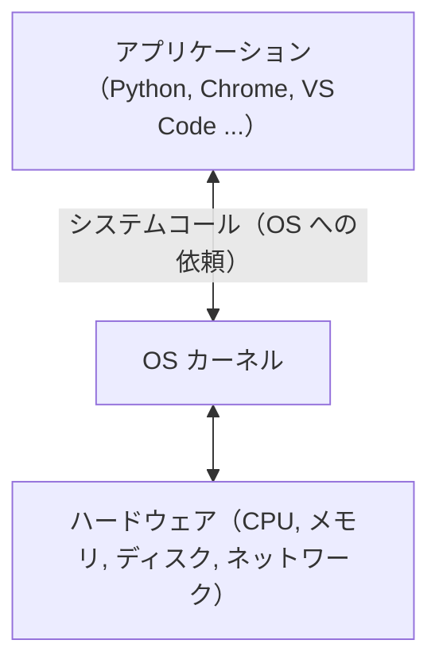
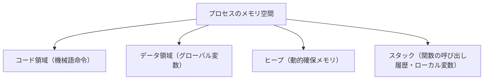
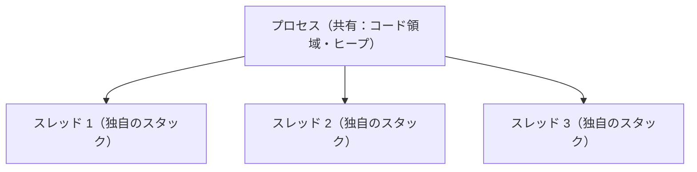
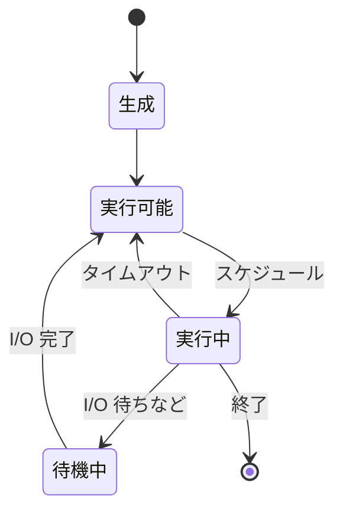
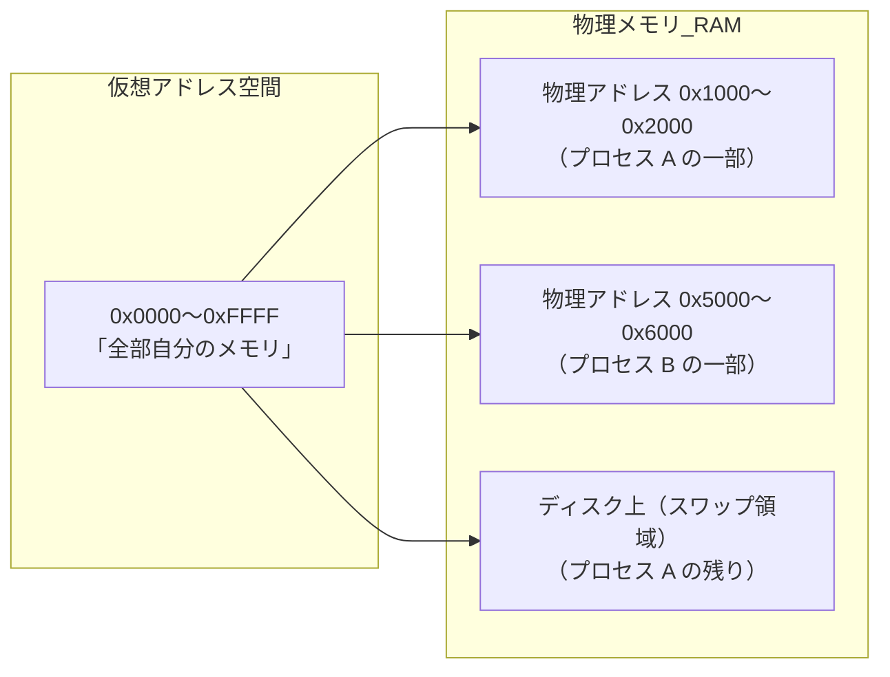
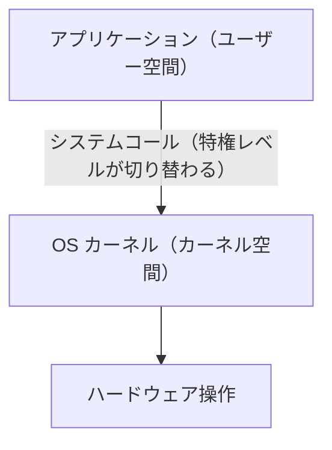
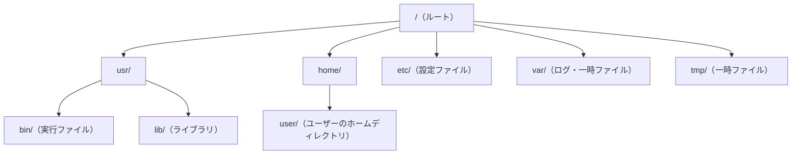
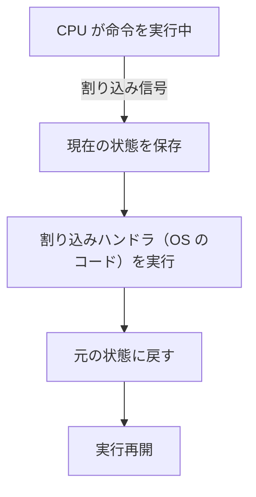

# OS 詳解

> [コンピュータ基礎](コンピュータ基礎) の続きです。OS がプロセス・メモリ・ファイルをどう管理するかを詳しく学びます。

---

## はじめて読む人へ

OS は、アプリケーションがハードウェアを安全に使うための管理者です。プロセス、メモリ、ファイル、割り込みなどを管理し、複数のプログラムが同時に動けるようにします。


### 読む前に押さえること

- プロセス管理は、どのプログラムをいつ実行するかを決めます。
- 仮想メモリは、各プロセスが独立したメモリ空間を持つように見せます。
- システムコールは、アプリがOSの機能を呼び出す入口です。

### 読み終えたら説明できること

- プロセス状態、スケジューリング、仮想メモリを説明できる。
- ファイル操作がシステムコールを通ることを理解できる。
- OS が安全性と効率を支えている理由を説明できる。

---

## OS（オペレーティングシステム）の役割

OS とは **ハードウェアとアプリケーションの仲介役** です。



OS がなければ、各アプリが「メモリのどこを使うか」「ディスクをどう読み書きするか」を自分で決めなければならず、衝突やクラッシュが起きます。OS が管理することで複数のプログラムが安全に共存できます。

**OS の主な仕事：**

| 仕事 | 内容 |
|------|------|
| プロセス管理 | どのプログラムを・いつ・どれだけ実行するか |
| メモリ管理 | どのプロセスにどのメモリ領域を割り当てるか |
| ファイルシステム | ディスクにデータをどう保存・読み出しするか |
| デバイス管理 | キーボード・ネットワーク・GPU などの入出力 |
| セキュリティ | プロセス間の隔離、権限管理 |

---

## プロセスとスレッド

プロセスは、実行中のプログラムにOSがメモリ空間や資源を割り当てたものです。ブラウザ、エディタ、Pythonプログラムなどは、それぞれプロセスとして動きます。

スレッドは、1つのプロセスの中で動く実行単位です。同じメモリ空間を共有するためデータを渡しやすい一方で、同じ変数を同時に書き換えると競合が起きることがあります。

### プロセス

**プロセス** とは、実行中のプログラム 1 つのことです。

```bash
ps aux          # 動いているプロセスを一覧表示（Mac/Linux）
top             # リアルタイムで CPU・メモリ使用量を監視
```

`ps aux` は、その時点で動いているプロセスの一覧を表示します。PID、CPU使用率、メモリ使用率、実行中のコマンドなどを見ることで、「何が動いているか」を確認できます。`top` はそれをリアルタイムに更新して表示する道具です。OS の概念を学ぶときは、抽象的な「プロセス」が、実際にはこのような一覧に現れる単位だと結びつけると理解しやすくなります。

プロセスはそれぞれ **独立したメモリ空間** を持ちます。あるプロセスが暴走しても、他のプロセスには影響しません。

**プロセスが持つもの：**



コード領域には実行する命令、データ領域にはプログラム全体で使う変数、ヒープには実行中に確保する可変長のデータ、スタックには関数呼び出しごとの一時的な情報が置かれます。C 言語で `malloc` を学ぶときにヒープ、関数呼び出しやローカル変数を学ぶときにスタックが出てきます。

### スレッド

**スレッド** とは、プロセスの中の実行単位です。1 つのプロセスの中に複数のスレッドを作れます。



スレッドは同じプロセス内のヒープを共有します。共有できることは高速な一方で、同じデータを同時に更新すると壊れる危険があります。この危険が、後の [並列・並行処理](並列・並行処理) で学ぶ競合状態やミューテックスにつながります。

| 比較 | プロセス | スレッド |
|------|---------|---------|
| メモリ | 独立している | プロセス内で共有 |
| 生成コスト | 重い（メモリ空間まるごとコピー） | 軽い |
| 通信方法 | IPC（パイプ・ソケット等） | 共有メモリを直接読み書き |
| 障害時 | 他のプロセスに影響しない | 同プロセスのスレッド全体が危険 |

> **Web サーバーとプロセス/スレッド：**  
> Nginx はリクエストをイベントループで処理します（シングルスレッドで多数の接続を効率よくさばく）。Apache はリクエストごとにプロセス/スレッドを生成します。どちらが向いているかはユースケース次第です（詳しくは [並列・並行処理](並列・並行処理)）。

---

## プロセスの状態遷移

プロセスは常に以下のいずれかの状態にあります。



**PCB（Process Control Block）：**

OS は各プロセスの状態を PCB というデータ構造で管理します。

| PCB の内容 | 例 |
|------------|---|
| PID（プロセス ID） | 1234 |
| 状態 | 実行中 |
| プログラムカウンタ | 次に実行する命令のアドレス |
| レジスタの値 | コンテキストスイッチ時に保存 |
| メモリマップ | このプロセスが使うメモリ領域 |
| 開いているファイル | ファイルディスクリプタのリスト |

PCB は、OS にとっての「プロセスの管理台帳」です。CPU が別のプロセスへ切り替わるとき、いま実行していたプロセスのレジスタや次に実行する位置を PCB に保存します。あとでそのプロセスに戻るとき、保存しておいた情報を復元することで、プログラムは続きから実行されているように見えます。

---

## CPU スケジューリング

複数のプロセスを 1 つの CPU で動かすために、OS は **どのプロセスを次に実行するか** を決めます。

### 主なスケジューリングアルゴリズム

**FCFS（First Come, First Served）：先着順**

!!! info ""
    到着順：P1(24ms) → P2(3ms) → P3(3ms)
    
    P1 が終わるまで P2, P3 は待つ
    平均待ち時間 = (0 + 24 + 27) / 3 = 17ms

単純だが、長いプロセスが先にくると後のプロセスが長時間待たされる（護送船団問題）。

FCFS は行列に並んだ順に処理する方式です。公平に見えますが、最初に長い処理が来ると、短い処理まで巻き込まれて待たされます。OS のスケジューリングでは、「公平さ」と「待ち時間の短さ」が必ずしも同じではないことが分かります。

**SJF（Shortest Job First）：最短ジョブ優先**

!!! info ""
    P1(6ms) P2(8ms) P3(7ms) P4(3ms)
    
    実行順：P4(3) → P1(6) → P3(7) → P2(8)
    平均待ち時間 = (0 + 3 + 9 + 16) / 4 = 7ms

平均待ち時間が最小になる最適戦略。ただし各プロセスの実行時間を事前に知る必要がある（現実では困難）。

SJF は短い処理から先に片づけるので平均待ち時間を短くできます。ただし、実行前に「この処理は何ミリ秒で終わる」と正確に知ることは普通できません。そのため、実際のOSでは過去の実行状況から推定したり、優先度と組み合わせたりします。

**ラウンドロビン（RR）：タイムスライスで交代**

各プロセスに一定時間（タイムクォンタム、例：10ms）を割り当て、時間が来たら次のプロセスに交代する。

!!! info ""
    タイムクォンタム = 4ms
    
    P1(24ms) P2(3ms) P3(3ms)
    
    P1[4] → P2[3] → P3[3] → P1[4] → P1[4] → P1[4] → P1[4] → P1[4]

全プロセスが均等に CPU を使える。対話的なシステム（GUI・Web サーバー）に適している。

ラウンドロビンでは、処理が終わっていなくても一定時間ごとに交代します。これにより、1つの重い処理がCPUを独占しにくくなります。GUIやWebサーバーでは、利用者が「固まった」と感じないよう、短い間隔で応答を返せることが重要です。

**コンテキストスイッチ：**

プロセスを切り替えるとき、OS は現在のプロセスの PCB（レジスタ・プログラムカウンタ等）を保存し、次のプロセスの PCB を復元します。この操作を **コンテキストスイッチ** と言い、無駄な処理時間がかかります（オーバーヘッド）。

---

## メモリ管理

### 仮想メモリ

各プロセスは **自分専用のメモリ空間を丸ごと持っている** ように見えます（仮想アドレス空間）。実際には OS が仮想アドレスを物理アドレスに変換します。



**メリット：**

- プロセスが他のプロセスのメモリを誤って書き換えられない（保護）
- 実際の RAM より大きいメモリを使えるように見せられる
- プログラムのロード時に物理アドレスを気にしなくてよい

### ページング

仮想アドレスと物理アドレスのマッピングは **ページ** 単位で行います（通常 4KB）。


**ページフォールト：**

アクセスしようとしたページが RAM 上になく（ディスクのスワップ領域にある）、OS がディスクから RAM にロードする処理。時間がかかるためパフォーマンスに影響します。

仮想メモリのおかげで、各プロセスは連続した大きなメモリを持っているように見えます。しかし実際には、必要なページだけがRAMに載り、残りはディスクに退避されることがあります。ページフォールトが多い状態は、メモリ不足でディスクアクセスが増えているサインです。

### メモリ割り当て

| 領域 | 用途 | 管理 |
|------|------|------|
| コード領域 | 機械語命令 | OS がロード時に固定 |
| データ領域 | グローバル変数・定数 | コンパイル時に決まる |
| ヒープ | 動的確保（malloc/new） | プログラマが管理（または GC） |
| スタック | 関数呼び出し・ローカル変数 | OS が自動管理 |

---

## システムコール

プログラムから OS の機能を呼び出すインターフェースです。



**よく使うシステムコール：**

| 分類 | システムコール | 内容 |
|------|-------------|------|
| ファイル | `open`, `read`, `write`, `close` | ファイルの読み書き |
| プロセス | `fork`, `exec`, `exit`, `wait` | プロセスの生成・終了 |
| メモリ | `mmap`, `brk` | メモリの確保 |
| ネットワーク | `socket`, `connect`, `send`, `recv` | 通信 |

Python や JavaScript では意識しませんが、`open("file.txt")` の裏では OS の `open` システムコールが呼ばれています。

アプリケーションは、ディスクやネットワークカードを直接操作できません。直接触れてしまうと、他のアプリのデータを壊したり、権限を無視したりできてしまうからです。そこで、ファイルを開く、ネットワークに接続する、プロセスを作るといった操作は、OSに依頼する形になります。

```python
# Python コード
with open("data.txt", "r") as f:
    content = f.read()

# 裏側では OS の open() / read() / close() システムコールが走る
```

この Python コードでは、`with open(...)` がファイルを開き、`f.read()` が内容を読み、`with` ブロックを抜けるとファイルを閉じます。Python の文法としては短いですが、裏側ではOSが権限を確認し、ディスクからデータを読み、ファイルディスクリプタを管理しています。

### strace で実際に見る（Linux）

```bash
strace python3 hello.py 2>&1 | head -20
```

Python が起動するだけで何十ものシステムコールが走っていることがわかります。

`strace` は、プログラムがどのシステムコールを呼んだかを表示するLinuxの診断ツールです。`2>&1 | head -20` は、エラー出力も含めて先頭20行だけを見るための書き方です。出力のすべてを理解する必要はありませんが、「普通のPython実行もOSへの依頼の連続で成り立っている」と観察できます。

---

## ファイルシステム

### ディレクトリ構造

ファイルシステムは木構造で管理されます。



Linux や macOS では、ファイルはこのような1本の木構造の中に配置されます。`/` が根で、`usr` や `etc` などのディレクトリが枝のようにつながります。Windows の `C:\` や `D:\` とは見え方が違いますが、「場所をパスで指定する」という考え方は同じです。

### inode

ファイルの実体は **inode** というデータ構造で管理されます。

| inode が持つ情報 | 持たない情報 |
|----------------|-----------|
| ファイルサイズ | ファイル名 |
| 所有者（UID/GID） | — |
| 権限（rwxrwxrwx） | — |
| タイムスタンプ | — |
| データブロックの場所 | — |

ファイル名は **ディレクトリエントリ** が管理します（ファイル名 → inode 番号のマッピング）。ハードリンクは同じ inode を複数のファイル名で参照します。

### ファイル権限

```bash
ls -la
-rw-r--r--  1 user group 1234 Jan  1 00:00 file.txt
```

`ls -la` は、隠しファイルを含めて詳細情報を表示します。先頭の `-rw-r--r--` は、ファイル種別と権限を表しています。権限の読み方が分かると、「なぜこのスクリプトを実行できないのか」「なぜこのファイルに書き込めないのか」を切り分けられます。

!!! info ""
    -  rw-  r--  r--
    ↑  ↑    ↑    ↑
    │  │    │    └─ その他のユーザー
    │  │    └───── グループ
    │  └────────── 所有者
    └───────────── ファイル種別（-:ファイル, d:ディレクトリ）
    
    r = 読み取り (4)
    w = 書き込み (2)
    x = 実行    (1)

```bash
chmod 644 file.txt    # rw-r--r--
chmod 755 script.sh   # rwxr-xr-x
```

`chmod 644` は、所有者だけが書き込めて、他の人は読める設定です。通常のテキストファイルによく使われます。`chmod 755` は、所有者が読み書き実行でき、他の人も読み取りと実行ができる設定です。シェルスクリプトをコマンドとして実行したいときに使います。

---

## 割り込み

CPU は通常プログラムを順番に実行しますが、**割り込み（interrupt）** が発生すると実行中の処理を一時停止して OS のハンドラを実行します。

| 種類 | 例 |
|------|---|
| ハードウェア割り込み | キーボード入力、タイマー（スケジューリングに使う）、NIC（パケット到着） |
| ソフトウェア割り込み（例外） | ゼロ除算、不正メモリアクセス（セグフォ）、システムコール |



タイムスライスのタイムアウトもタイマー割り込みによって実現されています。

---

## まとめ

| 機能 | 要点 |
|------|------|
| プロセス管理 | 各プロセスは独立したメモリ空間。PCB で状態管理 |
| スレッド | プロセス内の軽量な実行単位。メモリを共有する |
| スケジューリング | ラウンドロビンが汎用的。コンテキストスイッチにはコストがある |
| 仮想メモリ | プロセスに独立した仮想アドレス空間を提供。ページングでマッピング |
| システムコール | ユーザー空間とカーネル空間の境界 |
| ファイルシステム | inode でメタデータ管理。ディレクトリは名前→inode のマッピング |
| 割り込み | 非同期イベントを CPU に知らせる仕組み |

---


## 確認問題

1. OS 詳解 は、何の問題を解決するための考え方・道具ですか。
2. このページで出てきた重要語を 3 つ選び、それぞれ 1 文で説明してください。
3. コード例やコマンド例がある場合、入力・処理・出力を分けて説明してください。
4. このページの内容が、前後の STEP や自分の作りたいものにどうつながるか説明してください。

---

## 関連ページ

- [コンピュータ基礎](コンピュータ基礎) — CPU・メモリ・ストレージの概要
- [並列・並行処理](並列・並行処理) — スレッド・競合状態・デッドロック
- [Linux 基礎](Linux基礎) — コマンドラインでの OS 操作
- [C 言語入門](C言語入門) — システムコールを直接呼ぶプログラミング

---

[← ホームへ](Home)
