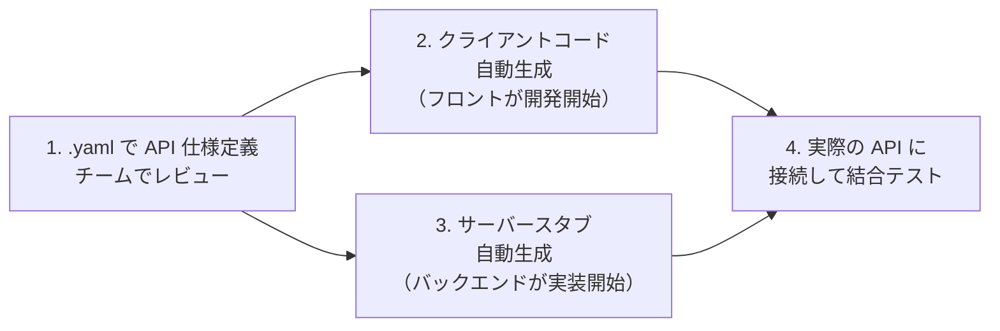

# OpenAPI / Swagger

REST API の仕様を機械可読な形式（YAML / JSON）で記述する業界標準です。**API ドキュメントの自動生成・クライアントコードの自動生成・バリデーション**を可能にし、フロントエンドとバックエンドの開発を疎結合で進める基盤になります。FastAPI は OpenAPI 仕様を自動出力します。

---

## はじめて読む人へ

「フロントエンドチームが使う API の仕様書を Word で書いて、変更があるたびに手動更新する」——これが OpenAPI 以前の世界です。OpenAPI なら仕様が YAML に記述されており、Swagger UI でブラウザ上に美しいドキュメントが自動生成され、テストも UI からできます。

### 読む前に押さえること

- [Web / API設計](WebAPI設計) — REST・HTTP・ステータスコードの基礎
- [FastAPI](FastAPI) — FastAPI と OpenAPI の連携

### 読み終えたら説明できること

- OpenAPI 仕様の基本構造（paths・components・schemas）を書ける
- FastAPI で OpenAPI が自動生成される仕組みを説明できる
- API-first 設計のワークフローを説明できる

---

## OpenAPI とは

### 略史

| 名前 | 時期 | 説明 |
|------|------|------|
| Swagger | 2010〜 | SmartBear 社が開発。最初の API 仕様標準 |
| OpenAPI 2.0 | 2015 | Swagger の仕様を OpenAPI Initiative に寄贈・改名 |
| **OpenAPI 3.0** | 2017 | 現在の主流バージョン。`components` の分離・改善 |
| OpenAPI 3.1 | 2021 | JSON Schema との完全互換 |

「Swagger」という言葉は今もよく使われますが、**仕様 = OpenAPI、ツール群 = Swagger**という整理が正確です（Swagger UI・Swagger Editor など）。

---

## OpenAPI 仕様の基本構造

```yaml
openapi: "3.0.3"

info:
  title: User API
  version: "1.0.0"
  description: ユーザー管理 API

servers:
  - url: https://api.example.com/v1
    description: 本番環境
  - url: http://localhost:8000
    description: 開発環境

paths:
  /users:
    get:
      summary: ユーザー一覧を取得
      operationId: listUsers
      parameters:
        - name: page
          in: query
          required: false
          schema:
            type: integer
            default: 1
      responses:
        "200":
          description: 成功
          content:
            application/json:
              schema:
                $ref: "#/components/schemas/UserListResponse"
        "401":
          $ref: "#/components/responses/Unauthorized"

    post:
      summary: ユーザーを作成
      requestBody:
        required: true
        content:
          application/json:
            schema:
              $ref: "#/components/schemas/CreateUserRequest"
      responses:
        "201":
          description: 作成成功
          content:
            application/json:
              schema:
                $ref: "#/components/schemas/User"

  /users/{userId}:
    get:
      summary: ユーザーを 1 件取得
      parameters:
        - name: userId
          in: path
          required: true
          schema:
            type: integer

components:
  schemas:
    User:
      type: object
      required: [id, name, email]
      properties:
        id:
          type: integer
          example: 1
        name:
          type: string
          example: Alice
          minLength: 1
          maxLength: 100
        email:
          type: string
          format: email
        created_at:
          type: string
          format: date-time

    CreateUserRequest:
      type: object
      required: [name, email]
      properties:
        name:
          type: string
        email:
          type: string
          format: email

    UserListResponse:
      type: object
      properties:
        users:
          type: array
          items:
            $ref: "#/components/schemas/User"
        total:
          type: integer

  responses:
    Unauthorized:
      description: 認証エラー
      content:
        application/json:
          schema:
            type: object
            properties:
              message:
                type: string

  securitySchemes:
    BearerAuth:
      type: http
      scheme: bearer
      bearerFormat: JWT

security:
  - BearerAuth: []
```

### 主要セクション

| セクション | 役割 |
|-----------|------|
| `openapi` | バージョン指定 |
| `info` | API のタイトル・バージョン・説明 |
| `servers` | エンドポイントの URL |
| `paths` | エンドポイント・HTTP メソッド・パラメータ・レスポンスの定義 |
| `components` | 再利用可能なスキーマ・レスポンス・セキュリティスキームの定義 |
| `security` | グローバルな認証設定 |

---

## FastAPI との統合

FastAPI は Python の型ヒントから OpenAPI 仕様を**自動生成**します。

```python
from fastapi import FastAPI, Path, Query
from pydantic import BaseModel, EmailStr
from typing import Optional

app = FastAPI(
    title="User API",
    version="1.0.0",
    description="ユーザー管理 API"
)

class User(BaseModel):
    id: int
    name: str
    email: EmailStr

class CreateUserRequest(BaseModel):
    name: str
    email: EmailStr

@app.get("/users", response_model=list[User])
def list_users(
    page: int = Query(1, ge=1, description="ページ番号"),
    per_page: int = Query(20, le=100, description="1ページのアイテム数"),
):
    """ユーザー一覧を取得します"""
    ...

@app.post("/users", response_model=User, status_code=201)
def create_user(body: CreateUserRequest):
    """新しいユーザーを作成します"""
    ...
```

`http://localhost:8000/docs` → **Swagger UI** が自動で表示  
`http://localhost:8000/redoc` → **ReDoc** 形式のドキュメント  
`http://localhost:8000/openapi.json` → **OpenAPI JSON** がエクスポート

---

## クライアントコードの自動生成

OpenAPI 仕様から各言語のクライアントコードを自動生成できます。

```bash
# openapi-generator-cli を使った TypeScript クライアント生成
npx @openapitools/openapi-generator-cli generate \
  -i openapi.yaml \
  -g typescript-fetch \
  -o ./src/api

# 生成された型安全な API クライアント
import { UsersApi, Configuration } from './api';

const api = new UsersApi(new Configuration({ basePath: 'http://localhost:8000' }));
const users = await api.listUsers({ page: 1 });  // 型安全！
```

**生成できる言語：** TypeScript・Python・Java・Go・Kotlin・Swift など 50 言語以上。

---

## API-first 設計

コードを書く前に OpenAPI 仕様を先に定義するアプローチです。



**利点：**
- フロント・バックエンドが並行して開発できる
- 仕様の変更が単一の YAML ファイルで管理される
- 型安全なクライアントコードが常に最新の仕様と一致する

---

## Swagger UI の活用

生成されたドキュメントから直接 API をテストできます。

GET /users HTTP/1.1
Authorization: Bearer eyJ...（UI から JWT を設定してテスト）

→ "Try it out" → "Execute" で実際に API を呼び出し
→ レスポンスのステータスコード・ボディを確認
チームメンバーや外部開発者への API 説明・手動テスト・コードレビューに活用できます。

---

## 確認問題

1. `$ref: "#/components/schemas/User"` の `$ref` が重要な理由を「DRY 原則」の観点から説明してください。
2. FastAPI が Python の型ヒントだけで OpenAPI を自動生成できる仕組みを説明してください。
3. API-first 設計がフロントエンドとバックエンドの並行開発を可能にする理由を説明してください。

---

## 関連ページ

- [Web / API設計](WebAPI設計) — REST の基本設計
- [FastAPI](FastAPI) — OpenAPI の自動生成の実装
- [gRPC](gRPC) — REST + OpenAPI の代替（内部通信向け）
- [TypeScript](TypeScript) — 自動生成クライアントの型安全性

---

[← ホームへ](Home)
