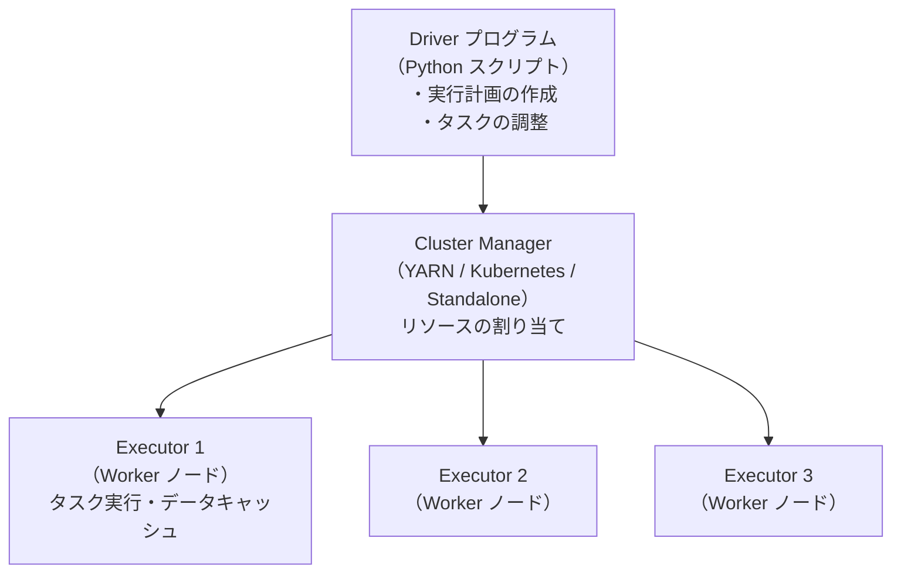

# PySpark

分散データ処理フレームワーク Apache Spark の Python API です。単一マシンのメモリに収まらない大規模データ（GB〜TB 規模）を複数ノードのクラスターで並列処理します。DataFrame API・SparkSQL・MLlib（分散機械学習）・Structured Streaming（ストリーミング処理）を扱います。

---

## はじめて読む人へ

「pandas は 10GB の CSV を読めない」「SQL で 1 億行のジョインが数時間かかる」——こういった規模のデータが出てくると PySpark の出番です。API は pandas に似ていますが、実行は裏で分散コンピュータ上で行われます。就職後にデータエンジニアリング・機械学習エンジニアリングを担当する方はほぼ確実に遭遇します。

### 読む前に押さえること

- [NumPy / pandas 基礎](pandas-sklearn) — DataFrame の基本操作
- [データベース基礎](データベース基礎) — SQL・JOIN の基礎
- [データエンジニアリング](データエンジニアリング) — Spark の位置づけ

### 読み終えたら説明できること

- Spark の Driver・Executor・クラスターの役割を説明できる
- RDD と DataFrame の違いと使い分けを説明できる
- pandas に対して Spark が有効な規模の目安を説明できる

---

## Spark のアーキテクチャ

### 分散処理の仕組み



| コンポーネント | 役割 |
|-------------|------|
| **Driver** | ユーザーのコードを受け取り、DAG（有向非巡回グラフ）の実行計画を作成 |
| **Executor** | 実際の計算を行うプロセス（複数のタスクを並列実行）|
| **Cluster Manager** | リソース（CPU・メモリ）を各 Executor に割り当て |

### 遅延評価（Lazy Evaluation）

```python
df = spark.read.csv("huge.csv")  # 何もしない
df2 = df.filter(df.age > 25)     # 何もしない（Transformation）
df3 = df2.select("name", "age")  # 何もしない
result = df3.count()              # ここで初めて実行（Action）
```

Transformation は DAG として記録され、Action が呼ばれたときに最適化されてまとめて実行されます。DuckDB の Lazy API と同じ発想です。

---

## RDD（Resilient Distributed Datasets）

Spark の基本データ構造です。クラスター全体に分散した **不変の** データセットで、障害時に再計算で復元できます（Resilient）。

### RDD の基本操作

```python
from pyspark.sql import SparkSession

spark = SparkSession.builder.appName("example").getOrCreate()
sc = spark.sparkContext  # SparkContext（RDD API）

# RDD の作成
rdd = sc.parallelize([1, 2, 3, 4, 5, 6, 7, 8])

# Transformation（遅延評価）
rdd2 = rdd.filter(lambda x: x % 2 == 0)   # [2, 4, 6, 8]
rdd3 = rdd2.map(lambda x: x ** 2)          # [4, 16, 36, 64]

# Action（実行）
print(rdd3.collect())    # [4, 16, 36, 64]
print(rdd3.sum())        # 120
print(rdd3.count())      # 4
```

### パーティション

データは複数の **パーティション** に分割されて Executor に分配されます。

```python
rdd.getNumPartitions()  # パーティション数の確認
rdd.repartition(8)      # 均等に 8 分割（Shuffle あり）
rdd.coalesce(4)         # 減らすのみ（Shuffle なし、より効率的）
```

---

## DataFrame API（推奨）

RDD より高レベルで最適化が効くため、通常は DataFrame を使います。

### 基本操作

```python
from pyspark.sql import SparkSession
from pyspark.sql.functions import col, avg, count, when

spark = SparkSession.builder.appName("demo").getOrCreate()

# 読み込み
df = spark.read.csv("data.csv", header=True, inferSchema=True)
df = spark.read.parquet("data.parquet")      # より高速

# スキーマ確認
df.printSchema()
df.show(5)                                    # 先頭 5 行表示
df.describe().show()                          # 基本統計量

# 選択・フィルタ
df.select("name", "age")
df.filter(col("age") > 25)
df.filter((col("age") > 25) & (col("city") == "Tokyo"))

# 新列追加
df.withColumn("age_next", col("age") + 1)
df.withColumn("senior", when(col("age") >= 65, True).otherwise(False))

# GroupBy と集計
df.groupBy("city").agg(
    avg("age").alias("avg_age"),
    count("*").alias("count")
).orderBy("avg_age", ascending=False)
```

### JOIN

```python
df_left.join(df_right, on="user_id", how="left")    # LEFT JOIN
df_left.join(df_right, on="user_id", how="inner")   # INNER JOIN
df_left.join(df_right, on=["id", "date"], how="left")  # 複数キー
```

**Broadcast Join：** 片方が小テーブル（数 MB 以下）の場合、全 Executor にブロードキャストすることで Shuffle を避けて高速化できます。

```python
from pyspark.sql.functions import broadcast
df_large.join(broadcast(df_small), on="key")
```

---

## SparkSQL

SQL でデータを操作できます。

```python
df.createOrReplaceTempView("people")

result = spark.sql("""
    SELECT city,
           AVG(age) AS avg_age,
           COUNT(*) AS cnt,
           SUM(salary) OVER (PARTITION BY city ORDER BY hire_date) AS running_total
    FROM people
    WHERE age > 20
    GROUP BY city
    HAVING cnt > 100
    ORDER BY avg_age DESC
""")
result.show()
```

---

## MLlib（分散機械学習）

大規模データの機械学習を分散処理します。

```python
from pyspark.ml.feature import VectorAssembler, StandardScaler
from pyspark.ml.classification import RandomForestClassifier
from pyspark.ml.pipeline import Pipeline
from pyspark.ml.evaluation import BinaryClassificationEvaluator

# 特徴量のベクトル化（Spark ML の必須ステップ）
assembler = VectorAssembler(
    inputCols=["age", "income", "credit_score"],
    outputCol="features"
)

scaler = StandardScaler(inputCol="features", outputCol="scaled_features")
rf = RandomForestClassifier(
    featuresCol="scaled_features",
    labelCol="label",
    numTrees=100
)

# パイプライン
pipeline = Pipeline(stages=[assembler, scaler, rf])

# 学習・予測
train, test = df.randomSplit([0.8, 0.2], seed=42)
model = pipeline.fit(train)
predictions = model.transform(test)

# 評価
evaluator = BinaryClassificationEvaluator(labelCol="label")
print(f"AUC: {evaluator.evaluate(predictions):.4f}")
```

---

## Structured Streaming

バッチ処理と同じ DataFrame API でストリーミング処理を実現します。

```python
# Kafka からのストリーミング
stream_df = (spark.readStream
    .format("kafka")
    .option("kafka.bootstrap.servers", "localhost:9092")
    .option("subscribe", "events")
    .load()
)

# リアルタイム集計（5 分のウィンドウ）
from pyspark.sql.functions import window
result = (stream_df
    .groupBy(window("timestamp", "5 minutes"), "event_type")
    .count()
)

result.writeStream.outputMode("complete").format("console").start()
```

---

## パフォーマンス最適化

### よくある問題と対策

| 問題 | 原因 | 対策 |
|------|------|------|
| Job が遅い | データスキュー（特定のキーにデータが偏る）| `repartition` で再分散・Salt キー追加 |
| OOM エラー | Executor のメモリ不足 | `spark.executor.memory` を増やす・`persist()` を減らす |
| Shuffle が多い | groupBy・join で全データ移動 | Broadcast Join・パーティション設計 |
| 小ファイル問題 | 大量の小さな Parquet ファイル | `coalesce` で書き出し前に集約 |

### キャッシュ・永続化

```python
df.cache()                      # メモリにキャッシュ（MEMORY_AND_DISK）
df.persist(StorageLevel.MEMORY_AND_DISK)  # ストレージレベルを指定

df.unpersist()                  # キャッシュを解放
```

繰り返し使うデータは `cache()` してシャッフルを防ぎます。

### Spark UI

`http://localhost:4040` で実行計画・各ジョブのタイムライン・DAG・メモリ使用量を確認できます。ボトルネック特定に必須です。

---

## pandas vs PySpark の使い分け

| データサイズ | メモリ | 推奨 |
|-----------|--------|------|
| 〜100 MB | 余裕 | pandas |
| 100 MB 〜 10 GB | 足りるかギリギリ | DuckDB or Polars |
| 10 GB 〜 | 確実に足りない | **PySpark** |

**pandas API on Spark：** `pyspark.pandas` で pandas の API をほぼそのまま使いながら Spark で実行できます。pandas コードの移行に有効です。

---

## 確認問題

1. Spark の遅延評価（Lazy Evaluation）が DuckDB・Polars の Lazy API と同じ発想を持つ理由を説明してください。
2. Broadcast Join が通常の Join より高速な理由を、Shuffle の観点から説明してください。
3. `cache()` を使うべき場面と使うべきでない場面をそれぞれ説明してください。
4. データスキュー（特定のキーにデータが偏る）が Job を遅くする理由を説明してください。

---

## 関連ページ

- [データエンジニアリング](データエンジニアリング) — Spark の位置づけ・ETL 全体像
- [DuckDB](DuckDB) — 小〜中規模のローカル分析 SQL
- [Polars](Polars) — 単一ノードの高速 DataFrame
- [データパイプライン](データパイプライン) — Spark と Airflow の連携
- [SQL実践問題](SQL実践問題) — Window 関数・集計 SQL

---

[← ホームへ](Home)
