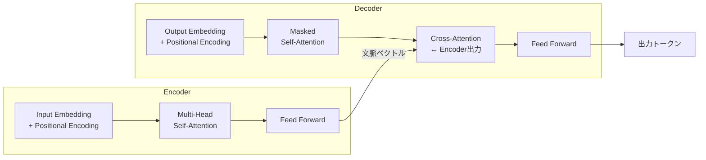

# Transformer・Attention機構

BERT・GPT・ChatGPT など現代の大規模言語モデルの土台となるアーキテクチャです。「文中のすべての単語が、他のすべての単語を直接参照できる」という Attention の仕組みを理解することで、LLM がなぜ強いかの本質が分かります。

---

## はじめて読む人へ

RNN は文を左から右へ順番に処理するため、「文の先頭の単語」と「文の末尾の単語」が遠くなるにつれて関係が薄れていきます。Transformer はこの問題を、全単語間の関係を一度に計算する Attention で解決しました。

### 読む前に押さえること

- [深層学習入門](深層学習入門.md) の行列演算・活性化関数の基本
- [NLP基礎](NLP基礎.md) のトークン化・埋め込みベクトルの概念

### 読み終えたら説明できること

- Self-Attention が Q・K・V を使って何を計算しているかを説明できる
- Transformer の Encoder と Decoder の役割の違いを説明できる
- BERT と GPT がなぜ構造が違うかを説明できる

---

## なぜ Attention が必要か

### RNN の問題：長距離依存

!!! info ""
    文: 「私は昨日、東京で買った本を今日ようやく読んだ」
    
    RNN の処理:
    私 → は → 昨日 → 東京 → で → 買った → 本 → を → 今日 → ようやく → 読んだ
                                                     ↑
                           「読んだ」の主語「私」が11ステップ前に消えかかっている

RNN は前から順番に処理するため、離れた位置にある単語の情報が薄れます。Transformer はすべての単語を並列に処理し、どの単語間の距離も「1ステップ」にします。

---

## Attention の直感

「辞書引き検索」のアナロジーが理解しやすいです。

!!! info ""
    Query（検索クエリ）:  「この文の "読んだ" は誰がやったのか？」
    Keys（索引）:         「私」「東京」「本」「今日」 …
    Values（内容）:        各単語の意味ベクトル
    
    Query と各 Key の類似度を計算 → 「私」が最も一致
    →「私」の Value を多く取ってくる

一つの Query に対して、文中の全単語を Key として照合し、類似度（重み）に応じて Value を加重平均します。

---

## Self-Attention の数式

入力行列 $X$（各行が1単語の埋め込みベクトル）から Q・K・V を作ります。

$$
Q = XW^Q, \quad K = XW^K, \quad V = XW^V
$$

$$
\text{Attention}(Q, K, V) = \text{softmax}\!\left(\frac{QK^\top}{\sqrt{d_k}}\right)V
$$

- $QK^\top$：全単語ペア間の類似度行列（内積）
- $\sqrt{d_k}$ での割り算：内積が大きくなりすぎて softmax が飽和するのを防ぐ
- softmax：各行を「どの単語に注目するか」の確率分布に変換
- $V$ との積：注目度に応じて各単語の Value を混ぜ合わせる

```python
import torch
import torch.nn.functional as F

def scaled_dot_product_attention(Q, K, V):
    d_k = Q.size(-1)
    scores = torch.matmul(Q, K.transpose(-2, -1)) / (d_k ** 0.5)
    weights = F.softmax(scores, dim=-1)
    return torch.matmul(weights, V), weights
```

---

## Multi-Head Attention

Self-Attention を複数の「視点」から並列に実行し、結果を結合します。

!!! info ""
    入力
     ├── Head 1: (Q₁, K₁, V₁) → 構文的な関係を学習
     ├── Head 2: (Q₂, K₂, V₂) → 意味的な関係を学習
     ├── Head 3: (Q₃, K₃, V₃) → 照応関係（代名詞の指示先）を学習
     └── ...（合計 h 個）
          ↓ 結合 → 線形変換
         出力

1 つの Attention では 1 種類の関係しか学べませんが、複数のヘッドで異なる関係を並列に捉えられます。

```python
import torch.nn as nn

class MultiHeadAttention(nn.Module):
    def __init__(self, d_model, num_heads):
        super().__init__()
        self.num_heads = num_heads
        self.d_k = d_model // num_heads
        self.W_q = nn.Linear(d_model, d_model)
        self.W_k = nn.Linear(d_model, d_model)
        self.W_v = nn.Linear(d_model, d_model)
        self.W_o = nn.Linear(d_model, d_model)

    def forward(self, x):
        B, T, D = x.shape
        Q = self.W_q(x).view(B, T, self.num_heads, self.d_k).transpose(1, 2)
        K = self.W_k(x).view(B, T, self.num_heads, self.d_k).transpose(1, 2)
        V = self.W_v(x).view(B, T, self.num_heads, self.d_k).transpose(1, 2)
        out, _ = scaled_dot_product_attention(Q, K, V)
        out = out.transpose(1, 2).contiguous().view(B, T, D)
        return self.W_o(out)
```

---

## Positional Encoding

Attention は単語の順序を無視します（全単語を一度に並列処理するため）。順序情報を補うために **Positional Encoding** を埋め込みベクトルに加算します。

$$
PE_{(pos, 2i)} = \sin\!\left(\frac{pos}{10000^{2i/d_{model}}}\right)
$$

$$
PE_{(pos, 2i+1)} = \cos\!\left(\frac{pos}{10000^{2i/d_{model}}}\right)
$$

```python
import math

class PositionalEncoding(nn.Module):
    def __init__(self, d_model, max_len=512):
        super().__init__()
        pe = torch.zeros(max_len, d_model)
        pos = torch.arange(max_len).unsqueeze(1)
        div = torch.exp(torch.arange(0, d_model, 2) * (-math.log(10000.0) / d_model))
        pe[:, 0::2] = torch.sin(pos * div)
        pe[:, 1::2] = torch.cos(pos * div)
        self.register_buffer("pe", pe.unsqueeze(0))

    def forward(self, x):
        return x + self.pe[:, :x.size(1)]
```

---

## Transformer の全体構造



**Encoder**：入力文全体を文脈ベクトルに圧縮します。Self-Attention で全単語の関係を捉えます。

**Decoder**：出力を 1 トークンずつ生成します。
- **Masked Self-Attention**：未来のトークンを見ないようにマスクします（生成時に答えを見ないため）
- **Cross-Attention**：Encoder の出力を Key・Value として使い、入力文を参照します

---

## BERT vs GPT

| | BERT | GPT |
|--|------|-----|
| 構造 | Encoder のみ | Decoder のみ |
| 学習方法 | 文中の穴埋め（MLM） | 次のトークン予測 |
| 得意なタスク | 文章分類・固有表現抽出・質問応答 | テキスト生成・対話 |
| 入力方向 | 双方向（左右両方を参照） | 一方向（左のみ参照） |
| 代表モデル | BERT, RoBERTa, DeBERTa | GPT-2/3/4, LLaMA, Claude |

**BERT** は「文章の意味を理解する」タスクに向いています。「この文のジャンルは？」「この文中の人名はどこ？」のように、入力全体を参照して答える問題です。

**GPT** は「次に来るトークンを予測する」を繰り返すことでテキストを生成します。大規模データで事前学習したモデルが LLM（大規模言語モデル）です。

---

## 確認問題

1. Self-Attention の $QK^\top$ を計算すると何が得られますか？その後 softmax を取る理由は何ですか？
2. Positional Encoding がなければ何が起きますか？「私は彼が好き」と「彼は私が好き」を区別できますか？
3. BERT で文章生成が難しい理由を、Attention の方向性（双方向 vs 一方向）から説明してください。

---

## 関連ページ

- [深層学習入門](深層学習入門.md) — ニューラルネットワーク・誤差逆伝播の基礎
- [NLP基礎](NLP基礎.md) — トークン化・単語埋め込み
- [LLM活用入門](LLM活用入門.md) — Transformer をベースにした LLM の使い方
- [Hugging Face入門](HuggingFace入門.md) — BERT・GPT の実践的な利用
