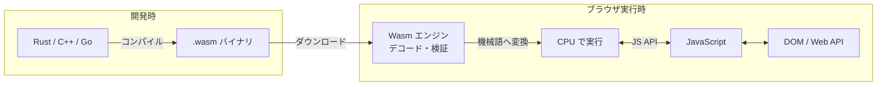

# WebAssembly

ブラウザ上でネイティブに近い速度で動作するバイナリ命令形式です。C・C++・Rust などで書いたコードをコンパイルしてブラウザで実行でき、JavaScript では処理が追いつかない**画像処理・動画エンコード・物理シミュレーション・ゲームエンジン**などに使われます。2019 年に W3C の正式標準になり、すべての主要ブラウザがサポートしています。

---

## はじめて読む人へ

「ブラウザは JavaScript しか動かない」という常識を変えたのが WebAssembly（略称 Wasm）です。Wasm はバイナリ形式のため人間が書くものではなく、別の言語からのコンパイル先として使われます。JavaScript と共存し、重い計算だけを Wasm に委ねるハイブリッドな設計が基本です。

### 読む前に押さえること

- [JavaScript 基礎](JavaScript.md) — Promise・モジュール・ArrayBuffer の概念
- [コンパイラの仕組み](コンパイラの仕組み.md) — コンパイルの基礎（省略可）
- [C 言語入門](C言語入門.md) — Emscripten を使う場合

### 読み終えたら説明できること

- WebAssembly が JavaScript より高速な理由を説明できる
- Rust で Wasm モジュールをビルドし JS から呼び出せる
- 線形メモリモデルと JS との相互運用の仕組みを説明できる

---

## なぜ WebAssembly が必要か

| JavaScript の問題 | WebAssembly の解決 |
|---|---|
| 動的型付け → 実行時に型推論のオーバーヘッド | 静的型付きバイナリ → 型推論不要・ほぼ機械語と同速 |
| JIT コンパイル → 初回実行が遅い・最適化に時間がかかる | AOT コンパイル済み → ブラウザが即デコードして実行 |
| GC がある → 予測不能な停止が起きる | 手動メモリ管理（線形メモリ）→ GC ポーズなし |
| 観点 | JavaScript | WebAssembly |
|------|------------|-------------|
| **実行速度** | JIT 最適化後でネイティブの 50〜80% | ネイティブの 80〜95% |
| **起動速度** | 遅い（パース・JIT） | 速い（バイナリを即デコード）|
| **型安全** | なし（実行時エラー）| あり（静的型・コンパイル時チェック）|
| **メモリ管理** | GC（予測不能な停止）| 線形メモリ（手動管理）|
| **記述言語** | JavaScript / TypeScript | C・C++・Rust・Go・AssemblyScript |

---

## アーキテクチャ



Wasm はスタックベースの仮想マシン（VM）上で動作します。ブラウザ内の Wasm エンジン（V8・SpiderMonkey など）がバイナリを検証・機械語に変換して実行します。

---

## テキスト形式（WAT）

Wasm のバイナリには人間が読める対応テキスト形式（WAT: WebAssembly Text Format）があります。

```wat
;; add.wat（デバッグや学習用）
(module
  (func $add (export "add")
    (param $a i32) (param $b i32)
    (result i32)
    local.get $a
    local.get $b
    i32.add)   ;; スタックに 2 値をプッシュして加算
)
```

実際の開発では WAT は書かず、Rust や C++ からコンパイルして生成します。

---

## Rust + wasm-pack（推奨ツールチェーン）

Rust は Wasm との親和性が高く、GC なし・ゼロコスト抽象化が Wasm の特性に合致します。

```bash
# ツールのインストール
rustup target add wasm32-unknown-unknown
cargo install wasm-pack

# プロジェクト作成
cargo new --lib wasm-image-processor
```

```toml
# Cargo.toml
[lib]
crate-type = ["cdylib"]

[dependencies]
wasm-bindgen = "0.2"
```

```rust
// src/lib.rs
use wasm_bindgen::prelude::*;

// JS から呼び出せる関数
#[wasm_bindgen]
pub fn grayscale(pixels: &[u8]) -> Vec<u8> {
    // RGBA 配列をグレースケールに変換
    pixels
        .chunks(4)
        .flat_map(|chunk| {
            let gray = (chunk[0] as f32 * 0.299
                + chunk[1] as f32 * 0.587
                + chunk[2] as f32 * 0.114) as u8;
            [gray, gray, gray, chunk[3]]
        })
        .collect()
}

#[wasm_bindgen]
pub fn fibonacci(n: u32) -> u64 {
    match n {
        0 => 0,
        1 => 1,
        _ => {
            let (mut a, mut b) = (0u64, 1u64);
            for _ in 2..=n {
                (a, b) = (b, a + b);
            }
            b
        }
    }
}
```

```bash
wasm-pack build --target web
# → pkg/ ディレクトリに .wasm + JS バインディングが生成される
```

---

## JavaScript からの呼び出し

```javascript
// index.js
import init, { grayscale, fibonacci } from './pkg/wasm_image_processor.js'

async function main() {
  await init()  // Wasm モジュールの初期化

  // 数値計算
  console.log(fibonacci(40))  // JS より数十倍高速

  // 画像処理
  const canvas = document.getElementById('canvas')
  const ctx = canvas.getContext('2d')
  const imageData = ctx.getImageData(0, 0, canvas.width, canvas.height)

  const grayPixels = grayscale(imageData.data)
  const newImageData = new ImageData(
    new Uint8ClampedArray(grayPixels),
    canvas.width,
    canvas.height
  )
  ctx.putImageData(newImageData, 0, 0)
}

main()
```

---

## 線形メモリモデル

Wasm は**連続したバイト配列**（線形メモリ）を持ち、JS と Wasm がこのメモリを共有します。

Wasm の線形メモリは `ArrayBuffer` として JavaScript からも参照できる連続したバイト配列です。Wasm が書き込んだ画像データを、JavaScript が `SharedArrayBuffer` 経由で読み出す、といった共有が可能です。ただし、JavaScript のオブジェクトや DOM へ Wasm から直接アクセスすることはできません。`wasm-bindgen` がこのブリッジコードを自動生成します。
大量のデータを JS → Wasm に渡す際は、コピーのオーバーヘッドを避けるために **ポインタ渡し**（メモリ上のアドレスを渡す）を使います。

---

## WASI（WebAssembly System Interface）

Wasm をブラウザ**外**（サーバー・CLI・エッジコンピューティング）で動かすための標準インターフェースです。

従来はコードを OS ごとに別々のバイナリへコンパイルする必要がありました（Windows / Linux / macOS で別々）。WASI では、コードを 1 つの `.wasm` バイナリにコンパイルし、WASI ランタイム（Wasmtime・WasmEdge）が OS 呼び出しをラップして実行します。
```bash
# WASI ランタイムで Wasm を実行（ブラウザなし）
cargo build --target wasm32-wasi
wasmtime target/wasm32-wasi/debug/my_program.wasm
```

Cloudflare Workers・Fastly Compute@Edge などのエッジ環境でも Wasm を利用できます。

---

## 主なユースケース

| 用途 | 具体例 |
|------|--------|
| **画像・動画処理** | Squoosh（画像圧縮）・FFmpeg.wasm |
| **ゲームエンジン** | Unity・Godot の Web エクスポート |
| **科学計算** | NumPy 互換の Pyodide（Python in Browser）|
| **暗号処理** | 高速な暗号・ハッシュ計算 |
| **CAD / 3D** | AutoCAD Web・Three.js のコンピュートシェーダ |
| **プラグイン基盤** | Figma のプラグインサンドボックス |

---

## 数学的背景

### スタックマシンの動作原理

Wasm はレジスタではなく**スタック**ベースの VM です。命令が値をスタックに積んだり取り出したりします。

`add(3, 5)` の実行ステップ（スタックの右が頂上）：

1. `i32.const 3` → スタック: `[3]`
2. `i32.const 5` → スタック: `[3, 5]`
3. `i32.add` → 2 値を取り出して加算し結果を積む → スタック: `[8]`
この設計により、検証（型チェック）がシンプルになります。各命令の実行前後のスタックの型を静的に追跡できるためです。

---

## 確認問題

1. WebAssembly が JavaScript より高速な理由を「型システム」「コンパイル方式」「メモリ管理」の 3 点から説明してください。
2. Wasm の「線形メモリ」とは何ですか？JavaScript との間でデータを共有する仕組みを説明してください。
3. WASI とは何ですか？ブラウザ向けの Wasm と何が違いますか？

---

## 関連ページ

- [JavaScript 基礎](JavaScript.md) — Wasm との相互運用の基礎
- [コンパイラの仕組み](コンパイラの仕組み.md) — コンパイルと中間表現の概念
- [GPU・CUDA入門](GPU-CUDA入門.md) — ブラウザでの GPU 計算（WebGPU との比較）
- [エッジAI・TinyML](エッジAI.md) — WASI を使ったエッジでの Wasm 実行
- [コンテナセキュリティ](コンテナセキュリティ.md) — Wasm のサンドボックスとコンテナの比較

---

[← ホームへ](Home)
