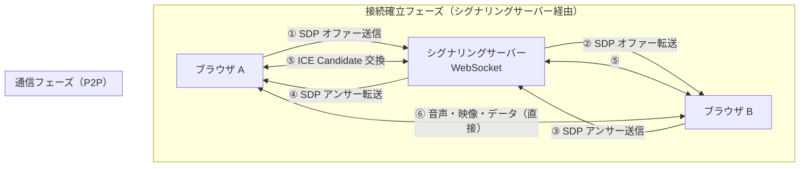

# WebRTC

ブラウザ間でサーバーを介さずに音声・映像・データをリアルタイムに送受信する P2P（Peer-to-Peer）通信の Web 標準です。**ビデオ通話・画面共有・P2P ファイル転送**を追加インストールなしで実現でき、Google Meet・Discord・Zoom Web 版などの基盤技術です。

---

## はじめて読む人へ

WebRTC の難しさは「P2P 接続を確立するまでの手順の複雑さ」にあります。一度接続が確立すれば、その後はサーバーを介さずにブラウザ同士が直接通信します。接続確立の流れ（シグナリング → ICE → 接続）を理解するのが理解の鍵です。

### 読む前に押さえること

- [ネットワーク基礎](ネットワーク基礎.md) — IP アドレス・NAT・UDP の概念
- [WebSocket・リアルタイム通信](WebSocket.md) — WebSocket（シグナリングに使う）
- [JavaScript 基礎](JavaScript.md) — Promise・非同期処理

### 読み終えたら説明できること

- ICE・STUN・TURN の役割を説明できる
- SDP オファー/アンサーモデルの手順を説明できる
- ブラウザでビデオ通話を実装する基本的な流れを説明できる

---

## WebRTC の全体像



シグナリングサーバーは「接続情報の交換」だけを担当し、メディアデータは P2P で流れます。

---

## コア概念

### ICE・STUN・TURN

NAT（ルーターによる IP アドレス変換）により、ブラウザの「本当の IP アドレス」が互いにわかりません。これを解決するのが ICE フレームワークです。

!!! info ""
    **STUN（Session Traversal Utilities for NAT）**

    「自分のパブリック IP アドレスは何？」を教えるサーバー
    → 多くの場合これだけで P2P 接続できる
    → Google の STUN サーバー: stun.l.google.com:19302

    **TURN（Traversal Using Relays around NAT）**

    厳しい NAT（対称型 NAT）では P2P が不可能なため、
    TURN サーバーがデータを中継する（フォールバック）
    → 帯域コストがかかるが、確実に通信できる

    **ICE（Interactive Connectivity Establishment）**

    STUN・TURN・ローカルアドレスをすべて試して
    最適な経路（Candidate）を選ぶフレームワーク
### SDP（Session Description Protocol）

接続の「名刺交換」です。コーデック・解像度・通信経路などの情報を記述します。

!!! info ""
    ```text
    SDP の中身（抜粋）:
      v=0
      o=- 1234567890 2 IN IP4 127.0.0.1
      m=audio 9 UDP/TLS/RTP/SAVPF 111   ← 音声トラック
      a=rtpmap:111 opus/48000/2          ← Opus コーデック
      m=video 9 UDP/TLS/RTP/SAVPF 96    ← 映像トラック
      a=rtpmap:96 VP8/90000             ← VP8 コーデック
    ```
---

## 接続確立の手順

!!! info ""
    ```text
    ブラウザ A（発信側）              ブラウザ B（受信側）
    ─────────────────────────────────────────────────────
    ① createOffer()
       → SDP オファーを生成
    ② setLocalDescription(offer)

    ③ オファーをシグナリングサーバー経由で B に送信
                                    ④ setRemoteDescription(offer)
                                    ⑤ createAnswer()
                                       → SDP アンサーを生成
                                    ⑥ setLocalDescription(answer)
                                    ⑦ アンサーをシグナリングサーバー経由で A に送信
    ⑧ setRemoteDescription(answer)

    ⑨ ICE Candidate を収集して交換（双方向、非同期）

    ⑩ P2P 接続確立 → 音声・映像・データの送受信開始
    ```
---

## 実装例：シンプルなビデオ通話

### シグナリングサーバー（Node.js + WebSocket）

```javascript
// server.js
const { WebSocketServer } = require('ws')
const wss = new WebSocketServer({ port: 8080 })

const clients = new Set()

wss.on('connection', (ws) => {
  clients.add(ws)

  ws.on('message', (msg) => {
    // 受け取ったメッセージを他の全クライアントに転送
    for (const client of clients) {
      if (client !== ws && client.readyState === 1) {
        client.send(msg)
      }
    }
  })

  ws.on('close', () => clients.delete(ws))
})
```

### ブラウザ側（JavaScript）

```javascript
// WebRTC ピア接続の設定
const config = {
  iceServers: [
    { urls: 'stun:stun.l.google.com:19302' },
    // TURN サーバーが必要な場合:
    // { urls: 'turn:your-turn-server.com', username: 'user', credential: 'pass' }
  ],
}

const pc = new RTCPeerConnection(config)
const ws = new WebSocket('ws://localhost:8080')

// ① カメラ・マイクの取得
const localStream = await navigator.mediaDevices.getUserMedia({
  video: true,
  audio: true,
})
document.getElementById('localVideo').srcObject = localStream

// ② ローカルトラックを接続に追加
localStream.getTracks().forEach((track) => pc.addTrack(track, localStream))

// ③ リモートストリームを受信したら表示
pc.ontrack = (event) => {
  document.getElementById('remoteVideo').srcObject = event.streams[0]
}

// ④ ICE Candidate を収集してシグナリングサーバーに送信
pc.onicecandidate = (event) => {
  if (event.candidate) {
    ws.send(JSON.stringify({ type: 'ice', candidate: event.candidate }))
  }
}

// ⑤ シグナリングメッセージの受信と処理
ws.onmessage = async ({ data }) => {
  const msg = JSON.parse(data)

  if (msg.type === 'offer') {
    await pc.setRemoteDescription(msg.sdp)
    const answer = await pc.createAnswer()
    await pc.setLocalDescription(answer)
    ws.send(JSON.stringify({ type: 'answer', sdp: answer }))

  } else if (msg.type === 'answer') {
    await pc.setRemoteDescription(msg.sdp)

  } else if (msg.type === 'ice') {
    await pc.addIceCandidate(msg.candidate)
  }
}

// ⑥ 発信側: オファーを作成して送信
async function call() {
  const offer = await pc.createOffer()
  await pc.setLocalDescription(offer)
  ws.send(JSON.stringify({ type: 'offer', sdp: offer }))
}
```

---

## データチャンネル

音声・映像以外に、任意のバイナリ・テキストデータを P2P で送受信できます。

```javascript
// 発信側: データチャンネルを作成
const dc = pc.createDataChannel('chat', {
  ordered: true,    // 順序保証（TCP ライク）
  // maxRetransmits: 0  // 再送なし（UDP ライク、ゲームなどに使う）
})

dc.onopen = () => {
  dc.send('こんにちは！')
  dc.send(new ArrayBuffer(1024))  // バイナリも送れる
}

dc.onmessage = (event) => {
  console.log('受信:', event.data)
}

// 受信側: データチャンネルを受け取る
pc.ondatachannel = (event) => {
  const dc = event.channel
  dc.onmessage = (e) => console.log('受信:', e.data)
}
```

---

## 画面共有

```javascript
// カメラの代わりに画面をキャプチャ
const screenStream = await navigator.mediaDevices.getDisplayMedia({
  video: { cursor: 'always' },
  audio: false,
})

// 既存の接続のビデオトラックを置き換え
const videoSender = pc.getSenders().find((s) => s.track?.kind === 'video')
await videoSender.replaceTrack(screenStream.getVideoTracks()[0])

// 共有終了の検知
screenStream.getVideoTracks()[0].onended = () => {
  // カメラに戻す処理
}
```

---

## 接続状態の監視

```javascript
pc.onconnectionstatechange = () => {
  console.log('接続状態:', pc.connectionState)
  // 'new' | 'connecting' | 'connected' | 'disconnected' | 'failed' | 'closed'
}

pc.oniceconnectionstatechange = () => {
  console.log('ICE 状態:', pc.iceConnectionState)
  // 'checking' | 'connected' | 'completed' | 'failed' | 'disconnected'

  if (pc.iceConnectionState === 'failed') {
    pc.restartIce()  // ICE の再試行
  }
}
```

---

## 主なユースケースと設計パターン

| ユースケース | 構成 | 備考 |
|------------|------|------|
| **1対1 ビデオ通話** | P2P のみ | 最もシンプル |
| **グループ通話** | SFU（Selective Forwarding Unit）| mediasoup・LiveKit |
| **大規模配信** | MCU（Multipoint Control Unit）| サーバー側でミキシング |
| **P2P ファイル転送** | DataChannel | ブラウザ間直接転送 |
| **画面共有** | getDisplayMedia + replaceTrack | |

!!! info ""
    ```text
    P2P（1対1）:     A ←→ B
    SFU（グループ）: A → [SFU] ← B ← [SFU] → C
                     C → [SFU]
    ```
SFU は各参加者のストリームをそのまま転送（N 人なら N-1 本の接続）。MCU は全ストリームを合成して 1 本にする（サーバー負荷大・品質劣化あり）。

---

## 確認問題

1. STUN と TURN の役割の違いを説明し、なぜ TURN が必要な場合があるのかを述べてください。
2. SDP オファー/アンサーモデルの手順を順を追って説明してください。
3. データチャンネルの `ordered: true` と `maxRetransmits: 0` の違いを、ユースケースとともに説明してください。

---

## 関連ページ

- [WebSocket・リアルタイム通信](WebSocket.md) — シグナリングに使う WebSocket
- [ネットワーク基礎](ネットワーク基礎.md) — NAT・UDP・TCP の概念
- [ネットワーク詳解](ネットワーク詳解.md) — TLS・DTLS・SRTP（WebRTC の暗号化）
- [セキュリティ基礎](セキュリティ.md) — WebRTC は DTLS/SRTP で暗号化されている
- [Cloudflare](Cloudflare.md) — Cloudflare Calls（SFU サービス）

---

[← ホームへ](Home)
