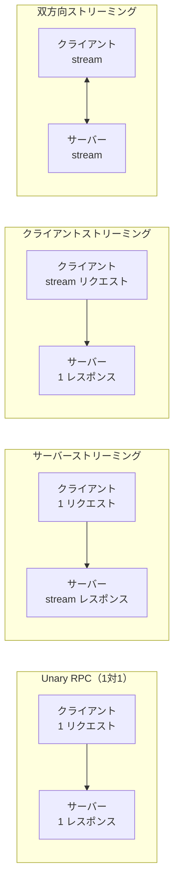
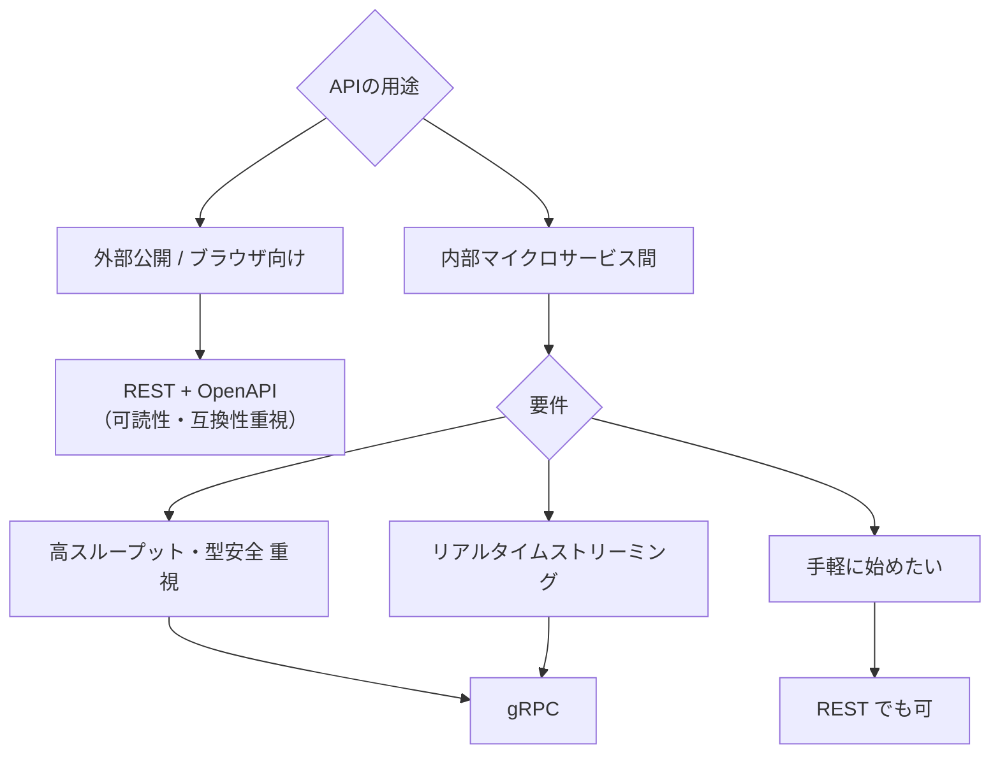

# gRPC

Protocol Buffers（protobuf）を使ったバイナリ通信プロトコルです。HTTP/2 上で動作し、REST/JSON に比べて**高速・型安全・ストリーミング対応**という特徴を持ちます。マイクロサービス間通信の事実上の標準であり、Google・Netflix・Uber などの大規模システムで採用されています。

---

## はじめて読む人へ

REST API は「テキスト（JSON）を HTTP/1.1 で送受信する」のに対し、gRPC は「バイナリ（protobuf）を HTTP/2 で送受信する」プロトコルです。まず `.proto` ファイルでインターフェースを定義し、コードを自動生成してサービスを実装します。

### 読む前に押さえること

- [Web / API設計](WebAPI設計) — REST の基本・HTTP メソッド
- [マイクロサービス](マイクロサービス) — サービス間通信の概念
- [ネットワーク詳解](ネットワーク詳解) — HTTP/2 の多重化

### 読み終えたら説明できること

- Protocol Buffers がなぜ JSON より高速かを説明できる
- gRPC の 4 種類の通信パターンを説明できる
- REST と gRPC の使い分け基準を説明できる

---

## Protocol Buffers（protobuf）

### なぜバイナリか

| 形式 | 例 | サイズ | 特徴 |
|------|----|----|------|
| JSON テキスト | `{"user_id": 123, "name": "Alice", "age": 30}` | 44 バイト | パースに CPU が必要 |
| protobuf バイナリ | `0x08 0x7B 0x12 0x05 "Alice" 0x18 0x1E` | 約 10〜15 バイト | スキーマ既知なので高速デシリアライズ |
- **サイズ：** JSON の 3〜10 倍小さい
- **速度：** JSON より 5〜100 倍高速なシリアライズ/デシリアライズ
- **型安全：** スキーマが `.proto` ファイルで定義され、コンパイル時に型チェック

### .proto ファイルの定義

```protobuf
// user.proto
syntax = "proto3";

package user;
option go_package = "./pb";

// メッセージ（データ構造）の定義
message User {
  int32  user_id = 1;   // フィールド番号（バイナリエンコードのキー）
  string name    = 2;
  int32  age     = 3;
  repeated string tags = 4;  // 繰り返しフィールド（配列）
}

message GetUserRequest {
  int32 user_id = 1;
}

message ListUsersResponse {
  repeated User users = 1;
  int32 total = 2;
}

// サービス（RPC メソッド）の定義
service UserService {
  rpc GetUser(GetUserRequest) returns (User);
  rpc ListUsers(google.protobuf.Empty) returns (ListUsersResponse);
  rpc WatchUser(GetUserRequest) returns (stream User);       // サーバーストリーミング
  rpc UploadUsers(stream User) returns (ListUsersResponse);  // クライアントストリーミング
  rpc SyncUsers(stream User) returns (stream User);          // 双方向ストリーミング
}
```

`protoc` コンパイラで各言語のコード（Go・Python・Java・TypeScript など）を自動生成します。

---

## HTTP/2 の恩恵

gRPC は HTTP/2 上で動作します。

| 機能 | HTTP/1.1 | HTTP/2 |
|------|----------|--------|
| **多重化** | 1 接続 1 リクエスト | 1 接続で複数リクエストを並列 |
| **ヘッダー圧縮** | テキスト（重い）| HPACK で圧縮 |
| **サーバープッシュ** | なし | サーバーから能動的に送信 |
| **ストリーミング** | 困難 | 双方向ストリーミングをネイティブサポート |

gRPC の特定の利点はこの HTTP/2 の多重化にあります。多数のマイクロサービスが高頻度で通信する場合、REST（HTTP/1.1）では接続数が増えますが、gRPC は同一接続を再利用して効率的に通信できます。

---

## 4 種類の通信パターン



| パターン | 用途 |
|---------|------|
| **Unary** | 通常の API 呼び出し（ユーザー取得・更新）|
| **サーバーストリーミング** | 大規模データの配信・ライブフィード（株価・センサーデータ）|
| **クライアントストリーミング** | ファイルアップロード・バッチデータ送信 |
| **双方向ストリーミング** | チャット・リアルタイム協調編集・ゲーム |

---

## Python での実装

```python
# サーバー側（server.py）
import grpc
from concurrent import futures
import user_pb2
import user_pb2_grpc

class UserServicer(user_pb2_grpc.UserServiceServicer):
    def GetUser(self, request, context):
        # request.user_id でリクエストを受け取る
        return user_pb2.User(
            user_id=request.user_id,
            name="Alice",
            age=30
        )

    def WatchUser(self, request, context):
        # ストリーミング：yield でデータを順次送信
        for update in get_user_updates(request.user_id):
            yield user_pb2.User(**update)

server = grpc.server(futures.ThreadPoolExecutor(max_workers=10))
user_pb2_grpc.add_UserServiceServicer_to_server(UserServicer(), server)
server.add_insecure_port('[::]:50051')
server.start()

# クライアント側（client.py）
with grpc.insecure_channel('localhost:50051') as channel:
    stub = user_pb2_grpc.UserServiceStub(channel)
    user = stub.GetUser(user_pb2.GetUserRequest(user_id=1))
    print(f"取得: {user.name}")

    # ストリーミング受信
    for update in stub.WatchUser(user_pb2.GetUserRequest(user_id=1)):
        print(f"更新: {update}")
```

---

## REST vs gRPC の比較

| 観点 | REST + JSON | gRPC + protobuf |
|------|------------|-----------------|
| **通信速度** | 普通 | **高速（バイナリ）** |
| **型安全性** | なし（JSON は弱型）| **あり（protobuf スキーマ）** |
| **ストリーミング** | 困難 | **ネイティブサポート** |
| **ブラウザ対応** | ✅ ネイティブ | ❌ grpc-web が必要 |
| **デバッグ** | curl・Postman で簡単 | バイナリのため難しい（grpcurl）|
| **エコシステム** | 広大 | 充実しているが REST より小さい |
| **使い場面** | 外部公開 API・ブラウザ向け | **マイクロサービス間・内部 API** |

### 使い分けの指針



---

## サービスメッシュとの統合

Kubernetes 環境では、gRPC は Istio・Envoy などのサービスメッシュと組み合わせて使われます。

- **mTLS による暗号化・認証** をサービスメッシュが自動処理
- **負荷分散** を HTTP/2 レベルで行う（接続ごとではなくリクエストごと）
- **サーキットブレーカー・リトライ** をサイドカープロキシが担当

---

## 数学的導出

### protobuf の Varint エンコーディング

整数値はバイナリで可変長エンコードされます。小さい値（よく使う）ほど少ないバイト数で表現できます。

Varint では各バイトの最上位ビット（MSB）を「続きのバイトがあるか」に使います：

値 `300`（`= 0b100101100`）のエンコード手順：

1. 下位 7 ビットを取り出す：`0101100 = 0x2C`。続きのバイトがあるため MSB=1 → `0xAC`
2. 残りのビットを取り出す：`0000010 = 0x02`。最後のバイトなので MSB=0 → `0x02`
3. 結果：`[0xAC, 0x02]` = **2 バイト**（JSON で `"300"` と書くと 3 バイト、かつ文字列として扱われる）
フィールド番号（`.proto` の `= 1` など）もこの方式でエンコードされ、フィールド名を送信しないことがデータサイズ削減の核心です。

---

## 確認問題

1. gRPC が REST より高速な理由を「シリアライゼーション形式」と「HTTP バージョン」の 2 点から説明してください。
2. サーバーストリーミング RPC が「株価のリアルタイム配信」に適している理由を説明してください。
3. gRPC がブラウザから直接呼び出せない理由と、一般的な回避策を説明してください。

---

## 関連ページ

- [マイクロサービス](マイクロサービス) — サービス間通信の設計パターン
- [Web / API設計](WebAPI設計) — REST との使い分け
- [OpenAPI / Swagger](OpenAPI-Swagger) — REST API の仕様定義
- [ネットワーク詳解](ネットワーク詳解) — HTTP/2 の多重化・TLS
- [リバースプロキシ](リバースプロキシ) — Nginx / Envoy での gRPC プロキシ

---

[← ホームへ](Home)
