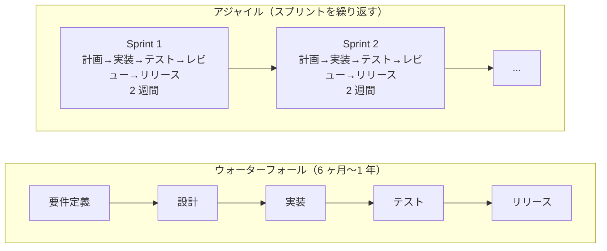
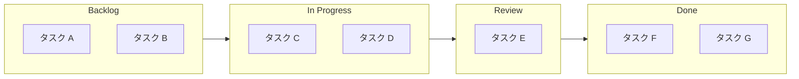
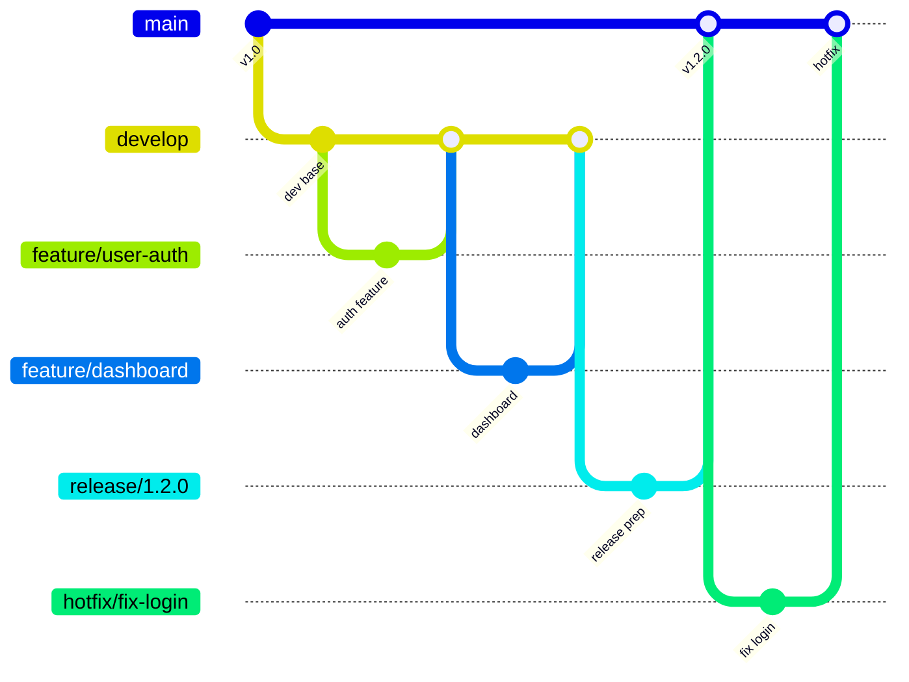
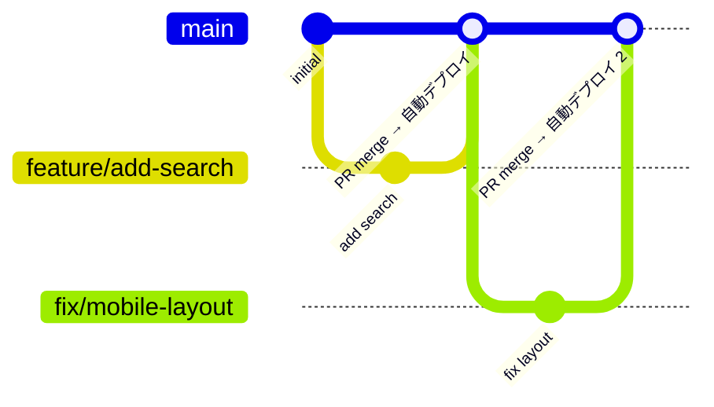

# アジャイル開発・チーム開発

ソフトウェアを「完成してから渡す」のではなく、「動くものを早く・小さく・繰り返しリリースする」開発スタイルです。現代のソフトウェアチームの多くがアジャイルを採用しており、チームに入ったときに戸惑わないための基礎知識をまとめます。

---

## はじめて読む人へ

アジャイル開発は、変化に強い開発プロセスです。計画を完璧に作るより、動くものを見せてフィードバックをもらい、方向を修正することを優先します。

### 読む前に押さえること

- ウォーターフォールは「設計 → 開発 → テスト → リリース」を一方向に進む。アジャイルはこれを小さく何度も繰り返します。
- スクラムは最も普及したアジャイルのフレームワークで、2 週間程度の「スプリント」を単位として動きます。
- コードレビューと PR（Pull Request）文化は、チームの品質を保つ基本的な仕組みです。

### 読み終えたら説明できること

- スプリント、バックログ、ベロシティなどのスクラム用語を説明できる。
- 良い PR とレビューコメントの書き方を理解できる。
- 技術的負債とは何か、どう付き合うか説明できる。

---

## ウォーターフォール vs アジャイル



---

## スクラム（Scrum）

スクラムは最も普及したアジャイルフレームワークです。役割・イベント・成果物の 3 つで構成されます。

### 役割

| 役割 | 責任 |
|------|------|
| プロダクトオーナー（PO） | 何を作るか決める。プロダクトバックログの優先順位を管理 |
| スクラムマスター | スクラムの進行を支援。障害を取り除く |
| 開発チーム | 実際に実装・テスト・デプロイを行う |

### スプリント（Sprint）

スプリントは **1〜4 週間（多くは 2 週間）の固定した開発サイクル** です。スプリント中に計画・実装・テスト・レビューをすべて行います。

スプリントの流れ

Day 1：スプリント計画
- バックログからタスクを選ぶ
- チームのキャパシティを見積もる（ポイント制が多い）

Day 2〜9：実装
- デイリースクラム（15 分の朝会）
・昨日やったこと
・今日やること
・ブロッカー（詰まっていること）

Day 10：スプリントレビュー + ふりかえり
- ステークホルダーにデモ
- KPT でふりかえり（Keep / Problem / Try）
### バックログとストーリーポイント

プロダクトバックログは優先度順のタスクリストです。

| 優先度 | タスク | ポイント |
|---|---|---|
| P1 | ユーザーログイン機能 | 5 pt |
| P2 | パスワードリセットメール送信 | 3 pt |
| P3 | ダッシュボードの棒グラフ実装 | 8 pt |
| P4 | CSVエクスポート | 2 pt |

**ストーリーポイント**はタスクの複雑さ・不確実性を相対評価する単位（時間ではない）です。**ベロシティ**は 1 スプリントで完了できるポイントの平均で、将来の計画に使います。
### カンバン（Kanban）

スプリント区切りを設けず、タスクを視覚的に管理する方式です。運用・サポートチームや研究開発に向きます。



WIP（Work In Progress）制限を設けることで、同時に取り組むタスク数を絞り、完了速度を上げます。

---

## コードレビューと PR 文化

### Pull Request の書き方

良い PR は「レビュアーの時間を尊重する」ことが基本です。

```markdown
## 概要
ユーザー一覧ページの絞り込み機能を追加

## 変更内容
- `UserList` コンポーネントに検索フォームを追加
- `/api/users?query=` のクエリパラメータに対応
- 検索結果 0 件のときの空状態 UI を実装

## テスト方法
1. `/users` ページを開く
2. 検索ボックスに「田中」と入力する
3. 「田中」を含む名前のみ表示されることを確認

## 関連 Issue
Closes #42
```

### レビューコメントのトーン

| NG 例 | OK 例 |
|--------|--------|
| 「なんでこう書いたの？」 | 「この書き方だと〇〇の問題が起きる可能性があります。△△はいかがでしょうか？」 |
| 「これは間違い」 | 「意図を教えてください。〇〇だとすれば、△△の方が安全かもしれません」 |
| 「直して」 | 「[提案] 〇〇に変えると可読性が上がりそうです。どう思いますか？」 |

コメントの先頭に `[必須]` / `[提案]` / `[質問]` をつけると、修正が必要かどうかが明確になります。

### レビューの観点

優先度 高
1. 正しく動くか（バグ・エッジケース）
2. セキュリティ（入力検証・認証・秘密情報の扱い）
3. パフォーマンス（N+1 クエリ・不要なループ）

優先度 中
4. 可読性（命名・関数の長さ・コメント）
5. テストが書かれているか

優先度 低
6. スタイル（Linter / Formatter に任せる）
---

## ブランチ戦略

### Git Flow

大規模・リリース管理が複雑なプロジェクト向けです。



### GitHub Flow

シンプルで小規模チームや継続的デプロイに向きます。



---

## 技術的負債（Technical Debt）

「今は動くが後で問題になるコード」のことです。急いで実装したコード、テストのない機能、古いライブラリがこれにあたります。

技術的負債の分類：

意図的・意識的な負債
- 「今はこの実装で動かす。後でリファクタリングする」と判断した場合
- 許容できる。ただし TODO コメントを残し、追跡する

意図せず積まれた負債
- 知識不足・時間不足で生まれる
- レビューで発見・指摘することで予防できる
### 負債との付き合い方

- スプリントに「技術的負債の返済」タスクを定期的に入れる。
- 機能追加と同じバックログで管理し、優先度をつける。
- 手を入れるたびに、そのファイル・関数を少しきれいにする（ボーイスカウト則）。

---

## ドキュメントと意思決定の記録

### ADR（Architecture Decision Record）

「なぜこの設計にしたのか」を残す軽量なドキュメントです。

```markdown
# ADR-005: データベースに PostgreSQL を採用する

## 状況
ユーザーデータと注文データを永続化する DB を選定する必要がある。

## 決定
PostgreSQL を採用する。

## 理由
- JSON 型のサポートが強力で、半構造化データを扱いやすい
- 本番環境で実績があり、チームに経験者がいる
- Cloud SQL（GCP）でマネージド運用できる

## 検討した代替案
- MySQL：JSON サポートが PostgreSQL より弱い
- MongoDB：スキーマレスは柔軟だが、トランザクション管理が複雑になる

## 結果
2024-03-01 に採用。問題なく動作中。
```

---

## 確認問題

1. スプリントとは何か、長さと含まれるイベントを説明してください。
2. ストーリーポイントが「時間ではなく複雑さの相対評価」である理由を説明してください。
3. コードレビューで「必須」と「提案」を区別する意義を説明してください。
4. 技術的負債を意図的に作ることが許容されるのはどんな場合か、例を挙げて説明してください。

---

## 関連ページ

- [Git](Git) — ブランチ戦略・コミット管理
- [GitHub](GitHub) — Pull Request・コードレビューの実践
- [CI/CD](CI-CD) — 自動テスト・自動デプロイのパイプライン
- [テスト方法論](テスト方法論) — ユニットテスト・TDD の実践
- [ソフトウェア設計](ソフトウェア設計) — 設計の品質を保つための原則

---

[← ホームへ](Home)
