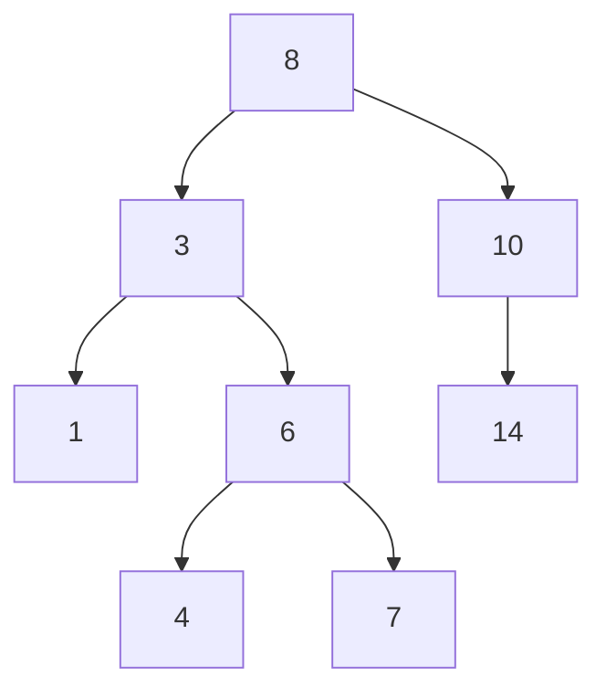
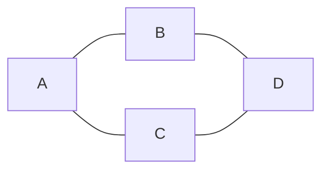

# アルゴリズム・データ構造

> 「なぜこのコードは遅いのか」「どのデータ構造を選ぶべきか」を論理的に判断するための基礎を学びます。

---

## はじめて読む人へ

アルゴリズムは問題を解く手順、データ構造はデータの持ち方です。同じ問題でも、データの持ち方と手順を変えるだけで、処理速度が大きく変わります。


### 読む前に押さえること

- 計算量は、データが増えたときに処理時間がどう増えるかを表します。
- 配列、ハッシュ、木は、それぞれ得意な操作が違います。
- 探索やソートは、多くのプログラムの基本部品です。

### 読み終えたら説明できること

- O記法で処理の増え方を説明できる。
- リスト、辞書、セットの使い分けを理解できる。
- 基本的な探索・ソートの考え方を説明できる。

---

## 計算量（Big O 記法）

### なぜ計算量を知る必要があるか

「このコードはデータ 100 件では一瞬だが、100 万件になったら何時間かかるか？」を見積もる道具が **計算量** です。実際の秒数ではなく、**「データが増えると処理量がどう変わるか」という傾向** を表します。

なぜ「実際の秒数」ではなく「傾向」を使うのでしょうか。秒数はコンピュータの性能に依存するため、別のマシンで測ると別の値が出てしまいます。しかし「データが倍になったとき処理量も倍になる（線形）か、4 倍になる（二乗）か」という傾向はどのマシンでも変わりません。この傾向を一言で表す記法が **Big O 記法** で、$O(n)$ のように書きます（n はデータ数）。

---

### STEP 1：図書館で本を探す例で理解する

```
問題：「田中さんが書いた本を探したい」

【方法 1：端から全部調べる → O(n)】
  棚の左端から 1 冊ずつ全部確認する
  本が 100 冊 → 最大 100 回確認
  本が 1,000 冊 → 最大 1,000 回確認
  データ数に比例して増える = O(n)

【方法 2：50 音順に並んでいれば半分ずつ絞る → O(log n)】
  「田中」なら「た行」あたりを先に確認
  → 前半か後半か → さらに半分 → さらに半分...
  本が 1,000 冊でも 10 回程度の確認で見つかる
  本が 100 万冊でも 20 回程度で見つかる = O(log n)

【方法 3：索引カードで番号が分かっている → O(1)】
  「田中さんの本は B-42 番」とわかっていれば即取れる
  本が何冊でも 1 回で見つかる = O(1)
```

---

### STEP 2：計算量の早見表

| 記法 | 名前 | n=100 のとき | n=10,000 のとき | n=1,000,000 のとき |
|------|------|------------|--------------|-----------------|
| $O(1)$ | 定数時間 | 1 | 1 | 1 |
| $O(\log n)$ | 対数時間 | 7 | 14 | 20 |
| $O(n)$ | 線形時間 | 100 | 10,000 | 1,000,000 |
| $O(n \log n)$ | 準線形 | 700 | 140,000 | 20,000,000 |
| $O(n^2)$ | 二乗時間 | 10,000 | 100,000,000 | $10^{12}$ **（実用不可）** |

```
O(1) は 10 倍の奇跡
O(log n) は 100 万件でも 20 回
O(n) は倍になると倍かかる
O(n²) は 10 倍になると 100 倍かかる → 要注意！
```

---

### STEP 3：コードで確認する

```python
import time
import numpy as np

def o1_access(arr, i):
    return arr[i]            # 配列の i 番目：位置が分かれば即取れる

def on_search(arr, target):  # リスト全体を順番に調べる
    for x in arr:
        if x == target:
            return True
    return False

def on2_find_pair(arr):      # 全組み合わせを調べる
    count = 0
    for i in arr:
        for j in arr:        # 2 重ループ
            count += 1
    return count

# 処理時間の比較
sizes = [100, 1_000, 10_000]
for n in sizes:
    arr = list(range(n))
    target = n - 1  # 最悪ケース（最後の要素）

    t0 = time.perf_counter()
    o1_access(arr, 0)
    t_o1 = time.perf_counter() - t0

    t0 = time.perf_counter()
    on_search(arr, target)
    t_on = time.perf_counter() - t0

    print(f"n={n:6d}:  O(1)={t_o1*1e6:.1f}μs  O(n)={t_on*1e6:.0f}μs")

# n を 10 倍にするたびに：
# O(1) → ほぼ変化なし
# O(n) → 約 10 倍かかる
```

---

### STEP 4：なぜ O(n²) を避けるべきか

```python
# O(n²) の危険性をシミュレーション
def count_o_n_squared(n):
    total = 0
    for i in range(n):
        for j in range(n):   # 2 重ループ
            total += 1
    return total

# n を 10 倍にすると何倍になるか
for n in [10, 100, 1_000, 10_000]:
    print(f"n={n:5d}: 処理回数 = {count_o_n_squared(n):15,}")

# n=    10: 処理回数 =             100
# n=   100: 処理回数 =          10,000   ← 10 倍で 100 倍
# n= 1,000: 処理回数 =       1,000,000   ← また 10 倍で 100 倍
# n=10,000: 処理回数 =     100,000,000   ← 1 億回 → 実際には数秒〜数十秒かかる
```

**実践的な目安：**
```
Web API の 1 リクエスト中で O(n²) のループ → ユーザーが増えると急激に遅くなる
DB の 100 万件データに O(n) の全スキャン → インデックスなしでは非実用的
適切なデータ構造（ハッシュ・ソート済み配列）で O(log n) に落とすことを常に意識する
```

Big O 記法は、入力サイズが大きくなったときに、処理時間やメモリ使用量がどのように増えるかを表します。実際の秒数ではなく、増え方の傾向を見るための道具です。

```python
# O(1)：インデックスで直接アクセス
value = array[5]

# O(n)：先頭から順番に探す
def find(array, target):
    for item in array:
        if item == target:
            return item

# O(n²)：2 重ループ（データが増えると急激に遅くなる）
def find_pairs(array):
    for i in array:
        for j in array:
            print(i, j)
```

**実践的な意味：** 100 万行のテーブルを $O(n)$ で検索すると 100 万回の比較が必要です。$O(\log n)$ のインデックス検索なら約 20 回で済みます。

---

## 配列（Array / List）

同じ型の要素を連続したメモリに並べたデータ構造です。

| 操作 | 計算量 | 理由 |
|------|--------|------|
| インデックスアクセス | $O(1)$ | 先頭アドレス + オフセットで直接計算できます |
| 末尾への追加 | $O(1)$ 平均 | 空きがあれば即追加できます |
| 先頭への挿入・削除 | $O(n)$ | 全要素をシフトする必要があります |
| 探索（未ソート） | $O(n)$ | 先頭から順に調べます |
| 探索（ソート済み） | $O(\log n)$ | 二分探索が使えます |

```python
# Python のリスト（内部は動的配列）
arr = [1, 2, 3]
arr.append(4)       # O(1)
arr.insert(0, 0)    # O(n) ← 先頭挿入は遅い
```

`append` は末尾に追加するだけなので高速です。一方、先頭に挿入すると、既存の要素を1つずつ右へずらす必要があります。Pythonで先頭への追加や削除を何度も行うなら、リストより `deque` を検討します。

---

## 連結リスト（Linked List）

各要素が「データ」と「次の要素へのポインタ」を持つデータ構造です。

```
[1|→] → [2|→] → [3|→] → None
```

連結リストは、要素同士がポインタでつながっています。途中に要素を挿入するときは、前後のポインタを付け替えればよいので、場所が分かっていれば高速です。ただし、`i` 番目へ直接飛べないため、先頭から順にたどる必要があります。

| 操作 | 計算量 | 配列との比較 |
|------|--------|------------|
| 先頭への挿入・削除 | $O(1)$ | 配列より速い |
| インデックスアクセス | $O(n)$ | 配列より遅い（先頭から辿ります） |

Python の `collections.deque` は両端キューとして連結リストを使い、両端への追加・削除を O(1) で行います。

---

## ハッシュテーブル（辞書・マップ）

キーをハッシュ関数で計算し、そのインデックスに値を保存するデータ構造です。

| 操作 | 計算量（平均） |
|------|-------------|
| 挿入 | $O(1)$ |
| 検索 | $O(1)$ |
| 削除 | $O(1)$ |

```python
# Python の dict はハッシュテーブル
d = {"apple": 100, "banana": 80}
d["apple"]     # O(1)
"apple" in d   # O(1)
```

辞書は、キーからハッシュ値を計算し、その値を使って保存場所を探します。キーを知っているときに値をすばやく取り出せるため、ユーザーIDからユーザー情報を引く、単語から出現回数を引く、といった用途に向いています。

**「リストの中に含まれているか」の検索：**

```python
# O(n)：リストは先頭から探します
if item in my_list: ...

# O(1)：セット（ハッシュテーブル）は即座に判定します
my_set = set(my_list)
if item in my_set: ...
```

大量データを繰り返し検索する場合、リストをセット・辞書に変換すると劇的に速くなります。

ただし、セットや辞書は順序や重複の扱いがリストと異なります。重複を残したい、元の順番が重要、という場合は、単純に置き換えられないことがあります。データ構造は速さだけでなく、表したい性質に合わせて選びます。

---

## 木（Tree）

親子関係を持つ階層構造のデータ構造です。

### 二分探索木（BST）

左の子 < 親 < 右の子 という順序を保つ木です。



- 挿入・探索・削除：$O(\log n)$（木がバランスしている場合）
- DB のインデックスは B-tree（Balanced Tree）を使い、常にバランスを保ちます

### トライ木（Trie）

文字列の前方一致検索に特化した木です。検索エンジンのオートコンプリートに使われます。

---

## グラフ（Graph）

ノードとエッジで構成されるデータ構造です。SNS の友人関係・路線図・依存関係などを表現します。



**有向グラフ vs 無向グラフ：**
- 無向：友人関係（A-B なら B-A も成立します）
- 有向：フォロー関係（A→B でも B→A とは限りません）

---

## 探索アルゴリズム

### 二分探索

ソート済み配列から $O(\log n)$ で値を探します。

```python
def binary_search(arr, target):
    left, right = 0, len(arr) - 1
    while left <= right:
        mid = (left + right) // 2
        if arr[mid] == target:
            return mid
        elif arr[mid] < target:
            left = mid + 1
        else:
            right = mid - 1
    return -1
```

二分探索は、中央の値を見て「左半分にあるか、右半分にあるか」を判断し、探索範囲を半分ずつ狭めます。成立条件は、配列がソート済みであることです。未ソートの配列に使うと、左右のどちらへ進むべきか判断できません。

### BFS（幅優先探索）

グラフを「近いノードから」探索します。最短経路の発見に使います。

BFS はキューを使い、スタート地点から距離1、距離2、距離3の順に探索します。辺の重みがすべて同じグラフでは、最初にゴールへ到達したときの距離が最短距離になります。

### DFS（深さ優先探索）

グラフを「深い方向に」探索します。全探索・迷路解き・依存関係の解析に使います。

DFS はスタックまたは再帰を使い、行けるところまで深く進んでから戻ります。すべての組み合わせを列挙する問題や、つながっている領域をまとめて調べる問題でよく使われます。

---

## ソートアルゴリズム

| アルゴリズム | 平均計算量 | 特徴 |
|------------|----------|------|
| バブルソート | $O(n^2)$ | シンプルですが遅い。学習用 |
| マージソート | $O(n \log n)$ | 安定・分割統治 |
| クイックソート | $O(n \log n)$ 平均 | 実用的・インプレース |
| ヒープソート | $O(n \log n)$ | 最悪ケースも $O(n \log n)$ |

**Python の `sorted()` や `.sort()` は Timsort（マージソート＋挿入ソートの組み合わせ）を使い、$O(n \log n)$ を保証します。** 自前でソートを実装する必要はほぼありません。

---

## まとめ：データ構造の選び方

| やりたいこと | 使うデータ構造 |
|------------|--------------|
| 順番に処理・インデックスアクセス | リスト（配列） |
| 両端への高速な追加・削除 | deque（両端キュー） |
| キーで高速に値を取得 | 辞書（ハッシュテーブル） |
| 含まれているか高速に判定 | セット（ハッシュテーブル） |
| 優先度付きのキュー | heapq（ヒープ） |
| 階層構造 | 木 |
| 関係・ネットワーク | グラフ |

---


## 確認問題

1. アルゴリズム・データ構造 は、何の問題を解決するための考え方・道具ですか。
2. このページで出てきた重要語を 3 つ選び、それぞれ 1 文で説明してください。
3. コード例やコマンド例がある場合、入力・処理・出力を分けて説明してください。
4. このページの内容が、前後の STEP や自分の作りたいものにどうつながるか説明してください。

---

## 関連ページ

- [離散数学](離散数学) — 計算量・グラフ理論の数学的背景
- [C 言語入門](C言語入門) — ポインタを使ったデータ構造の実装
- [コーディングテスト対策](コーディングテスト対策) — 二分探索・BFS/DFS・DP の応用
- [Python 基礎](Python) — Python でのアルゴリズム実装

---

[← ホームへ](Home)
