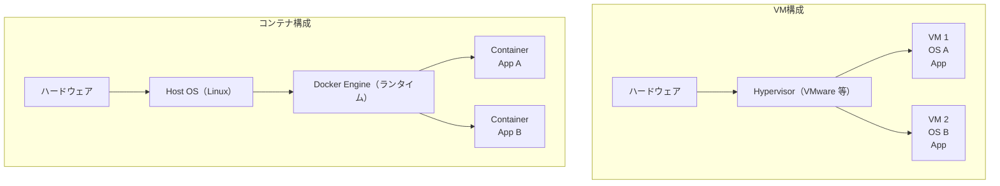
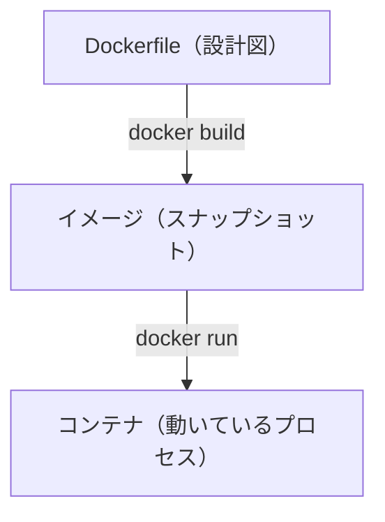
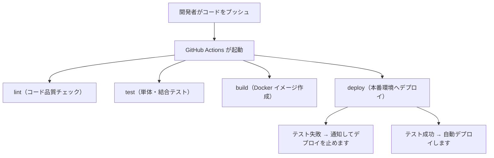

# クラウド・インフラ

> Linux・Docker・コンテナ・VM・CI/CD・監視の全体像を俯瞰します。各トピックの詳細は専用ページを参照してください。

---

## はじめて読む人へ

クラウド・インフラは、アプリを動かすためのサーバー、ネットワーク、コンテナ、監視などの土台です。手元のPCではなく、インターネット上の環境で安定して動かすことを考えます。

コードやコマンドが出てきたら、最初から全部を覚えようとしなくて大丈夫です。まずは「何を入力し、何が処理され、何が出力されるのか」を文章で説明できるように読むと、手を動かす前の理解が安定します。

### 読む前に押さえること

- VM は仮想的なサーバー、コンテナはアプリ単位の実行環境です。
- Kubernetes は、多数のコンテナを管理するための仕組みです。
- 監視は、障害を早く見つけるために必要です。

### 読み終えたら説明できること

- VM、コンテナ、Kubernetes の違いを説明できる。
- CI/CD とインフラ運用の関係を理解できる。
- 監視やIaCがなぜ必要か説明できる。

---

## Linux 基礎の再確認

Linux はサーバーの世界で圧倒的なシェアを持つ OS です。クラウドの仮想マシン・Docker コンテナはほぼすべて Linux で動きます。

**よく使うコマンドの役割：**

```bash
ps aux              # 動いているプロセスの一覧を表示します
top / htop          # CPU・メモリのリアルタイムを確認します
df -h               # ディスク使用量を確認します
free -h             # メモリ使用量を確認します
netstat -tlnp       # 開いているポートを確認します
lsof -i :8000       # ポート 8000 を使っているプロセスを特定します
journalctl -u nginx # systemd サービスのログを確認します
```

これらのコマンドは、サーバーで障害が起きたときの観察道具です。CPUが高いのか、メモリが足りないのか、ディスクが埋まっているのか、ポートがすでに使われているのか、サービスログにエラーが出ているのかを順番に確認できます。

詳細は [Linux 基礎](Linux基礎) を参照してください。

---

## VM（仮想マシン）とコンテナの違い

VM は、仮想的なサーバーを丸ごと作る技術です。OS も含めて分離されるため独立性が高い一方、起動やリソース消費は重くなりがちです。

コンテナは、ホストOSの上でアプリの実行環境を分離する技術です。VM より軽量で、アプリ単位で環境をそろえやすいため、Webアプリの開発やデプロイでよく使われます。

| 比較 | VM | コンテナ |
|------|-----|---------|
| 仮想化の対象 | OS ごと | プロセスの隔離のみ |
| 起動時間 | 分単位 | 秒以内 |
| サイズ | GB 単位 | MB 単位 |
| 独立性 | 強い（OS が別） | やや弱い（カーネルを共有） |
| 用途 | 異なる OS が必要な場合 | アプリのデプロイ・スケール |

**ハイパーバイザー（Hypervisor）：** ハードウェアの上で動き、複数の仮想マシンを管理するソフトウェアです。各 VM に CPU・メモリ・ストレージを分割して割り当てます。VMware・KVM・Hyper-V などが代表例です。



図の違いは、隔離の単位です。VMはゲストOSごと分けるため重いですが、OSの違いまで含めて独立できます。コンテナは同じホストOSのカーネルを共有し、アプリのプロセスやファイルシステムを分離します。そのため軽く、同じイメージを何個も起動してスケールしやすくなります。

---

## Docker の役割

Docker は「アプリとその動作環境をパッケージ化する」ツールです。



**主なメリット：**
- 「自分の PC では動く」問題を解決します（環境差異をなくします）
- 本番環境と開発環境を揃えられます
- スケールアウトが容易です（同じイメージをコピーして起動します）

詳細は [Docker](Docker) を参照してください。

Dockerfileは「このアプリを動かす環境をどう作るか」を書いた設計図です。`docker build` でイメージを作り、`docker run` でコンテナとして起動します。イメージは配布可能な成果物、コンテナは実際に動いているプロセスだと考えると整理しやすいです。

---

## コンテナオーケストレーション（Kubernetes）

多数のコンテナを管理・自動スケールする仕組みです。本番環境でのコンテナ運用の標準です。

**Kubernetes が解決する問題：**

| 問題 | Kubernetes の解決策 |
|------|------------------|
| コンテナが落ちた | 自動で再起動します |
| トラフィックが増えた | コンテナを自動増加します（オートスケール） |
| デプロイ中もサービスを止めたくない | ローリングアップデートを行います |
| 複数サーバーへの分散 | スケジューラが自動配置します |

**クラウドマネージドサービス：** EKS（AWS）・GKE（GCP）・AKS（Azure）

Kubernetes は便利ですが、学習コストと運用コストも高いです。小規模なアプリでは Cloud Run、Render、Railway、Fly.io のようなPaaSの方が向いていることも多いです。Kubernetesは、多数のサービスやチームで共通基盤を運用する段階で特に力を発揮します。

---

## CI/CD パイプライン

**CI（継続的インテグレーション）：** コードをプッシュするたびに自動でテスト・ビルドを実行します。  
**CD（継続的デリバリー/デプロイ）：** テストが通ったら自動で本番環境にデプロイします。



詳細は [CI/CD](CI-CD) を参照してください。

CI/CDは、インフラ運用の中でも「人間の手作業を減らす」ために重要です。毎回手元からSSHしてデプロイすると、手順漏れや環境差分が起きやすくなります。パイプライン化すると、同じ手順を毎回自動で再現できます。

---

## 監視（Observability）

**可観測性（Observability）** の 3 本柱：

| 柱 | 内容 | ツール例 |
|----|------|---------|
| ログ | 出来事の記録（テキスト） | CloudWatch Logs・Datadog |
| メトリクス | 数値の時系列データ | Prometheus・Grafana・CloudWatch |
| トレース | リクエストの処理経路を追跡 | Jaeger・AWS X-Ray・Datadog APM |

### アラートの設計

アラートは「対応が必要なとき」だけ鳴らします。多すぎると「アラート疲れ」が起きて重要なアラートを見逃します。

**良いアラートの条件：**
- しきい値が明確であること（エラーレートが 1% を超えたら、など）
- 対応方法が決まっていること（ランブック・手順書がある）
- 誰が対応するかが決まっていること（オンコール担当）

監視は「グラフを眺めるため」ではなく、利用者に影響が出る前後で異常に気づくためにあります。ログは原因調査、メトリクスは傾向把握、トレースは1リクエストがどこで遅くなったかの追跡に向いています。

---

## クラウドサービスの分類

| 種類 | 説明 | 例 |
|------|------|-----|
| IaaS（Infrastructure as a Service） | 仮想マシン・ストレージを提供します | AWS EC2・Google Compute Engine |
| PaaS（Platform as a Service） | アプリを動かす基盤を提供します | Heroku・Cloud Run・Railway |
| SaaS（Software as a Service） | ソフトウェア自体を提供します | GitHub・Slack・Notion |

**スタートアップや小規模チームには PaaS が向いています。** インフラ管理をクラウドに任せ、アプリ開発に集中できます。

---

## インフラ as コード（IaC）

インフラの構成をコードで管理する考え方です。設定の変更を Git で追跡でき、再現性が高まります。

| ツール | 用途 |
|--------|------|
| Terraform | クラウドリソースの作成・管理 |
| Ansible | サーバーの設定・ソフトウェアインストール |
| Helm | Kubernetes のアプリ設定管理 |
| docker-compose | ローカル開発環境の複数コンテナ管理 |

IaC を使うと、サーバーやDB、ネットワーク設定を手作業で作る代わりに、コードとして定義できます。誰がいつ何を変えたかをGitで追えるため、設定ミスの再現やレビューがしやすくなります。手元で動いた構成を本番でも再現しやすい点も大きな利点です。

---


## 確認問題

1. クラウド・インフラ は、何の問題を解決するための考え方・道具ですか。
2. このページで出てきた重要語を 3 つ選び、それぞれ 1 文で説明してください。
3. コード例やコマンド例がある場合、入力・処理・出力を分けて説明してください。
4. このページの内容が、前後の STEP や自分の作りたいものにどうつながるか説明してください。

---

## 関連ページ

- [Docker](Docker) — コンテナ化の基礎
- [CI/CD](CI-CD) — 自動デプロイパイプライン
- [運用・障害対応](運用-障害対応) — ログ・監視・インシデント対応
- [システム設計](システム設計) — スケーラビリティの設計方針
- [Linux 基礎](Linux基礎) — クラウド VM の操作

---

[← ホームへ](Home)
