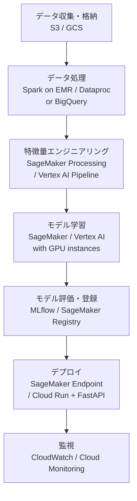

# クラウドサービス実践（AWS / GCP）

主要クラウドプロバイダーの具体的なサービス群と、データサイエンス・機械学習・Web アプリケーション開発での使い方を整理します。EC2・S3・Lambda（AWS）/ Cloud Run・BigQuery・Vertex AI（GCP）を中心に、就職後に確実に使うサービスを扱います。

---

## はじめて読む人へ

「クラウド」の概念は [クラウド・インフラ](クラウド-インフラ) で学びました。このページでは**具体的にどのサービスがどのユースケースに使われるか**を整理します。AWS と GCP の両方を扱いますが、DS 観点では BigQuery（GCP）・SageMaker（AWS）は特に重要です。

### 読む前に押さえること

- [クラウド・インフラ](クラウド-インフラ) — VM・コンテナ・クラウドの基礎
- [Docker](Docker) — コンテナの基礎
- [データエンジニアリング](データエンジニアリング) — データパイプラインの概念

### 読み終えたら説明できること

- AWS と GCP の主要サービスの対応関係を説明できる
- ML パイプラインをクラウドで構築する際のサービス選択を説明できる
- コスト管理の基本的な考え方を説明できる

---

## クラウドサービスの全体像

### サービス階層

**IaaS（インフラ）**

仮想マシン・ストレージ・ネットワーク
例: AWS EC2, GCP Compute Engine

**PaaS（プラットフォーム）**

マネージドな実行環境・DB
例: AWS RDS, GCP Cloud SQL, Cloud Run

**SaaS（機械学習プラットフォーム）**

モデル学習・デプロイのフルマネージドサービス
例: AWS SageMaker, GCP Vertex AI
### AWS / GCP サービス対応表

| カテゴリ | AWS | GCP |
|---------|-----|-----|
| 仮想マシン | EC2 | Compute Engine |
| オブジェクトストレージ | **S3** | **Cloud Storage（GCS）** |
| コンテナ（サーバーレス）| **ECS Fargate** | **Cloud Run** |
| コンテナオーケストレーション | EKS | **GKE（Kubernetes）** |
| サーバーレス関数 | **Lambda** | Cloud Functions |
| マネージド DB（RDB）| RDS | Cloud SQL |
| データウェアハウス | Redshift | **BigQuery** |
| ML プラットフォーム | **SageMaker** | **Vertex AI** |
| API ゲートウェイ | API Gateway | Cloud Endpoints |
| 監視・ログ | CloudWatch | Cloud Monitoring / Logging |
| CI/CD | CodePipeline | Cloud Build |

---

## AWS の主要サービス

### S3（Simple Storage Service）

**オブジェクトストレージ**。機械学習のデータレイクとして最も使われます。

```python
import boto3

s3 = boto3.client('s3')

# ファイルアップロード
s3.upload_file('local_data.csv', 'my-bucket', 'data/2024/data.csv')

# ダウンロード
s3.download_file('my-bucket', 'data/2024/data.csv', 'local.csv')

# pandas で直接読み込み
import pandas as pd
df = pd.read_csv('s3://my-bucket/data/2024/data.csv')
```

**S3 の主な用途：**
- 学習データ・モデルの保存
- 静的 Web ホスティング
- CloudFront（CDN）のオリジン
- バックアップ・アーカイブ（Glacier で低コスト）

### EC2（Elastic Compute Cloud）

**仮想マシン**。GPU インスタンスで深層学習モデルを訓練します。

| インスタンスタイプ | 用途 |
|----------------|------|
| `t3.medium` | Web サーバー・軽量処理 |
| `r6i.xlarge` | メモリ集約処理（pandas の大規模データ）|
| `p3.2xlarge` | GPU 学習（V100 × 1）|
| `p4d.24xlarge` | 大規模 DL（A100 × 8）|

### Lambda（サーバーレス関数）

**イベント駆動のサーバーレス実行**。S3 にファイルが置かれたら自動実行などのパイプラインに使います。

```python
# lambda_function.py
def handler(event, context):
    # S3 トリガーイベント
    bucket = event['Records'][0]['s3']['bucket']['name']
    key = event['Records'][0]['s3']['object']['key']

    # 新しいデータファイルを処理
    process_new_data(bucket, key)
    return {"statusCode": 200}
```

**Lambda の制約：** 最大実行時間 15 分・メモリ最大 10 GB・一時ストレージ 10 GB。長時間処理は ECS Fargate や Step Functions を使います。

### SageMaker

**フルマネージド ML プラットフォーム**。データ準備から学習・デプロイ・モニタリングまで一貫して扱えます。

```python
import sagemaker
from sagemaker.sklearn import SKLearn

# S3 上のデータで学習ジョブを起動
estimator = SKLearn(
    entry_point='train.py',
    framework_version='1.2-1',
    instance_type='ml.m5.xlarge',
    role=sagemaker.get_execution_role(),
)
estimator.fit({'train': 's3://bucket/data/train'})

# エンドポイントにデプロイ
predictor = estimator.deploy(
    initial_instance_count=1,
    instance_type='ml.t2.medium'
)
```

---

## GCP の主要サービス

### BigQuery

**サーバーレスデータウェアハウス**。ペタバイト規模の SQL 分析を秒単位で実行できます。

```sql
-- 1 テラバイトのデータに対しても数秒で実行
SELECT
  DATE_TRUNC(created_at, MONTH) AS month,
  COUNT(*) AS orders,
  SUM(amount) AS revenue,
  AVG(amount) AS avg_order
FROM `project.dataset.orders`
WHERE created_at >= '2024-01-01'
GROUP BY 1
ORDER BY 1;
```

```python
from google.cloud import bigquery

client = bigquery.Client()
df = client.query("""
    SELECT user_id, COUNT(*) as purchase_count
    FROM `project.dataset.events`
    WHERE event_type = 'purchase'
    GROUP BY user_id
""").to_dataframe()  # pandas DataFrame として取得
```

**BigQuery の特徴：**
- 列指向ストレージ（大規模集計に最適）
- 課金はクエリでスキャンしたデータ量（$5/TB）
- 外部テーブル（GCS の Parquet を直接クエリ可）

### Cloud Run

**コンテナをサーバーレスで実行**。Docker イメージをデプロイするだけで HTTPS エンドポイントが立ち上がります。

```bash
# Dockerfile をビルドしてデプロイ
gcloud run deploy my-api \
  --source . \
  --region asia-northeast1 \
  --allow-unauthenticated \
  --memory 2Gi
```

アクセスがない間はゼロにスケールダウン（コスト最適化）、急増時は自動スケールアップ。FastAPI アプリのデプロイに最適です。

### Vertex AI

**Google の ML フルマネージドプラットフォーム**。AutoML・カスタム学習・モデルデプロイ・MLOps を統合します。

```python
from google.cloud import aiplatform

aiplatform.init(project='my-project', location='asia-northeast1')

# カスタム学習ジョブを実行
job = aiplatform.CustomTrainingJob(
    display_name='my-training',
    script_path='train.py',
    container_uri='gcr.io/cloud-aiplatform/training/pytorch-gpu.1-13:latest',
)
model = job.run(
    dataset=dataset,
    machine_type='n1-highmem-8',
    accelerator_type='NVIDIA_TESLA_T4',
)
```

---

## DS / ML ワークフローでのクラウド活用



---

## コスト管理

### 主なコスト削減手法

| 手法 | AWS | GCP | 削減率 |
|------|-----|-----|--------|
| **スポットインスタンス** | Spot Instances | Preemptible VMs | 最大 90% |
| **Reserved** | Reserved Instances | Committed Use | 30〜70% |
| **サーバーレス** | Lambda / Fargate | Cloud Run / Functions | 小規模なら大幅削減 |
| **ライフサイクル** | S3 Intelligent-Tiering | GCS のクラス移行 | ストレージ 50〜80% |

**ML 学習での注意：** GPU インスタンスは高額（p3.2xlarge: $3.06/時間）。学習が終わったらすぐ停止する、スポットインスタンスで中断に対応する（チェックポイント保存）ことが重要です。

---

## 確認問題

1. S3 が「データレイク」の基盤として使われる理由を、コストと可用性の観点から説明してください。
2. Cloud Run が従来の EC2/Compute Engine より小規模 API に適している理由を「スケーリング」の観点から説明してください。
3. BigQuery の列指向ストレージが「全カラムを SELECT する」より「特定カラムを集計する」クエリに向いている理由を説明してください。

---

## 関連ページ

- [クラウド・インフラ](クラウド-インフラ) — クラウドの基礎概念
- [Docker](Docker) — Cloud Run へのデプロイ基盤
- [Kubernetes](Kubernetes) — EKS / GKE でのコンテナ管理
- [データエンジニアリング](データエンジニアリング) — BigQuery・GCS・Dataproc との接続
- [MLOps概要](MLOps概要) — SageMaker・Vertex AI との接続
- [Terraform / IaC](Terraform) — クラウドリソースのコード管理

---

[← ホームへ](Home)
