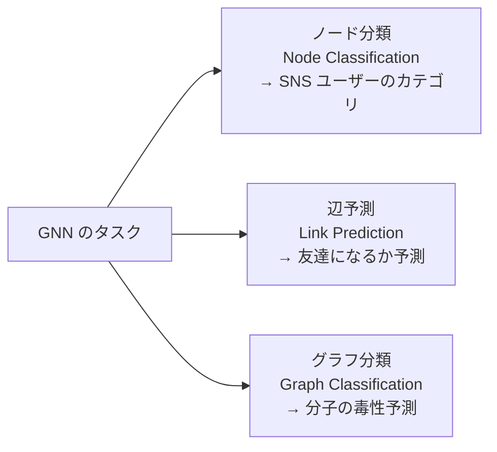
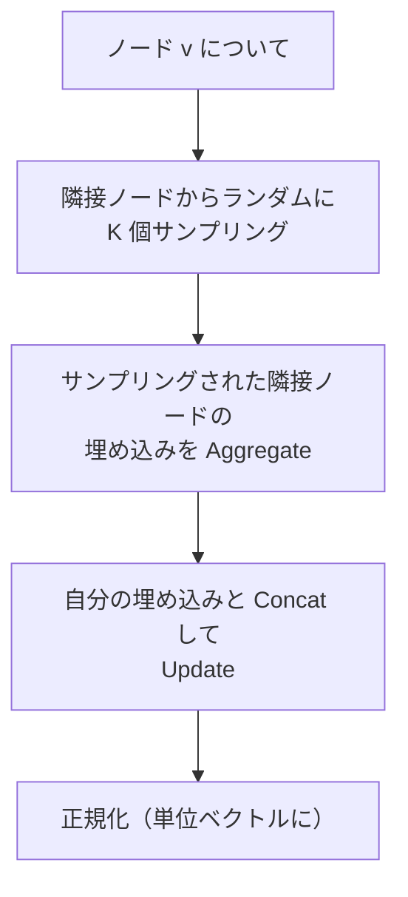

# グラフニューラルネットワーク（GNN）

グラフ構造データ（SNS の友人関係・分子の原子結合・知識グラフ）に対してニューラルネットワークを適用する手法です。画像・テキストが格子状・系列状のデータであるのに対し、グラフは任意の接続関係を持つ非ユークリッドデータです。GCN・GraphSAGE・GAT の 3 つが核心技術です。

---

## はじめて読む人へ

CNN は画像の「近隣ピクセル」を、RNN は系列の「前後のトークン」を使います。GNN は「グラフ上の隣接ノード」からの情報伝播を学習します。「薬の分子構造から活性を予測」「SNS のスパムユーザーを検出」「レコメンデーションの協調フィルタリング改善」——これらがすべて同じ GNN の枠組みで扱えます。

### 読む前に押さえること

- [離散数学](離散数学) — グラフ理論・隣接行列
- [深層学習入門](深層学習入門) — NN の基礎・バックプロパゲーション
- [線形代数](線形代数) — 行列演算・固有値

### 読み終えたら説明できること

- メッセージパッシングの仕組みを説明できる
- GCN・GraphSAGE・GAT の違いを説明できる
- GNN の 3 種類のタスク（ノード・辺・グラフ分類）を説明できる

---

## グラフの表現

### 基本記号

グラフ $\mathcal{G} = (\mathcal{V}, \mathcal{E})$：

- $\mathcal{V}$：ノード集合（$|\mathcal{V}| = N$）
- $\mathcal{E}$：エッジ集合
- $A \in \{0,1\}^{N \times N}$：隣接行列
- $X \in \mathbb{R}^{N \times d}$：ノード特徴量行列（各ノードに $d$ 次元の特徴）

### GNN のタスク

---

## メッセージパッシング（MPNN）

すべての GNN の統一的な枠組みです。

### 直感：「噂の伝播」

!!! info ""
    ノード v の状態を更新するとき：
    
    Step 1（Aggregate）: 隣接ノードからメッセージを集める
      「近所の人たちがどんな情報を持っているか聞く」
    
    Step 2（Combine/Update）: 自分の状態と組み合わせて更新
      「聞いた情報と自分の知識を統合して新しい理解を得る」
    
    これを L 層繰り返すと：
      L=1: 直接の隣人の情報を取り込む
      L=2: 隣人の隣人（2 ホップ先）の情報も取り込む
      L=k: k ホップ先までの情報が伝播する

### MPNN の一般式

$l$ 層目のノード $v$ の埋め込み $\mathbf{h}_v^{(l)}$ の更新：

$$
\mathbf{m}_v^{(l)} = \text{Aggregate}^{(l)}\!\left(\left\{\mathbf{h}_u^{(l-1)} : u \in \mathcal{N}(v)\right\}\right)
$$

$$
\mathbf{h}_v^{(l)} = \text{Update}^{(l)}\!\left(\mathbf{h}_v^{(l-1)},\, \mathbf{m}_v^{(l)}\right)
$$

$\mathcal{N}(v)$：ノード $v$ の隣接ノード集合。Aggregate と Update の設計で様々な GNN が導出されます。

---

## GCN（Graph Convolutional Network）

### スペクトルグラフ畳み込みの直感

CNN の畳み込みをグラフに拡張します。画像の畳み込みカーネルが「近傍ピクセルの加重平均」を計算するように、GCN は「隣接ノードの加重平均（+ 自分自身）」を計算します。

### 層の更新式

$$
H^{(l+1)} = \sigma\!\left(\tilde{D}^{-1/2} \tilde{A} \tilde{D}^{-1/2} H^{(l)} W^{(l)}\right)
$$

- $\tilde{A} = A + I$：自己ループ追加済みの隣接行列
- $\tilde{D}$：$\tilde{A}$ の次数行列（対角）
- $H^{(l)}$：$l$ 層目のノード埋め込み行列
- $W^{(l)}$：学習可能な重み行列
- $\sigma$：活性化関数（ReLU など）

**正規化 $\tilde{D}^{-1/2} \tilde{A} \tilde{D}^{-1/2}$ の意味：** 次数が高いノード（多くのエッジを持つ）の情報が過大にならないよう、各ノードの次数の平方根で正規化します。

### GCN の限界

- **過平滑化（Oversmoothing）：** 層を深くすると全ノードの埋め込みが同じになっていく
- **帰納的学習が難しい：** 学習時に見たノードの埋め込みしか推論できない（トランスダクティブ）
- **スケーラビリティ：** 大規模グラフ全体を一度に処理する必要がある

---

## GraphSAGE（Sample and Aggregate）

### GCN からの改善

GCN の限界を克服するため、**サンプリング + 帰納的学習** を導入しました。

### 更新式

$$
\mathbf{h}_v^{(l)} = \sigma\!\left(W^{(l)} \cdot \left[\mathbf{h}_v^{(l-1)} \| \text{Aggregate}\!\left(\{\mathbf{h}_u^{(l-1)}: u \in \tilde{\mathcal{N}}(v)\}\right)\right]\right)
$$

$\|$：ベクトルの結合（Concatenation）、$\tilde{\mathcal{N}}(v)$：サンプリングされた隣接ノード。

### Aggregate の選択肢

| 手法 | 数式 | 特徴 |
|------|------|------|
| Mean | $\frac{1}{|\mathcal{N}|}\sum_u h_u$ | シンプル・GCN と類似 |
| LSTM | LSTM の出力 | 順序依存（グラフには非推奨） |
| Max Pooling | $\max_{u \in \mathcal{N}}(W h_u)$ | 最も重要な特徴を選択 |

**帰納的学習（Inductive Learning）のメリット：** 学習後に新しいノードが追加されても、隣接ノードの特徴量から埋め込みを計算できます。SNS や EC サイトのように日々新しいユーザーが追加される場合に重要です。

---

## GAT（Graph Attention Network）

### GCN の固定重みの問題

GCN は全隣接ノードを次数で正規化した同じ重みで平均します。しかし「重要な隣人と重要でない隣人」が存在するはずです。

GAT はアテンション機構で **隣接ノードごとに異なる重みを学習** します。

### アテンション係数の計算

ノード $v$ に対するノード $u$ のアテンション係数：

$$
e_{vu} = \text{LeakyReLU}\!\left(\mathbf{a}^\top [\mathbf{W}\mathbf{h}_v \| \mathbf{W}\mathbf{h}_u]\right)
$$

Softmax で正規化：

$$
\alpha_{vu} = \frac{\exp(e_{vu})}{\sum_{k \in \mathcal{N}(v)} \exp(e_{vk})}
$$

更新式：

$$
\mathbf{h}_v^{(l)} = \sigma\!\left(\sum_{u \in \mathcal{N}(v)} \alpha_{vu} \mathbf{W} \mathbf{h}_u\right)
$$

**Multi-head Attention：** Transformer と同様に複数のアテンションヘッドを使い、異なる「注目の仕方」を学習します。

### GCN・GraphSAGE・GAT の比較

| モデル | 集約方式 | 帰納的 | 特徴 |
|-------|---------|--------|------|
| **GCN** | 固定の正規化加重平均 | ✗ | シンプル・ベースライン |
| **GraphSAGE** | サンプリング + 選べる集約 | ✓ | 大規模・帰納的学習 |
| **GAT** | アテンションで動的重み | ✓ | 隣人の重要度を学習 |

---

## 応用分野

### 分子設計・創薬

原子 = ノード、化学結合 = エッジ。グラフ分類で「この分子は毒か無毒か」「この薬は血中に浸透するか」を予測します。

**AlphaFold のアイデアの根幹：** タンパク質のアミノ酸残基をノード、空間的近傍を動的エッジとしたグラフ構造が活用されています。

### 推薦システム

ユーザーと商品を 2 種類のノード、購入・評価をエッジとした**二部グラフ**を GNN で処理します。NGCF・LightGCN が代表的なモデルです。

### 知識グラフ推論

「エンティティ（人・組織・概念）」をノード、「関係（生まれた・所属する）」をエッジとして、欠損した関係の補完（リンク予測）を行います。

### 交通流・経路予測

道路 = エッジ、交差点 = ノード。時空間グラフ（STGNN）で交通量を予測します。Google Maps の到着時刻予測に活用されています。

---

## 数学的導出

### GCN の固有値分解による正当化

グラフのラプラシアン行列 $L = D - A$ の固有値分解 $L = U \Lambda U^\top$ を使うと、グラフ上のフーリエ変換を定義できます：

$$
\hat{f} = U^\top f \quad \text{（グラフフーリエ変換）}
$$

スペクトル領域での畳み込み：

$$
f *_{\mathcal{G}} g = U((U^\top f) \odot (U^\top g)) = U \hat{g}(\Lambda) U^\top f
$$

$\hat{g}(\Lambda)$：グラフフィルタ。ChebNet は $\hat{g}(\Lambda) \approx \sum_{k=0}^K \theta_k T_k(\tilde{\Lambda})$（チェビシェフ多項式近似）で局所的フィルタを実現し、GCN はこれを 1 次近似したものです。

### 過平滑化の数学的解釈

$l$ 層の GCN は：

$$
H^{(l)} = \hat{A}^l X W_1 W_2 \cdots W_l
$$

正規化隣接行列 $\hat{A}$ のべき乗 $\hat{A}^l$ は、ランダムウォークの $l$ ステップ遷移行列に対応します。$l \to \infty$ のとき $\hat{A}^l$ は各行が stationary distribution に収束するため、全ノードの埋め込みが同じになります（過平滑化）。

---

## 確認問題

1. メッセージパッシングで「層の数 = 情報が伝播するホップ数」になる理由を説明してください。
2. GCN の正規化 $\tilde{D}^{-1/2}\tilde{A}\tilde{D}^{-1/2}$ が必要な理由を「次数の偏り」の観点から説明してください。
3. GAT が GCN より柔軟な理由を、アテンション係数の計算から説明してください。
4. 分子グラフのノード分類とグラフ分類の違いを具体例で説明してください。

---

## 関連ページ

- [離散数学](離散数学) — グラフ理論の基礎
- [深層学習入門](深層学習入門) — NN・バックプロパゲーション
- [Transformer・Attention](Transformer-Attention) — GAT と Transformer のアテンション比較
- [レコメンデーションシステム](レコメンデーション) — LightGCN による協調フィルタリング
- [生成モデル](生成モデル) — グラフ生成（分子設計への応用）

---

[← ホームへ](Home)
