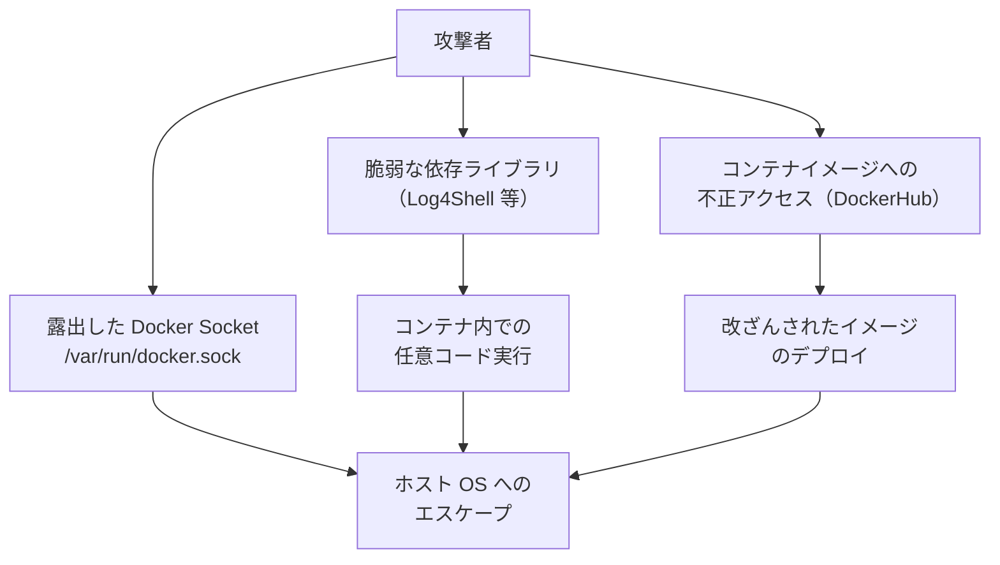

# コンテナセキュリティ

Docker・Kubernetes 環境でのセキュリティベストプラクティスです。イメージの脆弱性・secrets 管理・最小権限の原則・ネットワーク分離・Kubernetes RBAC を扱います。「動いているから大丈夫」から「安全に動いている」へのレベルアップに必要な知識です。

---

## はじめて読む人へ

`docker run --privileged` で動かしているコンテナは、ホスト OS の root と同等の権限を持ちます。`ENV DB_PASSWORD=secret` で環境変数にパスワードを埋め込んだ Dockerfile は、イメージを取得した人誰でもパスワードを見られます。コンテナは便利ですが、使い方を誤るとセキュリティホールを作ります。

### 読む前に押さえること

- [Docker](Docker) — イメージ・コンテナの基礎
- [Kubernetes](Kubernetes) — Pod・Deployment の基礎
- [セキュリティ基礎](セキュリティ) — 最小権限・攻撃面の縮小

### 読み終えたら説明できること

- Docker イメージのセキュリティベストプラクティスを説明できる
- Kubernetes Secrets の適切な使い方を説明できる
- コンテナのセキュリティ脅威モデルを説明できる

---

## Docker イメージのセキュリティ

### ベースイメージの選択

```dockerfile
# 悪い例: 攻撃面が広い
FROM ubuntu:latest
RUN apt-get install -y python3 python3-pip ...

# 良い例: 最小構成のイメージ
FROM python:3.12-slim          # 軽量 Debian ベース
# または
FROM python:3.12-alpine        # Alpine（さらに小さい、5MB 程度）
# または
FROM gcr.io/distroless/python3 # シェルすら含まない（最小攻撃面）
```

**Distroless：** Google 製の最小イメージ。シェル・パッケージマネージャー・coreutils がない。侵入されてもできることが極端に少なくなります。

### 非 root ユーザーでの実行

```dockerfile
FROM python:3.12-slim

WORKDIR /app
COPY requirements.txt .
RUN pip install -r requirements.txt

COPY . .

# 非 root ユーザーを作成して切り替える
RUN useradd -m -u 1000 appuser
USER appuser  # ← 重要！root で実行しない

EXPOSE 8000
CMD ["python", "-m", "uvicorn", "main:app", "--host", "0.0.0.0"]
```

コンテナがコンテナ内で root でも、ホスト OS 上では特定のユーザーとしか動かないため、エスケープ時のリスクを限定できます。

### マルチステージビルド（機密情報の漏洩防止）

```dockerfile
# ビルドステージ（SSH キーなど秘密情報を使っていい）
FROM node:20 AS builder
COPY package.json .
RUN npm install       # ← node_modules をここに閉じ込める
COPY . .
RUN npm run build

# 実行ステージ（ビルド成果物だけをコピー）
FROM nginx:alpine
COPY --from=builder /app/dist /usr/share/nginx/html
# ← builder ステージのファイルシステム・秘密情報は含まれない
```

### .dockerignore

```text
.env                  # 環境変数ファイルを除外
.git                  # Git 履歴を除外（APIキーの履歴が含まれることがある）
node_modules
__pycache__
*.key
*.pem
credentials.json
```
---

## Secrets の管理

### やってはいけないこと

```dockerfile
# 絶対NG: Dockerfile に秘密情報を直接書く
ENV API_KEY=sk-xxxxxxxxxxxx
ENV DB_PASSWORD=mysecretpassword

# NG: docker build の ARG でも、イメージの履歴に残る
ARG DB_PASSWORD
RUN echo $DB_PASSWORD > /etc/db.conf
```

### Docker Secrets（Swarm モード）

```bash
# secrets を作成
echo "mysecretpassword" | docker secret create db_password -

# コンポーズでの利用
services:
  app:
    image: myapp
    secrets:
      - db_password

secrets:
  db_password:
    external: true
```

### Kubernetes Secrets

```yaml
# Secret を作成（base64 エンコード）
apiVersion: v1
kind: Secret
metadata:
  name: db-credentials
type: Opaque
data:
  password: bXlzZWNyZXRwYXNzd29yZA==  # base64("mysecretpassword")
```

```yaml
# Pod から Secret を環境変数として使用
env:
  - name: DB_PASSWORD
    valueFrom:
      secretKeyRef:
        name: db-credentials
        key: password
```

**注意：** Kubernetes Secrets は base64 エンコードされているだけで**暗号化されていません**。本番では AWS Secrets Manager・GCP Secret Manager・HashiCorp Vault を使うのがベストプラクティスです。

```yaml
# External Secrets Operator を使って外部 Secrets Manager から取得
apiVersion: external-secrets.io/v1beta1
kind: ExternalSecret
spec:
  secretStoreRef:
    name: aws-secretsmanager
  data:
    - secretKey: db_password
      remoteRef:
        key: prod/myapp/db
        property: password
```

---

## イメージの脆弱性スキャン

### Trivy

```bash
# イメージをスキャン
trivy image python:3.12-slim

# 出力例
Total: 23 (HIGH: 5, MEDIUM: 12, LOW: 6)
┌──────────────────────┬────────────────┬──────────┬──────────────────┐
│ Library              │ Vulnerability  │ Severity │ Fixed Version    │
├──────────────────────┼────────────────┼──────────┼──────────────────┤
│ libssl3              │ CVE-2024-xxxx  │ HIGH     │ 3.0.11-1~deb12u2 │
└──────────────────────┴────────────────┴──────────┴──────────────────┘

# CI/CD に組み込む（HIGH 以上があればビルド失敗）
trivy image --exit-code 1 --severity HIGH,CRITICAL myapp:latest
```

### CI/CD パイプラインでのスキャン統合

```yaml
# .github/workflows/security.yml
- name: Scan Docker image
  uses: aquasecurity/trivy-action@master
  with:
    image-ref: 'myapp:${{ github.sha }}'
    format: 'table'
    exit-code: '1'
    severity: 'CRITICAL,HIGH'
```

---

## Kubernetes のセキュリティ

### RBAC（Role-Based Access Control）

誰が何のリソースに何の操作を許可するかを定義します。

```yaml
# Role: 特定の名前空間での権限
apiVersion: rbac.authorization.k8s.io/v1
kind: Role
metadata:
  namespace: production
  name: pod-reader
rules:
  - apiGroups: [""]
    resources: ["pods"]
    verbs: ["get", "list", "watch"]  # create・delete は許可しない

# RoleBinding: ユーザーに Role を付与
apiVersion: rbac.authorization.k8s.io/v1
kind: RoleBinding
metadata:
  namespace: production
  name: read-pods
subjects:
  - kind: User
    name: alice
roleRef:
  kind: Role
  name: pod-reader
```

### NetworkPolicy

Pod 間の通信を制限します。

```yaml
# app Pod は db Pod への 5432 ポートのみ許可
apiVersion: networking.k8s.io/v1
kind: NetworkPolicy
metadata:
  name: db-network-policy
spec:
  podSelector:
    matchLabels:
      app: db
  ingress:
    - from:
        - podSelector:
            matchLabels:
              app: app
      ports:
        - port: 5432
```

### Security Context

Pod・コンテナレベルでの権限を制限します。

```yaml
spec:
  securityContext:
    runAsNonRoot: true         # root 以外で実行
    runAsUser: 1000
    fsGroup: 2000
  containers:
    - name: app
      securityContext:
        allowPrivilegeEscalation: false  # 権限昇格禁止
        readOnlyRootFilesystem: true      # ルートファイルシステムを読み取り専用
        capabilities:
          drop: ["ALL"]                   # すべての Linux capabilities を削除
```

---

## 脅威モデル

### コンテナ特有の攻撃経路



**Docker Socket の危険性：** `/var/run/docker.sock` をコンテナにマウントすると、コンテナ内からホスト OS 上で任意のコンテナを起動できます（実質 root 権限）。

---

## 確認問題

1. Dockerfile で `USER root` のままにすることのリスクを「コンテナエスケープ」の観点から説明してください。
2. Kubernetes Secrets が base64 エンコードのみで「暗号化ではない」理由を説明してください。
3. NetworkPolicy でデフォルトで全通信を拒否し、必要な通信だけ許可することを「最小権限の原則」の観点から説明してください。

---

## 関連ページ

- [Docker](Docker) — コンテナの基礎
- [Kubernetes](Kubernetes) — Pod・RBAC の基礎
- [セキュリティ基礎](セキュリティ) — 最小権限・攻撃面の縮小
- [CI/CD](CI-CD) — Trivy スキャンのパイプライン統合
- [クラウドサービス実践](クラウドサービス実践) — AWS Secrets Manager・GCP Secret Manager

---

[← ホームへ](Home)
