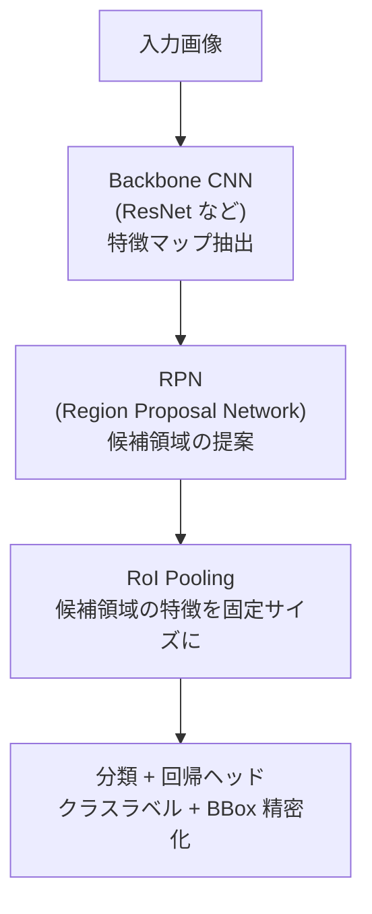
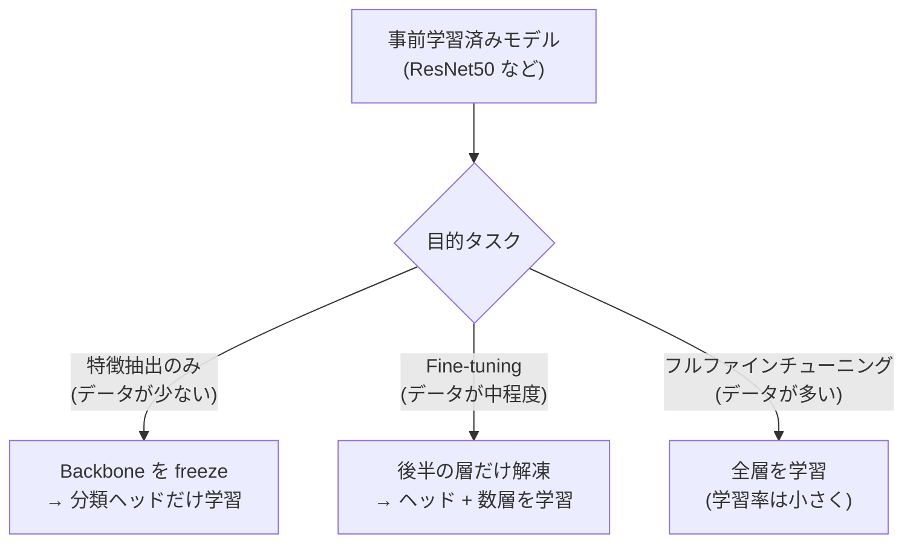

# コンピュータビジョン応用

「画像の中に何があり、どこにあるか」を認識する技術です。画像分類（クラス分類）にとどまらず、物体検出・セグメンテーション・姿勢推定・深度推定といった豊富なタスクを扱います。自動運転・医療画像診断・産業検査・AR/VR の中核技術です。

---

## はじめて読む人へ

CNN.md では「画像に何が写っているか（分類）」を学びました。このページでは「どこに何があるか（検出・位置特定）」と「どのピクセルが何か（セグメンテーション）」に進みます。深層学習の基礎（CNN・転移学習）を前提にします。

### 読む前に押さえること

- [CNN（画像認識）](CNN) — 畳み込み・ResNet・転移学習
- [画像処理基礎](画像処理基礎) — フィルタリング・色空間・前処理

### 読み終えたら説明できること

- 物体検出の主要なアーキテクチャを比較できる
- セマンティック・インスタンス・パノプティックセグメンテーションの違いを説明できる
- 転移学習の戦略を使い分けられる

---

## 物体検出

### タスクの定義

画像内に存在する物体の **クラスラベル + バウンディングボックス（矩形領域）** を出力します。

!!! info ""
    入力:                    出力:
                             [犬: (x=50, y=30, w=100, h=120, conf=0.95)]
    ┌──────────────┐        [猫: (x=200, y=80, w=80, h=100, conf=0.87)]
    │  🐶    🐱   │  →
    │              │
    └──────────────┘

### 性能評価：IoU と mAP

**IoU（Intersection over Union）：** 予測ボックスと正解ボックスの重なり具合。

$$
\text{IoU} = \frac{|\text{予測} \cap \text{正解}|}{|\text{予測} \cup \text{正解}|}
$$

- IoU ≥ 0.5 を正解（True Positive）と判定することが多い

**mAP（mean Average Precision）：** 全クラスの AP（適合率-再現率曲線の面積）の平均。物体検出の標準的な評価指標です。

### 2 段階検出（Two-Stage）

**Faster R-CNN：**



- **精度が高い**が、2段階処理のため**遅い**（リアルタイム不向き）
- RPN：「物体らしい領域」をアンカーボックスで提案

### 1 段階検出（One-Stage）

**YOLO（You Only Look Once）：**

画像を $S \times S$ のグリッドに分割し、各グリッドセルが直接 BBox とクラス確率を予測します。

!!! info ""
    画像をグリッド分割:      各グリッドセルの出力:
    ┌──┬──┬──┬──┐          (bx, by, bw, bh, conf) × B個の予測
    │  │  │  │  │    →     + (クラス確率) × C クラス
    ├──┼──┼──┼──┤
    │  │ ★│  │  │    ★: 物体の中心が含まれるセルが
    ├──┼──┼──┼──┤       そのBBoxを予測する責任を持つ
    │  │  │  │  │
    └──┴──┴──┴──┘

| モデル | 特徴 |
|-------|------|
| **YOLOv5/v8** | 高速・精度のバランスが良い。実務で最も普及 |
| **DETR** | Transformer ベース。アンカー不要でシンプル |
| **SSD** | 多解像度特徴マップで小物体に対応 |

### 検出タスクの比較

| 手法 | 速度 | 精度 | 用途 |
|------|------|------|------|
| Faster R-CNN | 遅い | 高い | 医療画像・精度優先 |
| YOLO v8 | リアルタイム | 十分 | 監視カメラ・自動運転 |
| DETR | 中程度 | 高い | 研究・高精度が必要な用途 |

---

## セグメンテーション

### 3 種類のセグメンテーション

!!! info ""
    入力画像:     セマンティック:    インスタンス:   パノプティック:
    ┌────────┐   ┌────────┐        ┌────────┐     ┌────────┐
    │🐶 🐶 🌳│   │人人人🌳 │ →       │①人②人③│     │①人②人 │
    │      │   │人人人🌳 │    各ピクセルに│🌳🌳🌳 │     │①人背景 │
    └────────┘   └────────┘        └────────┘     └────────┘
                 クラスラベル      + 個体識別       スタッフ/モノ区別

| 種類 | 出力 | 特徴 | 代表モデル |
|------|------|------|---------|
| **セマンティック** | 各ピクセルのクラス | 個体区別なし | FCN・DeepLab |
| **インスタンス** | 各ピクセルのクラス + ID | 個体を区別 | Mask R-CNN |
| **パノプティック** | スタッフ+モノの統合 | 最も情報量豊富 | Panoptic FPN |

### FCN（Fully Convolutional Network）

分類向けの CNN（最後が全結合層）を「全畳み込み」に置き換え、ピクセルレベルの予測を実現しました。

**Encoder-Decoder 構造：**

!!! info ""
    Encoder（ダウンサンプリング）:
    画像 → Conv → Pool → Conv → Pool → 特徴マップ（小）
    
    Decoder（アップサンプリング）:
    特徴マップ → 転置畳み込み → スキップ接続 → 元サイズのマスク

**スキップ接続：** Encoder の各解像度の特徴を Decoder に直接接続。空間的な詳細情報を保持します。

### U-Net

医療画像セグメンテーションの定番モデルです。

```
Encoder               Decoder
 ─────────────────────────────────
 Conv Conv → ──────────→ Conv Conv
     │Pool                 ↑
 Conv Conv → ──────────→ Conv Conv
     │Pool                 ↑
 Conv Conv → ──────────→ Conv Conv
     │Pool                 ↑
         → BottleNeck →
```

U 字型のスキップ接続が特徴で、位置精度が高いセグメンテーションを実現します。少量のデータ（医療画像は枚数が限られる）でも良い結果が得られます。

### SAM（Segment Anything Model）

Meta が 2023 年に発表した**汎用セグメンテーションモデル**。

- 1,100 万枚の画像・11 億マスクで事前学習
- ポイント・ボックス・テキストを「プロンプト」として入力すると任意物体をセグメント
- 「基盤モデル」アプローチをセグメンテーションに適用

---

## 転移学習と Fine-tuning

### 事前学習モデルの活用

大規模データセット（ImageNet: 120 万枚・1,000 クラス）で学習済みのモデルをベースに、独自タスクに適応させます。



### 転移学習の戦略

| データ量 | ソースとの類似度 | 推奨戦略 |
|---------|-------------|---------|
| 少ない | 高い | 特徴量として使用のみ（backbone freeze） |
| 少ない | 低い | 浅い層のみ使用 + 小さい学習率 |
| 多い | 高い | Fine-tuning（後半層） |
| 多い | 低い | Full Fine-tuning（低 lr）または初期化から学習 |

### 医療画像への応用例

- 胸部 X 線の肺炎検出（2 値分類）
- 皮膚病変のセグメンテーション
- 眼底画像の糖尿病性網膜症の分類

ImageNet と医療画像は見た目が大きく異なりますが、事前学習のエッジ検出・テクスチャ検出の能力は医療画像でも有効です。

---

## 姿勢推定（Pose Estimation）

人体の関節（肩・肘・手首・膝など）の位置を検出します。

### ヒートマップ方式

各関節の「存在確率マップ」を出力します。

$$
\text{Heatmap}(j, x, y) = \exp\!\left(-\frac{(x - x_j)^2 + (y - y_j)^2}{2\sigma^2}\right)
$$

$j$：関節インデックス、$(x_j, y_j)$：正解位置。最大値を取る座標が予測関節位置です。

### 代表的なフレームワーク

| ツール | 検出方式 | 用途 |
|-------|---------|------|
| **OpenPose** | Bottom-up（人全体 → 関節） | マルチパーソン |
| **MediaPipe Pose** | Top-down（人検出 → 関節） | リアルタイム・モバイル |
| **ViTPose** | Transformer ベース | 最高精度 |

**応用：** スポーツ動作分析・リハビリ支援・手話認識・人物追跡

---

## 深度推定（Depth Estimation）

単眼カメラから各ピクセルのカメラまでの距離を推定します。

### 単眼深度推定（Monocular Depth）

1 枚の画像から深度マップを予測。カメラ 1 台で自動運転支援に使えます。

**Depth Anything（2024）：** 大規模自己教師あり学習による汎用深度推定モデル。

### ステレオ深度推定

人間の両眼と同様に、2 台のカメラの視差（disparity）から三角測量で深度を計算します。

$$
Z = \frac{f \cdot B}{d}
$$

$f$：焦点距離、$B$：ベースライン（カメラ間距離）、$d$：視差

---

## 変化検出・異常検知

### 変化検出

衛星画像・監視カメラで、時系列的な変化（建物の増減・洪水域の拡大）を検出します。

$$
\text{Change} = |I_{t2} - I_{t1}| > \theta
$$

深層学習では Siamese Network（2 時期の画像を同じ CNN に入れて差分を分類）が使われます。

### 視覚的異常検知

正常画像のみで学習し、テスト時に異常（傷・汚れ）を検出します。製造業の外観検査に広く使われます。

- **PatchCore** / **PaDiM**：事前学習済み特徴量を使った正常分布モデリング
- **MVTec AD** データセット：異常検知の標準ベンチマーク

---

## 数学的導出

### IoU の微分可能化（GIoU）

標準 IoU は勾配が消える（重なりがない場合に IoU = 0 で定数）という問題があります。GIoU（Generalized IoU）はこれを解決します：

$$
\text{GIoU} = \text{IoU} - \frac{|C \setminus (A \cup B)|}{|C|}
$$

$C$：2 つのボックス $A$, $B$ を包む最小の囲みボックス。$C \setminus (A \cup B)$ は $C$ のうち $A$ にも $B$ にも属さない領域です。GIoU は $[-1, 1]$ の範囲を取り、常に勾配が存在します。

### 転置畳み込み（Bilinear Upsample との違い）

Decoder でのアップサンプリングに使われる転置畳み込みは、畳み込みの逆操作です。

入力サイズ $n$ → 出力サイズ $s(n-1) + k - 2p$（$s$：ストライド、$k$：カーネルサイズ、$p$：パディング）

バイリニア補間（固定の重み）と異なり、転置畳み込みは重みを**学習**できます。ただし「チェッカーボードアーティファクト」が発生しやすいため、Bilinear + Conv の組み合わせが実務では好まれます。

---

## 確認問題

1. 1 段階検出（YOLO）と 2 段階検出（Faster R-CNN）の速度と精度のトレードオフを説明してください。
2. セマンティックセグメンテーションとインスタンスセグメンテーションの違いを、交差点での車の検出を例に説明してください。
3. Transfer Learning で「backbone を freeze する」のはどのような場合に有効ですか？
4. U-Net のスキップ接続がない場合、セグメンテーション精度にどのような影響がありますか？

---

## 関連ページ

- [CNN（画像認識）](CNN) — 畳み込み・ResNet・分類
- [画像処理基礎](画像処理基礎) — 前処理・フィルタリング
- [深層学習入門](深層学習入門) — NN の基礎・バックプロパゲーション
- [PyTorch 入門](PyTorch入門) — モデルの実装・学習ループ
- [Transformer・Attention](Transformer-Attention) — Vision Transformer・DETR
- [異常検知](異常検知) — 画像異常検知の実装

---

[← ホームへ](Home)
