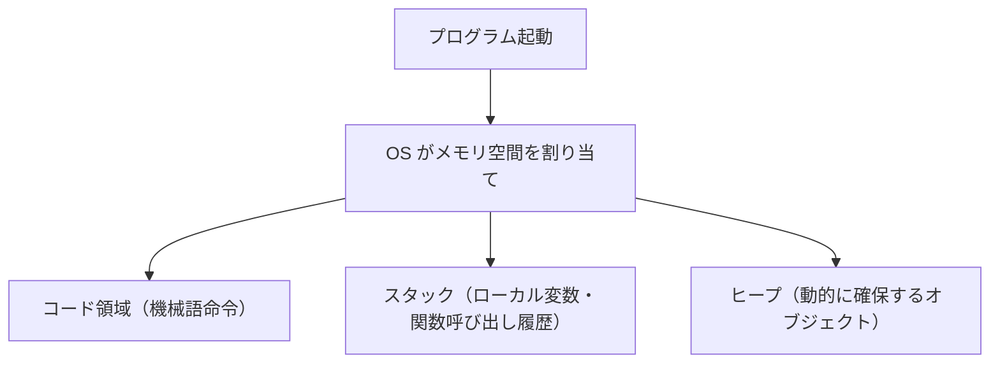

# コンピュータ基礎

> コース 6 の出発点です。プログラムが「何の上で動いているか」を理解することで、パフォーマンス問題や障害の原因を論理的に追えるようになります。

---

## はじめて読む人へ

コンピュータ基礎では、プログラムがどのような部品の上で動いているかを学びます。CPU、メモリ、ストレージ、OS の役割を知ると、遅い・落ちる・動かない原因を考えやすくなります。

コードやコマンドが出てきたら、最初から全部を覚えようとしなくて大丈夫です。まずは「何を入力し、何が処理され、何が出力されるのか」を文章で説明できるように読むと、手を動かす前の理解が安定します。

### 読む前に押さえること

- CPU は命令を実行し、メモリは実行中のデータを置きます。
- ストレージは、電源を切っても残るデータを保存します。
- OS は、アプリとハードウェアの間を仲介します。

### 読み終えたら説明できること

- CPU、メモリ、ストレージ、OS の役割を説明できる。
- プロセスとスレッドの違いを理解できる。
- パフォーマンス問題の原因を大まかに分類できる。

---

## CPU

CPU（Central Processing Unit）はコンピュータの「頭脳」で、命令を 1 つひとつ実行します。

| 用語 | 意味 |
|------|------|
| クロック周波数 | 1 秒あたりの命令実行サイクル数。3 GHz = 1 秒に 30 億サイクル |
| コア | CPU 内の独立した処理ユニット。4 コアなら 4 つの処理を同時実行できます |
| キャッシュ | メモリより高速な小容量の一時記憶。L1 > L2 > L3 の順で速く、容量は逆です |

**開発者への影響：**  
Node.js はシングルスレッドで動きます（デフォルト）。CPU ヘビーな処理（画像変換・機械学習推論など）を同一プロセスで行うと、1 コアしか使えず他のリクエストがブロックされます。`worker_threads` や `child_process` でマルチコアを活かしてください。

---

## メモリ（RAM）

メモリは、プログラムが実行中に使う作業場所です。CPU はストレージから直接大量のデータを処理するのではなく、必要なデータをメモリに置いて高速に読み書きします。

変数、配列、オブジェクト、関数呼び出しの情報などは、実行中にメモリ上へ配置されます。メモリが不足するとスワップが発生し、ストレージを一時的に使うため処理が急に遅くなります。

プログラムが動いている間、データを一時的に置く場所です。ストレージより 100 倍以上速いですが、電源を切ると消えます。



この図は、プログラムが実行中に使うメモリの大まかな内訳です。コード領域には実行する命令、スタックには関数呼び出しごとの一時データ、ヒープにはリストやオブジェクトのように実行中に大きさが変わるデータが置かれます。

**仮想メモリ：**  
物理メモリが不足すると OS がストレージを一時的にメモリとして使います（スワップ）。SSD でも RAM の 1,000 倍遅いため、スワップが発生すると応答時間が急激に悪化します。

**メモリリーク：**  
参照を残したままオブジェクトを解放しないと、ヒープが増え続けてやがてプロセスがクラッシュします。Node.js では `--expose-gc` や `heapdump` で調査できます。

---

## ストレージ

データを永続的に保存する装置です。

| 種類 | 特徴 | 用途 |
|------|------|------|
| HDD | 磁気ディスクを物理回転。安価・大容量ですが遅い | バックアップ・ログ保存 |
| SSD | フラッシュメモリ。HDD の 10〜100 倍速い | OS・アプリ・DB |
| NVMe SSD | SSD の高速版規格。さらに 3〜5 倍速い | ハイパフォーマンス用途 |

**アクセス速度の目安（レイテンシ）：**

```
CPU キャッシュ（L1） : ~1 ns
メモリ（RAM）         : ~100 ns
NVMe SSD             : ~20 µs
SSD                  : ~100 µs
HDD                  : ~10 ms   ← SSD の 100 倍遅い
ネットワーク（LAN）  : ~1 ms
```

この差を体感で理解すると、「DB はなぜ遅いのか」「ファイル I/O のボトルネック」を適切に判断できるようになります。

---

## OS（オペレーティングシステム）

ハードウェアとアプリケーションの橋渡しをするソフトウェアです。

**カーネル：** OS の中核です。ハードウェア制御・メモリ管理・プロセス管理を担います。

**システムコール：** アプリがカーネルの機能を呼び出す窓口です。ファイルの読み書きやネットワーク通信はすべてシステムコールを介します。

```mermaid
flowchart TB
    App["アプリ"] -->|"open(\"file.txt\")  ← システムコール"| Kernel["カーネル"]
    Kernel -->|"ファイルシステム経由でストレージへアクセス"| HW["ハードウェア（SSD）"]
```

`strace`（Linux）コマンドを使うとアプリが実行しているシステムコールを追跡できます。パフォーマンス調査や障害解析に役立ちます。

この図では、アプリが直接SSDを読むのではなく、`open` のようなシステムコールを通じてカーネルに依頼しています。OSが間に入ることで、ファイル権限の確認や複数プロセスの安全な共有ができます。

---

## 数値表現（整数・浮動小数点）

コンピュータは「0 と 1」だけでデータを表します。整数と浮動小数点数の表現方法を知ると、計算誤差・オーバーフロー・型変換の問題を正しく理解できます。

### 整数（Integer）

```python
# Python / NumPy での整数型
import numpy as np

# 符号なし 8 ビット整数：0〜255（2⁸ - 1）
a = np.uint8(255)
print(a + 1)  # → 0（オーバーフロー！ラップアラウンド）

# 符号あり 32 ビット整数：-2,147,483,648 〜 2,147,483,647
b = np.int32(2_147_483_647)
print(b + 1)  # → -2,147,483,648（オーバーフロー）

# Python の int は精度無制限
large = 2 ** 100   # 問題なし（内部的にメモリを伸長）
```

| 型 | ビット数 | 範囲 |
|----|--------|------|
| int8 | 8 | -128 〜 127 |
| int16 | 16 | -32,768 〜 32,767 |
| int32 | 32 | 約 ±21 億 |
| int64 | 64 | 約 ±920 京 |
| uint8 | 8（符号なし） | 0 〜 255（画像の 1 ピクセル） |

### 浮動小数点数（Floating Point）

浮動小数点は **IEEE 754** 規格で定められた実数の近似表現です。

```
64 ビット（float64）: 1 符号 + 11 指数部 + 52 仮数部
精度：約 15〜16 桁の有効数字
```

```python
# 浮動小数点の誤差
print(0.1 + 0.2)          # → 0.30000000000000004（誤差がある）
print(0.1 + 0.2 == 0.3)   # → False！

# 近似比較を使う
import math
print(math.isclose(0.1 + 0.2, 0.3))  # → True

# NumPy の型
x = np.float32(3.14)   # 32 ビット（メモリ節約 — GPU 計算に多用）
y = np.float64(3.14)   # 64 ビット（デフォルト、高精度）
print(np.finfo(np.float32).eps)  # ≈ 1.19e-7（相対精度）
print(np.finfo(np.float64).eps)  # ≈ 2.22e-16（相対精度）
```

**機械学習との関係：**  
PyTorch/TensorFlow は **float32** で計算します（GPU メモリと速度のバランス）。学習が不安定なときに `float64` に変えても改善しないことが多く、むしろデータの前処理（スケーリング・正規化）を見直す方が効果的です。

---

## プロセスとスレッド

| 概念 | 説明 |
|------|------|
| プロセス | 実行中のプログラム 1 つです。独立したメモリ空間を持ちます |
| スレッド | プロセス内の実行単位です。同じメモリ空間を共有します |


**プロセスの隔離：**  
Web サーバーと DB を別プロセスで動かすと、片方がクラッシュしても影響が及びません。Docker コンテナも「プロセスの隔離」を応用した仕組みです。

プロセスは独立したメモリ空間を持つため、別プロセスの変数を勝手に書き換えることはできません。スレッドは同じプロセス内のメモリを共有するため、データ共有は簡単ですが、同時更新の危険もあります。この違いが、並列・並行処理の設計に直結します。

**スレッドの注意点（競合状態）：**  
複数スレッドが同じ変数を同時に書き換えると、意図しない値になります（Race Condition）。ミューテックス（排他ロック）で保護が必要です。

**GIL（Global Interpreter Lock）：** Python インタープリタが持つロック機構です。一度に 1 スレッドしか Python コードを実行できないようにすることで、Race Condition を回避しています。そのため Python のマルチスレッドは CPU バウンドな処理には向かず、I/O 待ちが多い処理（ファイル読み書き・HTTP 通信）に限って効果を発揮します。

**コンテキストスイッチ：**  
CPU コア数より多くのスレッドが動くと、OS が「どのスレッドを実行するか」を切り替え続けます（コンテキストスイッチ）。この切り替えにはコストがかかるため、スレッドを無闇に増やしても速くなりません。

---

## まとめ：パフォーマンス問題との対応表

| 症状 | 疑うべき原因 |
|------|-------------|
| CPU 使用率が高い | 無限ループ・非効率なアルゴリズム・スレッド数過多 |
| メモリが増え続ける | メモリリーク（解放されないオブジェクト） |
| ディスク I/O が高い | ログ書きすぎ・DB のフルスキャン |
| 応答が急に遅くなった | スワップ発生（メモリ不足） |

---


## 確認問題

1. コンピュータ基礎 は、何の問題を解決するための考え方・道具ですか。
2. このページで出てきた重要語を 3 つ選び、それぞれ 1 文で説明してください。
3. コード例やコマンド例がある場合、入力・処理・出力を分けて説明してください。
4. このページの内容が、前後の STEP や自分の作りたいものにどうつながるか説明してください。

---

## 関連ページ

- [OS 詳解](OS詳解) — プロセス管理・スケジューリング・仮想メモリ
- [並列・並行処理](並列・並行処理) — スレッド・ミューテックス・デッドロック
- [C 言語入門](C言語入門) — ポインタ・手動メモリ管理の実装
- [Linux 基礎](Linux基礎) — OS の実践的な操作

---

[← ホームへ](Home)
