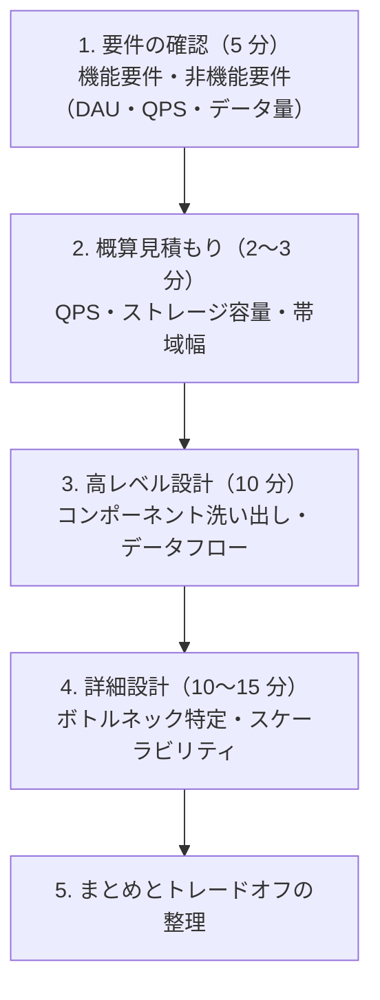
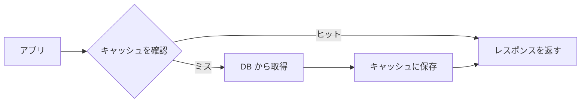
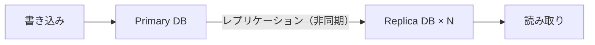
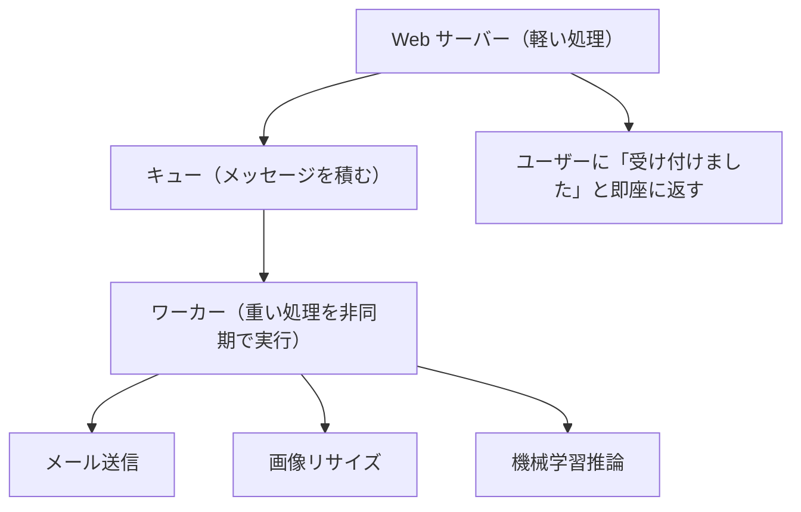
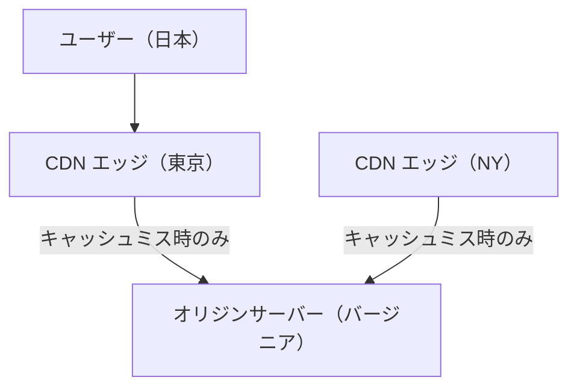
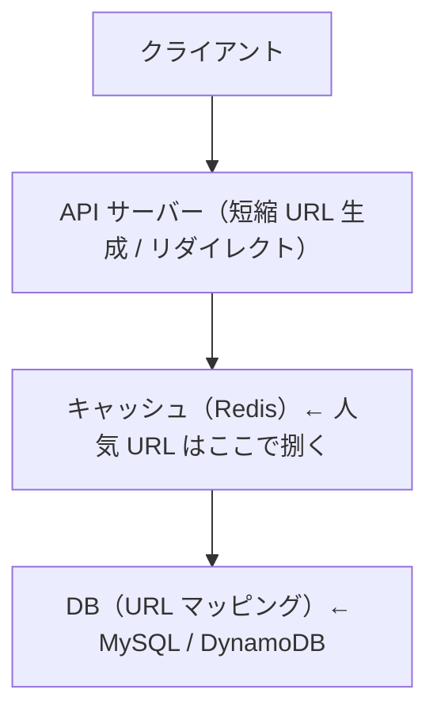

# システム設計

> 技術面接の中〜後半で問われる「大規模なシステムをどう設計するか」の思考フレームワークです。これまで学んだネットワーク・DB・クラウドの知識を統合して使います。

---

## はじめて読む人へ

システム設計は、大きなサービスをどう分解し、どうつなぎ、どうスケールさせるかを考える作業です。個別のコードよりも、データの流れ、負荷、障害、保存方法を広く見ます。


### 読む前に押さえること

- 要件を確認しないまま設計を始めると、必要なものがずれます。
- キャッシュ、キュー、レプリケーションは、負荷や可用性の問題を解く道具です。
- 設計では、メリットだけでなくトレードオフも説明します。

### 読み終えたら説明できること

- 要件定義から高レベル設計までの流れを説明できる。
- キャッシュ、シャーディング、レート制限の目的を理解できる。
- URL短縮サービスの基本設計を説明できる。

---

## システム設計面接とは

「Twitter のタイムラインを設計してください」「URL 短縮サービスを作るとしたら？」のように、制約の中でスケーラブルなシステムを設計する問題です。

**正解は 1 つではありません。** 面接官が見ているのは：
- 要件を明確にする力（何を作るのか）
- トレードオフを理解しているか（速さ vs 正確さ など）
- ボトルネックを特定できるか（どこが遅くなるか）
- 改善策を複数提示できるか

---

## 設計の進め方（フレームワーク）

システム設計では、最初に技術名を並べるのではなく、要件を確認します。誰が使うのか、何を保存するのか、どれくらいのアクセスがあるのか、どの程度止まってはいけないのかで設計が変わります。

要件が決まると、データモデル、API、保存先、キャッシュ、非同期処理、監視の必要性を考えられます。設計とは、制約の中で何を優先し、何を妥協するかを説明する作業でもあります。



このフレームワークは、設計を「思いついた技術を並べる作業」にしないための順番です。たとえば、いきなりRedisやKafkaを置くのではなく、まず読み取りが多いのか、書き込みが多いのか、データを失ってよいのか、どれくらい遅延を許せるのかを確認します。要件が変われば、最適な構成も変わります。

---

## 概算の目安

設計を始める前に規模感を把握します。

| 指標 | 計算方法 |
|------|---------|
| QPS（Query Per Second） | 1 日のリクエスト数 ÷ 86,400 秒 |
| 読み書き比率 | SNS は読み:書き = 100:1 程度が多い |
| ストレージ | 1 件のサイズ × 件数 × 期間 |

**よく使う数字：**
- 1 日 = 86,400 秒（≒ 10⁵）
- 1 か月 = 2.5 × 10⁶ 秒
- 1 文字 = 1〜4 バイト（UTF-8）
- 写真 1 枚 = 約 1 MB
- 動画 1 分（720p）= 約 50 MB

---

## キャッシュ戦略

DB へのアクセスを減らし、レスポンスを高速化する仕組みです。代表的な実装は **Redis**（インメモリ KV ストア）です。

### キャッシュパターン

**Cache-Aside（最も一般的）：**



```python
def get_user(user_id: int) -> dict:
    cached = redis.get(f"user:{user_id}")
    if cached:
        return json.loads(cached)
    user = db.query("SELECT * FROM users WHERE id = %s", user_id)
    redis.setex(f"user:{user_id}", 3600, json.dumps(user))  # 1 時間 TTL
    return user
```

このコードでは、まずRedisに `user:{user_id}` というキーでデータがあるか確認しています。あればDBを読まずに返します。なければDBから取得し、`setex` で1時間の有効期限つきでキャッシュに保存します。

Cache-Aside のポイントは、アプリケーション側が「キャッシュを見る」「なければDBを見る」「キャッシュに戻す」という流れを制御することです。実装が分かりやすい反面、DB更新時にキャッシュを消す、または更新する設計を忘れると古いデータを返す危険があります。

**Write-Through：** 書き込みと同時にキャッシュも更新します。DB とキャッシュの整合性が保たれますが、書き込みが遅くなります。

### キャッシュの問題

| 問題 | 意味 | 対策 |
|------|------|------|
| キャッシュミス嵐（Thundering Herd） | キャッシュが切れた瞬間に大量リクエストが DB へ集中します | ロック or 確率的期限切れ |
| キャッシュ汚染 | 古い/不正なデータがキャッシュに残ります | TTL の適切な設定・明示的な無効化 |
| キャッシュ貫通 | 存在しないキーへのリクエストが毎回 DB へ行きます | ネガティブキャッシュ（null もキャッシュ）|

---

## データベース設計の応用

### 読み取りスケールアウト（レプリケーション）



読み取りが多いサービス（SNS・EC サイト）では、Replica を増やすことで読み取り性能を線形にスケールできます。

この構成では、書き込みはPrimaryに集め、読み取りはReplicaへ分散します。読み取りが圧倒的に多いサービスでは効果的ですが、書き込み直後のデータがReplicaへ反映されるまで少し遅れることがあります。たとえばプロフィールを更新した直後に古い名前が表示される、といった現象です。

**課題：** 非同期レプリケーションは遅延があるため、「書いた直後に読むと古い値が返ることがある」（結果整合性）という問題があります。

### シャーディング（水平分割）

1 台の DB に収まらなくなったとき、データを複数の DB に分割します。

!!! info ""
    ```
    ユーザー ID のハッシュでシャードを決めます：
      user_id % 4 == 0 → シャード A
      user_id % 4 == 1 → シャード B
      ...
    ```

**課題：** JOIN が難しくなります。シャード間の再配置（リシャーディング）がコスト高です。

シャーディングは、1台のDBでは保存量や負荷に耐えられないときの水平分割です。`user_id % 4` のような規則で保存先を分けると、ユーザー単位の読み書きは分散できます。一方で、全ユーザーをまたぐ集計や、複数シャードをまたぐJOINは難しくなります。

---

## レート制限（Rate Limiting）

API への過剰なリクエストを制限する仕組みです。DoS 攻撃の緩和・課金プランの実装に使います。

### トークンバケット方式

バケットにトークン（許可証）が一定レートで補充されます。トークンがあればリクエストを通します。

!!! info ""
    ```
    バケット容量：100 トークン
    補充レート：10 トークン/秒
    
    リクエストが来るたびにトークンを 1 消費します
    トークンがなければ 429 Too Many Requests を返します
    ```

**Redis を使った実装：**

```python
def is_allowed(user_id: str, limit: int = 100) -> bool:
    key = f"rate:{user_id}"
    current = redis.incr(key)
    if current == 1:
        redis.expire(key, 60)  # 1 分間のウィンドウ
    return current <= limit
```

この実装は、厳密には固定ウィンドウ方式に近い簡易的なレート制限です。ユーザーごとに `rate:{user_id}` というキーを増やし、最初のリクエスト時に60秒の有効期限を設定します。60秒以内に `limit` を超えたら `False` を返します。

実運用では、境界時刻にリクエストが集中する問題や、複数サーバーから同時に更新される問題を考えます。そのため、Redis のアトミック操作や Lua スクリプト、専用のAPIゲートウェイ機能を使うこともあります。

---

## メッセージキュー

重い処理を非同期で行うための仕組みです。代表実装は **Celery + Redis/RabbitMQ** や **Apache Kafka** です。



**メリット：** レスポンスが速いです。ワーカーを増やすだけでスケールします。  
**デメリット：** 処理の完了タイミングがわかりません（ポーリングや WebSocket で通知する設計が必要です）。

キューを使うと、ユーザーにすぐ返す処理と、時間のかかる処理を分けられます。たとえば画像アップロードでは、APIサーバーは「受け付けました」と返し、画像リサイズやサムネイル生成はワーカーが後から処理します。ただし、非同期処理は失敗時の再試行や重複実行への対策も必要です。

---

## CDN（Content Delivery Network）

静的ファイル（画像・動画・JS/CSS）を世界中のエッジサーバーにキャッシュし、ユーザーに近い場所から配信する仕組みです。



CDN は、ユーザーに近い場所で静的ファイルを返すことで遅延を減らします。画像やJavaScriptのように多くの人へ同じ内容を配るファイルは、CDNの効果が大きいです。キャッシュミス時だけオリジンサーバーへ取りに行くため、オリジンサーバーの負荷も下がります。

**Cloudflare Pages** はこの仕組みを使って静的サイトを世界中に高速配信しています（[Cloudflare](Cloudflare) 参照）。

---

## 設計例：URL 短縮サービス

### 要件

- `https://short.ly/abc123` → `https://very-long-url.example.com/path?...` にリダイレクトします
- 1 日 1 億 URL 生成、10 億リクエスト（読み: 書き = 10:1）

### 概算

- QPS（書き込み）= 10⁸ / 86,400 ≒ **1,160 QPS**
- QPS（読み取り）= 11,600 QPS
- URL 1 件 = 500 バイト × 365 日 × 10 年 × 10⁸ = **182 TB**

### 高レベル設計



### 短縮キーの生成

- UUID（36 文字）は長すぎます → base62 エンコード（a-z, A-Z, 0-9）で 7 文字にします
- 7 文字の base62 = 62⁷ ≒ 35 兆通り（10 年分で十分です）

```python
import base62
import hashlib

def shorten(long_url: str) -> str:
    hash_value = int(hashlib.md5(long_url.encode()).hexdigest(), 16)
    return base62.encode(hash_value)[:7]
```

この例では、長いURLをMD5でハッシュ化し、その数値をbase62で短い文字列にしています。ただし、先頭7文字だけを使うと衝突する可能性があります。実サービスでは、衝突した場合に別のキーを生成する処理、またはDBの連番IDをbase62に変換する方式を組み合わせます。

### リダイレクト

!!! info ""
    ```
    GET /abc123 HTTP/1.1
    → 301 Moved Permanently（ブラウザがキャッシュ → サーバー負荷↓）
      or
    → 302 Found（毎回サーバーを通す → 統計を正確に取れます）
    ```

301は「恒久的に移動した」という意味なので、ブラウザや検索エンジンが結果をキャッシュしやすくなります。302は「一時的に移動した」という意味なので、毎回サーバーに確認しに来る可能性が高く、クリック数などの統計を取りたい場合に向いています。どちらを選ぶかは、負荷削減と計測精度のトレードオフです。

---

## 面接で押さえるキーワード

| キーワード | 意味 |
|-----------|------|
| スケールアップ（垂直スケール） | サーバーの CPU・RAM を増やします。限界があります |
| スケールアウト（水平スケール） | サーバーの台数を増やします。理論上無限です |
| CAP 定理 | 分散システムは「一貫性・可用性・分断耐性」の 3 つを同時に満たせません |
| 結果整合性 | 「すぐには一致しないが、最終的には一致する」整合性モデルです |
| 単一障害点（SPOF） | 1 つ落ちると全体が止まるコンポーネントです → 冗長化で排除します |
| べき等性 | 同じ操作を何度しても結果が変わらない性質です（API 設計で重要）|

---


## 確認問題

1. システム設計 は、何の問題を解決するための考え方・道具ですか。
2. このページで出てきた重要語を 3 つ選び、それぞれ 1 文で説明してください。
3. コード例やコマンド例がある場合、入力・処理・出力を分けて説明してください。
4. このページの内容が、前後の STEP や自分の作りたいものにどうつながるか説明してください。

---

## 関連ページ

- [データベース詳解](データベース詳解) — インデックス・トランザクション・シャーディング
- [ネットワーク基礎](ネットワーク基礎) — キャッシュ・CDN・ロードバランサ
- [クラウド・インフラ](クラウド-インフラ) — VM・コンテナ・Kubernetes
- [運用・障害対応](運用-障害対応) — モニタリング・可用性設計

---

[← ホームへ](Home)
