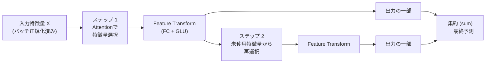
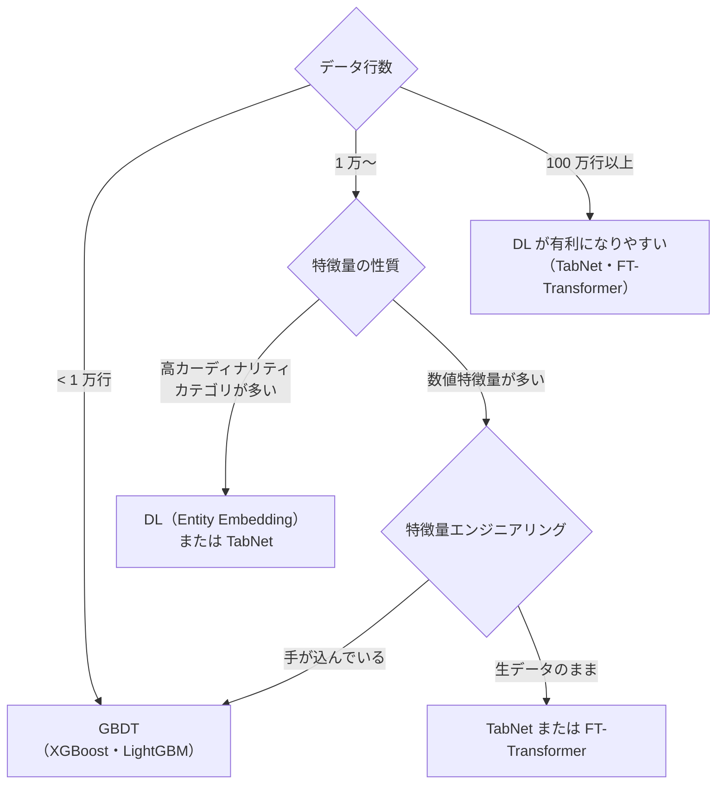

# テーブルデータの深層学習

CSV や SQL で扱うような行×列形式のデータ（タブラーデータ）に深層学習を適用する手法群です。**XGBoost が依然として多くのベンチマークで優れている**という現実を踏まえながら、カテゴリ埋め込み・TabNet・FT-Transformer など、深層学習が有効な場面と実装方法を整理します。

---

## はじめて読む人へ

「なぜ画像や言語と違い、テーブルデータは深層学習が苦手なのか」から始めます。テーブルデータの特性（異種混合特徴量・小〜中規模データ・特徴量の独立性）を理解すれば、どのアーキテクチャが効くかが見えてきます。

### 読む前に押さえること

- [XGBoost / LightGBM 詳解](XGBoost-LightGBM詳解.md) — GBDT の仕組み（比較基準として重要）
- [深層学習入門](深層学習入門.md) — MLP・バッチ正規化・ドロップアウト
- [Transformer・Attention](Transformer-Attention.md) — TabNet・FT-Transformer を理解する前提

### 読み終えたら説明できること

- テーブルデータで深層学習が苦手な理由を説明できる
- カテゴリ変数の埋め込み（Entity Embedding）を実装できる
- TabNet と FT-Transformer の仕組みを説明できる

---

## なぜテーブルデータで DL は苦手か

!!! info ""
    画像データ:
      ・特徴量（ピクセル）が均質で空間的な局所性がある
      ・CNN が局所パターンを階層的に学習できる
      ・大量データ（ImageNet: 100万枚以上）が存在する
    
    テーブルデータの難しさ:
      ・数値・カテゴリ・バイナリが混在（異種混合特徴量）
      ・特徴量間の独立性が高い（空間的・時間的な構造が少ない）
      ・データ量が少ない（数百〜数万行が多い）
      ・正則化なしでは簡単に過学習する
      ・MLP は特徴量の順序に不変だが、その学習は難しい

| 手法 | 少データ | 多データ | 特徴量エンジニアリング不要 | 解釈性 |
|------|---------|---------|--------------------------|--------|
| GBDT（XGBoost） | ◎ | ○ | △（効果あり）| ○ |
| MLP | △ | ○ | ✗ | △ |
| TabNet | ○ | ◎ | ○ | ◎（Attention）|
| FT-Transformer | ○ | ◎ | ○ | △ |

---

## カテゴリ変数の埋め込み（Entity Embedding）

One-hot エンコーディングの代わりに、カテゴリを低次元の密なベクトルに変換します。

```python
import torch
import torch.nn as nn

class TabularModel(nn.Module):
    def __init__(self, cat_dims: list[int], emb_dims: list[int], num_cont: int):
        super().__init__()
        # カテゴリ変数ごとに Embedding 層を作成
        # cat_dims: 各カテゴリの取りうる値の数
        # emb_dims: 各カテゴリの埋め込み次元（経験則: min(50, (n+1)//2)）
        self.embeddings = nn.ModuleList([
            nn.Embedding(n_cat, emb_dim)
            for n_cat, emb_dim in zip(cat_dims, emb_dims)
        ])
        emb_total = sum(emb_dims)

        # バッチ正規化は連続値に適用
        self.bn_cont = nn.BatchNorm1d(num_cont)

        # 結合後の MLP
        in_features = emb_total + num_cont
        self.mlp = nn.Sequential(
            nn.Linear(in_features, 256),
            nn.ReLU(),
            nn.BatchNorm1d(256),
            nn.Dropout(0.3),
            nn.Linear(256, 128),
            nn.ReLU(),
            nn.Linear(128, 1),
        )

    def forward(self, x_cat: torch.Tensor, x_cont: torch.Tensor):
        # カテゴリ埋め込み
        embedded = [emb(x_cat[:, i]) for i, emb in enumerate(self.embeddings)]
        x = torch.cat(embedded + [self.bn_cont(x_cont)], dim=1)
        return self.mlp(x)
```

埋め込みベクトルは学習によって**意味的な距離関係**を獲得します。たとえば「月曜〜金曜」が近く「土日」が近くなるような表現を自動で学習します。

---

## TabNet

Google が 2019 年に提案した、**アテンション機構を使った逐次特徴量選択**が特徴のアーキテクチャです。各ステップで「どの特徴量に注目するか」を学習し、解釈性を持ちます。



### アテンションの数学

ステップ $i$ での特徴量選択マスク $\mathbf{M}^{(i)}$ は：

$$\mathbf{M}^{(i)} = \text{sparsemax}\!\left(\mathbf{P}^{(i-1)} \cdot \mathbf{h}\left(\mathbf{a}^{(i-1)}\right)\right)$$

- $\mathbf{P}^{(i)}$：前ステップまでの「使用量」を記録するペナルティ行列
- $\text{sparsemax}$：softmax の代わりに**スパースな確率分布**を出力（多くの特徴量を 0 にする）
- $\mathbf{h}$：fully-connected + Batch Normalization

各ステップの出力を総合した予測：

$$\hat{y} = \sum_{i=1}^{N_\text{steps}} \text{ReLU}\!\left(\mathbf{d}^{(i)}\right) \cdot W_\text{final}$$

### pytorch-tabnet での実装

```python
from pytorch_tabnet.tab_model import TabNetClassifier
import numpy as np

model = TabNetClassifier(
    n_d=64,              # 各ステップの決定層の次元
    n_a=64,              # アテンション埋め込みの次元
    n_steps=5,           # 逐次ステップ数
    gamma=1.5,           # 特徴量再使用のペナルティ係数
    cat_idxs=[0, 1, 2],  # カテゴリ列のインデックス
    cat_dims=[10, 5, 8], # 各カテゴリの取りうる値の数
    cat_emb_dim=3,       # カテゴリ埋め込み次元
    optimizer_fn=torch.optim.Adam,
    optimizer_params={'lr': 2e-2},
    scheduler_params={"step_size": 10, "gamma": 0.9},
    scheduler_fn=torch.optim.lr_scheduler.StepLR,
    mask_type='sparsemax',
)

model.fit(
    X_train, y_train,
    eval_set=[(X_val, y_val)],
    eval_metric=['auc'],
    max_epochs=200,
    patience=20,
    batch_size=1024,
    virtual_batch_size=128,  # Ghost Batch Normalization
)

# 特徴量重要度（アテンションマスクの平均）
importance = model.feature_importances_
```

---

## FT-Transformer（Feature Tokenizer + Transformer）

2021 年に提案された、各特徴量を「トークン」として扱い、Transformer で処理するアーキテクチャです。

!!! info ""
    各特徴量 → 線形変換（Feature Tokenizer）→ トークンベクトル
                                                  ↓
                                 [CLS] [feat1] [feat2] ... [featN]
                                                  ↓
                                      Multi-Head Attention
                                      Feed Forward
                                      Layer Normalization
                                                  ↓
                                 [CLS] トークンを分類ヘッドへ

```python
# 簡略化した FT-Transformer の特徴量トークン化
class FeatureTokenizer(nn.Module):
    def __init__(self, n_features: int, d_token: int):
        super().__init__()
        # 各特徴量に独立した重みとバイアス
        self.weight = nn.Parameter(torch.randn(n_features, d_token))
        self.bias = nn.Parameter(torch.zeros(n_features, d_token))

    def forward(self, x: torch.Tensor) -> torch.Tensor:
        # x: (batch, n_features)
        # 出力: (batch, n_features, d_token)
        return x.unsqueeze(-1) * self.weight + self.bias
```

rtdl ライブラリで簡単に利用できます：

```python
import rtdl
import torch

model = rtdl.FTTransformer.make_default(
    n_num_features=10,     # 連続値特徴量の数
    cat_cardinalities=[5, 10, 3],  # カテゴリ変数の種類数リスト
    last_layer_query_idx=[-1],     # [CLS] トークンのみを出力に使う
    d_out=1,               # 出力次元（回帰なら 1）
)
```

---

## GBDT vs 深層学習の使い分け指針



| 条件 | 推奨手法 |
|------|---------|
| 少〜中規模データ（< 5 万行）| GBDT |
| 高カーディナリティなカテゴリ変数が多い | Entity Embedding + MLP |
| 特徴量の解釈性が必要 | TabNet |
| 大規模データ（> 100 万行）| FT-Transformer |
| 画像・テキストを含むマルチモーダル | DL（特徴量を統合しやすい）|

---

## 実践的なパイプライン

```python
import pandas as pd
import numpy as np
from sklearn.model_selection import train_test_split
from sklearn.preprocessing import LabelEncoder, StandardScaler

df = pd.read_csv('data.csv')

# カテゴリ列と数値列を分離
cat_cols = ['category', 'city', 'product_type']
num_cols = ['age', 'price', 'clicks']
target = 'is_purchased'

# カテゴリをラベルエンコード
encoders = {}
for col in cat_cols:
    le = LabelEncoder()
    df[col] = le.fit_transform(df[col].astype(str))
    encoders[col] = le

# 数値を標準化
scaler = StandardScaler()
df[num_cols] = scaler.fit_transform(df[num_cols])

X_cat = df[cat_cols].values
X_num = df[num_cols].values
y = df[target].values

X_cat_train, X_cat_val, X_num_train, X_num_val, y_train, y_val = train_test_split(
    X_cat, X_num, y, test_size=0.2, stratify=y, random_state=42
)

# カテゴリ次元の取得（Embedding に必要）
cat_dims = [df[col].nunique() for col in cat_cols]
emb_dims = [min(50, (n + 1) // 2) for n in cat_dims]

# モデルの作成・学習
model = TabularModel(cat_dims, emb_dims, num_cont=len(num_cols))
```

---

## 確認問題

1. テーブルデータで深層学習が画像・テキストほど有効でない理由を 3 つ挙げて説明してください。
2. Entity Embedding（カテゴリ埋め込み）が One-hot エンコーディングより優れている点と、適さない場面を説明してください。
3. TabNet の `sparsemax` がなぜ `softmax` より適しているかを、特徴量選択の観点から説明してください。

---

## 関連ページ

- [XGBoost / LightGBM 詳解](XGBoost-LightGBM詳解.md) — テーブルデータの最強ベースライン
- [Transformer・Attention](Transformer-Attention.md) — FT-Transformer の基礎
- [特徴量エンジニアリング](特徴量エンジニアリング.md) — DL でも前処理は重要
- [深層学習入門](深層学習入門.md) — MLP・BatchNorm・Dropout
- [アンサンブル学習](アンサンブル学習.md) — GBDT + DL のスタッキング

---

[← ホームへ](Home)
