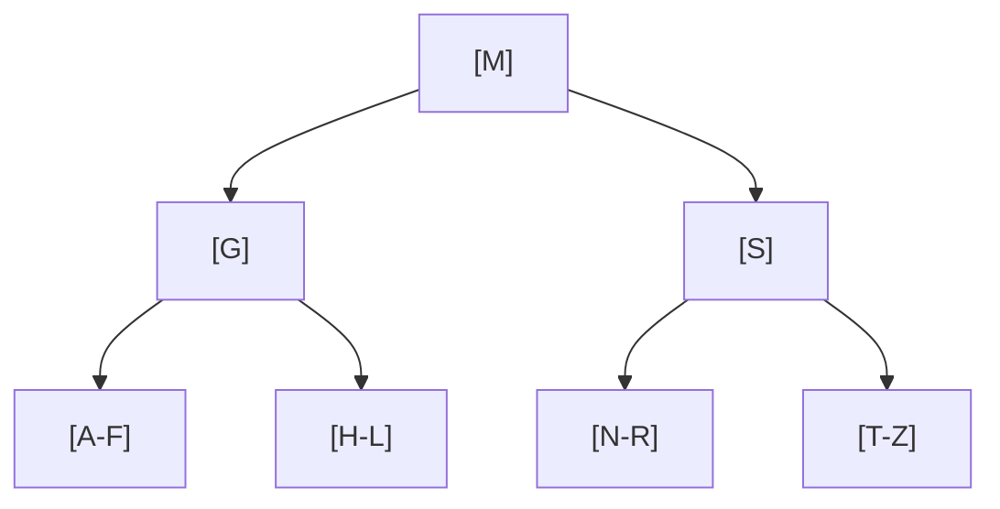
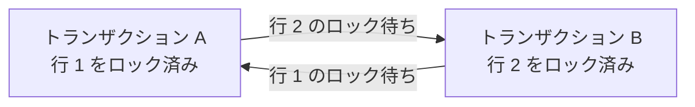
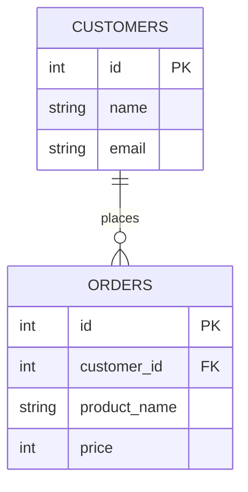

# データベース詳解

> [データベース基礎](データベース基礎) で SQL・テーブル設計の基礎を学んだあとに読んでください。ここではインデックス・トランザクション・ロック・正規化を掘り下げます。

---

## はじめて読む人へ

「1000 件のデータなら一瞬で返るクエリが、100 万件になると 30 秒かかる」——インデックスを張るだけでこれが 0.01 秒になることがあります。また「銀行振込でお金が引かれたのに相手に届かない」という事態を防ぐのがトランザクションです。このページはそういった、**規模が大きくなる・複数人が同時に使うようになる** と初めてぶつかる問題の解決策を扱います。

[データベース基礎](データベース基礎.md) で SQL の書き方を学んだら、このページで「速く・安全に動かす」設計を身につけてください。

### 読む前に押さえること

- [データベース基礎](データベース基礎.md) の SELECT・INSERT・JOIN の基本
- テーブルとは何か（行・列・主キーの概念）を知っていること

### 読み終えたら説明できること

- インデックスがなぜ検索を速くするかを「B-tree」の概念で説明できる
- ACID の 4 つの性質（原子性・一貫性・分離性・永続性）を説明できる
- N+1 問題とは何か、どう解決するかを説明できる

---

## インデックス

インデックスは、本の索引のように、目的の行を素早く探すための仕組みです。インデックスがない場合、データベースは条件に合う行を探すためにテーブル全体を読むことがあります。

ただし、インデックスを増やせば常に良いわけではありません。検索は速くなりますが、データの追加や更新時にはインデックスも更新する必要があるため、書き込みが遅くなることがあります。

インデックスは検索を高速化するデータ構造です。本の索引と同じ原理です。

### インデックスなし vs あり

**インデックスなし：** テーブル全行を先頭から順に走査します（フルスキャン）。100 万行あれば 100 万回比較します。計算量は $O(n)$ です。

**インデックスあり：** B-tree 構造で目的の行へ直接ジャンプします。計算量は $O(\log n)$ です。

```sql
-- インデックスを作成
CREATE INDEX idx_users_email ON users(email);

-- このクエリが高速になります
SELECT * FROM users WHERE email = 'yamada@example.com';
```

`CREATE INDEX idx_users_email ON users(email);` は、`users` テーブルの `email` 列に索引を作る命令です。インデックス名 `idx_users_email` は任意ですが、どのテーブルのどの列に対するものか分かる名前にしておくと管理しやすくなります。

インデックス作成後、`WHERE email = ...` のようにその列を条件にした検索では、DBが全行を読む代わりにインデックスをたどれる可能性があります。ただし、DBのオプティマイザが「インデックスを使うより全件読む方が速い」と判断することもあるため、必ず使われるとは限りません。

### B-tree インデックスの仕組み



ルートから目的の葉ノードまで、最大で木の高さ分（log n）の比較で到達できます。

**なぜハッシュテーブルではなく B-tree なのか？**  
ハッシュテーブルは `WHERE email = '...'` のような等値検索は $O(1)$ で非常に速いですが、`WHERE age > 20` のような**範囲検索**ができません。B-tree はすべての値がソート順で格納されているため、範囲検索を $O(\log n)$ + 連続読み取りで効率よく処理できます。DB のインデックスに広く採用されている理由がここにあります。

### インデックスのトレードオフ

| 操作 | 影響 |
|------|------|
| SELECT | 速くなります |
| INSERT | 遅くなります（インデックスも更新が必要） |
| UPDATE | 遅くなります（インデックス更新） |
| DELETE | 遅くなります（インデックス更新） |
| ストレージ | 余分に使います |

### インデックスが効かないパターン

```sql
-- 関数を使う（インデックスが使えません）
WHERE LOWER(email) = 'yamada@example.com'
-- → 解決策: 関数インデックスを作るか、アプリ側で LOWER 化して保存

-- 前方一致以外の LIKE
WHERE name LIKE '%太郎'      -- NG（前方一致でない）
WHERE name LIKE '山田%'      -- OK（前方一致）

-- カラムを演算に使う
WHERE age + 1 = 20           -- NG
WHERE age = 19               -- OK

-- OR 条件（複合インデックス）
WHERE a = 1 OR b = 2         -- 多くの場合効きません
```

インデックスが効かない典型例では、列そのものではなく加工後の値で比較しています。`LOWER(email)` のように関数をかけると、通常の `email` インデックスとは別の値を検索している扱いになります。インデックスは「どの列を、どの形で検索するか」とセットで考える必要があります。

### EXPLAIN でクエリ実行計画を確認する

```sql
EXPLAIN SELECT * FROM users WHERE email = 'yamada@example.com';
```

`EXPLAIN` は、DBがそのSQLをどう実行する予定かを表示します。インデックスが効いているつもりでも、実際にはフルスキャンになっていることがあります。パフォーマンス改善では、推測ではなく `EXPLAIN` で実行計画を確認するのが基本です。

出力の `type` カラムを確認します：
- `const` / `ref` → インデックスが使われています（速い）
- `ALL` → フルスキャン（遅い、要対策）

---

## トランザクションと ACID

トランザクションとは「一連の操作をひとまとめにして、全部成功か全部失敗かにする」仕組みです。

```sql
BEGIN;
  UPDATE accounts SET balance = balance - 1000 WHERE id = 1;  -- 送金元から引く
  UPDATE accounts SET balance = balance + 1000 WHERE id = 2;  -- 送金先へ加える
COMMIT;
-- 途中でエラーが起きたら ROLLBACK で元の状態に戻ります
```

この例では、口座1から1000円を引き、口座2に1000円を足しています。もし1つ目の更新だけ成功して2つ目が失敗すると、お金が消えたような状態になります。トランザクションで囲むことで、2つの更新を「両方成功」または「両方取り消し」にできます。

### ACID 特性

| 特性 | 英語 | 意味 |
|------|------|------|
| 原子性 | Atomicity | 全部成功か全部失敗か（中間状態がありません） |
| 一貫性 | Consistency | 整合性ルール（外部キー・NOT NULL など）を常に満たします |
| 隔離性 | Isolation | 同時実行しても互いに干渉しません |
| 永続性 | Durability | COMMIT したデータは電源断でも消えません |

### 分離レベル

隔離性をどこまで厳密にするかのレベル設定です。厳しいほど安全ですが遅くなります。

**3 つの異常：**

| 異常 | 意味 | 例 |
|------|------|-----|
| ダーティリード | まだ COMMIT されていない変更を別トランザクションが読む | A が値を更新中（未 COMMIT）に B が読む → A が ROLLBACK すると B は存在しない値を見ていました |
| ノンリピータブルリード | 同じ行を 2 回読んだら値が変わっていた | T1 が id=1 を読む → T2 が id=1 を更新・COMMIT → T1 がもう一度読むと値が変わっています |
| ファントムリード | 同じ条件で検索したら行の数が変わっていた | T1 が WHERE age > 20 で検索 → T2 が新しい行を INSERT・COMMIT → T1 が再検索すると行が増えています |

| レベル | ダーティリード | ノンリピータブルリード | ファントムリード |
|--------|------------|-------------------|--------------|
| READ UNCOMMITTED | 発生する | 発生する | 発生する |
| READ COMMITTED | 防ぐ | 発生する | 発生する |
| REPEATABLE READ | 防ぐ | 防ぐ | 発生する |
| SERIALIZABLE | 防ぐ | 防ぐ | 防ぐ |

**PostgreSQL のデフォルトは READ COMMITTED、MySQL（InnoDB）は REPEATABLE READ です。**  
InnoDB はリレーショナル DB エンジンの一種で、MySQL のデフォルト実装です。

**分離レベルの選び方：**

| 状況 | 推奨レベル |
|------|-----------|
| 通常の Web アプリ（最もよく使う） | READ COMMITTED |
| 同一トランザクション内で一貫した値が必要（集計レポートなど） | REPEATABLE READ |
| 厳密な整合性が必要な金融・在庫処理（ごく一部に限定） | SERIALIZABLE |

> SERIALIZABLE は最も安全ですが、ロック競合が増えてスループットが大幅に下がります。必要な箇所だけに絞って使ってください。

---

## ロック

複数のトランザクションが同じデータを同時に変更しないよう制御する仕組みです。

### 悲観ロック（SELECT FOR UPDATE）

変更するつもりのデータを取得時点でロックします。確実ですが、待ちが発生しやすいです。

```sql
BEGIN;
SELECT balance FROM accounts WHERE id = 1 FOR UPDATE;  -- ロック取得
-- この間、他のトランザクションは id=1 の行を変更できません
UPDATE accounts SET balance = balance - 1000 WHERE id = 1;
COMMIT;
```

`FOR UPDATE` は、読み取った行をこれから更新する意思表示です。他のトランザクションが同じ行を更新しようとすると待たされます。銀行残高や在庫数のように、同時更新で矛盾が起きると困るデータに使います。

### 楽観ロック

ロックは取らず、更新時にバージョン番号で「誰かに変更されていないか」確認します。

```sql
-- version カラムで管理する例
UPDATE products
SET stock = stock - 1, version = version + 1
WHERE id = 1 AND version = 5;  -- version が変わっていたら 0 行更新 → 競合を検知
```

楽観ロックでは、「たぶん競合しない」と考えて先にロックを取りません。その代わり、更新時に `version` が想定どおりか確認します。別のユーザーが先に更新して `version` が 6 になっていれば、このSQLは0行更新となり、アプリ側で競合を検知できます。

0 行更新の場合はアプリ側でリトライや競合エラーを返します。

**使い分け：**
- 悲観ロック：競合頻度が高い・確実に排他したい（在庫管理など）
- 楽観ロック：競合頻度が低い・読み取りが多い（ブログ記事の同時編集など）

### デッドロック

2 つのトランザクションが互いに相手のロックを待って永遠に止まる状態です。



DB が自動検知して片方を強制 ROLLBACK します。アプリはリトライで対処します。  
**防ぐコツ：** 複数テーブルを操作するとき、常に同じ順序でロックします。

デッドロックは完全にゼロにできないこともあります。そのため、アプリケーション側では「デッドロックで失敗したら短い待ち時間を置いてリトライする」設計を入れることがあります。ただし、頻発する場合はロック順序やトランザクションの長さを見直す必要があります。

---

## 正規化

データの冗長性を排除してデータの整合性を保つ設計手法です。

### 正規化されていないテーブルの問題

| order_id | customer_name | customer_email | product_name | price |
|----------|---------------|----------------|--------------|-------|
| 1 | 山田太郎 | yamada@... | りんご | 100 |
| 2 | 山田太郎 | yamada@... | みかん | 80 |

**問題点（更新異常）：** 山田さんのメールを変えるには複数行を更新する必要があります。1 行だけ変えると矛盾が起きます。

### 正規化後（第 3 正規形）



**customers テーブル**

| id | name     | email      |
|----|----------|------------|
| 1  | 山田太郎 | yamada@... |

**orders テーブル**

| id | customer_id | product_name | price |
|----|-------------|--------------|-------|
| 1  | 1           | りんご       | 100   |
| 2  | 1           | みかん       | 80    |

顧客情報は 1 か所だけに存在するため、更新は 1 行で完結します。

正規化後は、注文テーブルが顧客名やメールアドレスを直接持たず、`customer_id` で顧客テーブルを参照します。これにより、顧客情報の更新場所が1つになります。JOINが必要になるためクエリは少し複雑になりますが、データの矛盾を防ぎやすくなります。

### 非正規化（意図的な冗長化）

検索パフォーマンスのために、正規化を崩して冗長データを持たせることがあります。

例：SNS の「いいね数」を毎回集計するのではなく、`posts.like_count` カラムに非同期で集計値を保存します。正確性より速度を優先したトレードオフです。

**原則：まず正規化して設計し、パフォーマンス問題が実際に発生したら非正規化を検討してください。**

---


## 確認問題

1. データベース詳解 は、何の問題を解決するための考え方・道具ですか。
2. このページで出てきた重要語を 3 つ選び、それぞれ 1 文で説明してください。
3. コード例やコマンド例がある場合、入力・処理・出力を分けて説明してください。
4. このページの内容が、前後の STEP や自分の作りたいものにどうつながるか説明してください。

---

## 関連ページ

- [データベース基礎](データベース基礎) — SQL 基礎・テーブル設計
- [データベース × Web](データベース-Web) — SQLAlchemy・マイグレーション
- [SQL 実践問題](SQL実践問題) — Window 関数・CTE の応用
- [システム設計](システム設計) — スケーラブルな DB 設計パターン

---

[← ホームへ](Home)
