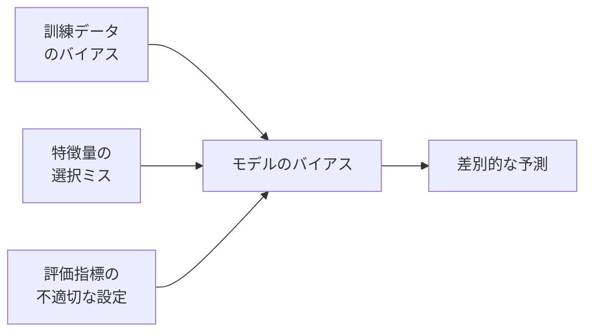

# データ倫理・AI倫理

データサイエンティストが身につけるべき、**技術の使い方に関する判断力**です。「できる」と「すべき」は別の話です。個人情報・アルゴリズムのバイアス・AI の説明責任——これらを理解していないと、意図せず人を傷つけるシステムを作ることになります。

---

## はじめて読む人へ

データを扱う仕事は「人の生活に直結する判断」を支援することが多くなっています。採用・融資・医療診断・犯罪予測——これらにアルゴリズムが使われている現実があります。データサイエンティストは技術スキルと同時に、**倫理的な判断力**が問われます。

### 読む前に押さえること

特に前提知識は不要です。1年生から読めます。

### 読み終えたら説明できること

- 個人情報保護法と GDPR の基本を説明できる
- アルゴリズムのバイアスが生じる原因を説明できる
- データ収集・分析・公開の各段階で気をつけるべき点を挙げられる

---

## なぜデータ倫理が必要か

### 実際に起きた事例

!!! info ""
    【採用 AI の性差別（Amazon, 2018年）】
    過去の採用データ（男性優位）で学習した AI が、
    履歴書に「女性」を含む表現に低スコアをつけた。
    → システム廃止

    【顔認識の人種バイアル（NIST, 2019年）】
    白人男性の認識精度は 0.1% 誤り率
    黒人女性の認識精度は 10〜100 倍高い誤り率
    → 誤認逮捕事例が複数発生

    【COVID-19 感染予測（UK, 2020年）】
    訓練データの欠如から、有色人種・高齢者の
    リスクを過小評価したモデルが医療資源配分に使用された
これらはすべて「技術的には動作していた」システムです。問題は技術ではなく、**どんなデータで・何を目的に・誰のために作ったか** にありました。

---

## 個人情報とプライバシー

### 個人情報保護法（日本）

「個人情報」とは、氏名・生年月日・住所などで**特定の個人を識別できる情報**です。

| 用語 | 意味 |
|------|------|
| 個人情報 | 特定個人を識別できる情報 |
| 要配慮個人情報 | 人種・信条・病歴・犯罪歴など（取得に本人同意が必要） |
| 匿名加工情報 | 特定の個人を識別できないよう加工した情報 |
| 仮名加工情報 | 他の情報と照合しない限り識別できないよう加工した情報 |

**データ分析で気をつけること：**

```python
# NG：氏名・住所・電話番号をそのまま分析に使う
df['name'].value_counts()   # 個人が特定可能

# OK：分析目的に必要な列だけ使い、識別子は除外する
df_analysis = df.drop(columns=['name', 'address', 'phone'])

# OK：必要なら ID で管理（連結不可能な形で）
import hashlib
df['user_id'] = df['email'].apply(
    lambda x: hashlib.sha256(x.encode()).hexdigest()[:8]
)
```

### GDPR（EU 一般データ保護規則）

日本の個人情報保護法より厳格な EU の規則。EU の人のデータを扱う場合（卒業研究で EU のデータを使う場合など）は適用されます。

- **明示的な同意**が必要
- **忘れられる権利**（削除請求権）
- データは収集目的に**必要最小限**に限る
- 違反時は最大 **年間売上の 4%** の制裁金

### 同意（Informed Consent）

研究・分析でデータを収集する際は、**何のために・どのように使うかを明示した上での同意**が必要です。

!!! info ""
    **不十分な同意の例**

    「このサービスを使用することで利用規約に同意します」
    （利用規約の中に「データを研究に使う」と書いてある）

    **十分な同意の例**

    「このアンケートへの回答は、○○研究に使用します。
    参加は任意で、いつでも撤回できます。
    個人情報は匿名化して管理します。」
---

## アルゴリズムのバイアスと公平性

### バイアスの発生源



**1. 訓練データのバイアス**

過去のデータが不公平な社会を反映していれば、モデルもそれを学習します。

```python
# 例：採用データに性別バイアスがある場合
# 過去に男性が多く採用されていた → モデルが男性を好む傾向を学習
df['hired'].groupby(df['gender']).mean()
# male: 0.65
# female: 0.32  ← 歴史的不公平が数値に現れている
```

**2. プロキシ変数**

直接使わなくても、別の変数が差別的な属性の代理になることがあります。

!!! info ""
    郵便番号 → 実質的に人種・所得水準の代理変数になることがある
    スマホの機種 → 経済状況の代理変数
    残業時間 → 育児負担のある人を間接的に不利にする
### 公平性の指標

「公平」には複数の定義があり、すべてを同時に満たすことは数学的に不可能（公平性のトリレンマ）なため、**何を優先するかを明示すること**が重要です。

| 指標 | 意味 | 例 |
|------|------|-----|
| 人口統計的均等（Demographic Parity） | 全グループで同じ陽性予測率 | 採用率が男女で同じ |
| 等機会（Equal Opportunity） | 真陽性率が全グループで同じ | 本当に優秀な人を見逃す率が同じ |
| 個人的公平性 | 似た人には似た予測 | 同じ条件の人には同じ評価 |

```python
from sklearn.metrics import confusion_matrix

def fairness_report(y_true, y_pred, sensitive_attr):
    """グループ別の公平性指標を計算"""
    for group in sensitive_attr.unique():
        mask = sensitive_attr == group
        tn, fp, fn, tp = confusion_matrix(
            y_true[mask], y_pred[mask]
        ).ravel()
        tpr = tp / (tp + fn)   # 真陽性率（再現率）
        fpr = fp / (fp + tn)   # 偽陽性率
        print(f"{group}: TPR={tpr:.3f}, FPR={fpr:.3f}, "
              f"陽性率={(tp+fp)/(tp+fp+tn+fn):.3f}")
```

---

## AI の説明可能性（Explainable AI）

高精度なモデルは「なぜその予測をしたか」がわからないことがあります（ブラックボックス問題）。説明ができないことが問題になる場面：

- 融資の却下理由を説明する義務（金融）
- 医療診断の根拠（医療）
- 採用・不採用の理由（労働）

### SHAP による予測根拠の可視化

```python
import shap
from sklearn.ensemble import RandomForestClassifier
from sklearn.datasets import load_breast_cancer

data = load_breast_cancer()
model = RandomForestClassifier(n_estimators=100, random_state=42)
model.fit(data.data, data.target)

# SHAP で各特徴量の寄与を計算
explainer = shap.TreeExplainer(model)
shap_values = explainer.shap_values(data.data[:100])

# 予測への各特徴量の寄与を可視化
shap.summary_plot(shap_values[1], data.data[:100],
                  feature_names=data.feature_names)
```

---

## データ収集・分析・公開の各段階での注意点

### 収集段階

!!! info ""
    □ 収集の目的を明示しているか
    □ 本人の同意を得ているか
    □ 必要最小限のデータだけ収集しているか
    □ 要配慮情報（病歴・人種など）を含む場合、特別な同意があるか
### 分析段階

!!! info ""
    □ 訓練データにバイアスがないか確認したか
    □ グループ別の精度差を評価したか
    □ モデルの予測根拠を説明できるか
    □ 外れ値・少数派への影響を確認したか
### 公開・運用段階

!!! info ""
    □ モデルの限界・不確実性を明示しているか
    □ 誤った予測をした場合の救済手段があるか
    □ 定期的に性能とバイアスを再評価する仕組みがあるか
    □ ログを記録して監査できるようにしているか
---

## DS 学生として意識すること

### 卒業研究・授業での注意

1. **他人のデータを分析する前に許可を取る**（友人の SNS 投稿・公開データでも目的外利用に注意）
2. **スクレイピングは利用規約を確認する**（多くのサービスは禁止している）
3. **公開リポジトリに個人情報を含めない**（GitHub にアップする前に確認）

```python
# NG: 本物のメールアドレスやIDを含むデータをGitHubに公開
# OK: サンプルデータは匿名化・フィクションのデータを使う

# .gitignore に秘密情報を含むファイルを追加する
# data/real_users.csv
# .env
```

### AI ツールを使うときの注意

ChatGPT や GitHub Copilot などに**個人情報・機密情報を入力しない**。入力したデータが学習に使われる可能性があります。

---

## 確認問題

1. アルゴリズムのバイアスが「歴史的なデータ」から生じる仕組みを、具体的な例で説明してください。
2. 「プロキシ変数」とは何ですか？郵便番号を使うと何が問題になりますか？
3. 卒業研究でアンケートデータを分析する際、倫理的に配慮すべき点を 3 つ挙げてください。

---

## 関連ページ

- [セキュリティ基礎](セキュリティ.md) — 情報セキュリティの技術的側面
- [機械学習理論](機械学習理論.md) — 損失関数・評価指標の設計
- [モデル評価・チューニング](モデル評価-チューニング.md) — 評価指標の選び方
- [LLM活用入門](LLM活用入門.md) — AI ツール利用時の注意点
