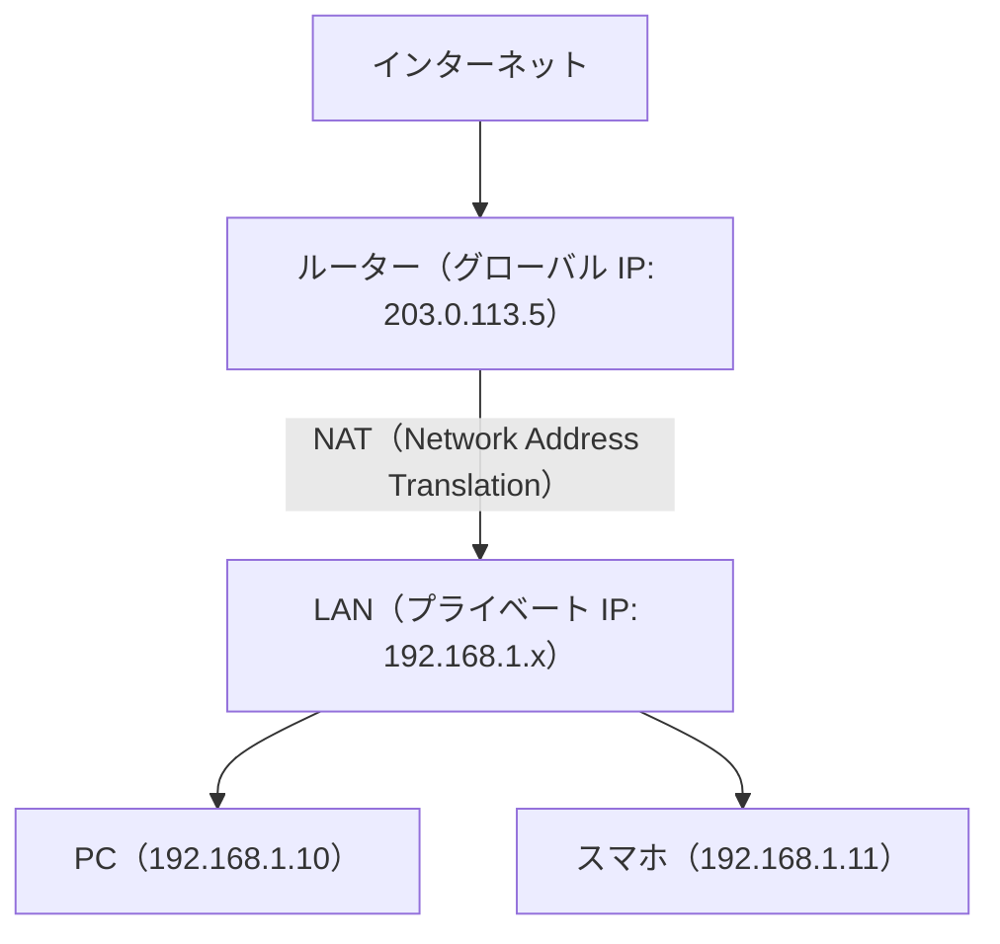
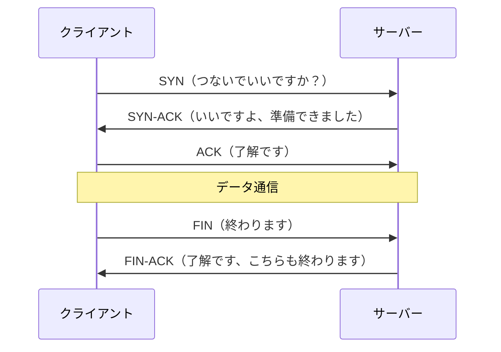
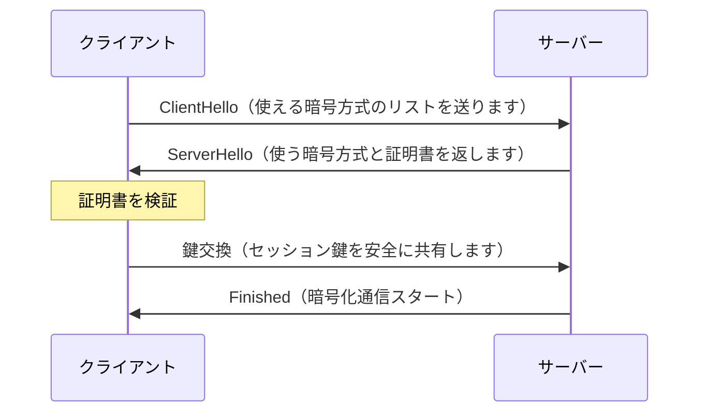
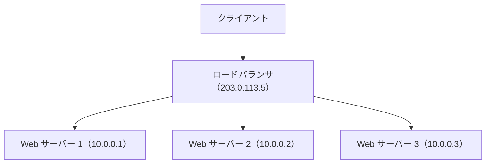

# ネットワーク詳解

> [ネットワーク基礎](ネットワーク基礎) で IP・DNS・HTTP の概要を学んだあとに読んでください。ここでは TCP・TLS・ロードバランサの内部を掘り下げます。

---

## はじめて読む人へ

ネットワーク詳解では、基礎ページで扱った HTTP や DNS の裏側をさらに深く見ます。IP、TCP、TLS、ロードバランサなどを知ると、通信の遅さや失敗を分解して考えられます。


### 読む前に押さえること

- IP は、宛先までパケットを届けるための仕組みです。
- TCP は、順序や再送を管理して信頼性を高めます。
- TLS は、通信の盗聴や改ざんを防ぎます。

### 読み終えたら説明できること

- IP、TCP、TLS の役割を区別できる。
- HTTP/2 や CDN がなぜ速さに関係するか理解できる。
- ロードバランサの目的を説明できる。

---

## IP アドレスの詳細

### IPv4 と IPv6

| 種類 | 例 | ビット数 | アドレス数 |
|------|-----|---------|-----------|
| IPv4 | `203.0.113.5` | 32 | 約 43 億 |
| IPv6 | `2001:db8::1` | 128 | 事実上無限 |

IPv4 は枯渇しているため、ISP・クラウドでは IPv6 への移行が進んでいます。

### サブネットとプライベート IP



LAN 内のデバイスはプライベート IP を使い、外向き通信はルーターがグローバル IP に変換（NAT）して送り出します。これにより 1 つのグローバル IP を複数デバイスで共有できます。

NAT があるため、自宅のPCやスマホは同じグローバルIPを共有できます。外部のWebサイトから見ると、複数デバイスからの通信がルーターの1つのIPから来ているように見えます。一方で、外部から家庭内のPCへ直接接続するには、ポート開放などの追加設定が必要になります。

---

## TCP

TCP は、データを確実に届けるための通信プロトコルです。送ったデータが届いたかを確認し、届かなかった場合は再送します。また、データの順番が入れ替わっても正しい順序に戻します。

この信頼性のために、TCP では接続開始時にハンドシェイクが必要です。HTTP や HTTPS の通信が安定して見えるのは、下の層で TCP が順序制御や再送制御を行っているからです。

信頼性のある通信を保証するプロトコルです。「データが届くこと」「順序が正しいこと」を保証します。

### 3-way ハンドシェイク

通信開始前に必ず実行する接続確立手順です。



**なぜ 3 回（3-way）必要なのか？**

2 回（クライアント → SYN → サーバー → SYN-ACK まで）で止めると、「クライアントがサーバーに到達できる」ことしか確認できません。サーバーからクライアントへの通信が届くかどうかが未確認のままになってしまいます。3 回目の ACK を加えることで、**双方向の疎通**を確認できます。

| パケット | 確認できること |
|---------|--------------|
| SYN | クライアントの送信能力・サーバーの受信能力 |
| SYN-ACK | サーバーの送信能力・クライアントの受信能力 |
| ACK | クライアントが SYN-ACK を受け取れたことをサーバーが把握 |
3-wayハンドシェイクは、通信の前に「お互いに送受信できる」ことを確認する手順です。この確認があるため、TCPは信頼性を持てますが、接続開始に往復時間がかかります。大量の短い通信では、この接続確立コストも性能に影響します。

### TCP vs UDP

| 項目 | TCP | UDP |
|------|-----|-----|
| 信頼性 | 高い（再送・順序保証） | 低い（投げっぱなし） |
| 速度 | 遅め（確認のオーバーヘッド） | 速い |
| 用途 | HTTP・DB 接続・ファイル転送 | DNS・動画ストリーミング・ゲーム |

### TCP の輻輳制御

ネットワークが混雑したとき、送信速度を自動で落とす仕組みです。HTTP/2 や gRPC のパフォーマンスに直接影響します。

---

## TLS（Transport Layer Security）

通信を暗号化・認証するプロトコルです。`https://` の「s」は TLS で保護されていることを示します。

### TLS が解決する 3 つの問題

| 問題 | TLS の解決策 |
|------|------------|
| 盗聴 | 暗号化（途中で見ても内容がわかりません） |
| 改ざん | MAC（メッセージ認証コード）で検知します |
| なりすまし | サーバー証明書で相手の正体を確認します |

### TLS ハンドシェイク（簡略版）



**証明書の仕組み：**  
サーバーは「自分は `example.com` です」という証明書を提示します。証明書は認証局（CA）が署名しており、ブラウザはその署名を検証して正規サーバーか確認します。

TLSでは、暗号化だけでなく「相手が本当にそのドメインのサーバーか」を確認します。暗号化されていても、偽サーバーと暗号化通信していては意味がありません。証明書は、なりすましを防ぐための身分証明書のような役割を持ちます。

**TLS 1.2 vs 1.3：**  
TLS 1.3 ではハンドシェイクが 1 往復減り（1-RTT）、接続確立が速くなりました。現在は TLS 1.3 を使うのが標準です。

> **用語メモ**  
> - **1-RTT / 0-RTT**：RTT（Round-Trip Time）は「送信→受信→返信が届くまでの時間」です。TLS 1.3 はハンドシェイクを 1 往復（1-RTT）に短縮しています。さらに過去に接続したことがあるサーバーへは 0-RTT（再接続時にハンドシェイクをスキップ）も可能です。

---

## HTTP

### HTTP/1.1 vs HTTP/2 vs HTTP/3

| 項目 | HTTP/1.1 | HTTP/2 | HTTP/3 |
|------|----------|--------|--------|
| 多重化 | 1 接続 1 リクエスト | 1 接続で複数並列 | 同左（QUIC 使用） |
| ヘッダー圧縮 | なし | HPACK | QPACK |
| 下位プロトコル | TCP | TCP | UDP（QUIC） |
| 主な改善点 | - | 速度改善 | モバイル・パケットロス耐性 |

> **用語メモ**  
> - **HPACK / QPACK**：HTTP ヘッダーを圧縮するアルゴリズムです。同じヘッダーを繰り返し送らないよう辞書圧縮します。HTTP/2 は HPACK、HTTP/3 は QUIC 向けに改良した QPACK を使います。  
> - **QUIC**：Google が開発した UDP ベースのトランスポートプロトコルです。TCP の代わりに使うことで接続確立を高速化（0-RTT／1-RTT）します。

### HTTP リクエストの構造

```
GET /api/articles/1 HTTP/2
Host: example.com
Authorization: Bearer eyJhbG...
Accept: application/json
```

**メソッドの意味：**

HTTPリクエストは、最初の行にメソッド、パス、HTTPバージョンを書き、その後にヘッダーを並べます。`Authorization` ヘッダーにはログイン後のトークンなどが入り、`Accept` はクライアントが受け取りたい形式を示します。

| メソッド | 用途 | べき等性 |
|---------|------|---------|
| GET | 取得 | あり |
| POST | 作成 | なし |
| PUT | 完全置換 | あり |
| PATCH | 部分更新 | 状況による |
| DELETE | 削除 | あり |

べき等性（Idempotency）：同じリクエストを何度送っても結果が変わらない性質です。GET は何度呼んでも同じ結果ですが、POST は毎回リソースが作成されます。

---

## ロードバランサ

複数のサーバーへリクエストを分散させる装置・ソフトウェアです。



ロードバランサは、外から見ると1つの入口ですが、裏側では複数のWebサーバーへリクエストを振り分けています。これにより、アクセスが増えたときにサーバー台数を増やして対応できます。

### 役割

| 役割 | 説明 |
|------|------|
| スケールアウト | サーバーを増やすだけで処理能力を拡張できます |
| 冗長化 | 1 台落ちても他が引き継ぎます |
| ヘルスチェック | 応答しないサーバーを自動で除外します |
| SSL 終端 | クライアント–LB 間だけ TLS にして、LB–サーバー間を平文にすることもできます |

### 分散アルゴリズム

| 方式 | 説明 | 向いているケース |
|------|------|---------------|
| ラウンドロビン | 順番に割り当てます | 処理時間が均一な場合 |
| 最小接続数 | 接続数が最も少ないサーバーへ振ります | 処理時間がばらつく場合 |
| IP ハッシュ | 同じ IP は同じサーバーへ振ります | セッションを維持したい場合 |

### L4 vs L7 ロードバランサ

| 種類 | 判断材料 | 特徴 |
|------|---------|------|
| L4（トランスポート層） | IP・ポート番号 | 速いですが内容は見ません |
| L7（アプリケーション層） | URL・Cookie・ヘッダー | パスごとに振り分けできます |

AWS では ALB（Application Load Balancer）が L7、NLB（Network Load Balancer）が L4 にあたります。

L4ロードバランサは通信の中身を深く見ないため高速です。L7ロードバランサはHTTPのURLやヘッダーを見て振り分けられるため、`/api` はAPIサーバー、`/images` は画像サーバーのような柔軟な設計ができます。速度と柔軟性のどちらを重視するかで選びます。

---


## 確認問題

1. ネットワーク詳解 は、何の問題を解決するための考え方・道具ですか。
2. このページで出てきた重要語を 3 つ選び、それぞれ 1 文で説明してください。
3. コード例やコマンド例がある場合、入力・処理・出力を分けて説明してください。
4. このページの内容が、前後の STEP や自分の作りたいものにどうつながるか説明してください。

---

## 関連ページ

- [ネットワーク基礎](ネットワーク基礎) — HTTP・DNS・CDN の基礎
- [セキュリティ詳解](セキュリティ詳解) — TLS・暗号化の実装
- [OS 詳解](OS詳解) — TCP/IP スタックの OS 側実装
- [クラウド・インフラ](クラウド-インフラ) — ロードバランサ・VPC の設計

---

[← ホームへ](Home)
