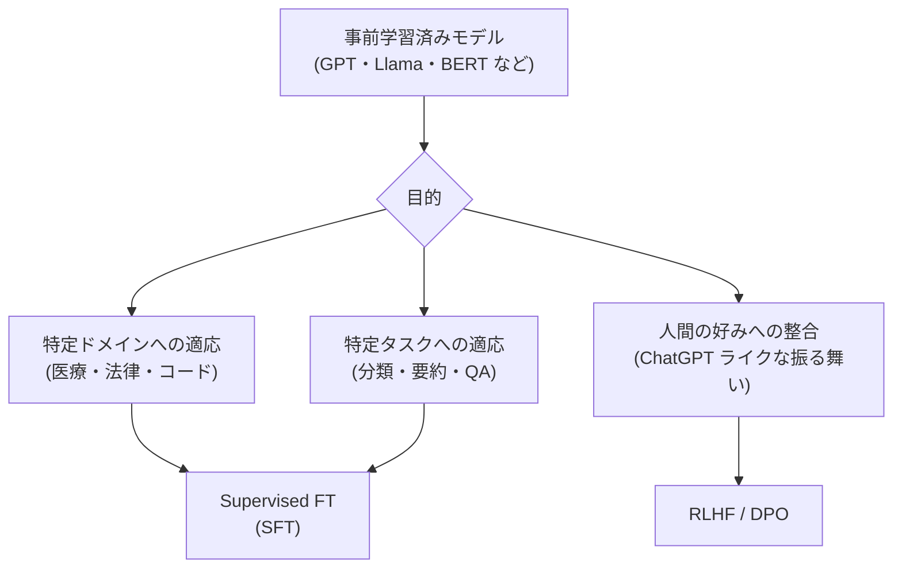
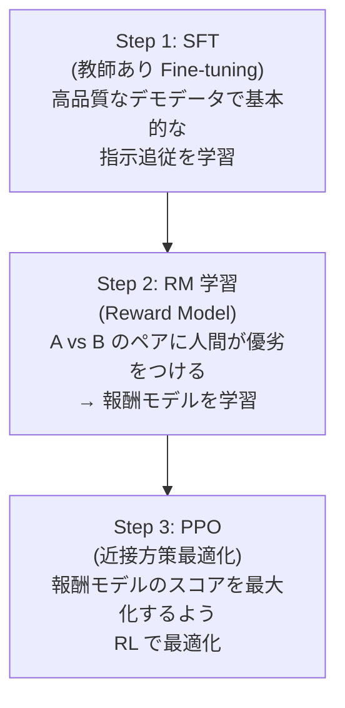
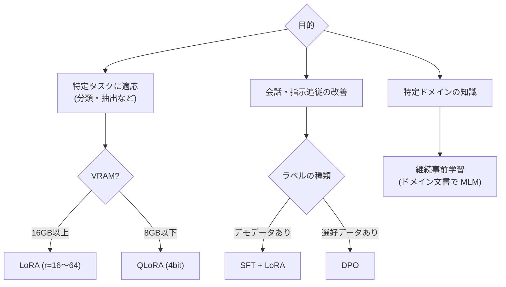

# ファインチューニング詳解

事前学習済みの大規模モデルを特定のタスクや領域に適応させる技術です。フルファインチューニングから LoRA・QLoRA などの Parameter-Efficient Fine-Tuning（PEFT）、さらに人間のフィードバックを使う RLHF・DPO まで、現代の LLM 開発の核心を扱います。

---

## はじめて読む人へ

「ChatGPT を自社のカスタマーサポート専用にしたい」「Llama-3 を日本語の医療文書に特化させたい」——これらはすべてファインチューニングで実現できます。フルファインチューニングはコストが高すぎますが、LoRA なら 1/100 のパラメータで同等の効果が得られます。

### 読む前に押さえること

- [Transformer・Attention](Transformer-Attention) — モデルの基本構造
- [自己教師あり学習](自己教師あり学習) — 事前学習の概念
- [深層学習入門](深層学習入門) — バックプロパゲーション・学習の基礎

### 読み終えたら説明できること

- LoRA が「低ランク分解」でパラメータを削減する仕組みを説明できる
- RLHF と DPO の違いを説明できる
- タスクや制約に応じてファインチューニング手法を選べる

---

## ファインチューニングの全体像



---

## フルファインチューニングの限界

7B パラメータのモデル（Llama-3-7B）をフルファインチューニングする場合：

| 項目 | 必要量 |
|------|--------|
| モデルパラメータ | 7B × 2 bytes（fp16）= 14 GB |
| 勾配 | 14 GB |
| オプティマイザ（Adam）| 56 GB（1st + 2nd モーメント） |
| **合計** | **~84 GB** |

A100 GPU（80 GB）でも 1 枚に収まらないほどのメモリが必要です。

---

## PEFT（Parameter-Efficient Fine-Tuning）

モデルの大部分を **凍結（frozen）** し、わずかなパラメータのみを学習します。

### Adapter

各 Transformer 層にボトルネック層（小さな MLP）を挿入します。元のパラメータは変更せず、追加した Adapter のみ学習します。

元の Transformer 層にボトルネック構造を挿入します。入力は元の FFN を通った後、Down-project（$d \to r$ 次元）で次元削減し、Up-project（$r \to d$ 次元）で元の次元に戻します。その出力を元の FFN 出力に残差接続として加算します（$r \ll d$ のためパラメータは少ない）。
### LoRA（Low-Rank Adaptation）

Adapter がレイテンシを増やす問題を解決した、現在最も広く使われる PEFT 手法です。

**アイデア：** 重み行列の更新量 $\Delta W$ は「低ランク」で近似できるという仮説。

$$
W' = W + \Delta W = W + BA
$$

- $W \in \mathbb{R}^{d \times k}$：元の重み（凍結）
- $B \in \mathbb{R}^{d \times r}$：LoRA の B 行列（$r \ll d$）
- $A \in \mathbb{R}^{r \times k}$：LoRA の A 行列

$A$ はランダム初期化、$B$ はゼロ初期化（学習開始時は $\Delta W = 0$）。

**パラメータ削減率：**

元の重み：$d \times k$ パラメータ
LoRA：$d \times r + r \times k = r(d+k)$ パラメータ

$r \ll d$ なら $r(d+k) \ll dk$ ので大幅削減。GPT-3（175B）に $r=4$ の LoRA を適用すると、学習パラメータが 0.01% 程度になります。

**推論時：** $W' = W + BA$ に合算できるため、**推論コストは増加しない**（Adapter と異なる大きなメリット）。

### QLoRA（Quantized LoRA）

LoRA をさらに進め、ベースモデルを 4bit に量子化して VRAM を削減します。

| 手法 | 必要 VRAM（7B モデル） | 精度損失 |
|------|-------------|--------|
| フルファインチューニング | ~80 GB | なし |
| LoRA（fp16） | ~16 GB | 微小 |
| **QLoRA（4bit）** | **~6 GB** | 微小 |

QLoRA により、コンシューマー GPU（RTX 3090・RTX 4090）でも 7B モデルのファインチューニングが可能になりました。

### LoRA 適用対象の選択

!!! warning ""
    Transformer の重み行列：
    ・Query (Wq): ✓ 注意機構に直接影響
    ・Key (Wk):   ✓
    ・Value (Wv): ✓
    ・Output (Wo):✓
    ・FFN 第1層:  △ 必要に応じて
    ・FFN 第2層:  △ 必要に応じて

    一般的に Wq, Wv のみが最もコスト効率が良い
---

## Instruction Tuning

LLM を「指示に従う」ようにする教師あり学習です。

**データ形式（Alpaca フォーマット）：**

```json
{
  "instruction": "以下の文章を要約してください。",
  "input": "人工知能は...(長い文章)...",
  "output": "人工知能は近年急速に発展し..."
}
```

OpenAI の InstructGPT・Meta の Llama-2-chat はこの手法が出発点です。

---

## RLHF（Reinforcement Learning from Human Feedback）

人間の好みに基づいてモデルの出力を改善します。ChatGPT の「フレンドリーで有用な応答」はここから来ています。

### 3 ステップ



**問題点：**
- 報酬モデルの学習に大量の人間ラベルが必要
- PPO の実装が複雑・不安定
- 報酬ハッキング（モデルが報酬モデルの弱点を突く）

---

## DPO（Direct Preference Optimization）

RLHF の問題を解決した、より シンプルな嗜好学習手法です（2023 年）。

### アイデア

「報酬モデルを陽に学習しなくても、選好データから直接 LLM を最適化できる」という数学的洞察に基づきます。

**損失関数：**

$$
\mathcal{L}_{\text{DPO}} = -\mathbb{E}_{(x, y_w, y_l)}\!\left[\log \sigma\!\left(\beta \log \frac{\pi_\theta(y_w \mid x)}{\pi_{\text{ref}}(y_w \mid x)} - \beta \log \frac{\pi_\theta(y_l \mid x)}{\pi_{\text{ref}}(y_l \mid x)}\right)\right]
$$

- $(x, y_w, y_l)$：プロンプト $x$ に対して、「好ましい応答 $y_w$（winner）」と「好ましくない応答 $y_l$（loser）」
- $\pi_\theta$：学習中のモデル
- $\pi_{\text{ref}}$：参照モデル（SFT 後のモデル、固定）
- $\beta$：KL 制約の強さ（大きいほど元のモデルから離れにくい）

**DPO が RL なしで機能する理由：** 最適な報酬モデルと最適なポリシーの関係式を代入すると、報酬モデルを消去できます（封じ込められた形式解から）。

### RLHF vs DPO の比較

| | RLHF | DPO |
|--|------|-----|
| 実装の複雑さ | 高い（PPO）| シンプル |
| 安定性 | 不安定（報酬ハッキング）| 安定 |
| 計算コスト | 高い（4 モデル）| 低い（2 モデル） |
| 採用 | InstructGPT・Llama-2 | Zephyr・Mistral |

---

## ファインチューニング手法の選択ガイド



---

## 数学的導出

### LoRA の低ランク仮説の正当化

事前学習された大規模モデルの重み行列は「本質的な次元数（intrinsic dimensionality）」が低いという実験的証拠があります。

ランダムな部分空間での最適化で十分な性能が出ることを示した研究（Aghajanyan et al., 2021）が LoRA の理論的背景です。特定タスクへの適応に必要な更新 $\Delta W$ が低ランクになるのは、タスクが学習済み表現の「少数の方向」の調整で済むためです。

### DPO 損失の導出

RLHF の目標関数：

$$
\max_\pi \mathbb{E}_{y \sim \pi}[r(x, y)] - \beta D_{\text{KL}}(\pi \| \pi_{\text{ref}})
$$

この最適解は解析的に：

$$
\pi^*(y|x) = \frac{\pi_{\text{ref}}(y|x) \exp(r(x,y)/\beta)}{Z(x)}
$$

逆算して $r(x,y) = \beta \log \frac{\pi^*(y|x)}{\pi_{\text{ref}}(y|x)} + \beta \log Z(x)$。

Bradley-Terry モデル（選好確率の式）に代入すると $Z(x)$ が消え、DPO 損失が導出されます。

---

## 確認問題

1. LoRA が「推論コストを増加させない」理由を、$W + BA$ の合算という観点から説明してください。
2. QLoRA でフルファインチューニングに比べて VRAM を大幅に削減できる 2 つの工夫を説明してください。
3. DPO の損失関数で $\pi_{\text{ref}}$（参照モデル）を使う理由を、KL 制約との関係から説明してください。
4. RAG と Fine-tuning はどのような場面で使い分けるべきですか？

---

## 関連ページ

- [自己教師あり学習](自己教師あり学習) — 事前学習の概念
- [Transformer・Attention](Transformer-Attention) — LoRA が適用される構造
- [LLMエージェント・RAG詳解](LLMエージェント-RAG) — Fine-tuning と RAG の使い分け
- [Hugging Face 入門](HuggingFace入門) — PEFT ライブラリの使い方
- [強化学習](強化学習) — RLHF の RL 部分（PPO）

---

[← ホームへ](Home)
