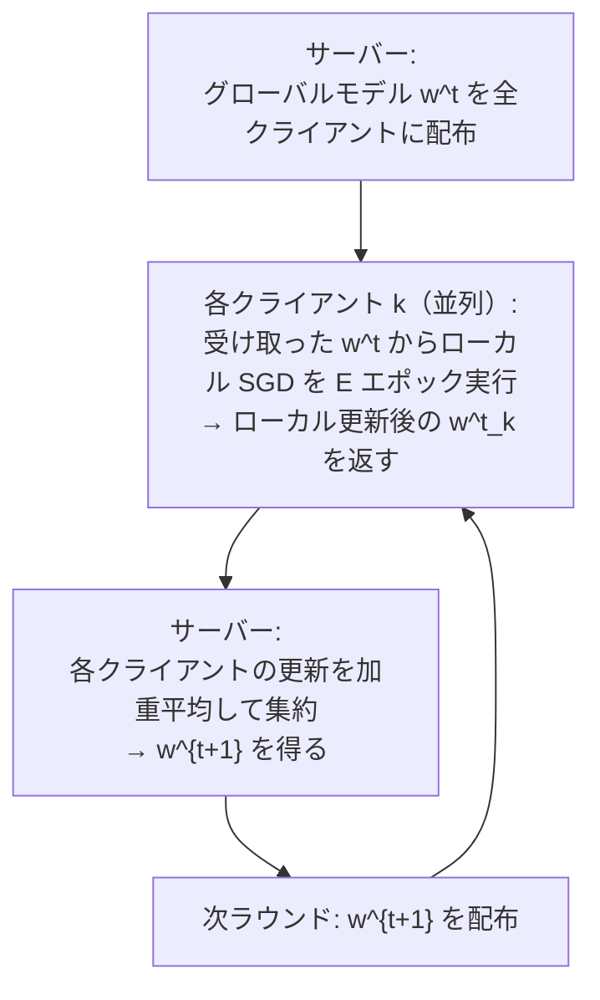

# フェデレーテッドラーニング（Federated Learning）

データをサーバーに集めず、各デバイス・組織でローカルに学習し、モデルの更新のみを共有するプライバシー保護分散学習の枠組みです。スマートフォンの次単語予測・医療機関間の疾患モデル・金融機関間の不正検知——「データは出さないがモデルは改善したい」場面で力を発揮します。

---

## はじめて読む人へ

「病院 A と病院 B が協力して癌検出モデルを学習したいが、患者データを互いに共有できない」——このジレンマをフェデレーテッドラーニング（FL）は解決します。データは動かさず、モデルの勾配（更新量）だけを共有します。

### 読む前に押さえること

- [深層学習入門](深層学習入門) — 勾配降下法・モデル更新
- [セキュリティ基礎](セキュリティ) — プライバシーの基本概念

### 読み終えたら説明できること

- FedAvg アルゴリズムの仕組みを説明できる
- Non-IID データが収束を困難にする理由を説明できる
- 差分プライバシー（Differential Privacy）との組み合わせを説明できる

---

## 集中型学習との対比

### 従来の集中型学習

!!! info ""
    デバイス 1: データ → ┐
    デバイス 2: データ → ├→ 中央サーバーにデータを集約 → モデル学習
    デバイス 3: データ → ┘
    
    問題:
      ・プライバシー侵害リスク（医療・金融・通信履歴）
      ・データ転送コスト・通信帯域
      ・規制（GDPR・HIPAA）への対応が困難

### フェデレーテッドラーニング

!!! info ""
    デバイス 1: ローカルデータで学習 → 勾配 Δw₁ → ┐
    デバイス 2: ローカルデータで学習 → 勾配 Δw₂ → ├→ サーバーで集約 → グローバルモデル更新
    デバイス 3: ローカルデータで学習 → 勾配 Δw₃ → ┘
    
    生データはデバイスを離れない

---

## FedAvg（Federated Averaging）

FL の標準的なアルゴリズムです（McMahan et al., 2017）。

### アルゴリズム

**集約の式：**

$$
w^{t+1} = \sum_{k=1}^{K} \frac{n_k}{n} w_k^t
$$

$n_k$：クライアント $k$ のデータ数、$n = \sum_k n_k$：全データ数。データ数が多いクライアントの更新が強く反映されます。

### ローカル更新ステップ数 $E$ の影響

- **$E = 1$（SGD と等価）：** 収束は安定するが通信コストが高い
- **$E$ を大きく：** 各クライアントが自分のデータに過適応し、「クライアントドリフト」が発生して収束が遅くなる

---

## Non-IID 問題

### IID vs Non-IID

**IID（独立同一分布）：** 各クライアントのデータが全体の分布を代表している（現実には稀）

**Non-IID（実際の FL）：**

!!! info ""
    クライアント A（糖尿病専門病院）: 糖尿病患者データのみ
    クライアント B（小児科病院）:     小児疾患データのみ
    クライアント C（眼科クリニック）: 眼科疾患データのみ
    
    → 各クライアントの最適モデルが大きく異なる
    → 平均化すると全員にとって中途半端なモデルになる

### Non-IID への対応手法

| 手法 | アイデア |
|------|---------|
| **FedProx** | クライアントの更新をグローバルモデルからの乖離で正則化 |
| **SCAFFOLD** | コントロール変数でクライアントドリフトを補正 |
| **FedNova** | 各クライアントの更新ステップ数を正規化してから集約 |
| **パーソナライズド FL** | 共有のグローバルモデル + 個人用ファインチューニング |

---

## 差分プライバシー（Differential Privacy）との組み合わせ

FedAvg でも勾配から元データを**再構成できる**という攻撃（Gradient Inversion Attack）が知られています。差分プライバシー（DP）を加えることで、数学的なプライバシー保証が得られます。

### DP-SGD（差分プライバシー確率的勾配降下法）

各クライアントのローカル更新に**クリッピング + ノイズ追加**を適用します：

$$
\tilde{g} = \text{clip}(g, C) + \mathcal{N}(0, \sigma^2 C^2 I)
$$

- $C$：クリッピング閾値（勾配の最大ノルムを制限）
- $\sigma$：ノイズスケール（大きいほどプライバシーが強く、精度が落ちる）

**$(\varepsilon, \delta)$-差分プライバシー：** 任意の隣接データセット（1 件だけ異なる）に対して、出力の分布の差が $\varepsilon$ 以内（$\delta$ の確率で許容）であることを保証します。

| $\varepsilon$ | プライバシー強度 | 精度への影響 |
|--------------|--------------|-----------|
| 1 以下 | 強いプライバシー保護 | 精度が大きく低下 |
| 8〜10 | 実用的なバランス | 許容できる精度低下 |
| 無限大 | 保護なし | 最大精度 |

---

## セキュリティの脅威

FL はプライバシーを改善しますが、新たな脅威が生じます。

### モデル汚染攻撃（Model Poisoning）

悪意のあるクライアントが意図的に誤った更新を送信し、グローバルモデルを壊します。

!!! info ""
    正常クライアント × 99 → 正しい更新
    悪意クライアント × 1  → モデルが「ストップ標識をスピード標識と分類する」よう操作
    → 集約後のモデルに Backdoor が仕込まれる

**対策：** Krum・Median・Trimmed Mean などのロバストな集約手法でアウトライアーの更新を除外します。

---

## 実装フレームワーク

| フレームワーク | 開発元 | 特徴 |
|-------------|------|------|
| **TensorFlow Federated（TFF）** | Google | TF との深い統合 |
| **PySyft** | OpenMined | PyTorch ベース・DP サポート |
| **Flower** | AdaNet | フレームワーク非依存・シンプル |
| **FATE** | WeBank | 企業間 FL・金融向け |

---

## 数学的導出

### FedAvg の収束解析

非凸損失関数で Non-IID データを持つ $K$ クライアント、各ラウンドで $E$ ステップのローカル更新を行う場合の収束率（Li et al., 2020）：

$$
\mathbb{E}\left[\|\nabla F(w^T)\|^2\right] \leq O\!\left(\frac{1}{\sqrt{TKE}}\right) + O\!\left(\frac{E \cdot G^2}{T}\right)
$$

第1項：収束（$T, K, E$ が大きいほど小さい）  
第2項：Non-IID によるバイアス（$E$ が大きいほどドリフトが増大）

最適な $E$ は $T$ の関数で、学習の後半では $E$ を小さくする適応的スケジューリングが有効です。

---

## 確認問題

1. FedAvg で「データを動かさず勾配のみを共有する」ことの限界（Gradient Inversion Attack）を説明してください。
2. Non-IID データが FedAvg の収束を遅くする理由を「クライアントドリフト」の観点から説明してください。
3. 差分プライバシーの $\varepsilon$ が小さいほど「プライバシー保護が強い」理由を定義から説明してください。

---

## 関連ページ

- [深層学習入門](深層学習入門) — 勾配降下法・モデル更新の基礎
- [セキュリティ基礎](セキュリティ) — プライバシー・データ保護の概念
- [GPU・CUDA入門](GPU-CUDA入門) — 分散学習とのハードウェア接続
- [データ倫理・AI倫理](データ倫理) — プライバシーとAIの倫理

---

[← ホームへ](Home)
