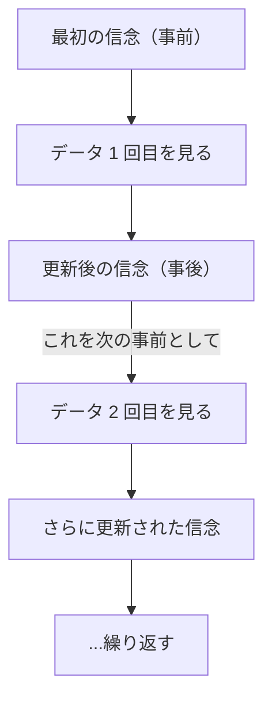
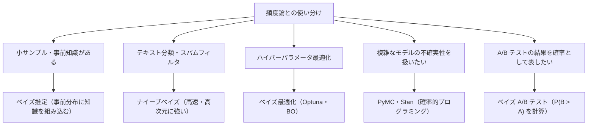

# ベイズ理論

**「データを見る前の信念」と「データから得た証拠」を組み合わせて、「データを見た後の信念」を更新する統計的推論の枠組み**です。頻度論的統計（p値・信頼区間）とは異なる哲学を持ち、不確実性を確率分布として扱います。

---

## はじめて読む人へ

「コインを投げる前から、このコインは 50% の確率で表が出そうだ」という信念（事前分布）を持っているとします。実際に 10 回投げて 8 回表が出たら（尤度）、「やっぱりこのコインは少し偏っているかもしれない」と信念を更新します（事後分布）。これがベイズ推論の本質です。

### 読む前に押さえること

- 頻度論では「確率 = 長期的な頻度」ですが、ベイズでは「確率 = 不確実性の度合い（信念の強さ）」です。
- 事前分布（prior）はデータを見る前の信念、事後分布（posterior）はデータを見た後の更新された信念です。
- 尤度（likelihood）は「このパラメータ θ のとき、観測データが得られる確率」です。

### 読み終えたら説明できること

- ベイズの定理を使って事後分布を計算できる。
- 最尤推定とベイズ推定の違いを説明できる。
- ナイーブベイズ分類器の仕組みを説明できる。

---

## ベイズの定理

### なぜベイズ理論が必要か

普通の統計（頻度論）では「この実験を無限に繰り返したとき」という仮想的な状況を考えます。一方ベイズでは**「今持っている信念をデータで更新する」**という枠組みです。

```
頻度論：「このコインを 1 万回投げたとき、表は何回出るか」（繰り返しの概念）
ベイズ論：「このコインが公平である可能性は、今のデータを見てどれくらいか」（信念の更新）
```


医療診断・スパムフィルタ・推薦システムなど、「過去の知識 + 新しい証拠」を組み合わせたいときにベイズが力を発揮します。

---

### STEP 1：日常例でベイズの定理を理解する

**例：新型ウイルスの検査**

```
状況：
  ・人口の 1% がウイルスに感染している
  ・検査の感度（本当に感染している人を陽性と判定する確率）= 95%
  ・偽陽性率（感染していない人を陽性と判定する確率）= 5%

問い：「検査が陽性だった場合、本当に感染している確率は？」
```


直感的に「95% くらいじゃないか？」と思いますが、実際は違います。

```
1000 人でシミュレーション：

  感染者 10 人 → 検査陽性 = 10 × 0.95 = 9.5 ≈ 9 人
  非感染者 990 人 → 検査陽性（偽陽性）= 990 × 0.05 = 49.5 ≈ 50 人

  陽性と判定された人の合計 ≈ 59 人
  そのうち本当の感染者 ≈ 9 人

  → 陽性が出たときに本当に感染している確率 = 9/59 ≈ 15%
```


これがベイズの定理の本質です。**「検査結果（新しいデータ）」と「事前の知識（感染率 1%）」を組み合わせて正確な確率を出す**。

---

### STEP 2：ベイズの定理の式を読む

STEP 1 のシミュレーションで「陽性が出たとき本当に感染している確率 ≈ 16%」を求めましたが、これを一般化したのがベイズの定理です。

式の形は以下の通りです。

$$
P(\theta \mid X) = \frac{P(X \mid \theta) P(\theta)}{P(X)}
$$

一見難しく見えますが、それぞれの項は「誰が何を知っているか」を表しています。感染症の例に当てはめると次のようになります。

$$
P(\text{感染} \mid \text{陽性}) = \frac{P(\text{陽性} \mid \text{感染}) \cdot P(\text{感染})}{P(\text{陽性})}
$$

- $P(\text{感染} \mid \text{陽性})$ = **事後確率**：「陽性という結果を見た後で、感染している確率」——これが知りたいものです
- $P(\text{陽性} \mid \text{感染})$ = **尤度**：「感染しているときに陽性が出る確率 = 0.95」——検査の性能です
- $P(\text{感染})$ = **事前確率**：「検査結果を見る前の感染率 = 0.01」——人口統計からわかる情報です
- $P(\text{陽性})$ = **全体の陽性率**：「陽性になる人の割合（感染者＋偽陽性者）」——式を正規化するための定数です

重要なのは「知りたかった確率（事後確率）が、検査の性能（尤度）と事前の知識（事前確率）の掛け算で求まる」という点です。STEP 1 で手計算した 16% は、この式を数値で計算したものにほかなりません。

| 項 | 名前 | 役割 | 例 |
|----|------|------|-----|
| $P(\theta \mid X)$ | 事後確率（posterior） | データを見た後の「更新された信念」 | 陽性後の感染確率 |
| $P(X \mid \theta)$ | 尤度（likelihood） | 「θ が真なら X が起こる確率」 | 感染していれば陽性になる確率 |
| $P(\theta)$ | 事前確率（prior） | データを見る前の信念 | 感染率 1% |
| $P(X)$ | 周辺確率（evidence） | 正規化のための定数（θ に依存しない）| 陽性になる全確率 |

**実用的な覚え方：「事後 $\propto$ 尤度 × 事前」**（$P(X)$ は定数なので省略できる）

---

### STEP 3：信念を更新し続ける

ベイズのパワーは「データが増えるたびに信念を更新できる」ことにあります。



コインを投げるたびに「表の確率 θ」への信念が更新されていきます。最初は「何も知らない（θ は 0〜1 の何でもあり得る）」状態（事前分布 Beta(1,1)）から始め、表が出るたびに推定が 0.7 に近づいていく——これがベイズ更新の直感です。

---

## 事前分布・尤度・事後分布

### 事前分布（Prior）の種類

| 種類 | 意味 | 例 |
|------|------|-----|
| 無情報事前分布 | 知識がない状態。一様分布など | $\text{Beta}(1,1)$・正規分布 $N(0, 10^2)$ |
| 弱情報事前分布 | ゆるい制約のみ。過学習防止に有効 | $N(0, 1)$ |
| 情報的事前分布 | 過去の実験・専門知識を反映 | $\text{Beta}(5, 2)$（少し表寄りのコイン） |
| 共役事前分布 | 事後分布が事前分布と同じ分布族になる | 後述 |

### 尤度（Likelihood）

パラメータ θ を固定したとき、データがどれだけ「もっともらしいか」を表す関数です。対数尤度 $\log p(k \mid \theta)$ を最大化する θ が最尤推定量（MLE）になります。

---

## 共役事前分布

事後分布が事前分布と **同じ分布族** になる事前分布を共役事前分布と言います。解析的に事後分布を計算できるため便利です。

| 尤度 | 共役事前分布 | 事後分布 |
|------|------------|---------|
| 二項分布 $\text{Bin}(n, \theta)$ | $\text{Beta}(\alpha, \beta)$ | $\text{Beta}(\alpha + \text{成功数},\ \beta + \text{失敗数})$ |
| ポアソン分布 $\text{Pois}(\lambda)$ | $\text{Gamma}(\alpha, \beta)$ | $\text{Gamma}(\alpha + \sum x_i,\ \beta + n)$ |
| 正規分布（$\mu$ 未知） | 正規分布 $N(\mu_0, \sigma_0^2)$ | 正規分布（更新後の $\mu$, $\sigma^2$） |
| カテゴリ分布 | ディリクレ分布 | ディリクレ分布 |

**ポアソン-ガンマ共役の例：** 1 時間あたりの問い合わせ件数 λ を推定する場合、事前分布を Gamma(α=2, β=1)（λ の事前期待値 = 2 件/時間）とし、3 時間で [3, 5, 4] 件の観測があれば、事後分布は Gamma(α + Σx, β + n) = Gamma(2+12, 1+3) = Gamma(14, 4) となり、事後平均は 14/4 = 3.5 件/時間になります。

---

## 最尤推定 vs ベイズ推定

| 観点 | 最尤推定（MLE） | ベイズ推定 |
|------|--------------|----------|
| 結果 | 点推定（1 つの値） | 確率分布（不確実性を含む） |
| 事前知識 | 使わない | 事前分布として組み込める |
| 小サンプル | 過学習しやすい | 事前分布が正則化として機能 |
| 解釈 | 「最も尤もらしい値」 | 「信念の更新された分布」 |
| 計算コスト | 低い | 高い（MCMC など） |

ベイズ線形回帰（`BayesianRidge`）は係数に事前分布を置き、予測とともに不確実性の幅も出力できます。サンプル数が少ない高次元問題では過学習しにくく、点推定の線形回帰より汎化することが多いです。

---

## ナイーブベイズ分類器

ベイズの定理を分類に応用した手法です。「各特徴量が独立」という **単純化の仮定（ナイーブ）** を置くことで、高次元データでも効率よく学習できます。

$$
P(\text{クラス } k \mid x_1, x_2, \ldots, x_n) \propto P(\text{クラス } k) \times \prod_i P(x_i \mid \text{クラス } k)
$$

### ナイーブベイズの変種

| クラス | 特徴量の仮定 | 使い場面 |
|--------|-----------|---------|
| GaussianNB | 正規分布 | 連続値（身長・体重など） |
| MultinomialNB | 多項分布（頻度） | テキスト分類・TF-IDF |
| BernoulliNB | ベルヌーイ分布（0/1） | 単語の有無の二値特徴量 |
| CategoricalNB | カテゴリ分布 | 離散カテゴリ特徴量 |

scikit-learn の `GaussianNB`, `MultinomialNB` でワンライナーで使えます。テキスト分類（スパムフィルタ・ニュース分類）で特に強力です。

---

## ベイズ更新の逐次性

ベイズ推論の強力な性質：前回の事後分布を次の事前分布として使い、データが来るたびに更新できます。A/B テストや広告のクリック率推定に使われます。

```
時刻 0: 事前分布 Beta(1, 1)（均一）
観測 1: クリック → Beta(2, 1)
観測 2: 非クリック → Beta(2, 2)
観測 3: クリック → Beta(3, 2)
...
200 回の観測後、事後分布が真のクリック率 θ に集中していく
```

---

## MCMC（マルコフ連鎖モンテカルロ法）

共役事前分布が使えない複雑なモデルでは、事後分布から **サンプリング** して近似します。MCMC はその代表的な手法です。

**メトロポリス・ヘイスティングス法の仕組み：**

1. 現在の θ から、提案分布（例：正規分布）で候補 θ' を生成
2. 受理確率 $\alpha = \min\!\left(1,\; \frac{p(\theta' \mid X)}{p(\theta \mid X)}\right)$ を計算
3. 確率 α で θ' を受理、1-α で棄却して θ のまま
4. これを繰り返すと、サンプルの分布が事後分布に収束する

この手続きが事後分布に収束することは、詳細つり合い条件（[確率過程](確率過程)参照）によって保証されます。実務では `pymc` ライブラリを使うのが標準です（`pip install pymc`）。

---

## PyMC によるベイズモデリング

`pymc` では、確率分布を積み上げてモデルを記述し、`pm.sample()` で MCMC を実行します。

```python
import pymc as pm

# A/B テスト：A 群 100 人中 20 クリック、B 群 100 人中 30 クリック
with pm.Model():
    theta_A = pm.Beta('theta_A', alpha=1, beta=1)  # 事前分布
    theta_B = pm.Beta('theta_B', alpha=1, beta=1)
    pm.Binomial('obs_A', n=100, p=theta_A, observed=20)  # 尤度
    pm.Binomial('obs_B', n=100, p=theta_B, observed=30)
    delta = pm.Deterministic('delta', theta_B - theta_A)
    trace = pm.sample(2000, tune=1000)

# trace.posterior['delta'] > 0 の割合 → P(B > A | データ)
```

ベイズ線形回帰も同様に、係数に正規事前分布を置いて `pm.sample()` で事後分布を推論できます。

---

## ベイズ最適化

目的関数の評価コストが高い（例：ハイパーパラメータチューニング）場合に、**ガウス過程回帰** を使って「次にどこを評価するか」をベイズ的に決める手法です。

**仕組み：**
1. ガウス過程が「まだ評価していない点での目的関数値の不確実性」をモデル化
2. 獲得関数（Expected Improvement など）が「不確実性が高くて期待値も高い点」を選ぶ
3. その点を評価して観測に追加 → 繰り返す

**Optuna** を使えば、機械学習のハイパーパラメータ最適化に同じ考え方をすぐ適用できます（[モデル評価・チューニング](モデル評価-チューニング) 参照）。

---

## 信用区間 vs 信頼区間

ベイズと頻度論で「区間推定」の解釈が異なります。

| | 頻度論の信頼区間 | ベイズの信用区間（credible interval） |
|--|--------------|-------------------------------|
| 意味 | 「同じ手順を繰り返したとき、95% の区間が真値を含む」 | 「真の値がこの区間にある確率が 95%」 |
| θ の扱い | 固定された未知の値 | 確率変数 |
| 直感との一致 | やや難解（θ は確率的でない） | 直感的 |

ベイズの信用区間（HDI: Highest Density Interval）は、「この区間に真のパラメータが 95% の確率で収まる」と直感的に解釈できるため、レポーティングやビジネス上の意思決定に馴染みやすいです。

---

## ベイズ理論の実用マップ



---

## 数学的導出

### ベータ-二項共役の導出

コインを $n$ 回投げて $k$ 回表が出たとき（二項尤度）、事前分布がベータ分布なら事後分布も同じくベータ分布になることを示します。

**事前分布：** $\theta \sim \text{Beta}(\alpha, \beta)$

$$
p(\theta) = \frac{\Gamma(\alpha + \beta)}{\Gamma(\alpha)\Gamma(\beta)} \theta^{\alpha-1}(1-\theta)^{\beta-1} \propto \theta^{\alpha-1}(1-\theta)^{\beta-1}
$$

**尤度：** $k \mid \theta \sim \text{Binomial}(n, \theta)$

$$
p(k \mid \theta) = \binom{n}{k} \theta^k (1-\theta)^{n-k} \propto \theta^k (1-\theta)^{n-k}
$$

**事後分布（ベイズの定理）：**

$$
p(\theta \mid k) \propto p(k \mid \theta) \cdot p(\theta) \propto \theta^k(1-\theta)^{n-k} \cdot \theta^{\alpha-1}(1-\theta)^{\beta-1}
$$

$$
= \theta^{(\alpha + k) - 1}(1-\theta)^{(\beta + n - k) - 1}
$$

これはベータ分布 $\text{Beta}(\alpha + k, \beta + n - k)$ の核です。

$$
\boxed{p(\theta \mid k) = \text{Beta}(\alpha + k,\; \beta + n - k)}
$$

**解釈：** 事前の「成功 $\alpha$ 回、失敗 $\beta$ 回」という仮想経験に、実際の「成功 $k$ 回、失敗 $n-k$ 回」を足すだけで事後分布が更新されます。

---

### MAP 推定 = L2 正則化付き最尤推定

**MAP（最大事後確率）推定** は事後分布を最大化するパラメータを求めます：

$$
\hat{\theta}_{\text{MAP}} = \arg\max_\theta p(\theta \mid X) = \arg\max_\theta \left[ \log p(X \mid \theta) + \log p(\theta) \right]
$$

**ガウス事前分布を使うと L2 正則化と同値：**

$\theta \sim \mathcal{N}(0, \sigma_0^2)$ とすると：

$$
\log p(\theta) = -\frac{\|\theta\|^2}{2\sigma_0^2} + \text{const}
$$

これを目的関数に足すと：

$$
\hat{\theta}_{\text{MAP}} = \arg\max_\theta \left[ \log p(X \mid \theta) - \frac{\|\theta\|^2}{2\sigma_0^2} \right]
$$

最大化を最小化に変換すると（符号反転）：

$$
= \arg\min_\theta \left[ -\log p(X \mid \theta) + \frac{1}{2\sigma_0^2}\|\theta\|^2 \right]
$$

$\lambda = 1/(2\sigma_0^2)$ とおくと、これはまさに **L2 正則化付き最尤推定**：

$$
\boxed{\hat{\theta}_{\text{MAP}} = \arg\min_\theta \left[ -\log p(X \mid \theta) + \lambda \|\theta\|^2 \right]}
$$

**含意：** Ridge 回帰（L2 正則化線形回帰）は、パラメータにガウス事前分布を仮定した MAP 推定と数学的に等価です。

---

## 確認問題

1. ベイズの定理 $P(\theta \mid X) \propto P(X \mid \theta) \times P(\theta)$ の各項の名前と意味を説明してください。
2. ベータ分布 $\text{Beta}(\alpha, \beta)$ を事前分布として使い、$n$ 回中 $k$ 回成功したとき、事後分布の式を導いてください。
3. MAP 推定でガウス事前分布を仮定すると L2 正則化と同値になることを、対数尤度の式から説明してください。
4. 頻度論の信頼区間とベイズの信用区間の違いを、解釈の観点から説明してください。

---

## 関連ページ

- [確率・統計基礎](確率・統計基礎) — 確率分布・p 値・信頼区間の基礎
- [回帰分析](回帰分析) — 最尤推定による線形・ロジスティック回帰
- [機械学習理論](機械学習理論) — 正則化・過学習（ベイズ的正則化との対応）
- [モデル評価・チューニング](モデル評価-チューニング) — ベイズ最適化によるハイパーパラメータ探索
- [教師あり学習](教師あり学習) — ナイーブベイズを含む分類アルゴリズム

---

[← ホームへ](Home)
