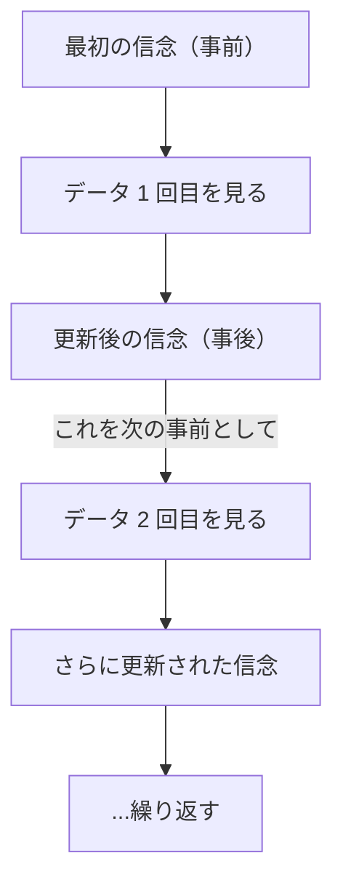
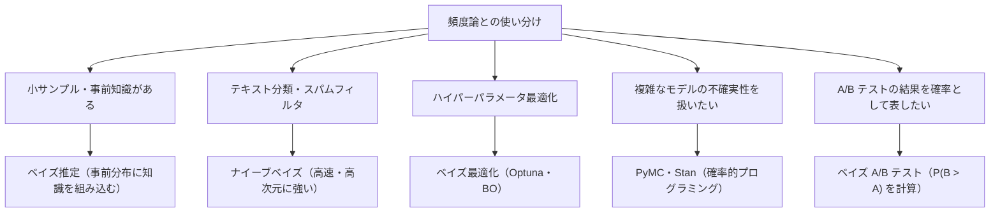

# ベイズ理論

**「データを見る前の信念」と「データから得た証拠」を組み合わせて、「データを見た後の信念」を更新する統計的推論の枠組み**です。頻度論的統計（p値・信頼区間）とは異なる哲学を持ち、不確実性を確率分布として扱います。

---

## はじめて読む人へ

「コインを投げる前から、このコインは 50% の確率で表が出そうだ」という信念（事前分布）を持っているとします。実際に 10 回投げて 8 回表が出たら（尤度）、「やっぱりこのコインは少し偏っているかもしれない」と信念を更新します（事後分布）。これがベイズ推論の本質です。

### 読む前に押さえること

- 頻度論では「確率 = 長期的な頻度」ですが、ベイズでは「確率 = 不確実性の度合い（信念の強さ）」です。
- 事前分布（prior）はデータを見る前の信念、事後分布（posterior）はデータを見た後の更新された信念です。
- 尤度（likelihood）は「このパラメータ θ のとき、観測データが得られる確率」です。

### 読み終えたら説明できること

- ベイズの定理を使って事後分布を計算できる。
- 最尤推定とベイズ推定の違いを説明できる。
- ナイーブベイズ分類器の仕組みを説明できる。

---

## ベイズの定理

### なぜベイズ理論が必要か

普通の統計（頻度論）では「この実験を無限に繰り返したとき」という仮想的な状況を考えます。一方ベイズでは**「今持っている信念をデータで更新する」**という枠組みです。

```
頻度論：「このコインを 1 万回投げたとき、表は何回出るか」（繰り返しの概念）
ベイズ論：「このコインが公平である可能性は、今のデータを見てどれくらいか」（信念の更新）
```


医療診断・スパムフィルタ・推薦システムなど、「過去の知識 + 新しい証拠」を組み合わせたいときにベイズが力を発揮します。

---

### STEP 1：日常例でベイズの定理を理解する

**例：新型ウイルスの検査**

```
状況：
  ・人口の 1% がウイルスに感染している
  ・検査の感度（本当に感染している人を陽性と判定する確率）= 95%
  ・偽陽性率（感染していない人を陽性と判定する確率）= 5%

問い：「検査が陽性だった場合、本当に感染している確率は？」
```


直感的に「95% くらいじゃないか？」と思いますが、実際は違います。

```
1000 人でシミュレーション：

  感染者 10 人 → 検査陽性 = 10 × 0.95 = 9.5 ≈ 9 人
  非感染者 990 人 → 検査陽性（偽陽性）= 990 × 0.05 = 49.5 ≈ 50 人

  陽性と判定された人の合計 ≈ 59 人
  そのうち本当の感染者 ≈ 9 人

  → 陽性が出たときに本当に感染している確率 = 9/59 ≈ 15%
```


これがベイズの定理の本質です。**「検査結果（新しいデータ）」と「事前の知識（感染率 1%）」を組み合わせて正確な確率を出す**。

```python
# 上のシミュレーションをベイズの定理で計算
p_infected     = 0.01    # 事前確率（感染率）
p_pos_if_inf   = 0.95    # 感度（感染→陽性）
p_pos_if_noinf = 0.05    # 偽陽性率（非感染→陽性）

# 全体での陽性率
p_positive = p_pos_if_inf * p_infected + p_pos_if_noinf * (1 - p_infected)

# ベイズの定理：P(感染 | 陽性) = P(陽性 | 感染) × P(感染) / P(陽性)
p_infected_given_pos = (p_pos_if_inf * p_infected) / p_positive

print(f"陽性が出たとき本当に感染している確率: {p_infected_given_pos:.1%}")  # ≈ 16.1%
```

---

### STEP 2：ベイズの定理の式を読む

STEP 1 のシミュレーションで「陽性が出たとき本当に感染している確率 ≈ 16%」を求めましたが、これを一般化したのがベイズの定理です。

式の形は以下の通りです。

$$
P(\theta \mid X) = \frac{P(X \mid \theta) P(\theta)}{P(X)}
$$

一見難しく見えますが、それぞれの項は「誰が何を知っているか」を表しています。感染症の例に当てはめると次のようになります。

$$
P(\text{感染} \mid \text{陽性}) = \frac{P(\text{陽性} \mid \text{感染}) \cdot P(\text{感染})}{P(\text{陽性})}
$$

- $P(\text{感染} \mid \text{陽性})$ = **事後確率**：「陽性という結果を見た後で、感染している確率」——これが知りたいものです
- $P(\text{陽性} \mid \text{感染})$ = **尤度**：「感染しているときに陽性が出る確率 = 0.95」——検査の性能です
- $P(\text{感染})$ = **事前確率**：「検査結果を見る前の感染率 = 0.01」——人口統計からわかる情報です
- $P(\text{陽性})$ = **全体の陽性率**：「陽性になる人の割合（感染者＋偽陽性者）」——式を正規化するための定数です

重要なのは「知りたかった確率（事後確率）が、検査の性能（尤度）と事前の知識（事前確率）の掛け算で求まる」という点です。STEP 1 で手計算した 16% は、この式を数値で計算したものにほかなりません。

| 項 | 名前 | 役割 | 例 |
|----|------|------|-----|
| $P(\theta \mid X)$ | 事後確率（posterior） | データを見た後の「更新された信念」 | 陽性後の感染確率 |
| $P(X \mid \theta)$ | 尤度（likelihood） | 「θ が真なら X が起こる確率」 | 感染していれば陽性になる確率 |
| $P(\theta)$ | 事前確率（prior） | データを見る前の信念 | 感染率 1% |
| $P(X)$ | 周辺確率（evidence） | 正規化のための定数（θ に依存しない）| 陽性になる全確率 |

**実用的な覚え方：「事後 $\propto$ 尤度 × 事前」**（$P(X)$ は定数なので省略できる）

---

### STEP 3：信念を更新し続ける

ベイズのパワーは「データが増えるたびに信念を更新できる」ことにあります。



```python
# コインを投げるたびに「表の確率 θ」への信念を更新するシミュレーション
import numpy as np

# 本当の表の確率（未知）
true_theta = 0.7

# 最初の信念：「何も知らない = θ は 0〜1 の何でもあり得る」
# → Beta(1, 1)（均一な分布）で表現
alpha, beta = 1, 1  # 事前分布のパラメータ

print(f"初期状態: 表の確率の期待値 = {alpha / (alpha + beta):.2f}")

# コインを 1 枚ずつ投げてベイズ更新
rng = np.random.default_rng(42)
for i in range(20):
    flip = rng.binomial(1, true_theta)  # 1=表, 0=裏

    # ベイズ更新（Beta-Binomial の共役）
    alpha += flip       # 表が出たら alpha += 1
    beta  += 1 - flip   # 裏が出たら beta  += 1

    estimate = alpha / (alpha + beta)  # 事後分布の平均
    print(f"投げ {i+1:2d}回目: {'表' if flip else '裏'}  推定 θ = {estimate:.3f}")

print(f"\n真の θ = {true_theta}  最終推定 = {estimate:.3f}")
```

20 回投げるたびに、「表の出やすさ」の推定が 0.5 から 0.7 に徐々に近づきます。これがベイズ更新です。

### 具体例：コイン投げのパラメータ推定（分布で追う）

コインの表が出る確率 θ を推定する問題です。

```python
import numpy as np
import matplotlib.pyplot as plt
from scipy import stats

# データ：10 回投げて 7 回表
n_trials = 10
n_heads = 7

# 事前分布：Beta(1, 1) = 一様分布（θ について何も知らない状態）
prior_a, prior_b = 1, 1

# 事後分布：Beta(a + 表の回数, b + 裏の回数)
# Beta 分布は二項尤度の共役事前分布（後述）
post_a = prior_a + n_heads
post_b = prior_b + (n_trials - n_heads)

theta = np.linspace(0, 1, 300)

prior_dist     = stats.beta(prior_a, prior_b)
likelihood     = stats.binom.pmf(n_heads, n_trials, theta)
posterior_dist = stats.beta(post_a, post_b)

plt.figure(figsize=(10, 4))
plt.plot(theta, prior_dist.pdf(theta),     label='事前分布 Beta(1,1)',          linestyle='--')
plt.plot(theta, likelihood / likelihood.max() * posterior_dist.pdf(theta).max(),
                                            label='尤度（正規化済み）',          linestyle=':')
plt.plot(theta, posterior_dist.pdf(theta), label=f'事後分布 Beta({post_a},{post_b})', linewidth=2)
plt.axvline(n_heads / n_trials, color='red', linestyle='--', alpha=0.5, label='最尤推定値 0.7')
plt.xlabel('θ（表が出る確率）'); plt.ylabel('密度')
plt.title('ベイズ更新：コインの偏り推定')
plt.legend(); plt.tight_layout(); plt.show()

print(f"事後分布の平均: {post_a / (post_a + post_b):.3f}")  # MAP 推定
print(f"95% 信用区間: {posterior_dist.interval(0.95)}")
```

---

## 事前分布・尤度・事後分布

### 事前分布（Prior）の種類

| 種類 | 意味 | 例 |
|------|------|-----|
| 無情報事前分布 | 知識がない状態。一様分布など | $\text{Beta}(1,1)$・正規分布 $N(0, 10^2)$ |
| 弱情報事前分布 | ゆるい制約のみ。過学習防止に有効 | $N(0, 1)$ |
| 情報的事前分布 | 過去の実験・専門知識を反映 | $\text{Beta}(5, 2)$（少し表寄りのコイン） |
| 共役事前分布 | 事後分布が事前分布と同じ分布族になる | 後述 |

### 尤度（Likelihood）

パラメータ θ を固定したとき、データがどれだけ「もっともらしいか」を表す関数です。

```python
# 尤度関数の可視化
theta_vals = np.linspace(0.01, 0.99, 200)
log_likelihood = [stats.binom.logpmf(n_heads, n_trials, t) for t in theta_vals]

plt.plot(theta_vals, log_likelihood)
plt.xlabel('θ'); plt.ylabel('対数尤度')
plt.title(f'対数尤度関数（n={n_trials}, k={n_heads}）')
plt.axvline(n_heads / n_trials, color='red', label=f'最大値 θ = {n_heads/n_trials}')
plt.legend(); plt.show()
```

---

## 共役事前分布

事後分布が事前分布と **同じ分布族** になる事前分布を共役事前分布と言います。解析的に事後分布を計算できるため便利です。

| 尤度 | 共役事前分布 | 事後分布 |
|------|------------|---------|
| 二項分布 $\text{Bin}(n, \theta)$ | $\text{Beta}(\alpha, \beta)$ | $\text{Beta}(\alpha + \text{成功数},\ \beta + \text{失敗数})$ |
| ポアソン分布 $\text{Pois}(\lambda)$ | $\text{Gamma}(\alpha, \beta)$ | $\text{Gamma}(\alpha + \sum x_i,\ \beta + n)$ |
| 正規分布（$\mu$ 未知） | 正規分布 $N(\mu_0, \sigma_0^2)$ | 正規分布（更新後の $\mu$, $\sigma^2$） |
| カテゴリ分布 | ディリクレ分布 | ディリクレ分布 |

```python
# ポアソン-ガンマ共役：1 時間あたりの問い合わせ件数 λ を推定
# 事前分布: Gamma(alpha=2, beta=1) → λ の平均は 2 件/時間と信じている
prior_alpha, prior_beta = 2, 1

# 観測データ：3 時間で [3, 5, 4] 件の問い合わせ
observations = np.array([3, 5, 4])
n = len(observations)

# 事後分布: Gamma(alpha + Σx, beta + n)
post_alpha = prior_alpha + observations.sum()
post_beta  = prior_beta + n

lam = np.linspace(0, 15, 300)
plt.plot(lam, stats.gamma(a=prior_alpha, scale=1/prior_beta).pdf(lam),
         label='事前分布', linestyle='--')
plt.plot(lam, stats.gamma(a=post_alpha, scale=1/post_beta).pdf(lam),
         label=f'事後分布（MAP={post_alpha/post_beta:.2f}）', linewidth=2)
plt.xlabel('λ（件/時間）'); plt.ylabel('密度')
plt.title('ポアソン過程のベイズ更新')
plt.legend(); plt.show()

print(f"事後平均: {post_alpha / post_beta:.2f}")
print(f"95% 信用区間: {stats.gamma(a=post_alpha, scale=1/post_beta).interval(0.95)}")
```

---

## 最尤推定 vs ベイズ推定

```python
from sklearn.linear_model import LinearRegression, BayesianRidge
from sklearn.datasets import make_regression
from sklearn.model_selection import train_test_split
from sklearn.metrics import r2_score
import numpy as np

X, y = make_regression(n_samples=50, n_features=20, noise=10, random_state=42)
X_train, X_test, y_train, y_test = train_test_split(X, y, test_size=0.3, random_state=42)

# 最尤推定（OLS）
ols = LinearRegression().fit(X_train, y_train)

# ベイズ線形回帰（係数に事前分布を置いてパラメータを推定）
bayes_ridge = BayesianRidge().fit(X_train, y_train)

print(f"OLS   R²: {r2_score(y_test, ols.predict(X_test)):.3f}")
print(f"Bayes R²: {r2_score(y_test, bayes_ridge.predict(X_test)):.3f}")

# ベイズリッジは予測の不確実性も返せる
y_pred, y_std = bayes_ridge.predict(X_test, return_std=True)
print(f"\n予測値の標準偏差（不確実性）: 平均 {y_std.mean():.2f}")
```

| 観点 | 最尤推定（MLE） | ベイズ推定 |
|------|--------------|----------|
| 結果 | 点推定（1 つの値） | 確率分布（不確実性を含む） |
| 事前知識 | 使わない | 事前分布として組み込める |
| 小サンプル | 過学習しやすい | 事前分布が正則化として機能 |
| 解釈 | 「最も尤もらしい値」 | 「信念の更新された分布」 |
| 計算コスト | 低い | 高い（MCMC など） |

---

## ナイーブベイズ分類器

ベイズの定理を分類に応用した手法です。「各特徴量が独立」という **単純化の仮定（ナイーブ）** を置くことで、高次元データでも効率よく学習できます。

$$
P(\text{クラス } k \mid x_1, x_2, \ldots, x_n) \propto P(\text{クラス } k) \times \prod_i P(x_i \mid \text{クラス } k)
$$

```python
from sklearn.naive_bayes import GaussianNB, MultinomialNB, BernoulliNB
from sklearn.datasets import load_iris, fetch_20newsgroups
from sklearn.feature_extraction.text import TfidfVectorizer
from sklearn.metrics import accuracy_score, classification_report
from sklearn.model_selection import train_test_split

# ─── 例 1：ガウスナイーブベイズ（連続値特徴量）───
data = load_iris()
X_train, X_test, y_train, y_test = train_test_split(
    data.data, data.target, test_size=0.3, random_state=42)

gnb = GaussianNB()
gnb.fit(X_train, y_train)
print(f"GaussianNB 精度: {accuracy_score(y_test, gnb.predict(X_test)):.3f}")

# クラスごとの特徴量の平均・分散（ガウス分布のパラメータ）
print("クラス事前確率:", gnb.class_prior_.round(3))
print("特徴量平均（クラス 0）:", gnb.theta_[0].round(2))
```

```python
# ─── 例 2：多項ナイーブベイズ（テキスト分類）───
categories = ['sci.space', 'rec.sport.baseball', 'comp.graphics']
news = fetch_20newsgroups(subset='train', categories=categories)

vectorizer = TfidfVectorizer(max_features=5000, stop_words='english')
X = vectorizer.fit_transform(news.data)

X_train, X_test, y_train, y_test = train_test_split(
    X, news.target, test_size=0.2, random_state=42)

mnb = MultinomialNB(alpha=1.0)   # alpha: ラプラス平滑化（ゼロ確率を防ぐ）
mnb.fit(X_train, y_train)

print(f"\nMultinomialNB 精度: {accuracy_score(y_test, mnb.predict(X_test)):.3f}")
print(classification_report(y_test, mnb.predict(X_test), target_names=categories))

# カテゴリごとの上位ワード
feature_names = np.array(vectorizer.get_feature_names_out())
for i, cat in enumerate(categories):
    top10 = feature_names[mnb.feature_log_prob_[i].argsort()[-10:][::-1]]
    print(f"[{cat}] 上位語: {', '.join(top10)}")
```

### ナイーブベイズの変種

| クラス | 特徴量の仮定 | 使い場面 |
|--------|-----------|---------|
| GaussianNB | 正規分布 | 連続値（身長・体重など） |
| MultinomialNB | 多項分布（頻度） | テキスト分類・TF-IDF |
| BernoulliNB | ベルヌーイ分布（0/1） | 単語の有無の二値特徴量 |
| CategoricalNB | カテゴリ分布 | 離散カテゴリ特徴量 |

---

## ベイズ更新の逐次性

ベイズ推論の強力な性質：前回の事後分布を次の事前分布として使い、データが来るたびに更新できます。

```python
# A/B テストのリアルタイム更新
# クリック率（コンバージョン率）θ の推定

np.random.seed(42)
true_theta = 0.3          # 真のクリック率（未知）
n_steps = 200

alpha, beta_ = 1, 1       # 無情報事前分布
history = [(alpha, beta_)]

for _ in range(n_steps):
    click = np.random.binomial(1, true_theta)  # 1 回の観測
    alpha  += click
    beta_  += (1 - click)
    history.append((alpha, beta_))

# 更新過程をアニメーション的に可視化（ステップごとのスナップショット）
fig, axes = plt.subplots(1, 4, figsize=(16, 4))
snapshots = [5, 20, 50, 200]

for ax, step in zip(axes, snapshots):
    a, b = history[step]
    theta_range = np.linspace(0, 1, 300)
    ax.plot(theta_range, stats.beta(a, b).pdf(theta_range))
    ax.axvline(true_theta, color='red', linestyle='--', label='真の値')
    ax.axvline((a-1)/(a+b-2), color='blue', linestyle=':', label='MAP 推定')
    ax.set_title(f'n={step}回後\nBeta({a},{b})')
    ax.legend(fontsize=7)

plt.suptitle('ベイズ更新の過程（クリック率推定）')
plt.tight_layout(); plt.show()
```

---

## MCMC（マルコフ連鎖モンテカルロ法）

共役事前分布が使えない複雑なモデルでは、事後分布から **サンプリング** して近似します。MCMC はその代表的な手法です。

### メトロポリス-ヘイスティングス法（概念実装）

```python
def metropolis_hastings(log_posterior, theta_init, n_samples=10000, step_size=0.1):
    """
    log_posterior: log P(θ | X) を返す関数
    """
    theta = theta_init
    samples = [theta]

    for _ in range(n_samples):
        # 提案分布から候補を生成
        theta_proposed = theta + np.random.normal(0, step_size)

        # 受理確率を計算（対数スケール）
        log_accept = log_posterior(theta_proposed) - log_posterior(theta)

        # 確率的に受理
        if np.log(np.random.uniform()) < log_accept:
            theta = theta_proposed

        samples.append(theta)

    return np.array(samples)

# コイン投げの事後分布を MCMC でサンプリング
def log_posterior_coin(theta, n=10, k=7):
    if theta <= 0 or theta >= 1:
        return -np.inf
    log_likelihood = k * np.log(theta) + (n - k) * np.log(1 - theta)
    log_prior = 0  # Beta(1,1) の対数 → 定数
    return log_likelihood + log_prior

samples = metropolis_hastings(log_posterior_coin, theta_init=0.5, n_samples=10000)
burn_in = 1000  # 最初のサンプルは捨てる（バーンイン）

plt.figure(figsize=(12, 4))
plt.subplot(1, 2, 1)
plt.plot(samples[:500], alpha=0.7)
plt.axvline(burn_in, color='red', linestyle='--', label='バーンイン終了')
plt.xlabel('iteration'); plt.ylabel('θ')
plt.title('MCMC トレースプロット')

plt.subplot(1, 2, 2)
plt.hist(samples[burn_in:], bins=50, density=True, alpha=0.7, label='MCMC サンプル')
theta_range = np.linspace(0, 1, 300)
plt.plot(theta_range, stats.beta(8, 4).pdf(theta_range), 'r-', label='解析的事後分布 Beta(8,4)')
plt.xlabel('θ'); plt.ylabel('密度')
plt.title('事後分布の近似')
plt.legend(); plt.tight_layout(); plt.show()

print(f"事後平均（MCMC）: {samples[burn_in:].mean():.3f}")
print(f"95% 信用区間: {np.percentile(samples[burn_in:], [2.5, 97.5])}")
```

---

## PyMC によるベイズモデリング

実務では `pymc` ライブラリを使うのが標準です（`pip install pymc`）。

```python
import pymc as pm
import numpy as np

# ─── 例：A/B テストのベイズ解析 ───
np.random.seed(42)

# 観測データ：A 群 100 人中 20 クリック、B 群 100 人中 30 クリック
clicks_A, n_A = 20, 100
clicks_B, n_B = 30, 100

with pm.Model() as ab_model:
    # 事前分布
    theta_A = pm.Beta('theta_A', alpha=1, beta=1)
    theta_B = pm.Beta('theta_B', alpha=1, beta=1)

    # 尤度
    obs_A = pm.Binomial('obs_A', n=n_A, p=theta_A, observed=clicks_A)
    obs_B = pm.Binomial('obs_B', n=n_B, p=theta_B, observed=clicks_B)

    # B が A より優れている確率
    delta = pm.Deterministic('delta', theta_B - theta_A)

    # MCMC サンプリング（NUTS サンプラー）
    trace = pm.sample(2000, tune=1000, return_inferencedata=True, progressbar=False)

# 結果の要約
import arviz as az
print(az.summary(trace, var_names=['theta_A', 'theta_B', 'delta']))

# B が A より優れている確率
prob_B_better = (trace.posterior['delta'] > 0).mean().item()
print(f"\nP(θ_B > θ_A | データ) = {prob_B_better:.3f}")
```

```python
# ─── 例：ベイズ線形回帰 ───
import pymc as pm
import numpy as np

np.random.seed(42)
X = np.random.randn(50)
y = 2 * X + 1 + np.random.randn(50) * 0.5  # 真の関係: y = 2x + 1

with pm.Model() as linear_model:
    # 事前分布
    alpha = pm.Normal('alpha', mu=0, sigma=10)      # 切片
    beta  = pm.Normal('beta',  mu=0, sigma=10)      # 傾き
    sigma = pm.HalfNormal('sigma', sigma=1)         # 誤差の標準偏差

    # 期待値
    mu = alpha + beta * X

    # 尤度
    y_obs = pm.Normal('y_obs', mu=mu, sigma=sigma, observed=y)

    trace = pm.sample(2000, tune=1000, return_inferencedata=True, progressbar=False)

print(az.summary(trace, var_names=['alpha', 'beta', 'sigma']))
# alpha ≈ 1, beta ≈ 2, sigma ≈ 0.5 が復元されるはず
```

---

## ベイズ最適化

目的関数の評価コストが高い（例：ハイパーパラメータチューニング）場合に、**ガウス過程回帰** を使って「次にどこを評価するか」をベイズ的に決める手法です。

```python
from sklearn.gaussian_process import GaussianProcessRegressor
from sklearn.gaussian_process.kernels import Matern
from scipy.stats import norm
import numpy as np

def black_box_function(x):
    """評価コストが高い未知の目的関数"""
    return -((x - 2)**2) + np.sin(3 * x) * 2

def expected_improvement(x, gp, best_y, xi=0.01):
    """獲得関数：期待改善量（Expected Improvement）"""
    mu, sigma = gp.predict(x.reshape(-1, 1), return_std=True)
    z = (mu - best_y - xi) / (sigma + 1e-9)
    return (mu - best_y - xi) * norm.cdf(z) + sigma * norm.pdf(z)

# 初期観測点
np.random.seed(42)
X_obs = np.array([-2, 0, 4]).reshape(-1, 1)
y_obs = black_box_function(X_obs.ravel())

kernel = Matern(nu=2.5)
gp = GaussianProcessRegressor(kernel=kernel, alpha=1e-6, normalize_y=True)

x_range = np.linspace(-3, 6, 300).reshape(-1, 1)

for iteration in range(5):
    gp.fit(X_obs, y_obs)
    mu, sigma = gp.predict(x_range, return_std=True)

    # 次に評価する点（EI が最大の点）
    ei = expected_improvement(x_range.ravel(), gp, y_obs.max())
    next_x = x_range[ei.argmax()].ravel()

    # 評価して観測に追加
    next_y = black_box_function(next_x)
    X_obs = np.vstack([X_obs, next_x.reshape(1, 1)])
    y_obs = np.append(y_obs, next_y)

    print(f"iter {iteration+1}: 次の探索点 x={next_x[0]:.3f}, f(x)={next_y[0]:.3f}")

print(f"\n最良点: x={X_obs[y_obs.argmax(), 0]:.3f}, f(x)={y_obs.max():.3f}")
```

**Optuna** を使えば、機械学習のハイパーパラメータ最適化に同じ考え方をすぐ適用できます（[モデル評価・チューニング](モデル評価-チューニング) 参照）。

---

## 信用区間 vs 信頼区間

ベイズと頻度論で「区間推定」の解釈が異なります。

| | 頻度論の信頼区間 | ベイズの信用区間（credible interval） |
|--|--------------|-------------------------------|
| 意味 | 「同じ手順を繰り返したとき、95% の区間が真値を含む」 | 「真の値がこの区間にある確率が 95%」 |
| θ の扱い | 固定された未知の値 | 確率変数 |
| 直感との一致 | やや難解（θ は確率的でない） | 直感的 |

```python
# ベイズ信用区間（HDI: Highest Density Interval）
from scipy.stats import beta as beta_dist

posterior = beta_dist(a=post_a, b=post_b)

# 等裾信用区間
lower, upper = posterior.ppf([0.025, 0.975])
print(f"95% 等裾信用区間: [{lower:.3f}, {upper:.3f}]")

# HDI（最高密度区間）: 密度が最も高い領域
# arviz を使う場合
import arviz as az
samples_posterior = posterior.rvs(10000)
hdi = az.hdi(samples_posterior, hdi_prob=0.95)
print(f"95% HDI: [{hdi[0]:.3f}, {hdi[1]:.3f}]")
```

---

## ベイズ理論の実用マップ



---

## 数学的導出

### ベータ-二項共役の導出

コインを $n$ 回投げて $k$ 回表が出たとき（二項尤度）、事前分布がベータ分布なら事後分布も同じくベータ分布になることを示します。

**事前分布：** $\theta \sim \text{Beta}(\alpha, \beta)$

$$
p(\theta) = \frac{\Gamma(\alpha + \beta)}{\Gamma(\alpha)\Gamma(\beta)} \theta^{\alpha-1}(1-\theta)^{\beta-1} \propto \theta^{\alpha-1}(1-\theta)^{\beta-1}
$$

**尤度：** $k \mid \theta \sim \text{Binomial}(n, \theta)$

$$
p(k \mid \theta) = \binom{n}{k} \theta^k (1-\theta)^{n-k} \propto \theta^k (1-\theta)^{n-k}
$$

**事後分布（ベイズの定理）：**

$$
p(\theta \mid k) \propto p(k \mid \theta) \cdot p(\theta) \propto \theta^k(1-\theta)^{n-k} \cdot \theta^{\alpha-1}(1-\theta)^{\beta-1}
$$

$$
= \theta^{(\alpha + k) - 1}(1-\theta)^{(\beta + n - k) - 1}
$$

これはベータ分布 $\text{Beta}(\alpha + k, \beta + n - k)$ の核です。

$$
\boxed{p(\theta \mid k) = \text{Beta}(\alpha + k,\; \beta + n - k)}
$$

**解釈：** 事前の「成功 $\alpha$ 回、失敗 $\beta$ 回」という仮想経験に、実際の「成功 $k$ 回、失敗 $n-k$ 回」を足すだけで事後分布が更新されます。

```python
from scipy.stats import beta as beta_dist
import numpy as np
import matplotlib.pyplot as plt

# 事前分布：Beta(2, 2)（少し情報あり、中立的）
alpha_prior, beta_prior = 2, 2

# データ：10 回投げて 7 回表
n, k = 10, 7

# 事後分布：Beta(2+7, 2+3) = Beta(9, 5)
alpha_post = alpha_prior + k
beta_post  = beta_prior + (n - k)

theta = np.linspace(0, 1, 200)
plt.plot(theta, beta_dist.pdf(theta, alpha_prior, beta_prior), label=f"事前 Beta({alpha_prior},{beta_prior})")
plt.plot(theta, beta_dist.pdf(theta, alpha_post,  beta_post),  label=f"事後 Beta({alpha_post},{beta_post})")
plt.axvline(k/n, color='gray', linestyle='--', label=f"最尤推定 {k/n:.1f}")
plt.legend(); plt.xlabel("θ（表の確率）"); plt.title("ベータ-二項共役の更新")
plt.show()
```

---

### MAP 推定 = L2 正則化付き最尤推定

**MAP（最大事後確率）推定** は事後分布を最大化するパラメータを求めます：

$$
\hat{\theta}_{\text{MAP}} = \arg\max_\theta p(\theta \mid X) = \arg\max_\theta \left[ \log p(X \mid \theta) + \log p(\theta) \right]
$$

**ガウス事前分布を使うと L2 正則化と同値：**

$\theta \sim \mathcal{N}(0, \sigma_0^2)$ とすると：

$$
\log p(\theta) = -\frac{\|\theta\|^2}{2\sigma_0^2} + \text{const}
$$

これを目的関数に足すと：

$$
\hat{\theta}_{\text{MAP}} = \arg\max_\theta \left[ \log p(X \mid \theta) - \frac{\|\theta\|^2}{2\sigma_0^2} \right]
$$

最大化を最小化に変換すると（符号反転）：

$$
= \arg\min_\theta \left[ -\log p(X \mid \theta) + \frac{1}{2\sigma_0^2}\|\theta\|^2 \right]
$$

$\lambda = 1/(2\sigma_0^2)$ とおくと、これはまさに **L2 正則化付き最尤推定**：

$$
\boxed{\hat{\theta}_{\text{MAP}} = \arg\min_\theta \left[ -\log p(X \mid \theta) + \lambda \|\theta\|^2 \right]}
$$

**含意：** Ridge 回帰（L2 正則化線形回帰）は、パラメータにガウス事前分布を仮定した MAP 推定と数学的に等価です。

---

## 確認問題

1. ベイズの定理 $P(\theta \mid X) \propto P(X \mid \theta) \times P(\theta)$ の各項の名前と意味を説明してください。
2. ベータ分布 $\text{Beta}(\alpha, \beta)$ を事前分布として使い、$n$ 回中 $k$ 回成功したとき、事後分布の式を導いてください。
3. MAP 推定でガウス事前分布を仮定すると L2 正則化と同値になることを、対数尤度の式から説明してください。
4. 頻度論の信頼区間とベイズの信用区間の違いを、解釈の観点から説明してください。

---

## 関連ページ

- [確率・統計基礎](確率・統計基礎) — 確率分布・p 値・信頼区間の基礎
- [回帰分析](回帰分析) — 最尤推定による線形・ロジスティック回帰
- [機械学習理論](機械学習理論) — 正則化・過学習（ベイズ的正則化との対応）
- [モデル評価・チューニング](モデル評価-チューニング) — ベイズ最適化によるハイパーパラメータ探索
- [教師あり学習](教師あり学習) — ナイーブベイズを含む分類アルゴリズム

---

[← ホームへ](Home)
