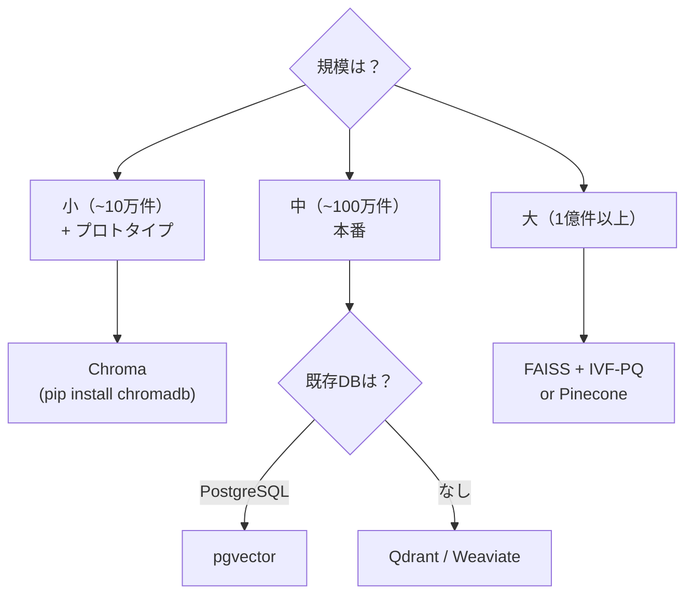
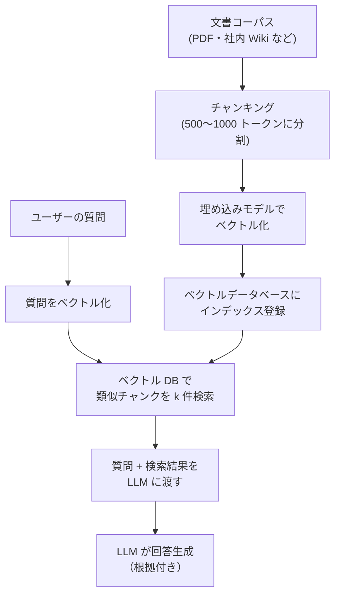

# ベクトルデータベース

意味的に類似したデータを高速に検索するためのデータベースです。テキスト・画像・音声を数百次元の「埋め込みベクトル」に変換し、近似最近傍探索（ANN）で高速に類似検索します。RAG（検索拡張生成）・セマンティック検索・画像類似検索の基盤技術です。

---

## はじめて読む人へ

「この文章と意味が似た文章を探す」——これは通常の SQL では難しい（文字列の完全一致しか検索できない）ですが、ベクトルデータベースなら「意味的な近さ」で検索できます。ChatGPT に社内文書を読ませる RAG システムの中核技術です。

### 読む前に押さえること

- [線形代数](線形代数) — ベクトル・内積・ノルム・コサイン類似度
- [LLM活用入門](LLM活用入門) — 埋め込みモデルの概念

### 読み終えたら説明できること

- 埋め込みベクトルによる意味検索の仕組みを説明できる
- HNSW・IVF などの ANN アルゴリズムの概要を説明できる
- RAG パイプラインでベクトルデータベースがどう使われるかを説明できる

---

## 埋め込みベクトルとは

### テキストの意味をベクトルで表す

```
「犬は哺乳類だ」  → [0.21, -0.54, 0.31, ..., 0.08]  (1536 次元)
「猫も哺乳類だ」  → [0.19, -0.51, 0.28, ..., 0.11]  ← 意味が近い → ベクトルも近い
「東京は日本の首都」→ [0.73,  0.12, -0.44, ..., 0.55]  ← 意味が遠い → ベクトルも遠い
```

埋め込みモデル（text-embedding-3、all-MiniLM など）が文章→ベクトルの変換を担います。

### 類似度の測定

| 指標 | 式 | 特徴 |
|------|-----|------|
| **コサイン類似度** | $\frac{a \cdot b}{\|a\|\|b\|}$ | 方向の類似度（[-1, 1]）。正規化済みなら内積と同じ |
| **内積（ドット積）** | $a \cdot b$ | スケールも考慮。OpenAI 埋め込みは内積推奨 |
| **L2 距離** | $\|a - b\|_2$ | 距離が小さいほど類似 |

埋め込みモデルの設計により最適な指標が異なります。ほとんどの最新モデルでは正規化済みベクトルを使うため、コサイン類似度と内積は等価です。

---

## 近似最近傍探索（ANN）

### 完全探索の限界

100 万件のベクトル（1,536 次元）を全件比較する場合：
- 1 件あたり $O(d \cdot N) = O(1536 \times 10^6)$ 回の演算
- リアルタイム検索には遅すぎる

**ANN：** 正確な最近傍ではなく、高確率で近い近傍を高速に返します。精度とスピードのトレードオフです。

### HNSW（Hierarchical Navigable Small World）

ベクトルデータベースで最も広く使われるアルゴリズムです。

**構造：**

```
レイヤー 2（まばら）:  ●         ●         ●
                      長距離リンク（ハイウェイ）
レイヤー 1:     ● ── ● ── ●   ● ── ● ── ●
                中距離リンク
レイヤー 0:  ●─●─●─●─●─●─●─●─●─●─●─●
（全ノード）  短距離リンク（精度の高い最終探索）
```

**検索手順：**
1. 上位レイヤーから「大まかに」近い方向に移動
2. 下のレイヤーに降りるほど「細かく」探索
3. レイヤー 0 で最終的な近傍を返す

**計算量：** $O(\log N)$ で検索（全件探索の $O(N)$ より大幅に速い）

**パラメータ：**
- `M`：各ノードのリンク数（大きいほど精度が上がるが、メモリと構築時間が増加）
- `ef_construction`：構築時の探索幅
- `ef_search`：検索時の探索幅

### IVF（Inverted File Index）

ベクトル空間を「クラスター」に分割し、クエリに近いクラスターのみを探索します。

```
事前処理（k-means でクラスタリング）:
  ・全ベクトルを k 個のセントロイドに割り当て
  ・各セントロイドに「所属ベクトルのリスト」を作成

検索:
  1. クエリに近い上位 nprobe 個のセントロイドを選ぶ
  2. そのセントロイドの所属ベクトルのみを全件比較
  3. 最も近いベクトルを返す
```

**計算量：** $O(k + n/k \cdot nprobe)$（$k$：クラスター数、$n$：全ベクトル数）

**IVF + PQ（Product Quantization）：** ベクトルをサブベクトルに分割してコードブックで量子化し、メモリを 8〜64 倍圧縮します。大規模データセット（1 億件以上）で使われます。

---

## 代表的なベクトルデータベース

| DB | 特徴 | 向いている用途 |
|----|------|-------------|
| **Chroma** | 組み込み型・Python ネイティブ・無料 | プロトタイプ・小〜中規模 |
| **FAISS** | Meta 製・純粋な ANN ライブラリ | 研究・高速ローカル処理 |
| **Pinecone** | フルマネージド SaaS | プロダクション・スケーラブル |
| **Weaviate** | ハイブリッド検索（ベクトル + キーワード）| 本番環境・複合検索 |
| **Qdrant** | Rust 製・高速・フィルタリング強力 | 本番環境・フィルタ検索 |
| **pgvector** | PostgreSQL 拡張 | 既存 PostgreSQL と統合 |

### 選択の指針



---

## RAG（検索拡張生成）でのベクトルDB

### RAG パイプライン



### チャンキング戦略

| 手法 | 特徴 | 推奨場面 |
|------|------|---------|
| 固定長 | シンプル。文の途中で切れる | プロトタイプ |
| 文区切り | 文の境界で分割 | 一般的なテキスト |
| 意味的チャンク | トピックの変化で分割 | 構造化文書 |
| 階層的 | 章→節→段落の階層を保持 | 長文書・マニュアル |

### ハイブリッド検索

ベクトル検索（意味的類似）+ キーワード検索（BM25）を組み合わせます。

```
クエリ: "東京の天気予報"
ベクトル検索: 「気象情報」「降水確率」など意味的に近い文書を取得
キーワード検索: "東京" "天気" を含む文書を取得
RRF (Reciprocal Rank Fusion): 2 つのランキングを統合
```

専門用語・固有名詞（製品名・人名）はベクトル検索が苦手なためキーワード検索で補います。

---

```python
# Chroma によるシンプルな RAG 実装
import chromadb
from chromadb.utils.embedding_functions import OpenAIEmbeddingFunction

client = chromadb.Client()
ef = OpenAIEmbeddingFunction(api_key="...", model_name="text-embedding-3-small")

collection = client.create_collection("docs", embedding_function=ef)

# インデックス登録
collection.add(
    documents=["東京は日本の首都です", "大阪は西日本最大の都市です"],
    ids=["doc1", "doc2"]
)

# 類似検索
results = collection.query(query_texts=["日本の首都について"], n_results=2)
print(results["documents"])
```

---

## 数学的導出

### HNSW の探索が $O(\log N)$ になる理由

HNSW はスモールワールドグラフ（Small World Graph）の性質を利用します。

**スモールワールドの性質：** $N$ ノードのグラフで、あるノードから別のノードへの最短経路長が $O(\log N)$ になる構造。SNS で「6 次の隔たり」と呼ばれる現象の数学的基礎です。

HNSW の階層構造はこれを人工的に構築します。上位レイヤーへの昇格確率を指数分布で決めることで、各レイヤーの密度が指数的に減少し、探索が $O(\log N)$ に収束します。

### コサイン類似度と内積の等価性

単位ベクトル（$\|a\| = \|b\| = 1$）のとき：

$$
\text{cosine}(a, b) = \frac{a \cdot b}{\|a\|\|b\|} = a \cdot b
$$

ほとんどの埋め込みモデルは L2 正規化済みのベクトルを出力するため、内積最大化 ≡ コサイン類似度最大化になります。FAISS の `IndexFlatIP`（内積）を使うのはこのためです。

---

## 確認問題

1. 全件線形探索が大規模データで使えない理由を計算量で説明してください。
2. HNSW の階層構造が「高速な検索」を実現する理由を、スモールワールドの性質と関連づけて説明してください。
3. RAG でチャンキングが必要な理由を「LLM のコンテキスト長」の観点から説明してください。
4. ハイブリッド検索がピュアなベクトル検索より優れる場面を 2 つ挙げてください。

---

## 関連ページ

- [LLMエージェント・RAG詳解](LLMエージェント-RAG) — RAG システム全体の設計
- [LLM活用入門](LLM活用入門) — 埋め込みモデルの使い方
- [Elasticsearch・全文検索](Elasticsearch) — キーワード検索との比較・ハイブリッド検索
- [線形代数](線形代数) — ベクトル・内積・コサイン類似度の数学
- [データベース詳解](データベース詳解) — 従来型 DB との使い分け

---

[← ホームへ](Home)
