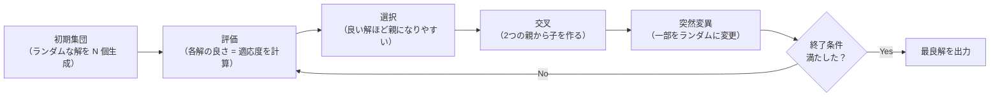
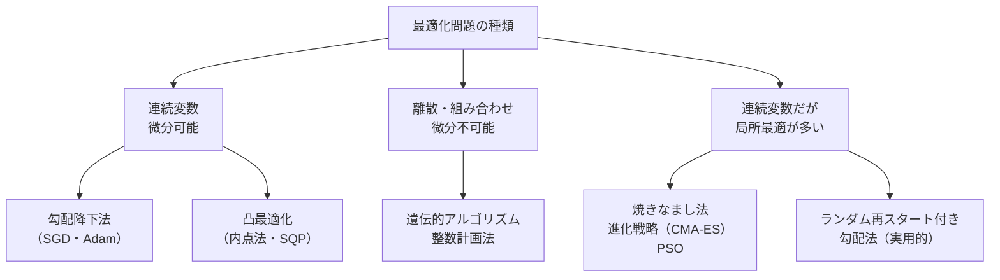

# メタヒューリスティクス（GA・焼きなまし法）

**勾配が使えない・目的関数が複雑すぎる・局所最適に罠にはまる**——こういった問題を解くために、自然や物理現象からヒントを得た探索アルゴリズム群です。遺伝的アルゴリズム・焼きなまし法・粒子群最適化などが代表例です。

---

## はじめて読む人へ

[最適化理論](最適化理論.md) で学んだ勾配法・KKT 条件は「なめらかな関数」に強力ですが、「組み合わせが爆発する問題」「不連続な目的関数」「局所最適が多い問題」には対応できません。メタヒューリスティクスはそういった問題への実用的なアプローチです。

### 読む前に押さえること

- [最適化理論](最適化理論.md) — 勾配法・凸最適化との違いを理解するために

### 読み終えたら説明できること

- 遺伝的アルゴリズムの「選択→交叉→突然変異」のサイクルを説明できる
- 焼きなまし法が局所最適を回避できる理由を説明できる
- 勾配法 vs メタヒューリスティクスの使い分けを説明できる

---

## なぜ勾配法だけでは足りないのか

**勾配法が使えない・難しい状況**

組み合わせ最適化:
「20都市を最短経路で巡回する（巡回セールスマン問題）」
→ 経路の数は 20! = 2.4 × 10^18 通り → 全探索不可能
→ 連続でないので微分できない

ブラックボックス最適化:
ニューラルネットワークのアーキテクチャ探索
「層の数・幅・活性化関数」の組み合わせ
→ 微分できない離散変数が混在

多峰性（局所最適が多数ある）:
f(x) = sin(x) + sin(3x) + sin(5x)
→ 勾配法はたまたま出発した近くの山頂に登るだけ
→ 本当の最高点を見つけられない可能性が高い
```python
import numpy as np
import matplotlib.pyplot as plt

# 多峰性関数の例（局所最適が多い）
def rastrigin(x, y):
    """Rastrigin 関数: 局所最適が格子状に並ぶ典型的なテスト関数"""
    return 20 + x**2 - 10*np.cos(2*np.pi*x) + y**2 - 10*np.cos(2*np.pi*y)

x = np.linspace(-5, 5, 300)
y = np.linspace(-5, 5, 300)
X, Y = np.meshgrid(x, y)
Z = rastrigin(X, Y)

plt.contourf(X, Y, Z, levels=30, cmap='viridis')
plt.colorbar()
plt.title("Rastrigin 関数（谷が格子状に並ぶ — 局所最適だらけ）")
plt.xlabel("x"); plt.ylabel("y")
plt.show()

# 最小値は (0, 0) で f=0 だが、勾配法は近くの谷に落ちやすい
```

---

## 遺伝的アルゴリズム（GA: Genetic Algorithm）

### 自然選択のメタファー

| 自然界の進化 | 遺伝的アルゴリズム |
|---|---|
| 個体群 → 環境で生き残れる個体が繁殖 → 子孫に形質が遺伝 | 解の集合（個体群） → 良い解ほど次世代に残る（選択） |
| → 突然変異で多様性 → 何世代もかけて適応 | → 2つの解を組み合わせる（交叉） → ランダムに変化（突然変異） |
|  | → 何世代も繰り返して良い解に収束 |
### GA の基本サイクル



### Python 実装（関数の最大化）

```python
import numpy as np

def genetic_algorithm(
    fitness_func,        # 最大化したい関数
    n_vars: int,         # 変数の数
    bounds: list,        # 各変数の範囲 [(min, max), ...]
    pop_size: int = 50,  # 個体群のサイズ
    n_generations: int = 100,
    crossover_rate: float = 0.8,
    mutation_rate: float = 0.01,
):
    """シンプルな遺伝的アルゴリズム"""
    rng = np.random.default_rng(42)

    # ── 初期集団の生成（ランダム）────────────────────
    population = np.array([
        [rng.uniform(b[0], b[1]) for b in bounds]
        for _ in range(pop_size)
    ])

    best_history = []

    for gen in range(n_generations):
        # ── 評価 ─────────────────────────────────────
        fitness = np.array([fitness_func(ind) for ind in population])
        best_history.append(fitness.max())

        # ── 選択（トーナメント選択）──────────────────
        def tournament_select():
            idx = rng.choice(pop_size, size=3, replace=False)
            winner = idx[np.argmax(fitness[idx])]
            return population[winner].copy()

        # ── 交叉（一様交叉）+ 突然変異 ───────────────
        new_population = []
        while len(new_population) < pop_size:
            parent1 = tournament_select()
            parent2 = tournament_select()

            # 交叉
            if rng.random() < crossover_rate:
                mask = rng.random(n_vars) < 0.5
                child = np.where(mask, parent1, parent2)
            else:
                child = parent1.copy()

            # 突然変異（各遺伝子を mutation_rate の確率で再ランダム化）
            for i in range(n_vars):
                if rng.random() < mutation_rate:
                    child[i] = rng.uniform(bounds[i][0], bounds[i][1])

            new_population.append(child)

        population = np.array(new_population)

    # 最終世代の最良解
    fitness = np.array([fitness_func(ind) for ind in population])
    best_idx = np.argmax(fitness)
    return population[best_idx], fitness[best_idx], best_history


# ── 使用例: Rastrigin 関数の最小化（= -f の最大化）──
def neg_rastrigin(x):
    return -(20 + x[0]**2 - 10*np.cos(2*np.pi*x[0])
               + x[1]**2 - 10*np.cos(2*np.pi*x[1]))

best_x, best_f, history = genetic_algorithm(
    fitness_func=neg_rastrigin,
    n_vars=2,
    bounds=[(-5, 5), (-5, 5)],
    pop_size=100,
    n_generations=200,
)
print(f"最良解: x={best_x.round(4)}, f={-best_f:.4f}")
# 最良解: x≈[0, 0], f≈0

import matplotlib.pyplot as plt
plt.plot(history); plt.xlabel("世代"); plt.ylabel("最良適応度（-f）")
plt.title("GA の収束"); plt.show()
```

### 交叉の種類

| 名前 | 仕組み | 向いている問題 |
|------|--------|--------------|
| **一点交叉** | ある位置で前半・後半を入れ替える | 順序が意味を持つ配列 |
| **一様交叉** | 各遺伝子を確率 0.5 で入れ替える | 独立した変数 |
| **BLX-α交叉** | 親の間の領域からランダムに生成 | 連続変数 |
| **順序交叉（OX）** | 順序を壊さないように組み合わせる | 巡回セールスマン問題 |

---

## 焼きなまし法（SA: Simulated Annealing）

### 金属の「焼きなまし」からのアナロジー

| 金属の焼きなまし（物理） | 焼きなまし法 |
|---|---|
| 高温: 原子が活発に動き回る → エネルギーが低い安定状態を探す | 高温（初期）: 悪い解でも受け入れる確率が高い → 局所最適から脱出できる |
| 徐々に冷却: 動きが鈍くなる → 最終的に安定な結晶構造に落ち着く | 徐々に冷却: 受け入れ確率が下がる → 良い解の周辺で精密に探索 |
|  | 低温（最終）: ほぼ改善のみ受け入れる → 収束 |
### 受理確率の数式

現在の解 $x$、新しい解 $x'$、温度 $T$ とします。

$$
P(\text{受理}) =
\begin{cases}
1 & \text{if } f(x') \leq f(x) \text{ （改善している）} \\
\exp\!\left(-\dfrac{f(x') - f(x)}{T}\right) & \text{if } f(x') > f(x) \text{ （悪化している）}
\end{cases}
$$

温度 $T$ が高いとき：$\exp(-\Delta/T) \approx 1$ → 悪化しても受け入れやすい  
温度 $T$ が低いとき：$\exp(-\Delta/T) \approx 0$ → 改善のみ受け入れる

```python
import numpy as np
import math

def simulated_annealing(
    objective,            # 最小化する関数
    x_init: np.ndarray,
    bounds: list,
    T_init: float = 100.0,    # 初期温度
    T_final: float = 0.01,    # 最終温度
    n_steps: int = 10000,
    step_size: float = 0.5,
):
    """焼きなまし法"""
    rng = np.random.default_rng(42)
    x = x_init.copy()
    f = objective(x)
    best_x, best_f = x.copy(), f
    history = [f]

    for step in range(n_steps):
        # 温度を指数的に下げる（冷却スケジュール）
        T = T_init * (T_final / T_init) ** (step / n_steps)

        # 近傍解の生成
        x_new = x + rng.normal(0, step_size, size=len(x))
        x_new = np.clip(x_new, [b[0] for b in bounds], [b[1] for b in bounds])
        f_new = objective(x_new)

        delta = f_new - f

        # 受理判定
        if delta < 0 or rng.random() < math.exp(-delta / T):
            x, f = x_new, f_new
            if f < best_f:
                best_x, best_f = x.copy(), f

        history.append(best_f)

    return best_x, best_f, history


# Rastrigin 関数の最小化
def rastrigin(x):
    return 20 + sum(xi**2 - 10*np.cos(2*np.pi*xi) for xi in x)

result_x, result_f, history = simulated_annealing(
    rastrigin,
    x_init=np.array([3.0, 3.0]),
    bounds=[(-5, 5), (-5, 5)],
)
print(f"最良解: x={result_x.round(4)}, f={result_f:.4f}")
```

---

## 粒子群最適化（PSO: Particle Swarm Optimization）

### 鳥の群れ・魚の群れからのアナロジー

**群れの動き**

各個体は「自分が今まで見つけた最良の位置」と
「群れ全体の最良の位置」の両方に引き寄せられながら飛ぶ
$$
v_i \leftarrow w \cdot v_i + c_1 r_1 (\underbrace{p_i - x_i}_{\text{自分の最良に引き寄せ}}) + c_2 r_2 (\underbrace{g - x_i}_{\text{群れの最良に引き寄せ}})
$$

$$
x_i \leftarrow x_i + v_i
$$

```python
import numpy as np

def pso(objective, bounds, n_particles=30, n_iterations=100, w=0.7, c1=1.5, c2=1.5):
    """粒子群最適化"""
    rng = np.random.default_rng(42)
    n_dims = len(bounds)
    lo = np.array([b[0] for b in bounds])
    hi = np.array([b[1] for b in bounds])

    # 初期化
    X = rng.uniform(lo, hi, (n_particles, n_dims))  # 位置
    V = rng.uniform(-1, 1,  (n_particles, n_dims))  # 速度
    pBest_X = X.copy()                               # 個人最良位置
    pBest_f = np.array([objective(x) for x in X])
    gBest_idx = np.argmin(pBest_f)
    gBest_X = pBest_X[gBest_idx].copy()             # 群れ最良位置

    history = [pBest_f.min()]

    for _ in range(n_iterations):
        r1 = rng.random((n_particles, n_dims))
        r2 = rng.random((n_particles, n_dims))

        V = w * V + c1 * r1 * (pBest_X - X) + c2 * r2 * (gBest_X - X)
        X = np.clip(X + V, lo, hi)

        f = np.array([objective(x) for x in X])

        # 個人最良の更新
        improved = f < pBest_f
        pBest_X[improved] = X[improved]
        pBest_f[improved] = f[improved]

        # 群れ最良の更新
        if pBest_f.min() < objective(gBest_X):
            gBest_X = pBest_X[np.argmin(pBest_f)].copy()

        history.append(pBest_f.min())

    return gBest_X, pBest_f.min(), history


best_x, best_f, hist = pso(rastrigin, bounds=[(-5,5)]*2)
print(f"PSO 最良解: x={best_x.round(4)}, f={best_f:.4f}")
```

---

## 機械学習への応用

### ハイパーパラメータ最適化

```python
# optuna はベイズ最適化（ガウス過程 + 獲得関数）を内部で使う
import optuna
optuna.logging.set_verbosity(optuna.logging.WARNING)

from sklearn.ensemble import RandomForestClassifier
from sklearn.datasets import load_iris
from sklearn.model_selection import cross_val_score

data = load_iris()

def objective(trial):
    params = {
        "n_estimators":  trial.suggest_int("n_estimators", 10, 200),
        "max_depth":     trial.suggest_int("max_depth", 2, 20),
        "min_samples_split": trial.suggest_int("min_samples_split", 2, 10),
    }
    model = RandomForestClassifier(**params, random_state=42)
    score = cross_val_score(model, data.data, data.target, cv=5).mean()
    return score   # 最大化

study = optuna.create_study(direction="maximize")
study.optimize(objective, n_trials=50)

print(f"最良パラメータ: {study.best_params}")
print(f"最良スコア: {study.best_value:.4f}")
```

### ニューラルアーキテクチャ探索（NAS）

遺伝的アルゴリズムは「層の数・接続方法・活性化関数」などの**離散的な設計変数**を最適化するのに使われます。Google の AutoML・EfficientNet の設計でも進化的手法が使われました。

---

## 手法の使い分け



| 手法 | 強み | 弱み |
|------|------|------|
| **勾配法** | 高速・理論的保証 | 局所最適・微分が必要 |
| **遺伝的アルゴリズム** | 離散問題・並列化容易 | 計算コスト大・パラメータ調整が必要 |
| **焼きなまし法** | 局所最適回避・シンプル | 冷却スケジュールの設定が難しい |
| **PSO** | 実装が簡単・連続変数に強い | 離散問題には弱い |
| **ベイズ最適化** | 評価回数が少なくて済む | 高次元に弱い |

---

## 確認問題

1. 遺伝的アルゴリズムの「突然変異」が必要な理由を、「局所最適」の概念を使って説明してください。
2. 焼きなまし法で「温度が高いとき、悪い解でも受け入れる」のはなぜですか？局所最適との関係で説明してください。
3. ハイパーパラメータ探索（学習率・層の数など）に勾配法が使えない理由を説明してください。

---

## 関連ページ

- [最適化理論（凸最適化・KKT）](最適化理論.md) — 勾配法・ラグランジュ乗数・双対問題
- [微分・最適化基礎](微分・最適化基礎.md) — 勾配降下法・Adam の仕組み
- [モデル評価・チューニング](モデル評価-チューニング.md) — Optuna によるハイパーパラメータ最適化の実践
- [確率過程](確率過程.md) — 焼きなまし法の確率論的背景
