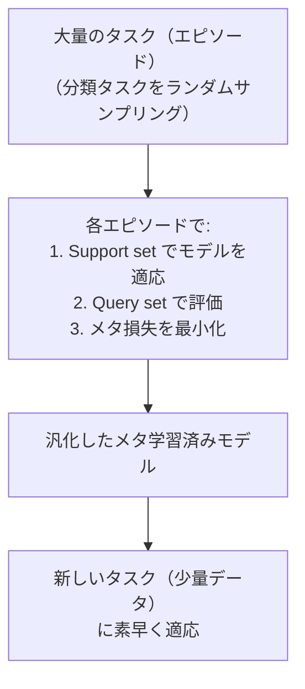

# メタ学習・Few-shot Learning

「少ないデータから素早く学習する」能力を学習する手法群です。「学習の仕方を学ぶ（Learning to Learn）」というメタ学習の視点と、数枚のサンプルから分類できる Few-shot Learning の手法を扱います。医療・希少言語・ロボット制御など、大量のラベルデータが得られない場面で重要です。

---

## はじめて読む人へ

人間は「ゴールデンレトリバー」を 5 枚の写真で見れば新しい個体を認識できます。しかし標準的な CNN は「1 クラス 1000 枚以上」のデータが必要です。Few-shot Learning はこのギャップを埋めます。また「In-Context Learning（プロンプトに例を数件入れるだけで GPT-4 が従う）」もメタ学習の一形態です。

### 読む前に押さえること

- [深層学習入門](深層学習入門) — NN の基礎
- [自己教師あり学習](自己教師あり学習) — 事前学習の概念
- [距離学習・埋め込み](線形代数) — ベクトル類似度

### 読み終えたら説明できること

- N-way K-shot 問題の定義を説明できる
- Prototypical Networks が「クラス中心との距離で分類」する仕組みを説明できる
- MAML が「どのタスクでも素早く適応できる初期値」を学ぶ仕組みを説明できる

---

## Few-shot Learning の問題設定

### N-way K-shot 分類

!!! info ""
    **Support set（少量の学習サンプル）**

    クラス A: [画像1, 画像2]   ← K=2 サンプル
    クラス B: [画像3, 画像4]
    クラス C: [画像5, 画像6]
    N=3 クラス、K=2 サンプル → 3-way 2-shot 問題

    **Query set（分類したいサンプル）**

    ? → クラス A か B か C か？
- **N-way：** 分類先のクラス数
- **K-shot：** クラスあたりの学習サンプル数
- **1-shot：** 1 枚だけで学習（最も難しい）
- **Zero-shot：** サンプルなしで分類

---

## メタ学習の枠組み

### エピソード学習（Episode Training）



**重要：** 通常の学習と異なり、「タスクを素早くこなせるか」がメタ損失です。各エピソードがランダムなタスクになるため、「どんなタスクでも素早く適応できる」能力を学習します。

---

## Prototypical Networks

### 基本アイデア

「各クラスのサンプルの平均埋め込みをプロトタイプとし、クエリとの距離で分類する」

!!! info ""
    **Support set のサンプルを埋め込み**

    クラス A: [embed(a₁), embed(a₂)] → 平均 → プロトタイプ cA
    クラス B: [embed(b₁), embed(b₂)] → 平均 → プロトタイプ cB
    クラス C: [embed(c₁), embed(c₂)] → 平均 → プロトタイプ cC

    **クエリ q の分類**

    d(embed(q), cA) = 0.3  ← 最小 → クラス A に分類
    d(embed(q), cB) = 1.2
    d(embed(q), cC) = 0.9
**分類確率：**

$$
P(y = k \mid x) = \frac{\exp(-d(f_\phi(x), c_k))}{\sum_j \exp(-d(f_\phi(x), c_j))}
$$

$f_\phi$：埋め込みネットワーク（学習対象）、$d$：距離関数（L2 またはコサイン）。

**エピソード学習で埋め込みネットワークを最適化：** Support set のプロトタイプを使って Query set の分類精度を最大化するよう $f_\phi$ を学習します。

### なぜ機能するのか

埋め込み空間で「同クラスは密集、異クラスは分離」するよう学習が進むと、新クラス（未学習のクラス）でも「少数サンプルのプロトタイプ」が意味のある中心になります。

---

## MAML（Model-Agnostic Meta-Learning）

### アイデア

「どのタスクでも、数ステップの勾配更新で良い性能を出せる初期値 $\theta$ を学習する」

!!! info ""
    ```text
    通常の学習: θ → タスク A に最適化 → θ_A
               θ → タスク B に最適化 → θ_B

    MAML:      θ を探す（メタ学習）
                ↓数ステップの更新でどのタスクでも良くなる初期値
               θ + αΔθ_A ≈ タスク A で良い性能
               θ + αΔθ_B ≈ タスク B で良い性能
               ...全タスクで良い性能
    ```
### MAML の更新式

**内側ループ（タスク適応）：**

$$
\theta_i' = \theta - \alpha \nabla_\theta \mathcal{L}_{\mathcal{T}_i}(f_\theta)
$$

各タスク $\mathcal{T}_i$ の Support set での勾配で $\theta$ を更新（固定 $\alpha$ ステップ）。

**外側ループ（メタ最適化）：**

$$
\theta \leftarrow \theta - \beta \nabla_\theta \sum_{\mathcal{T}_i} \mathcal{L}_{\mathcal{T}_i}(f_{\theta_i'})
$$

内側ループで適応した $\theta_i'$ を使って Query set で評価し、その損失の $\theta$ に関する勾配でメタ最適化します。

**二階微分：** 外側の勾配 $\nabla_\theta \mathcal{L}(f_{\theta'})$ は「$\theta \to \theta'$ という変換を通した勾配」なので、二階微分が必要です。

### First-Order MAML（FOMAML）

二階微分を無視して一階近似を使う省メモリ版。実用的には MAML とほぼ同等の性能が得られます。

---

## 距離学習（Metric Learning）

Few-shot の性能は埋め込みの質に大きく依存します。

### Siamese Network

同じネットワークを 2 つの入力で共有し、「同じクラスか違うクラスか」の二値判定を学習します。

$$
\mathcal{L} = y \cdot d^2 + (1-y) \cdot \max(0, m - d)^2
$$

$y$：同クラスなら 1、異クラスなら 0、$m$：マージン。

### Triplet Loss

アンカー $a$、正例 $p$（同クラス）、負例 $n$（異クラス）のトリプレットで学習します。

$$
\mathcal{L} = \max(0,\; d(f(a), f(p)) - d(f(a), f(n)) + m)
$$

「正例との距離 < 負例との距離 + マージン」になるよう学習します。

---

## In-Context Learning（LLM とメタ学習）

### 大規模言語モデルのゼロ・Few-shot

!!! info ""
    **Few-shot プロンプト（GPT への入力）**

    Q: 「映画が面白かった」の感情は？
    A: ポジティブ

    Q: 「料理がまずかった」の感情は？
    A: ネガティブ

    Q: 「サービスが丁寧でした」の感情は？  ← クエリ
    A: ← LLM が答える
これは「プロンプトに含まれた例（Support set）から学習する」という Few-shot Learning に他なりません。ただし LLM の重みは更新されない——**推論時の文脈から「動的に」適応**します。

**MAML との接続：** Transformer の Self-Attention は、文脈内の例を「内部メモリ」として使うメタ学習器であるという理論的解釈があります（"Transformers as Meta-Learners"）。

---

## 数学的導出

### Prototypical Networks が Mahalanobis 距離に対応する場合

ガウス混合モデル（GMM）の観点から Prototypical Networks を解釈できます。各クラス $k$ の分布を $\mathcal{N}(c_k, \sigma^2 I)$ と仮定すると：

$$
P(y = k \mid x) \propto \exp\!\left(-\frac{\|f(x) - c_k\|^2}{2\sigma^2}\right)
$$

これは Prototypical Networks のユークリッド距離版と一致します。対角共分散を学習可能にすると Mahalanobis 距離になり、より一般的な特徴空間の歪みを扱えます。

### MAML の収束条件

MAML の外側ループの勾配は：

$$
\nabla_\theta \mathcal{L}(\theta_i') = \nabla_{\theta_i'} \mathcal{L}(\theta_i') \cdot \left(I - \alpha \nabla^2_\theta \mathcal{L}_{\text{train}}\right)
$$

ヤコビアン $I - \alpha H$（$H$：ヘッシアン）が 1 より小さな固有値を持つとき（$\alpha < 1/\lambda_{\max}$）、内側ループが収束します。これが「内側の学習率 $\alpha$ を小さく設定する」理由です。

---

## 確認問題

1. Prototypical Networks がゼロから学習した分類器と異なる理由を、エピソード学習の観点から説明してください。
2. MAML の「内側ループ」と「外側ループ」がそれぞれ何を最適化しているかを説明してください。
3. LLM の In-Context Learning がメタ学習の一形態である理由を、「Support set」「Query」の対応で説明してください。
4. Few-shot Learning が「通常の Fine-tuning + 少データ」より有効な理由を説明してください。

---

## 関連ページ

- [自己教師あり学習](自己教師あり学習) — 良い埋め込みのための事前学習
- [深層学習入門](深層学習入門) — NN の基礎
- [ファインチューニング詳解](ファインチューニング詳解) — Few-shot と Fine-tuning の使い分け
- [LLMエージェント・RAG詳解](LLMエージェント-RAG) — In-Context Learning の実践
- [マルチモーダルAI](マルチモーダルAI) — CLIP のゼロショット分類

---

[← ホームへ](Home)
