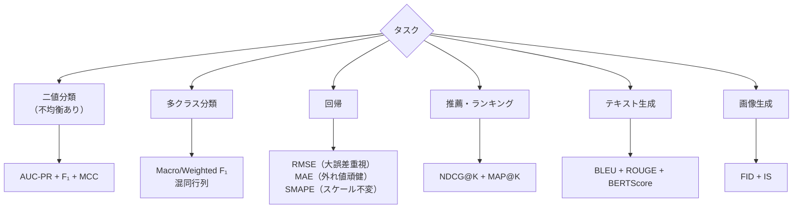

# モデル評価指標詳解

精度だけでは分からないモデルの品質を多角的に測る指標群です。不均衡データの評価・マルチラベル分類・回帰の詳細指標・ランキング評価・生成モデルの評価（FID・BLEU・BERTScore）・キャリブレーションを扱います。評価指標の選択ミスが実務上の大きな失敗につながることがあります。

---

## はじめて読む人へ

「精度（Accuracy）95%」のスパムフィルタが「すべてスパムでない」と判定し続けても、スパムが 5% しかなければ Accuracy は 95% になります。これが **クラス不均衡問題** です。正しい指標を選ぶことは、正しいモデルを選ぶことと同じくらい重要です。

### 読む前に押さえること

- [モデル評価・チューニング](モデル評価-チューニング) — 基本的な交差検証・ROC-AUC

### 読み終えたら説明できること

- 不均衡データで Precision・Recall・F1 を使う理由を説明できる
- macro/micro/weighted 平均の違いを説明できる
- FID・BLEU・BERTScore が何を評価しているかを説明できる

---

## 分類指標の体系

### 混同行列（Confusion Matrix）

|  | 予測: Positive | 予測: Negative |
|--|----------------|----------------|
| **実際: Positive** | TP（真陽性）| FN（偽陰性）|
| **実際: Negative** | FP（偽陽性）| TN（真陰性）|

$$
\text{Accuracy} = \frac{TP+TN}{TP+FP+FN+TN} \quad \text{（不均衡で意味を失う）}
$$

$$
\text{Precision} = \frac{TP}{TP+FP} \quad \text{（陽性と予測した中で本当に陽性の割合）}
$$

$$
\text{Recall} = \frac{TP}{TP+FN} \quad \text{（実際の陽性を見つけられた割合）}
$$

$$
F_1 = \frac{2 \cdot \text{Precision} \cdot \text{Recall}}{\text{Precision} + \text{Recall}} \quad \text{（Precision と Recall の調和平均）}
$$

$$
F_\beta = \frac{(1+\beta^2) \cdot P \cdot R}{\beta^2 \cdot P + R} \quad \text{（Recall を } \beta \text{ 倍重視）}
$$

### Precision-Recall トレードオフ

!!! info ""
    ```
    閾値を下げる（陽性と判定しやすくする）:
      Recall ↑（見逃しが減る）
      Precision ↓（偽陽性が増える）
    
    医療診断（見逃し厳禁）: Recall 重視 → F₂ (β=2)
    スパムフィルタ（誤検出厳禁）: Precision 重視 → F₀.₅ (β=0.5)
    ```

---

## 不均衡データへの対応

### クラス不均衡の影響

!!! info ""
    ```
    スパム検出: 正常 99% / スパム 1%
      「すべて正常」予測 → Accuracy: 99%、Recall（スパム）: 0%
      → 使えないモデルなのに Accuracy は高い
    ```

### 推奨指標

| 状況 | 推奨指標 |
|------|---------|
| 不均衡 + Precision/Recall 両方重要 | AUC-PR（PR 曲線の面積）|
| 不均衡 + FP/FN のコストが異なる | $F_\beta$（コストに合わせた $\beta$）|
| 不均衡 + ランキング重視 | AUC-ROC |
| 重大な少数クラス | **Cohen's Kappa**・MCC |

### MCC（Matthews Correlation Coefficient）

$$
\text{MCC} = \frac{TP \cdot TN - FP \cdot FN}{\sqrt{(TP+FP)(TP+FN)(TN+FP)(TN+FN)}}
$$

$-1$〜$+1$ の範囲。不均衡データでも意味のある評価ができる指標として近年注目されています。

---

## マルチクラス・マルチラベル評価

### 3 種類の平均

クラス数 $C$ のマルチクラス問題で各クラスの F1 を集約する方法：

| 平均方法 | 計算方法 | 適した場面 |
|---------|---------|---------|
| **Macro** | 各クラスの F1 を単純平均 | 全クラスを均等に重視 |
| **Weighted** | 各クラスのサンプル数で加重平均 | クラス不均衡があるとき |
| **Micro** | 全サンプルの TP/FP/FN を統合して計算 | サンプルレベルで均等 |

```python
from sklearn.metrics import f1_score

f1_macro    = f1_score(y_true, y_pred, average='macro')
f1_weighted = f1_score(y_true, y_pred, average='weighted')
f1_micro    = f1_score(y_true, y_pred, average='micro')
```

### マルチラベル分類

1 つのサンプルに複数のラベルが付く場合（記事のタグ付け・マルチラベル画像分類）。

| 指標 | 計算方法 | 特徴 |
|------|---------|------|
| **Exact Match Ratio** | 全ラベル完全一致の割合 | 厳格すぎることが多い |
| **Hamming Loss** | 誤ったラベルの割合（全ラベルに対して）| 部分一致を考慮 |
| **Macro/Micro F1** | 各ラベルの F1 を平均 | 最もよく使われる |

---

## 回帰の評価指標

| 指標 | 式 | 特徴 |
|------|-----|------|
| **MAE** | $\frac{1}{n}\sum|y_i - \hat{y}_i|$ | 外れ値に頑健 |
| **RMSE** | $\sqrt{\frac{1}{n}\sum(y_i-\hat{y}_i)^2}$ | 大きな誤差を強調 |
| **MAPE** | $\frac{100}{n}\sum\left|\frac{y_i-\hat{y}_i}{y_i}\right|$ | スケール不変（$y_i=0$ で不定）|
| **SMAPE** | $\frac{200}{n}\sum\frac{|y_i-\hat{y}_i|}{|y_i|+|\hat{y}_i|}$ | MAPE の改良（対称・ゼロ安全）|
| **R²** | $1 - SS_{\text{res}}/SS_{\text{tot}}$ | 1 に近いほど良い（負もあり）|
| **Huber Loss** | MAE と MSE の組み合わせ | 外れ値に半頑健 |

**MAPE vs SMAPE：** MAPE は真の値 $y_i$ が小さいと誤差が過大評価される。SMAPE は分母を「真の値と予測値の平均」にして対称にします。時系列予測コンペ（M4 コンペティション）では SMAPE が標準評価指標として使われました。

---

## ランキング評価

推薦システム・情報検索での評価指標です。

### Precision@K・Recall@K

上位 K 件の推薦に対する適合率・再現率。

$$
\text{Precision@K} = \frac{\text{上位 K 件の中の関連アイテム数}}{K}
$$

### NDCG（Normalized Discounted Cumulative Gain）

関連アイテムが**上位**に来るほどスコアが高い指標。

$$
\text{DCG@K} = \sum_{i=1}^K \frac{2^{r_i} - 1}{\log_2(i+1)}
$$

$r_i$：位置 $i$ のアイテムの関連度スコア（クリック=1、購入=3 など）。分母の $\log_2(i+1)$ で順位が下がるほど割り引かれます。

NDCG = DCG / Ideal DCG（最良の順位での DCG で正規化）。

### MAP（Mean Average Precision）

各クエリの AP（Precision の平均）を全クエリで平均。

$$
\text{AP} = \frac{\sum_{k=1}^K \text{Precision@k} \times \text{Relevant}(k)}{|\text{関連アイテム数}|}
$$

---

## 生成モデルの評価

### FID（Fréchet Inception Distance）

生成画像と実画像の分布の距離を測ります。

**計算手順：**
1. Inception v3 で実画像・生成画像を中間特徴量に変換
2. 各特徴量分布をガウス分布でフィット（平均 $\mu$・共分散 $\Sigma$）
3. Fréchet 距離を計算：

$$
\text{FID} = \|\mu_r - \mu_g\|^2 + \text{tr}\!\left(\Sigma_r + \Sigma_g - 2\sqrt{\Sigma_r\Sigma_g}\right)
$$

FID が小さいほど生成画像が実画像の分布に近い。

### BLEU（Bilingual Evaluation Understudy）

機械翻訳・テキスト生成の自動評価指標。N-gram の一致を測ります。

$$
\text{BLEU-N} = \text{BP} \cdot \exp\!\left(\sum_{n=1}^N w_n \log p_n\right)
$$

- $p_n$：N-gram 適合率（予測テキスト中の N-gram のうち正解に含まれる割合）
- $\text{BP}$：短い出力へのペナルティ（Brevity Penalty）

**BLEU の限界：** 表現の多様性・意味的な類似性を考慮しない。

### BERTScore

BERT の文脈的埋め込みを使って、単語レベルのコサイン類似度で意味的な類似性を評価します。

$$
P_{\text{BERTScore}} = \frac{1}{|c|}\sum_{c_j \in c} \max_{r_i \in r} \cos(\mathbf{c}_j, \mathbf{r}_i)
$$

単純な N-gram 一致より意味を考慮した評価が可能です。

### ROUGE（Recall-Oriented Understudy for Gisting Evaluation）

文書要約の評価指標。

| 変種 | 計算方法 |
|------|---------|
| ROUGE-N | N-gram の Recall |
| ROUGE-L | 最長共通部分列（LCS）の長さに基づく |
| ROUGE-S | スキップ bigram |

### IS（Inception Score）

生成画像の「多様性」と「鮮明さ」を同時に評価。

$$
\text{IS} = \exp\!\left(\mathbb{E}_x[D_{\text{KL}}(p(y|x) \| p(y))]\right)
$$

$p(y|x)$：Inception v3 の条件付き分類確率（鮮明な画像ほどエントロピー低い）。$p(y)$：全生成画像の周辺分布（多様ならエントロピー高い）。

---

## キャリブレーション

モデルが「70% と言ったとき、本当に 70% の確率で正解しているか」を測ります。

### ECE（Expected Calibration Error）

$$
\text{ECE} = \sum_{m=1}^M \frac{|B_m|}{n} \left|\text{acc}(B_m) - \text{conf}(B_m)\right|
$$

予測確率を $M$ 個のビンに分け、各ビンの「平均確率」と「実際の正解率」の差の加重平均。

### Reliability Diagram

!!! info ""
    ```
    実際の正解率
     1.0  │              ★
     0.8  │          ★  
          │      ★      完璧なキャリブレーション（対角線）
     0.6  │  ★
     0.4  │
     0.2  │★
     0.0  └─────────────── 予測確率
          0.0 0.2 0.4 0.6 0.8 1.0
    
    点が対角線から外れるほどキャリブレーションが悪い
    ```

### Temperature Scaling

訓練後のキャリブレーション改善。Softmax の前に温度パラメータ $T$ を適用：

$$
p_i = \frac{\exp(z_i / T)}{\sum_j \exp(z_j / T)}
$$

$T > 1$：予測確率を均等化（過信を修正）、$T < 1$：予測確率を尖らせる。検証セットで ECE を最小化する $T$ を探索します。

---

## 評価指標の選択ガイド



---

## 確認問題

1. Accuracy が不均衡データで適切でない理由を、スパム検出の例で説明してください。
2. macro F1 と weighted F1 の違いを「クラスの重み付け」の観点から説明してください。
3. FID が低いほど「良い生成モデル」と言える理由を、特徴量分布の距離の観点から説明してください。
4. Temperature Scaling がキャリブレーションを改善する仕組みを説明してください。

---

## 関連ページ

- [モデル評価・チューニング](モデル評価-チューニング) — 交差検証・ROC-AUC の基礎
- [教師あり学習](教師あり学習) — 分類問題全般
- [生成モデル（GAN・VAE・Diffusion）](生成モデル) — FID・IS の文脈
- [NLP基礎](NLP基礎) — BLEU・ROUGE の文脈
- [レコメンデーションシステム](レコメンデーション) — NDCG・MAP の応用

---

[← ホームへ](Home)
