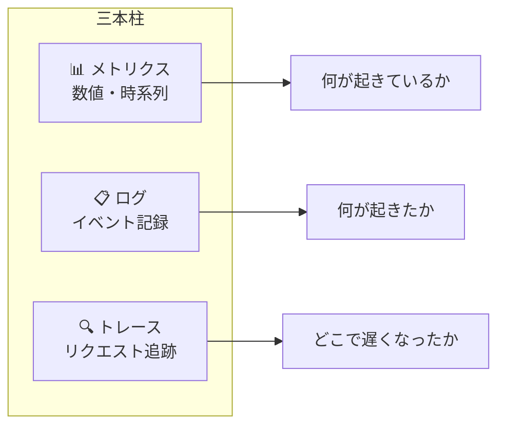

# モニタリング・可観測性

本番システムが「今どう動いているか」を把握し、問題を早期に検知・診断する実践です。可観測性（Observability）は **メトリクス・ログ・トレース** の三本柱から成り、「何かが壊れたとき、コードを変更せずに原因を特定できるか」を指標にします。

---

## はじめて読む人へ

「動いているから大丈夫」では本番運用は成立しません。レイテンシが 10 倍になっても気づかない、エラーが毎分起きていても知らない、という状態を避けるために監視を仕込みます。

### 読む前に押さえること

- [Docker](Docker.md) のコンテナ・docker-compose の基本
- [FastAPI](FastAPI.md) のエンドポイント実装の基本

### 読み終えたら説明できること

- メトリクス・ログ・トレースの違いと役割を説明できる
- Prometheus + Grafana の構成と動作を説明できる
- FastAPI に構造化ログとメトリクスを組み込める

---

## 可観測性の三本柱



| | メトリクス | ログ | トレース |
|--|----------|------|---------|
| 形式 | 数値の時系列 | テキスト（構造化推奨）| スパンの連鎖 |
| 用途 | ダッシュボード・アラート | デバッグ・監査 | ボトルネック特定 |
| 問いかけ | 「レイテンシは何ms?」 | 「エラーの詳細は?」 | 「DB が遅い?」 |
| ツール | Prometheus, Datadog | stdout, Loki, CloudWatch | Jaeger, Zipkin, OpenTelemetry |

---

## メトリクス：Prometheus + Grafana

### 構成

!!! info ""
    ```
    FastAPIアプリ → /metrics エンドポイント（Prometheus 形式）
            ↑
    Prometheus がスクレイプ（定期収集）
            ↓
    Grafana がビジュアライズ
            ↓
    アラートルールが閾値を超えたら通知
    ```

### FastAPI にメトリクスを追加

```bash
pip install prometheus-fastapi-instrumentator
```

```python
from fastapi import FastAPI
from prometheus_fastapi_instrumentator import Instrumentator

app = FastAPI()

# /metrics エンドポイントを自動追加
Instrumentator().instrument(app).expose(app)
```

これだけで以下のメトリクスが自動計測されます：
- `http_requests_total` — リクエスト総数（メソッド・パス・ステータスコード別）
- `http_request_duration_seconds` — レイテンシのヒストグラム
- `http_requests_in_progress` — 処理中リクエスト数

### カスタムメトリクスを追加

```python
from prometheus_client import Counter, Histogram, Gauge
import time

# カウンター：増えるだけの値（リクエスト数・エラー数）
prediction_requests = Counter(
    "ml_prediction_requests_total",
    "MLモデルへのリクエスト数",
    ["model_name", "status"]
)

# ヒストグラム：分布を記録（レイテンシ・ファイルサイズ）
prediction_latency = Histogram(
    "ml_prediction_duration_seconds",
    "ML推論にかかった時間",
    buckets=[0.01, 0.05, 0.1, 0.5, 1.0, 5.0]
)

# ゲージ：増減する値（キュー長・接続数・モデル精度）
model_accuracy = Gauge("ml_model_accuracy", "現在のモデル精度")

@app.post("/predict")
def predict(data: dict):
    start = time.time()
    try:
        result = run_model(data)
        prediction_requests.labels(model_name="v2", status="success").inc()
        return result
    except Exception as e:
        prediction_requests.labels(model_name="v2", status="error").inc()
        raise
    finally:
        prediction_latency.observe(time.time() - start)
```

### docker-compose で Prometheus + Grafana を立てる

```yaml
# docker-compose.yml
services:
  app:
    build: .
    ports:
      - "8000:8000"

  prometheus:
    image: prom/prometheus:latest
    ports:
      - "9090:9090"
    volumes:
      - ./prometheus.yml:/etc/prometheus/prometheus.yml

  grafana:
    image: grafana/grafana:latest
    ports:
      - "3000:3000"
    environment:
      - GF_SECURITY_ADMIN_PASSWORD=admin
```

```yaml
# prometheus.yml
global:
  scrape_interval: 15s

scrape_configs:
  - job_name: "fastapi"
    static_configs:
      - targets: ["app:8000"]
```

---

## ログ：構造化ログ

`print()` や平文ログは検索しにくく、大量になると役に立ちません。**構造化ログ**（JSON 形式）にすることで、ログ収集ツールが自動でパース・検索できます。

### structlog で構造化ログ

```bash
pip install structlog
```

```python
import structlog
import logging

# ログ設定
structlog.configure(
    processors=[
        structlog.stdlib.filter_by_level,
        structlog.stdlib.add_log_level,
        structlog.stdlib.add_logger_name,
        structlog.processors.TimeStamper(fmt="iso"),
        structlog.processors.JSONRenderer(),  # JSON 出力
    ],
    wrapper_class=structlog.stdlib.BoundLogger,
    logger_factory=structlog.stdlib.LoggerFactory(),
)

log = structlog.get_logger()

# 使い方
log.info("user_login", user_id=123, ip="192.168.1.1")
# → {"event": "user_login", "user_id": 123, "ip": "192.168.1.1", "level": "info", "timestamp": "..."}

log.error("payment_failed", user_id=456, amount=1000, reason="card_declined")
# → {"event": "payment_failed", "user_id": 456, "amount": 1000, "reason": "card_declined", ...}
```

### FastAPI のリクエストログ

```python
import time
import uuid
from fastapi import FastAPI, Request

app = FastAPI()
log = structlog.get_logger()

@app.middleware("http")
async def logging_middleware(request: Request, call_next):
    request_id = str(uuid.uuid4())[:8]
    start = time.time()

    bound_log = log.bind(
        request_id=request_id,
        method=request.method,
        path=request.url.path,
    )
    bound_log.info("request_started")

    response = await call_next(request)
    duration_ms = (time.time() - start) * 1000

    bound_log.info(
        "request_finished",
        status_code=response.status_code,
        duration_ms=round(duration_ms, 2),
    )
    return response
```

**ログに必ず含めるべき情報：**

| フィールド | 理由 |
|----------|------|
| `timestamp` | いつ起きたか |
| `level` | 重大度（DEBUG/INFO/WARNING/ERROR）|
| `request_id` | 1 リクエストの全ログを紐付ける |
| `user_id` | 誰のリクエストか |
| `duration_ms` | 遅いリクエストを発見する |
| `status_code` | エラーを集計する |

---

## トレース：OpenTelemetry

マイクロサービスや非同期処理で「リクエストがどのサービスをどの順で通り、どこで時間がかかったか」を可視化します。

```bash
pip install opentelemetry-api opentelemetry-sdk opentelemetry-instrumentation-fastapi
```

```python
from opentelemetry import trace
from opentelemetry.sdk.trace import TracerProvider
from opentelemetry.sdk.trace.export import ConsoleSpanExporter, BatchSpanProcessor
from opentelemetry.instrumentation.fastapi import FastAPIInstrumentor

# トレーサーのセットアップ
provider = TracerProvider()
provider.add_span_processor(BatchSpanProcessor(ConsoleSpanExporter()))
trace.set_tracer_provider(provider)

app = FastAPI()
FastAPIInstrumentor.instrument_app(app)  # 自動でスパンを作成

tracer = trace.get_tracer(__name__)

@app.get("/recommend/{user_id}")
def recommend(user_id: int):
    with tracer.start_as_current_span("fetch_user_profile") as span:
        span.set_attribute("user.id", user_id)
        profile = db.get_user(user_id)

    with tracer.start_as_current_span("run_recommendation_model"):
        results = model.predict(profile)

    return results
```

---

## アラート設計

監視で最も重要なのは「何をアラートにするか」の設計です。多すぎるアラートは「アラート疲れ」を引き起こし、重要なものが埋もれます。

**SLI / SLO / SLA の考え方：**

| 用語 | 意味 | 例 |
|------|------|-----|
| **SLI**（Service Level Indicator）| 測定する指標 | レイテンシ・エラー率・可用性 |
| **SLO**（Service Level Objective）| 達成目標値 | 99.9% のリクエストを 500ms 以内に |
| **SLA**（Service Level Agreement）| ユーザーとの契約 | 月次稼働率 99.9%（未達なら返金等）|

**アラートすべき vs すべきでないもの：**

!!! info ""
    ```
    ✅ アラートすべき（ユーザーへの影響がある）
      - エラー率 > 1% が 5 分継続
      - レイテンシ p99 > 2 秒が 5 分継続
      - サービス停止（ヘルスチェック失敗）
    
    ❌ アラートすべきでない（対応不要なノイズ）
      - 一時的なスパイク（5 秒で回復）
      - CPU 使用率 70%（まだ余裕あり）
      - 特定の非重要エンドポイントの遅延
    ```

### Prometheus アラートルール例

```yaml
# alerts.yml
groups:
  - name: app_alerts
    rules:
      - alert: HighErrorRate
        expr: |
          rate(http_requests_total{status=~"5.."}[5m])
          / rate(http_requests_total[5m]) > 0.01
        for: 5m
        labels:
          severity: critical
        annotations:
          summary: "エラー率が 1% を超えています"

      - alert: SlowResponseTime
        expr: |
          histogram_quantile(0.99,
            rate(http_request_duration_seconds_bucket[5m])
          ) > 2.0
        for: 5m
        labels:
          severity: warning
        annotations:
          summary: "P99 レイテンシが 2 秒を超えています"
```

---

## 確認問題

1. メトリクス・ログ・トレースはそれぞれ「何を知りたいとき」に使いますか？具体的なシナリオで説明してください。
2. 平文ログではなく構造化ログ（JSON）にするメリットは何ですか？
3. SLI・SLO・SLA の違いを説明してください。自分のアプリでどんな SLO を設定しますか？

---

## 関連ページ

- [運用・障害対応](運用-障害対応.md) — アラートが鳴ったときの対応フロー
- [Docker](Docker.md) — Prometheus/Grafana を docker-compose で構成する
- [Kubernetes](Kubernetes.md) — k8s クラスターのリソース監視
- [MLOps概要](MLOps概要.md) — モデルの精度・ドリフト監視
- [FastAPI](FastAPI.md) — ミドルウェアでリクエストログを仕込む
