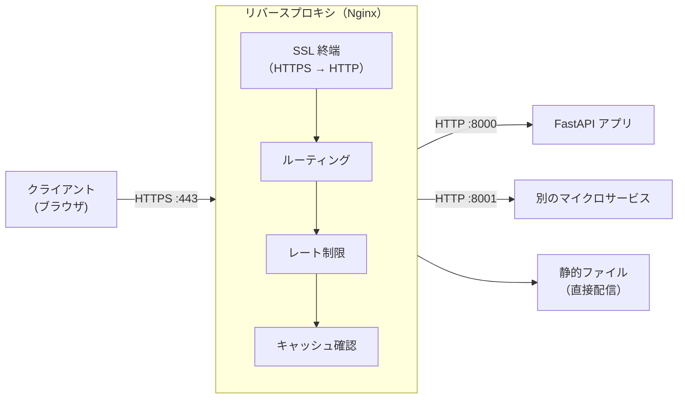

# リバースプロキシ

クライアントとバックエンドサーバーの間に立ち、リクエストを代理で受け付けるサーバーです。**ロードバランシング・SSL 終端・キャッシュ・レート制限・静的ファイル配信**を担い、Web システムの入口として不可欠な存在です。Nginx・Caddy・Traefik・Envoy が代表的な実装です。

---

## はじめて読む人へ

「FastAPI の開発サーバーを直接インターネットに公開する」のは避けるべきです。HTTPS 対応・不正アクセス制限・静的ファイルの効率的な配信——これらをリバースプロキシが担います。本番環境では「Nginx（リバースプロキシ）→ FastAPI / Gunicorn（アプリサーバー）」という 2 層構成が標準的です。

### 読む前に押さえること

- [ネットワーク基礎](ネットワーク基礎) — HTTP・DNS・ポートの概念
- [ネットワーク詳解](ネットワーク詳解) — TLS・HTTP/2・ロードバランサ
- [Docker](Docker) — Nginx コンテナの設定

### 読み終えたら説明できること

- フォワードプロキシとリバースプロキシの違いを説明できる
- Nginx の設定ファイルを読み書きできる
- SSL 終端・ロードバランシング・レート制限の仕組みを説明できる

---

## フォワードプロキシ vs リバースプロキシ

```
フォワードプロキシ（クライアント側）:
  クライアント → [プロキシ] → インターネット
  ・クライアントが「どこを見ているか」を隠す
  ・企業内のインターネットアクセス制限
  ・VPN の一形態

リバースプロキシ（サーバー側）:
  インターネット → [リバースプロキシ] → バックエンドサーバー群
  ・サーバーの実態（IP・ポート・台数）を隠す
  ・負荷分散・SSL 終端・キャッシュ
```

---

## リバースプロキシの主な役割



| 機能 | 説明 |
|------|------|
| **SSL 終端** | HTTPS の暗号化/復号をリバースプロキシが担う。アプリサーバーは HTTP のみ対応でよい |
| **ロードバランシング** | 複数バックエンドにリクエストを分散 |
| **静的ファイル配信** | HTML・CSS・JS・画像を Nginx が直接返す（アプリサーバーを経由しない）|
| **キャッシュ** | バックエンドの応答をキャッシュして負荷軽減 |
| **レート制限** | IP ごとのリクエスト数を制限して DDoS を緩和 |
| **圧縮** | gzip / brotli でレスポンスを圧縮 |
| **ヘッダー操作** | セキュリティヘッダーの付与・不要なヘッダーの削除 |

---

## Nginx の設定

### 基本構成

```nginx
# /etc/nginx/nginx.conf
events {
    worker_connections 1024;
}

http {
    # アップストリーム（バックエンドサーバー群）
    upstream app_servers {
        server localhost:8000;
        server localhost:8001;
        server localhost:8002;
        # least_conn;  # 最小接続数へのルーティング（デフォルトはラウンドロビン）
    }

    server {
        listen 80;
        server_name example.com;

        # HTTP → HTTPS リダイレクト
        return 301 https://$host$request_uri;
    }

    server {
        listen 443 ssl http2;
        server_name example.com;

        # SSL 証明書
        ssl_certificate     /etc/letsencrypt/live/example.com/fullchain.pem;
        ssl_certificate_key /etc/letsencrypt/live/example.com/privkey.pem;
        ssl_protocols TLSv1.2 TLSv1.3;

        # 静的ファイルは Nginx が直接配信
        location /static/ {
            root /var/www;
            expires 30d;
            add_header Cache-Control "public, no-transform";
        }

        # API リクエストをバックエンドへ転送
        location /api/ {
            proxy_pass http://app_servers;
            proxy_set_header Host $host;
            proxy_set_header X-Real-IP $remote_addr;
            proxy_set_header X-Forwarded-For $proxy_add_x_forwarded_for;
            proxy_set_header X-Forwarded-Proto $scheme;

            # タイムアウト設定
            proxy_read_timeout 60s;
            proxy_connect_timeout 10s;
        }
    }
}
```

### レート制限

```nginx
http {
    # 共有メモリゾーンで IP ごとのリクエスト数を管理
    limit_req_zone $binary_remote_addr zone=api_limit:10m rate=10r/s;

    server {
        location /api/ {
            limit_req zone=api_limit burst=20 nodelay;
            # 1秒に 10 リクエスト（バースト 20 まで許容）
            limit_req_status 429;  # 超過時は 429 Too Many Requests
        }
    }
}
```

### gzip 圧縮

```nginx
http {
    gzip on;
    gzip_types text/plain text/css application/json application/javascript;
    gzip_min_length 1000;  # 1KB 以上のレスポンスのみ圧縮
    gzip_comp_level 6;     # 1〜9（高いほど CPU 使用量が増える）
}
```

### セキュリティヘッダー

```nginx
server {
    # クリックジャッキング防止
    add_header X-Frame-Options "SAMEORIGIN";
    # XSS フィルタ
    add_header X-XSS-Protection "1; mode=block";
    # MIME タイプスニッフィング防止
    add_header X-Content-Type-Options "nosniff";
    # HTTPS 強制（HSTS）
    add_header Strict-Transport-Security "max-age=31536000; includeSubDomains";
    # CSP（Content Security Policy）
    add_header Content-Security-Policy "default-src 'self'";
    # サーバー情報を隠す
    server_tokens off;
}
```

---

## FastAPI アプリとの Docker Compose 構成

```yaml
# docker-compose.yml
services:
  nginx:
    image: nginx:alpine
    ports:
      - "80:80"
      - "443:443"
    volumes:
      - ./nginx.conf:/etc/nginx/nginx.conf:ro
      - ./certs:/etc/letsencrypt:ro
      - ./static:/var/www/static:ro
    depends_on:
      - api

  api:
    build: .
    expose:
      - "8000"  # 外部には公開しない（Nginx 経由のみ）
    environment:
      - DATABASE_URL=postgresql://...
```

---

## Caddy（モダンなリバースプロキシ）

Caddy は **HTTPS を自動設定**（Let's Encrypt を自動更新）します。

```
# Caddyfile
example.com {
    reverse_proxy /api/* localhost:8000
    file_server /static/* {
        root /var/www
    }
    rate_limit {
        zone api {
            key {remote_host}
            events 10
            window 1s
        }
    }
}
```

Nginx より設定が簡潔で、Let's Encrypt の証明書発行・更新が自動化されます。

---

## Traefik（Kubernetes 向け）

Kubernetes では Traefik や Nginx Ingress Controller がリバースプロキシ兼 Ingress コントローラーとして使われます。

```yaml
# Kubernetes Ingress リソース
apiVersion: networking.k8s.io/v1
kind: Ingress
metadata:
  name: my-ingress
  annotations:
    nginx.ingress.kubernetes.io/rate-limit: "10"
spec:
  rules:
    - host: api.example.com
      http:
        paths:
          - path: /
            pathType: Prefix
            backend:
              service:
                name: fastapi-service
                port:
                  number: 8000
  tls:
    - hosts:
        - api.example.com
      secretName: tls-secret
```

---

## 数学的導出

### ラウンドロビンとその変形

**ラウンドロビン（均等分散）：** $n$ 台のサーバーがあるとき、$i$ 番目のリクエストはサーバー $(i \mod n) + 1$ へ。接続コストが均等な場合は最良です。

**加重ラウンドロビン：** サーバー $j$ の重み $w_j$ に比例してリクエストを分配。

$$
P(\text{サーバー } j \text{ を選ぶ}) = \frac{w_j}{\sum_{k=1}^n w_k}
$$

高スペックサーバーに $w_j$ を大きく設定することで処理能力に応じた分散が実現できます。

**Least Connections（最小接続数）：** $\arg\min_j c_j$（$c_j$：サーバー $j$ の現在の接続数）。コネクションの保持時間が不均一な場合（ストリーミングAPIなど）に有効です。

---

## 確認問題

1. アプリサーバー（FastAPI）を直接インターネットに公開せずリバースプロキシを使う理由を 3 つ挙げてください。
2. SSL 終端をリバースプロキシで行うことで、バックエンドアプリケーションが得られるメリットを説明してください。
3. `limit_req_zone` でレート制限をアプリサーバー側でなく Nginx 側で行う理由を説明してください。

---

## 関連ページ

- [ネットワーク詳解](ネットワーク詳解) — TLS・HTTP/2・ロードバランサ
- [Docker](Docker) — Nginx コンテナの基礎
- [Kubernetes](Kubernetes) — Ingress Controller
- [システム設計](システム設計) — スケーラビリティとキャッシュ
- [コンテナセキュリティ](コンテナセキュリティ) — セキュリティヘッダー・最小権限
- [認証・認可](認証・認可) — OAuth2・JWT との連携

---

[← ホームへ](Home)
