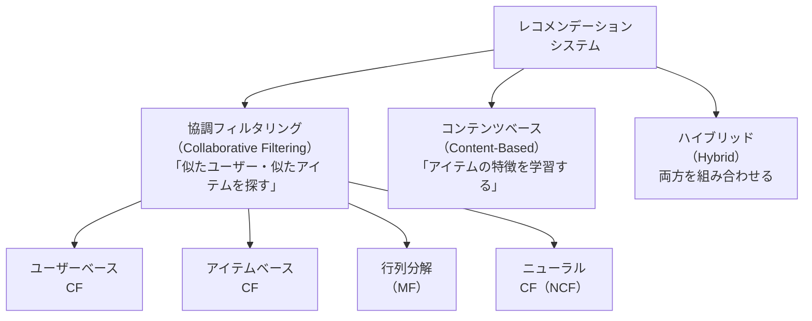

# レコメンデーションシステム

Netflix の「あなたへのおすすめ」、Amazon の「この商品を買った人はこれも」、Spotify のプレイリスト——**ユーザーが次に好みそうなアイテムを予測して提示するシステム**です。機械学習の最も身近で実用的な応用の一つです。

---

## はじめて読む人へ

レコメンドには大きく「誰が」「何を」好むかを学習するアプローチが複数あります。ユーザーの行動履歴（評価・購入・視聴）から潜在的な好みを推定するのが中心的な技術です。

### 読む前に押さえること

- [線形代数](線形代数.md) — 行列分解（SVD）の基礎
- [機械学習理論](機械学習理論.md) — 損失関数・勾配降下法

### 読み終えたら説明できること

- 協調フィルタリング・コンテンツベースの違いを説明できる
- 行列分解（Matrix Factorization）の仕組みをコードで実装できる
- コールドスタート問題とその対処法を説明できる

---

## アプローチの全体像



---

## 協調フィルタリング（CF）

**「趣味が似ているユーザーが好むものを推薦する」**アプローチです。アイテムの内容は一切見ず、「誰が何を好んだか」という行動パターンだけを使います。

### ユーザーベース CF

```python
import numpy as np
import pandas as pd
from sklearn.metrics.pairwise import cosine_similarity

# 評価行列（行: ユーザー、列: アイテム、値: 評価、0 は未評価）
ratings = np.array([
    [5, 4, 0, 0, 1],   # ユーザー 0
    [4, 0, 0, 1, 0],   # ユーザー 1
    [0, 0, 5, 4, 0],   # ユーザー 2
    [0, 1, 4, 5, 0],   # ユーザー 3
    [0, 0, 0, 0, 5],   # ユーザー 4
], dtype=float)

# ユーザー間のコサイン類似度
user_sim = cosine_similarity(ratings)
np.fill_diagonal(user_sim, 0)   # 自己類似度を除外
print("ユーザー類似度行列:")
print(pd.DataFrame(user_sim).round(3))

def user_based_predict(ratings, user_sim, user_id, item_id, top_k=3):
    """ユーザーベース CF で評価を予測"""
    # 類似度の高い top_k ユーザーを取得
    similar_users = np.argsort(user_sim[user_id])[::-1][:top_k]

    num = sum(user_sim[user_id, u] * ratings[u, item_id] for u in similar_users
              if ratings[u, item_id] > 0)
    den = sum(abs(user_sim[user_id, u]) for u in similar_users
              if ratings[u, item_id] > 0)

    return num / den if den > 0 else 0

# ユーザー 0 のアイテム 2 への評価を予測
pred = user_based_predict(ratings, user_sim, user_id=0, item_id=2)
print(f"\nユーザー 0 のアイテム 2 への予測評価: {pred:.2f}")
```

---

## 行列分解（Matrix Factorization）

大規模なシステムで最も広く使われる手法です。**評価行列を低ランク行列の積に分解**して、潜在因子（ユーザーの嗜好・アイテムの特性）を学習します。

$$
R \approx U \cdot V^\top, \quad U \in \mathbb{R}^{m \times k}, \; V \in \mathbb{R}^{n \times k}
$$

- $R$：評価行列（$m$ ユーザー × $n$ アイテム、多くが欠損）
- $U$：ユーザー潜在行列（各行がユーザーの $k$ 次元嗜好ベクトル）
- $V$：アイテム潜在行列（各行がアイテムの $k$ 次元特性ベクトル）

```python
import numpy as np
from sklearn.model_selection import train_test_split

class MatrixFactorization:
    def __init__(self, n_users, n_items, n_factors=10, lr=0.01, reg=0.01, n_epochs=100):
        rng = np.random.default_rng(42)
        self.U = rng.normal(0, 0.1, (n_users, n_factors))
        self.V = rng.normal(0, 0.1, (n_items, n_factors))
        self.lr, self.reg, self.n_epochs = lr, reg, n_epochs

    def fit(self, ratings):
        """SGD で行列分解を学習"""
        users, items = np.where(ratings > 0)
        for epoch in range(self.n_epochs):
            total_loss = 0
            for u, i in zip(users, items):
                pred = self.U[u] @ self.V[i]
                err  = ratings[u, i] - pred
                # 勾配更新
                self.U[u] += self.lr * (err * self.V[i] - self.reg * self.U[u])
                self.V[i] += self.lr * (err * self.U[u] - self.reg * self.V[i])
                total_loss += err ** 2
            if (epoch + 1) % 20 == 0:
                rmse = np.sqrt(total_loss / len(users))
                print(f"Epoch {epoch+1}: RMSE = {rmse:.4f}")

    def predict(self, user_id, item_id):
        return self.U[user_id] @ self.V[item_id]

    def recommend(self, user_id, ratings, top_k=5):
        """ユーザーが未評価のアイテムの中からトップ k を推薦"""
        unrated = np.where(ratings[user_id] == 0)[0]
        scores = [(i, self.predict(user_id, i)) for i in unrated]
        return sorted(scores, key=lambda x: x[1], reverse=True)[:top_k]


# 使用例
mf = MatrixFactorization(n_users=5, n_items=5, n_factors=3)
mf.fit(ratings)

print("\nユーザー 0 へのおすすめアイテム:")
for item_id, score in mf.recommend(user_id=0, ratings=ratings):
    print(f"  アイテム {item_id}: 予測スコア {score:.3f}")
```

---

## Surprise ライブラリによる実装

```python
# pip install scikit-surprise
from surprise import SVD, Dataset, Reader, accuracy
from surprise.model_selection import cross_validate, train_test_split
import pandas as pd

# MovieLens 100K データセットを使用
from surprise import Dataset
data = Dataset.load_builtin('ml-100k')

# SVD（行列分解）モデル
model = SVD(n_factors=50, n_epochs=20, lr_all=0.005, reg_all=0.02)

# 交差検証
results = cross_validate(model, data, measures=['RMSE', 'MAE'], cv=5, verbose=True)
print(f"平均 RMSE: {results['test_rmse'].mean():.4f}")

# 特定ユーザーへの推薦
trainset = data.build_full_trainset()
model.fit(trainset)

# ユーザー ID=196 がまだ評価していない映画を推薦
user_id = str(196)
all_items = set(trainset.all_items())
rated_items = {trainset.to_raw_iid(i) for i, _ in trainset.ur[trainset.to_inner_uid(user_id)]}
unrated = all_items - {trainset.to_inner_uid(i) for i in rated_items if i in {trainset.to_raw_iid(j) for j in all_items}}

predictions = [(iid, model.predict(user_id, trainset.to_raw_iid(iid)).est)
               for iid in all_items]
top_recs = sorted(predictions, key=lambda x: x[1], reverse=True)[:10]
print("おすすめアイテム:", top_recs[:5])
```

---

## コンテンツベースフィルタリング

ユーザーの行動ではなく、**アイテムの特徴量**に基づいて推薦します。

```python
from sklearn.feature_extraction.text import TfidfVectorizer
from sklearn.metrics.pairwise import cosine_similarity
import pandas as pd

# 映画のジャンル・説明文からアイテム類似度を計算
movies = pd.DataFrame({
    "title": ["マトリックス", "インセプション", "アベンジャーズ",
              "タイタニック", "ラ・ラ・ランド"],
    "description": [
        "SF アクション ハッカー 仮想現実 哲学的",
        "SF スリラー 夢 潜入 心理的",
        "アクション ヒーロー SF スーパーヒーロー チームワーク",
        "ロマンス ドラマ 歴史 船 悲劇",
        "ミュージカル ロマンス ドラマ 夢 LA",
    ]
})

# TF-IDF でアイテムをベクトル化
tfidf = TfidfVectorizer()
item_matrix = tfidf.fit_transform(movies["description"])

# コサイン類似度でアイテム間の類似度を計算
sim_matrix = cosine_similarity(item_matrix)
sim_df = pd.DataFrame(sim_matrix, index=movies["title"], columns=movies["title"])

def content_based_recommend(liked_movie: str, top_k: int = 3):
    scores = sim_df[liked_movie].drop(liked_movie).sort_values(ascending=False)
    return scores.head(top_k)

print("「インセプション」に似た映画:")
print(content_based_recommend("インセプション"))
```

---

## 評価指標

```python
import numpy as np

def precision_at_k(recommended, relevant, k):
    """Precision@K: 推薦上位 K 件のうち正解の割合"""
    return len(set(recommended[:k]) & set(relevant)) / k

def recall_at_k(recommended, relevant, k):
    """Recall@K: 正解アイテムのうち上位 K 件に含まれた割合"""
    return len(set(recommended[:k]) & set(relevant)) / len(relevant)

def ndcg_at_k(recommended, relevant, k):
    """NDCG@K: 順位を考慮した評価指標"""
    dcg = sum(1/np.log2(i+2) for i, item in enumerate(recommended[:k]) if item in relevant)
    idcg = sum(1/np.log2(i+2) for i in range(min(len(relevant), k)))
    return dcg / idcg if idcg > 0 else 0

# 使用例
recommended = [3, 1, 5, 2, 8]   # 推薦したアイテムのリスト（順位付き）
relevant     = {1, 3, 7}          # 実際に好まれたアイテムのセット

print(f"Precision@3: {precision_at_k(recommended, relevant, 3):.3f}")
print(f"Recall@3:    {recall_at_k(recommended, relevant, 3):.3f}")
print(f"NDCG@3:      {ndcg_at_k(recommended, relevant, 3):.3f}")
```

---

## コールドスタート問題と対処法

!!! info ""
    コールドスタート問題:
      新規ユーザー: 評価履歴がない → 協調フィルタリングが使えない
      新規アイテム: 評価がない → 推薦されにくい
    
    対処法:
      新規ユーザー:
        ① オンボーディングで好みを聞く（明示的フィードバック）
        ② デモグラフィック情報（年齢・性別）で初期推薦
        ③ コンテンツベースで人気アイテムを推薦
    
      新規アイテム:
        ① コンテンツベースで類似アイテムに推薦
        ② アイテムの特徴量を潜在ベクトルにマッピング
        ③ 探索的推薦（ε-greedy）で意図的に露出させる

---

## 確認問題

1. 協調フィルタリングとコンテンツベースフィルタリングのそれぞれの「限界」を 1 つずつ挙げてください。
2. 行列分解の潜在因子（latent factor）が「映画のジャンル傾向」などに対応することがある理由を説明してください。
3. Precision@K と Recall@K のどちらを重視すべきか、「推薦枠が限られているECサイト」と「見落とし防止が重要な医療診断支援」の 2 つのシナリオで比較してください。

---

## 関連ページ

- [線形代数](線形代数.md) — 行列分解・SVD の数学的背景
- [A/Bテスト・実験設計](ABテスト.md) — 推薦システムの効果検証
- [深層学習入門](深層学習入門.md) — ニューラル協調フィルタリング（NCF）
- [LLM 活用入門](LLM活用入門.md) — LLM を使った推薦（GPT-4 + 埋め込みベクトル）
