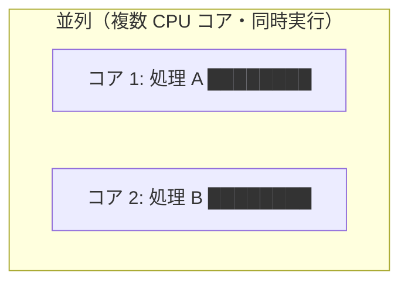
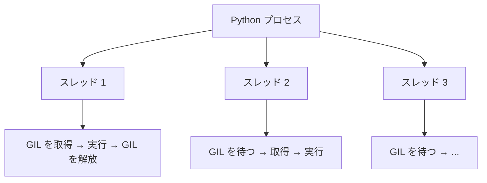
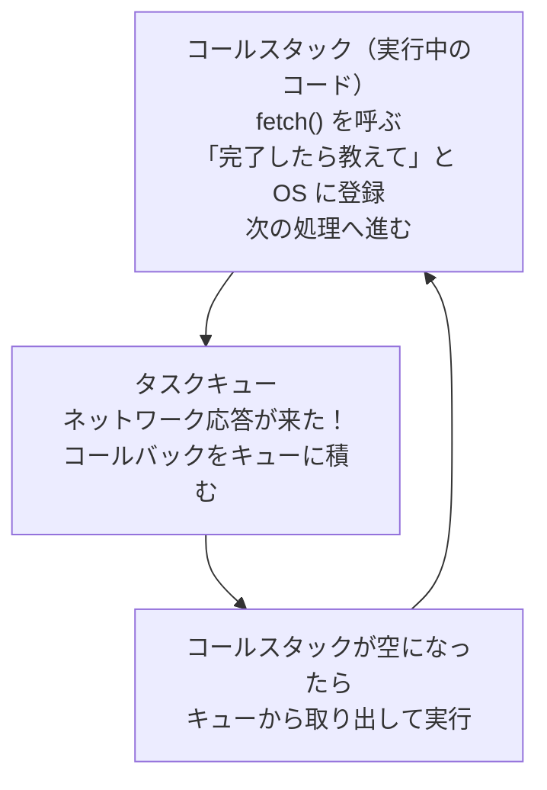

# 並列・並行処理

> [OS 詳解](OS詳解) のプロセス/スレッドを前提とします。複数の処理を同時に動かすときに何が起きるかを学びます。

---

## はじめて読む人へ

並列・並行処理は、複数の処理を同時または重ねて進める考え方です。速くするためだけでなく、待ち時間を有効に使うためにも重要です。


### 読む前に押さえること

- 並行は、複数の処理を切り替えながら進めることです。
- 並列は、複数の処理を本当に同時に実行することです。
- 共有データを書き換えると、競合状態が起きることがあります。

### 読み終えたら説明できること

- 並列と並行の違いを説明できる。
- Race Condition、Mutex、Deadlock の意味を理解できる。
- Python の GIL が何に影響するか説明できる。

---

## 並列と並行の違い

まず言葉を整理します。

**並行（Concurrency）：複数の処理が「同時に進んでいるように見える」**


**並列（Parallelism）：複数の処理が「本当に同時に実行される」**



| | 並行 | 並列 |
|--|------|------|
| CPU コア | 1つでも可 | 複数必要 |
| 目的 | I/O 待ち時間の有効活用 | 計算量の分散 |
| 例 | Web サーバーの複数リクエスト処理 | 画像処理・機械学習の並列計算 |

> **Web サーバーは「並行」で動いている：**  
> Node.js はシングルスレッドですが、リクエストを受け取った後にデータベースへの問い合わせを「待っている間」に次のリクエストを処理します。CPU を無駄なく使うための並行処理です。

---

## スレッドで並行処理する

次のコードでは、ダウンロード処理を `time.sleep` で代用しています。実際のダウンロードではネットワーク応答を待つ時間が発生しますが、その待ち時間中に別の処理を進められるのがスレッドの利点です。

ポイントは、順次実行では「Aが終わってからB」になるのに対し、スレッドでは「AとBを開始して、両方の完了を待つ」形になることです。`start()` はスレッドを開始し、`join()` はそのスレッドが終わるまで待つ命令です。

```python
import threading
import time

def download(name, seconds):
    print(f"{name} ダウンロード開始")
    time.sleep(seconds)   # ダウンロードの代わりに sleep で待機
    print(f"{name} 完了（{seconds}秒）")

# 順次実行（合計 5 秒）
download("ファイルA", 3)
download("ファイルB", 2)

# スレッドで並行実行（合計約 3 秒）
t1 = threading.Thread(target=download, args=("ファイルA", 3))
t2 = threading.Thread(target=download, args=("ファイルB", 2))

t1.start()
t2.start()
t1.join()   # t1 の終了を待つ
t2.join()   # t2 の終了を待つ
```

この例は CPU をたくさん使う計算ではなく、待ち時間が中心の処理なのでスレッドに向いています。ファイル読み込み、HTTPリクエスト、DB問い合わせのような I/O バウンドな処理では、スレッドや非同期処理によって全体の待ち時間を短くできます。

---

## 競合状態（Race Condition）

競合状態は、複数の処理が同じデータを同時に読み書きし、実行順序によって結果が変わってしまう問題です。1回だけ動かすと正しく見えても、タイミングが変わると壊れるため発見が難しいです。

たとえば、2つのスレッドが同じカウンタを同時に増やすと、片方の更新が上書きされることがあります。このような共有データは、ミューテックスなどで一度に1つの処理だけが触れるように保護します。

複数のスレッドが同じデータを同時に読み書きすると、**実行順序によって結果が変わる** バグが発生します。これを **競合状態（レースコンディション）** と言います。

```python
import threading

counter = 0

def increment():
    global counter
    for _ in range(100000):
        counter += 1   # ← ここが危険

threads = [threading.Thread(target=increment) for _ in range(5)]
for t in threads: t.start()
for t in threads: t.join()

print(counter)   # 500000 になるはず……ならないことがある
```

このコードは、5つのスレッドがそれぞれ10万回ずつ `counter` を増やすので、理屈の上では 500000 になるはずです。しかし `counter += 1` の途中に別スレッドへ切り替わると、更新が失われることがあります。結果が毎回同じとは限らないため、競合状態は再現しづらいバグになります。

**なぜ起きるのか？**

`counter += 1` は一見 1 命令ですが、CPU レベルでは 3 命令です：

```
1. counter の値を読み込む（例：100）
2. 1 を足す（101 を計算する）
3. counter に書き戻す（counter = 101）
```

2 つのスレッドが「1. 読み込み」を同時にしてしまうと、両方が「100 を読んで 101 を書く」という結果になり、カウンタが 1 しか増えません。

---

## ミューテックス（Mutex）

**ミューテックス（相互排除）** とは、「1 つのスレッドだけが特定のコードを実行できる」仕組みです。

```python
import threading

counter = 0
lock = threading.Lock()   # ミューテックス

def increment():
    global counter
    for _ in range(100000):
        with lock:       # ロックを取得（他のスレッドは待つ）
            counter += 1 # クリティカルセクション（一度に1つのスレッドのみ）
                         # ← ブロックを抜けると自動でロック解放

threads = [threading.Thread(target=increment) for _ in range(5)]
for t in threads: t.start()
for t in threads: t.join()

print(counter)   # 必ず 500000 になる
```

**クリティカルセクション：** ミューテックスで保護された、一度に 1 スレッドしか実行できないコードの区間。

`with lock:` の中に入れる範囲は、できるだけ短くするのが基本です。ロック中は他のスレッドが待たされるため、重い計算やネットワーク待ちまで含めると並行処理の利点が小さくなります。守るべき共有データの更新だけをクリティカルセクションに入れる、と考えます。

---

## セマフォ（Semaphore）

ミューテックスは「1 つのみ許可」ですが、**セマフォ** は「N 個まで同時に許可」できます。

セマフォは、「全員を止める」のではなく「同時に入れる人数を制限する」道具です。たとえば、DB接続を1000個同時に開くとDBが落ちるかもしれません。そこで「同時接続は最大10個まで」のように上限を決めます。

```python
import threading
import time

semaphore = threading.Semaphore(3)  # 同時に 3 スレッドまで許可

def access_resource(thread_id):
    with semaphore:
        print(f"スレッド {thread_id} が接続中")
        time.sleep(1)   # リソースを使用
        print(f"スレッド {thread_id} が解放")

threads = [threading.Thread(target=access_resource, args=(i,)) for i in range(8)]
for t in threads: t.start()
for t in threads: t.join()
```

この例では `Semaphore(3)` としているので、同時に `access_resource` の中へ入れるスレッドは最大3つです。8個のスレッドを作っても、リソースを使う部分は3つずつ順番に実行されます。

**よくある使いどころ：**

- データベースの接続プールの最大接続数（最大 10 接続など）
- API のレートリミット（同時リクエスト数の制限）

---

## デッドロック

2 つ以上のスレッドが **お互いに相手の持っているロックを待って** 止まってしまう状態です。


```python
import threading

lock_x = threading.Lock()
lock_y = threading.Lock()

def thread_a():
    with lock_x:
        print("A: X を取得")
        with lock_y:         # Y を待つが、B が持っている
            print("A: Y を取得")

def thread_b():
    with lock_y:
        print("B: Y を取得")
        with lock_x:         # X を待つが、A が持っている
            print("B: X を取得")

ta = threading.Thread(target=thread_a)
tb = threading.Thread(target=thread_b)
ta.start(); tb.start()
ta.join();  tb.join()    # ← 永遠に終わらない
```

このコードでは、`thread_a` が `lock_x` を取ったあとに `lock_y` を待ち、`thread_b` が `lock_y` を取ったあとに `lock_x` を待ちます。どちらも相手が手放すのを待っているため、先に進めません。プログラムがクラッシュするのではなく、止まったままになる点が厄介です。

### デッドロックの 4 条件（コフマン条件）

以下の 4 つがすべて成立するときデッドロックが発生します。1 つでも崩せば回避できます。

| 条件 | 内容 | 回避策 |
|------|------|--------|
| **相互排他** | リソースは一度に 1 プロセスのみ使用可 | — （排除困難）|
| **占有と待機** | リソースを持ちながら別のリソースを待つ | 必要なリソースを一度に全部取得する |
| **非横取り** | 取得したリソースを強制的に取り上げられない | タイムアウトで手放す |
| **循環待機** | スレッド A→B→C→A の順でリソースを待つ | **常に同じ順序でロックを取得する** |

**実践的な回避策（ロックの順序を固定する）：**

```python
def thread_a():
    with lock_x:      # 常に X → Y の順で取得
        with lock_y:
            ...

def thread_b():
    with lock_x:      # 同じく X → Y の順（逆にしない）
        with lock_y:
            ...
```

ロックを取る順番を全スレッドで統一すると、「AはXを持ってYを待つが、BはYを持ってXを待つ」という循環が起きにくくなります。複数のロックが必要な設計では、コードを書く前にロックの順序を決めておくことが重要です。

---

## Python の GIL（Global Interpreter Lock）

Python には **GIL（グローバルインタープリタロック）** という仕組みがあり、同一プロセス内のスレッドは **1 度に 1 つしか Python コードを実行できません**。



**GIL の影響：**

| 処理 | スレッド（GIL あり） | multiprocessing |
|------|-------------------|----------------|
| I/O バウンド（通信・ファイル読み書き） | 有効（I/O 中は GIL を解放する） | 有効 |
| CPU バウンド（数値計算・ループ） | ほぼ無効 | 有効 |

```python
# CPU バウンドな処理は multiprocessing を使う
from multiprocessing import Pool

def compute(n):
    return sum(range(n))

with Pool(4) as pool:             # 4 プロセスで並列実行
    results = pool.map(compute, [10**7] * 4)
```

`multiprocessing` はスレッドではなく複数のプロセスを使います。プロセスごとにPythonインタプリタが分かれるため、GILの制約を受けにくく、CPUを使う計算を複数コアに分散できます。ただし、プロセス間でデータを渡すコストがあるため、小さすぎる処理を大量に分けると逆に遅くなることがあります。

> **NumPy・pandas が速い理由：**  
> NumPy の演算は C で書かれており、GIL を解放して実行されます。そのため Python のスレッドとも相性がよく、実質的な並列実行ができます。

---

## JavaScript の非同期処理との対比

JavaScript はシングルスレッドで動きますが、**イベントループ** による並行処理ができます。



```js
// JavaScript
console.log("1");
fetch("https://api.example.com/data")    // I/O を開始して即座に戻る
    .then(data => console.log("3: データ取得"));  // 後で実行
console.log("2");                        // fetch を待たずに実行

// 出力順: 1 → 2 → 3
```

`fetch` は通信を開始すると、結果を待たずに次の行へ進みます。そのため `console.log("2")` が先に実行され、通信が終わってから `.then(...)` の中が実行されます。これは「同時に計算している」のではなく、「待っている時間に別の処理を進めている」並行処理です。

| | Python threading | JavaScript async/await |
|--|-----------------|----------------------|
| 本当の並列 | GIL のため CPU バウンドは NG | なし（シングルスレッド） |
| I/O 並行 | 有効 | 有効 |
| 共有メモリ | あり（競合状態に注意） | なし（安全） |
| デッドロック | 起きうる | 起きにくい |

---

## まとめ

| 概念 | 要点 |
|------|------|
| 並行 vs 並列 | 並行 = 切り替えて進む、並列 = 同時に進む |
| 競合状態 | 共有データへの同時アクセスで結果が不定になる |
| ミューテックス | クリティカルセクションを 1 スレッドずつ実行する |
| セマフォ | N 個まで同時アクセスを許可する |
| デッドロック | 循環待機で全スレッドが止まる。ロック順序を固定して防ぐ |
| Python GIL | CPU バウンドには multiprocessing、I/O バウンドには threading |

---


## 確認問題

1. 並列・並行処理 は、何の問題を解決するための考え方・道具ですか。
2. このページで出てきた重要語を 3 つ選び、それぞれ 1 文で説明してください。
3. コード例やコマンド例がある場合、入力・処理・出力を分けて説明してください。
4. このページの内容が、前後の STEP や自分の作りたいものにどうつながるか説明してください。

---

## 関連ページ

- [OS 詳解](OS詳解) — プロセス・スレッドの基礎
- [コンピュータ基礎](コンピュータ基礎) — CPU コア・スレッドの物理的な仕組み
- [JavaScript](JavaScript) — イベントループ・async/await
- [運用・障害対応](運用-障害対応) — 本番環境でのデッドロック検出

---

[← ホームへ](Home)
