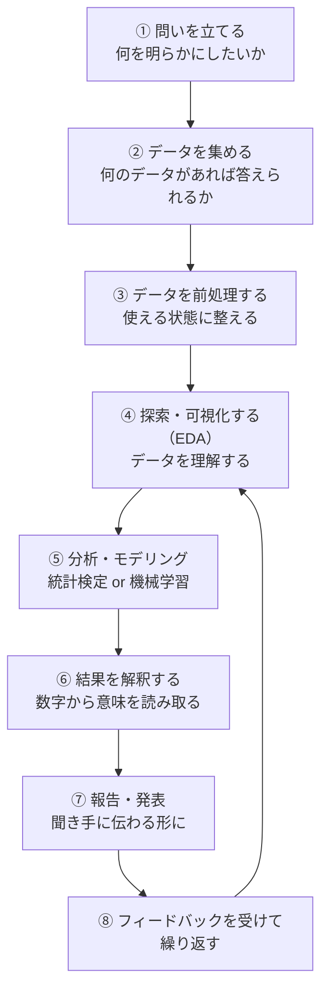
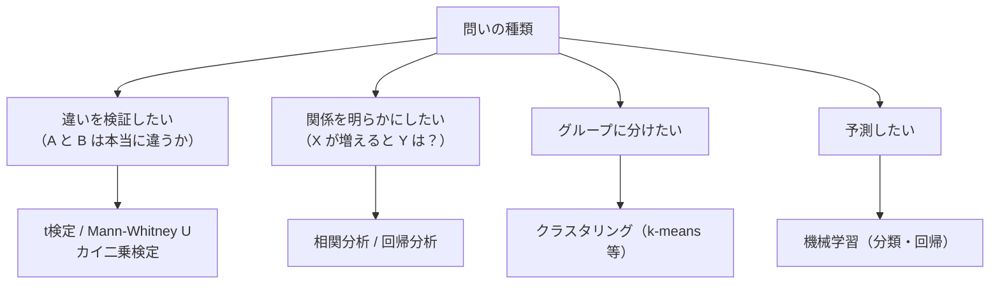

# 卒業研究・データ分析プロジェクトの進め方

技術を習得することと、**実際の問題を解く**ことは別のスキルです。このページでは「データを使って何かを明らかにする」プロセス全体——テーマ設定からデータ収集・分析・発表まで——を通して解説します。

---

## はじめて読む人へ

授業で「Python が書ける」「機械学習を知っている」ようになっても、「さあ卒業研究を始めよう」となったとき途方に暮れる人は多いです。問題は技術不足ではなく、**研究プロセスの設計力**が不足しているからです。

### 読む前に押さえること

特に前提知識は不要です。3・4年生向けですが、早めに読むと研究の全体像が見えます。

### 読み終えたら説明できること

- 良い「問い」の立て方と、答えられない問いの見分け方を説明できる
- データ収集〜発表までのプロジェクト全体を設計できる
- よくある失敗パターンを事前に回避できる

---

## プロジェクト全体像



**重要：** このプロセスは一直線ではありません。分析してみたら問いを修正する必要が出てきたり、データが足りないことに気づいたりします。**反復することが前提**です。

---

## ① 良い「問い」の立て方

### 答えられる問いと答えられない問い

!!! info ""
    ```
    ❌ 答えられない問い（広すぎる・測れない）:
      「AI は社会に良い影響をもたらすか」
      「教育を改善するにはどうすればよいか」
      「滋賀県の経済を活性化するには？」
    
    ✅ 答えられる問い（具体的・データがある・測れる）:
      「滋賀県の観光客数は天気と相関があるか」
      「レビューのテキストから評価点数を予測できるか」
      「授業への出席率は GPA と関係があるか」
    ```

### 良い問いの条件

| 条件 | 確認方法 |
|------|---------|
| **測定可能** | 数値やカテゴリで表現できるか |
| **データが存在する** | 収集可能なデータがあるか |
| **適切な難易度** | 学期内・卒業研究の期間内で答えられるか |
| **新規性または実用性** | 既知の結果を繰り返すだけでないか |

### 問いを絞り込む方法

!!! info ""
    ```
    「大きな問い」から出発して、データで答えられる「小さな問い」に分解する
    
    大きな問い: 「SNS は人の行動に影響するか」
      ↓ 分解
    中くらいの問い: 「Twitter でバズった商品は売上が上がるか」
      ↓ さらに分解
    小さな問い: 「2023年にリツイート数 1万以上になった商品は、
                 投稿翌週の Amazon 売上ランキングが変化するか」
    ```

---

## ② データ収集

### 使えるデータの種類

| 種類 | 具体例 | 入手方法 |
|------|--------|---------|
| **公開データセット** | Kaggle, UCI ML Repository, e-Stat（政府統計）| ダウンロード |
| **API** | Twitter/X API, OpenWeatherMap, 総務省 API | キー取得 + コード |
| **スクレイピング** | ニュース・EC サイト | requests + BeautifulSoup |
| **アンケート** | Google Forms, Qualtrics | 自分で設計・配布 |
| **センサー・ログ** | GPS・IoT・アプリログ | 機器設置 or 提供を受ける |

### おすすめのデータソース

```python
# Kaggle（機械学習向けデータセットの宝庫）
# https://www.kaggle.com/datasets

# e-Stat（日本の政府統計）
# https://www.e-stat.go.jp/

# データを kaggle API でダウンロード
# pip install kaggle
# kaggle datasets download -d <dataset-name>

# scikit-learn の組み込みデータセット
from sklearn import datasets
data = datasets.load_iris()
```

### データ収集時の注意

!!! info ""
    ```
    □ 利用規約・ライセンスを確認した（学術利用・商用利用の制限）
    □ 個人情報が含まれる場合、倫理審査の必要性を確認した（→ データ倫理.md）
    □ データの出典を記録した（論文・発表で引用できるように）
    □ 収集日時を記録した（再現性のため）
    ```

---

## ③ データ前処理

収集したデータがそのまま使えることはほぼありません。

```python
import pandas as pd

df = pd.read_csv('data.csv')

# ── よくある前処理の流れ ──────────────────────
# 1. 欠損値の確認と処理
print(df.isnull().sum())
df['age'].fillna(df['age'].median(), inplace=True)   # 中央値補完
df.dropna(subset=['target'], inplace=True)            # 目的変数が欠損の行は削除

# 2. 外れ値の処理
Q1, Q3 = df['income'].quantile([0.25, 0.75])
IQR = Q3 - Q1
df = df[df['income'].between(Q1 - 1.5*IQR, Q3 + 1.5*IQR)]

# 3. 型の変換
df['date'] = pd.to_datetime(df['date'])
df['category'] = df['category'].astype('category')

# 4. 特徴量の作成
df['year'] = df['date'].dt.year
df['is_weekend'] = df['date'].dt.dayofweek >= 5
```

---

## ⑤ 分析・モデリング：何を使うか選ぶ

### 問いの種類と分析手法の対応



**初めての研究には「関係を明らかにする」タイプが取り組みやすい：**

```python
from scipy import stats
import pandas as pd

# 「出席率と成績に相関があるか」を検定する例
df = pd.DataFrame({
    '出席率': [0.9, 0.7, 0.5, 0.8, 0.6, 0.95, 0.4],
    '最終成績': [85, 72, 55, 78, 64, 91, 48]
})

r, p = stats.pearsonr(df['出席率'], df['最終成績'])
print(f"ピアソン相関係数: r = {r:.3f}")
print(f"p 値: {p:.3f}")
print("→", "有意な相関あり" if p < 0.05 else "有意な相関なし")
```

---

## ⑥ 結果の解釈：「数字から意味を読み取る」

**数字を出して終わりにしない**ことが大切です。

!!! info ""
    ```
    ❌ 悪い解釈:
      「相関係数は 0.82 でした。」
    
    ✅ 良い解釈:
      「出席率と成績の間に強い正の相関（r=0.82, p<0.01）が認められた。
       これは、授業への参加が学習の定着に寄与している可能性を示唆する。
       ただし因果関係については追加の検討が必要であり、
       成績向上意欲が高い学生が出席率も高い（逆因果）可能性も排除できない。」
    ```

### 結果解釈の視点

!!! info ""
    ```
    □ 統計的有意性だけでなく「効果量」も確認した（p<0.05 でも効果が小さいことがある）
    □ 相関と因果を混同していないか（→ データ倫理・因果推論の視点）
    □ サンプルの偏りがないか（特定の集団からしかデータを取っていないなど）
    □ 外部妥当性はあるか（この結果は他の状況でも成り立つか）
    ```

---

## ⑦ 報告・発表

### 卒業論文の基本構成

| 章 | 内容 | 目安の長さ |
|----|------|---------|
| **序論** | 研究背景・問い・本論文の貢献 | 2〜3 ページ |
| **関連研究** | 先行研究との比較・自分の研究の位置づけ | 2〜4 ページ |
| **データ・方法** | データの説明・前処理・分析手法 | 3〜5 ページ |
| **結果** | 分析結果の記述（図・表中心） | 3〜6 ページ |
| **考察** | 結果の解釈・限界・今後の課題 | 2〜4 ページ |
| **結論** | 問いへの答えのまとめ | 1 ページ |

### プレゼンテーションの構成（15分の場合）

!!! info ""
    ```
    0:00〜 2:00  研究背景と問い（なぜこれを研究したか）
    2:00〜 4:00  データとその説明（何のデータをどう集めたか）
    4:00〜 9:00  分析手法と結果（何を分析してどうわかったか）
    9:00〜12:00  考察（結果が意味すること・限界）
    12:00〜13:00 結論（問いへの答え）
    13:00〜15:00 質疑応答の準備
    ```

**発表時のポイント：**
- スライド 1 枚につき 1 メッセージ
- グラフには必ずタイトルと軸ラベルをつける
- 「結果を見てください」だけでなく、「この図が示すことは〜」と解説する

---

## よくある失敗と対策

| 失敗 | 対策 |
|------|------|
| **データ収集に時間をかけすぎて分析が手薄** | 最初に小さなデータで分析パイプラインを作り、後からデータを増やす |
| **きれいなデータを作ることに必死になりすぎる** | 「80% きれい」で分析を始め、問題があれば戻る |
| **モデルを作るだけで解釈しない** | 「このモデルが示すことは何か」を言葉で書く |
| **締め切り直前まで指導教員に見せない** | 月 1 回は中間報告を行う |
| **先行研究を読まずに始める** | テーマを決めたらまず 10 本の論文を読む |
| **問いが途中で変わって収拾がつかない** | 初期の問いを文書化し、変更するときは意識的に行う |

---

## タイムライン（例：1 年間の卒業研究）

| 時期 | やること |
|------|---------|
| 4〜5月 | テーマ決め・文献調査・データソースの選定 |
| 6〜7月 | データ収集・前処理・EDA |
| 8〜9月（夏休み） | 分析・モデリングの試行 |
| 10〜11月 | 結果の整理・解釈・論文執筆開始 |
| 12月〜1月 | 論文完成・発表準備 |
| 2月 | 最終発表 |

---

## 確認問題

1. 「SNS の利用時間と学業成績の関係を調べたい」という問いを、データで答えられる形に具体化してください。
2. 相関係数が 0.3（p=0.02）だったとき、「相関がある」と結論づけることの問題点を説明してください。
3. 卒業研究の発表で「データが少なかった」「時間が足りなかった」という言い訳が生じる原因を、計画の観点から説明してください。

---

## 関連ページ

- [探索的データ分析（EDA）](EDA.md) — データ理解のワークフロー
- [確率・統計基礎](確率・統計基礎.md) — 統計検定・p値・相関係数
- [論文・技術文書の読み方](論文の読み方.md) — 先行研究の調査方法
- [データ倫理・AI倫理](データ倫理.md) — データ収集・利用の倫理
- [Jupyter Notebook / Google Colab](Jupyter.md) — 分析の作業環境
