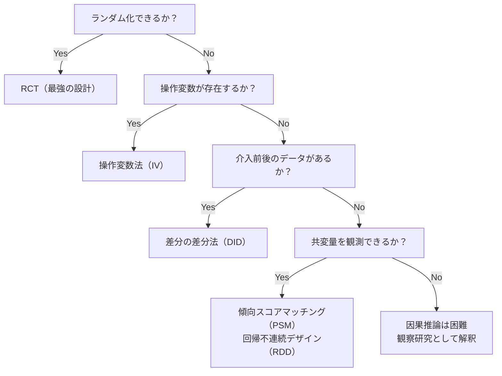

# 統計的因果推論

「相関があること」と「因果関係があること」は全く別の話です。アイスクリームの売上と溺死者数には正の相関がありますが、アイスクリームが溺死を引き起こすわけではありません。**因果推論**は「AがBを本当に引き起こすか」を数学的に調べる方法です。

---

## はじめて読む人へ

「機械学習で予測はできるようになったけど、なぜそうなるか説明できない」「施策が本当に効いたのか判断できない」——因果推論はこれらの問いに答える統計学の発展的な分野です。マーケティング・政策評価・医療研究で使われます。

### 読む前に押さえること

- [確率・統計基礎](確率・統計基礎.md) — 相関・仮説検定・回帰分析
- [回帰分析](回帰分析.md) — 重回帰の理解があると理解が深まります

### 読み終えたら説明できること

- 相関と因果の違いを交絡因子の概念で説明できる
- RCT（ランダム化比較試験）が因果を証明できる理由を説明できる
- 差分の差分法・傾向スコアの考え方を説明できる

---

## 相関と因果の違い

### 交絡因子（Confounding Variable）

```
疑似相関の例:
  アイスクリームの売上 ↑ → 溺死者数 ↑

真の構造:
  気温 ↑ → アイスクリームの売上 ↑
  気温 ↑ → 海水浴者増加 → 溺死者数 ↑

「気温」が交絡因子
```

```python
import numpy as np
import pandas as pd
import matplotlib.pyplot as plt

np.random.seed(42)
n = 200

# データ生成（気温が交絡因子）
temperature = np.random.normal(25, 5, n)              # 気温
ice_cream = 0.8 * temperature + np.random.normal(0, 2, n)  # アイスの売上
drowning  = 0.6 * temperature + np.random.normal(0, 2, n)  # 溺死者数

df = pd.DataFrame({"temperature": temperature,
                   "ice_cream": ice_cream,
                   "drowning": drowning})

# 相関を見ると正の相関がある
print(f"アイスと溺死の相関: {df['ice_cream'].corr(df['drowning']):.3f}")
# アイスと溺死の相関: 0.823

# 気温を統制すると相関が消える
import statsmodels.formula.api as smf
model = smf.ols("drowning ~ ice_cream + temperature", data=df).fit()
print(model.summary().tables[1])
# ice_cream の係数が非有意になる → 因果関係なし
```

### 因果ダイアグラム（DAG）

**有向非巡回グラフ（DAG）**で因果の方向を表します。

```
【交絡がある場合】
  温度 → アイスの売上
  温度 → 溺死者数
  （アイスと溺死に直接の矢印はない）

【真の因果がある場合】
  喫煙 → 肺がん
  （直接の矢印がある）

【逆因果の例】
  病院に行く → 病気？
  実際は: 病気 → 病院に行く
```

---

## ランダム化比較試験（RCT）

### なぜ RCT が最強か

処置（介入）を**ランダムに割り当てる**ことで、すべての交絡因子を平均的に打ち消せます。

```python
import numpy as np

np.random.seed(42)
n = 1000

# 交絡因子: 健康意識（高い人ほど薬を飲む & 回復しやすい）
health_consciousness = np.random.normal(0, 1, n)

# 非ランダム割り当て（健康意識が高い人ほど薬を飲む → バイアスあり）
treatment_biased = (health_consciousness + np.random.normal(0, 1, n) > 0).astype(int)

# 結果（健康意識と治療の両方が影響）
recovery_biased = 0.3 * treatment_biased + 0.5 * health_consciousness + np.random.normal(0, 0.5, n)

# ランダム割り当て（RCT）
treatment_rct = np.random.binomial(1, 0.5, n)
recovery_rct  = 0.3 * treatment_rct + 0.5 * health_consciousness + np.random.normal(0, 0.5, n)

# 推定
print(f"バイアスあり推定: {np.mean(recovery_biased[treatment_biased==1]) - np.mean(recovery_biased[treatment_biased==0]):.3f}")
print(f"RCT 推定:         {np.mean(recovery_rct[treatment_rct==1]) - np.mean(recovery_rct[treatment_rct==0]):.3f}")
print(f"真の効果:          0.300")
# バイアスあり推定: 0.567 ← 交絡で過大推定
# RCT 推定:         0.285 ← 真の効果に近い
```

---

## 差分の差分法（DID: Difference-in-Differences）

### いつ使うか

RCT が不可能なとき（過去のデータしかない・介入対象を制御できない）に使います。

```
例: 最低賃金引き上げの雇用への影響
  → ある州だけ最低賃金が上がった
  → 「介入群（上がった州）」vs「対照群（上がっていない州）」
  → 介入前後の差を比較
```

### DID の直感

$$
\text{DID 推定量} = \underbrace{(\bar{Y}_{\text{介入後,介入群}} - \bar{Y}_{\text{介入前,介入群}})}_{\text{介入群の変化}} - \underbrace{(\bar{Y}_{\text{介入後,対照群}} - \bar{Y}_{\text{介入前,対照群}})}_{\text{対照群の変化}}
$$

```python
import numpy as np
import pandas as pd
import statsmodels.formula.api as smf

np.random.seed(42)
n_each = 200

# データ生成
# 介入群（ある施策を受けた）と対照群
# 「並行トレンド仮定」: 施策がなければ両群は同じトレンドで動く

df = pd.DataFrame({
    "id":        list(range(n_each)) * 2,
    "treatment": [1]*n_each + [0]*n_each,  # 1=介入群, 0=対照群
    "post":      [0]*(n_each//2) + [1]*(n_each//2) +
                 [0]*(n_each//2) + [1]*(n_each//2),  # 0=介入前, 1=介入後
})
df["y"] = (
    0.5 * df["treatment"]            # 介入群のベースラインが高い
    + 0.3 * df["post"]               # 全体的な時間トレンド
    + 0.4 * df["treatment"] * df["post"]   # ← 真の処置効果（0.4）
    + np.random.normal(0, 0.5, len(df))
)

# DID 推定
# treatment * post の係数が処置効果の推定値
model = smf.ols("y ~ treatment + post + treatment:post", data=df).fit()
print(model.summary().tables[1])
# treatment:post の係数 ≈ 0.4 ← 真の効果を回収
```

---

## 傾向スコアマッチング（PSM）

### いつ使うか

「処置を受けやすい人と受けにくい人の特性が違う」ときに、**似た人を比較**して交絡を減らします。

```python
from sklearn.linear_model import LogisticRegression
from sklearn.preprocessing import StandardScaler
import pandas as pd
import numpy as np

np.random.seed(42)
n = 500

# 共変量（性別・年齢・健康意識）
age        = np.random.normal(40, 10, n)
health_idx = np.random.normal(0, 1, n)

# 処置の傾向（健康意識が高い人ほど処置を受けやすい）
logit = -1 + 0.05 * (age - 40) + 0.8 * health_idx
prob_treatment = 1 / (1 + np.exp(-logit))
treatment = np.random.binomial(1, prob_treatment)

# 結果（処置効果は 2.0, 健康意識も影響）
outcome = 2.0 * treatment + 0.5 * health_idx + np.random.normal(0, 1, n)

df = pd.DataFrame({"age": age, "health_idx": health_idx,
                   "treatment": treatment, "outcome": outcome})

# 傾向スコアの推定
X = StandardScaler().fit_transform(df[["age", "health_idx"]])
ps_model = LogisticRegression()
ps_model.fit(X, df["treatment"])
df["ps"] = ps_model.predict_proba(X)[:, 1]  # 傾向スコア

# 1:1 マッチング（近傍マッチング）
treated     = df[df["treatment"] == 1].copy()
control     = df[df["treatment"] == 0].copy()

from sklearn.neighbors import NearestNeighbors
nn = NearestNeighbors(n_neighbors=1)
nn.fit(control[["ps"]])
distances, indices = nn.kneighbors(treated[["ps"]])

matched_control = control.iloc[indices.flatten()].copy()

# マッチング後の ATT（処置効果）推定
att = treated["outcome"].mean() - matched_control["outcome"].mean()
print(f"マッチング前の単純比較: {df.groupby('treatment')['outcome'].mean().diff().iloc[1]:.3f}")
print(f"傾向スコアマッチング後: {att:.3f}")
print(f"真の処置効果: 2.000")
```

---

## 操作変数法（IV）

交絡因子を観測できない場合でも、**「処置に影響するが結果には直接影響しない変数（操作変数）」**があれば因果効果を推定できます。

```
例: 教育年数が賃金に与える影響
  問題: 「もともと能力が高い人」は教育年数も賃金も高い → 交絡
  操作変数: 「近くに大学があるか」
    → 大学の近さ → 進学率（教育年数）に影響する
    → 大学の近さ → 賃金には（教育を通じてしか）影響しない
    → 近さを操作変数として使うことで能力の交絡を除去できる
```

```python
from linearmodels.iv import IV2SLS
import numpy as np
import pandas as pd

np.random.seed(42)
n = 1000

# 観測できない能力（交絡因子）
ability = np.random.normal(0, 1, n)

# 操作変数: 大学への距離（能力とは無関係）
distance = np.random.normal(0, 1, n)

# 教育年数（能力と距離の両方が影響）
education = 12 + 1.5 * (-distance) + 1.0 * ability + np.random.normal(0, 1, n)

# 賃金（教育と能力が影響、距離は影響しない）
wage = 5 + 2.0 * education + 1.5 * ability + np.random.normal(0, 2, n)

df = pd.DataFrame({"wage": wage, "education": education,
                   "distance": distance, "ability": ability})

# OLS（交絡があるので過大推定）
ols = IV2SLS(df["wage"], pd.DataFrame({"const": 1, "education": df["education"]}),
             None, None).fit()

# 2SLS（操作変数法）
iv = IV2SLS(df["wage"],
            pd.DataFrame({"const": np.ones(n)}),
            pd.DataFrame({"education": df["education"]}),
            pd.DataFrame({"distance": df["distance"]})).fit()

print(f"OLS 推定（交絡あり）: {ols.params['education']:.3f}")  # > 2.0（過大推定）
print(f"IV 推定（交絡除去）:  {iv.params['education']:.3f}")   # ≈ 2.0
print(f"真の効果: 2.000")
```

---

## 手法の選び方



---

## 確認問題

1. 「運動量が多い人ほど健康状態が良い」という観察データから「運動は健康に良い」と結論付けることの問題点を交絡因子の概念を使って説明してください。
2. 差分の差分法における「並行トレンド仮定」とは何ですか？なぜこの仮定が必要ですか？
3. 傾向スコアマッチングは何を「マッチング」しますか？なぜこれで交絡が減るのですか？

---

## 関連ページ

- [確率・統計基礎](確率・統計基礎.md) — 相関・回帰・検定の基礎
- [回帰分析](回帰分析.md) — 線形回帰・ロジスティック回帰
- [データ倫理・AI倫理](データ倫理.md) — 因果を無視したアルゴリズムの問題
- [卒業研究・プロジェクトの進め方](卒業研究.md) — 研究での因果推論の使い方
