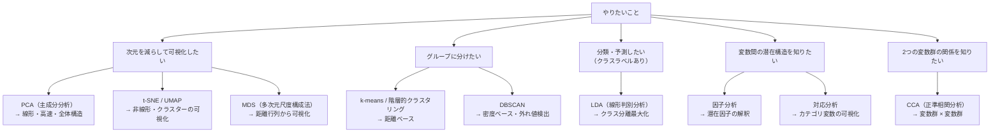

# 多変量解析：手法の地図

**複数の変数を同時に扱って、データの構造・パターン・関係を明らかにする統計手法群の総称**です。このページは個別手法への案内図です。各手法の詳細は専用ページで学んでください。

---

## どの手法を使うか

---

## 手法一覧と専用ページ

### 次元削減

| 手法 | 目的 | 教師あり | 専用ページ |
|------|------|:------:|---------|
| **PCA** | 分散を最大保持しながら圧縮 | なし | [主成分分析（PCA）](主成分分析.md) |
| **LDA** | クラス分離を最大化しながら圧縮 | あり | [線形判別分析（LDA）](線形判別分析.md) |
| **MDS** | 距離行列から座標を復元 | なし | [多次元尺度構成法（MDS）](多次元尺度構成法.md) |
| **t-SNE / UMAP** | 局所構造を保ちながら可視化 | なし | [教師なし学習](教師なし学習.md) |

### グルーピング

| 手法 | 特徴 | 専用ページ |
|------|------|---------|
| **k-means** | 重心への距離でクラスタ | [クラスター分析](クラスター分析.md) |
| **階層的クラスタリング** | デンドログラムで階層を見る | [クラスター分析](クラスター分析.md) |
| **DBSCAN** | 密度ベース・外れ値に強い | [クラスター分析](クラスター分析.md) |

### 潜在構造の発見

| 手法 | 目的 | 専用ページ |
|------|------|---------|
| **因子分析** | 観測できない潜在因子の推定 | [因子分析](因子分析.md) |
| **対応分析** | カテゴリ変数のクロス表を可視化 | [対応分析](対応分析.md) |
| **正準相関分析（CCA）** | 2変数群の相関構造を発見 | [正準相関分析（CCA）](正準相関分析.md) |

---

## PCA・LDA・因子分析の使い分け（よく混乱するポイント）

| 観点 | PCA | LDA | 因子分析 |
|------|-----|-----|---------|
| 目的 | 圧縮・可視化 | クラス分離 | 潜在構造の解釈 |
| クラスラベル | 不要 | **必要** | 不要 |
| 軸の意味 | 分散最大方向 | クラス間分散/クラス内分散最大 | 潜在因子（解釈可能） |
| 出力 | 主成分スコア | 判別スコア | 因子負荷量 |
| 次元の上限 | min(n, p) − 1 | クラス数 − 1 | 指定数 |

---

## 確認問題

1. 「顧客データ（年齢・購買頻度・金額など）を 2 次元に圧縮してプロットしたい」場合、PCA と t-SNE のどちらが向いていますか？理由も述べてください。
2. クラスラベルがある場合に PCA より LDA が有利な理由を説明してください。
3. 因子分析と PCA の最大の違いを 1 文で述べてください。

---

## 関連ページ

- [主成分分析（PCA）](主成分分析.md) — 最も基本的な次元削減
- [クラスター分析](クラスター分析.md) — k-means・DBSCAN・階層的クラスタリング
- [因子分析](因子分析.md) — 潜在因子の推定・バリマックス回転
- [線形判別分析（LDA）](線形判別分析.md) — 教師ありの次元削減
- [教師なし学習](教師なし学習.md) — t-SNE・UMAP を含む全体像
