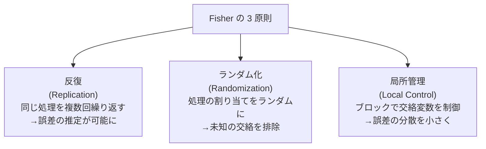

# 実験計画法

「何を比較するか」を事前に設計し、実験コストを最小化しながら確実な結論を引き出す統計的方法論です。A/Bテストの設計・農業実験・製品品質改善・機械学習のハイパーパラメータ探索——どれも実験計画の考え方を土台にしています。統計検定準1級の頻出領域です。

---

## はじめて読む人へ

「薬 A と薬 B を比較する実験をしたら、グループ間で年齢が偏っていて結果が信用できなかった」——これは実験設計の失敗例です。実験計画法は「どう実験すれば交絡を排除して因果を主張できるか」を事前に決める方法です。

### 読む前に押さえること

- [確率・統計基礎](確率・統計基礎) — 仮説検定・p 値・F 分布
- [統計的因果推論](因果推論) — 交絡・ランダム化の重要性

### 読み終えたら説明できること

- ANOVA の F 検定が「グループ間の差」と「グループ内のばらつき」の比である理由を説明できる
- 交互作用の意味と二元配置 ANOVA への影響を説明できる
- 多重比較問題と代表的な補正法を説明できる

---

## 実験計画の基本概念

### 因子・水準・反応

| 用語 | 意味 | 例（農業実験） |
|------|------|------------|
| **因子（Factor）** | 変化させる独立変数 | 肥料の種類 |
| **水準（Level）** | 因子の取りうる値 | A 肥料・B 肥料・無施肥 |
| **反応（Response）** | 測定する従属変数 | 収穫量（kg/ha） |
| **ブロック（Block）** | 制御できる交絡変数の単位 | 農場（土壌の違い） |

### Fisher の 3 原則

Ronald Fisher が提唱した実験設計の根本原則です。



**ランダム化の本質：** どんな方法でも測定できない交絡変数が存在します。ランダム化によって、それらがすべてのグループに「平均的に」分配されると期待できます。これが「観察研究」と「無作為化比較試験（RCT）」の決定的な違いです。

---

## 一元配置 ANOVA

### 問題設定

$k$ 個のグループ（処理）があり、各グループから $n_i$ 個のデータを得た場合、「グループ間に差があるか」を検定します。

t 検定をグループ数だけ繰り返すことはできません（多重比較問題）。ANOVA はすべてのグループを同時に検定します。

### 変動の分解

$$
\underbrace{\sum_{i,j}(y_{ij} - \bar{y})^2}_{SS_T \text{（全変動）}} = \underbrace{\sum_i n_i(\bar{y}_i - \bar{y})^2}_{SS_B \text{（グループ間変動）}} + \underbrace{\sum_{i,j}(y_{ij} - \bar{y}_i)^2}_{SS_W \text{（グループ内変動）}}
$$

- $SS_B$（Between）：グループの平均が全体平均からどれだけ離れているか → **処理効果**
- $SS_W$（Within）：グループ内の個々のばらつき → **誤差**

### F 統計量

$$
F = \frac{MS_B}{MS_W} = \frac{SS_B / (k-1)}{SS_W / (N-k)}
$$

$MS$（Mean Square）= 変動 ÷ 自由度。

| F の解釈 | 意味 |
|---------|------|
| $F \approx 1$ | グループ間変動 ≈ 誤差 → 差がない |
| $F \gg 1$ | グループ間変動 ≫ 誤差 → 差がある |

帰無仮説（$H_0$：全グループの平均が等しい）が正しければ $F$ は **F 分布 $F(k-1, N-k)$** に従います。

### ANOVA の前提条件

1. **正規性：** 各グループのデータが正規分布に従う
2. **等分散性（等分散の仮定）：** すべてのグループで分散が等しい（Levene 検定で確認）
3. **独立性：** データが互いに独立

前提が成立しない場合はクラスカル-ウォリス検定（ノンパラメトリック版 ANOVA）を使います。

---

## 二元配置 ANOVA と交互作用

### 2 因子の場合

因子 A（$a$ 水準）と因子 B（$b$ 水準）が同時に存在する場合、変動はさらに分解されます：

$$
SS_T = SS_A + SS_B + SS_{AB} + SS_E
$$

$SS_{AB}$：**交互作用**の変動——「因子 A の効果が因子 B の水準によって変わる」

### 交互作用とは

!!! info ""
    ```
    交互作用なし（並行線）:        交互作用あり（交差線）:
    
    収穫量                         収穫量
      │  肥料A ─────               │     肥料A ─────────
      │  肥料B ─────               │     肥料B ────────\
      │                            │                   \
      └────────────→ 水やり量       └────────────→ 水やり量
      「どちらの肥料でも水が増      「肥料Bは水が少ないと
       えると収穫量が同じように     効果があるが多いと
       増える」                     逆効果になる」
    ```

**交互作用がある場合、主効果の解釈は単純にできません。**「どちらの肥料が良いか」は「水やり量を何にするか」によって変わります。

### 計算の枠組み

| 変動要因 | 自由度 | 平均平方 | F 値 |
|---------|--------|--------|------|
| 因子 A | $a-1$ | $MS_A$ | $MS_A / MS_E$ |
| 因子 B | $b-1$ | $MS_B$ | $MS_B / MS_E$ |
| 交互作用 AB | $(a-1)(b-1)$ | $MS_{AB}$ | $MS_{AB} / MS_E$ |
| 誤差 E | $ab(n-1)$ | $MS_E$ | — |
| 全体 | $N-1$ | — | — |

---

## 多重比較

### 多重比較問題

$k$ グループを全ペアで t 検定すると $\binom{k}{2} = k(k-1)/2$ 回の検定が必要です。各回の有意水準が $\alpha = 0.05$ でも、**ファミリーワイズ誤り率（FWER）** は $1 - (1-\alpha)^m$ に膨らみます。

$$
k=5 \text{ グループ}: \quad \binom{5}{2} = 10 \text{ 回} \quad \Rightarrow \quad 1-(0.95)^{10} \approx 40\%
$$

### 代表的な補正法

| 手法 | 有意水準の調整 | 特徴 |
|------|------------|------|
| **Bonferroni** | $\alpha / m$（$m$：比較数）| 最も保守的。実装が簡単 |
| **Holm** | 段階的 Bonferroni | Bonferroni より検出力が高い |
| **Tukey HSD** | ANOVA 後の全ペア比較 | グループ数が同じ場合に適切 |
| **Dunnett** | 対照群との比較 | 1 つの対照群と複数処理群の比較 |
| **Scheffé** | 任意のコントラストに対応 | 最も柔軟だが保守的 |

**Tukey HSD の発想：** 全ペア比較で生じうる最大の差の分布（スチューデント化範囲分布）を使って、同時信頼区間を構成します。

```python
from scipy.stats import f_oneway
import statsmodels.stats.multicomp as mc

# 一元配置 ANOVA
group_a = [5.1, 4.8, 5.3, 5.0]
group_b = [6.2, 6.0, 6.5, 6.1]
group_c = [4.9, 5.2, 4.7, 5.1]

f_stat, p_val = f_oneway(group_a, group_b, group_c)
print(f"F = {f_stat:.3f}, p = {p_val:.4f}")

# Tukey HSD による多重比較
all_data = group_a + group_b + group_c
groups = ['A']*4 + ['B']*4 + ['C']*4
result = mc.pairwise_tukeyhsd(all_data, groups)
print(result)
```

---

## 因子計画法

### 完全因子計画

$k$ 個の因子を各 2 水準（高・低）で実験する場合、$2^k$ 通りの組み合わせを全て実施します。

**$2^3$ 計画の例（3 因子 × 2 水準 = 8 実験）：**

| Run | 温度 | 圧力 | 触媒 | 収率 |
|-----|------|------|------|------|
| 1 | − | − | − | $y_1$ |
| 2 | + | − | − | $y_2$ |
| 3 | − | + | − | $y_3$ |
| ⋮ | ⋮ | ⋮ | ⋮ | ⋮ |
| 8 | + | + | + | $y_8$ |

### 部分因子計画

$k$ 個の因子があり $2^k$ が多すぎる場合、交互作用を犠牲にして $2^{k-p}$（$p$ は削減数）の実験に減らします。

| 計画 | 実験数 | 主効果 | 2因子交互作用 |
|------|--------|--------|------------|
| $2^4$ | 16 | 推定可能 | 推定可能 |
| $2^{4-1}$ | 8 | 推定可能 | 一部交絡 |
| $2^{4-2}$ | 4 | 推定可能 | 多くが交絡 |

**解像度（Resolution）：** 部分因子計画の品質を表します。Resolution III（主効果が 2 因子交互作用と交絡しない）が最低限必要です。

---

## その他の計画法

### ラテン方格設計

2 つのブロック因子と 1 つの処理因子を $n \times n$ の正方形に配置し、各行・各列に各水準が 1 回ずつ現れるようにします。

$$
\begin{bmatrix}
A & B & C \\
B & C & A \\
C & A & B
\end{bmatrix}
$$

行（例：農場の列）と列（例：季節）の 2 方向の交絡を同時に制御できます。

### 応答曲面法（RSM）

最適化を目的とした実験計画です。一次モデルでスクリーニング → 二次モデルで最適点の精密化を行います。Box-Behnken 設計・中心複合計画が代表的です。

---

## 機械学習への応用

| 実験計画の概念 | ML での対応 |
|-------------|-----------|
| 因子 | ハイパーパラメータ（学習率・層数など） |
| 水準 | ハイパーパラメータの候補値 |
| 反応変数 | 検証精度 |
| ブロック | データの fold（交差検証） |
| 完全因子計画 | Grid Search |
| ランダムサンプリング | Random Search |
| 部分因子計画 | Latin Hypercube Sampling |
| 応答曲面法 | ベイズ最適化（Optuna）|

---

## 数学的導出

### ANOVA の F 統計量が F 分布に従う理由

帰無仮説 $H_0$（全グループ平均が等しい $\mu_1 = \cdots = \mu_k = \mu$）のもとで：

$$
MS_B = \frac{SS_B}{k-1} = \frac{\sum_i n_i(\bar{y}_i - \bar{y})^2}{k-1}
$$

各 $\bar{y}_i \sim N(\mu, \sigma^2/n_i)$ なので $n_i(\bar{y}_i - \bar{y})^2 / \sigma^2$ は $\chi^2(1)$ 的な量に従います。$H_0$ のもとで $SS_B / \sigma^2 \sim \chi^2(k-1)$。

一方 $SS_W / \sigma^2 \sim \chi^2(N-k)$ であり、$SS_B$ と $SS_W$ は独立です（Cochran の定理）。

$$
F = \frac{SS_B/(k-1)}{SS_W/(N-k)} = \frac{\chi^2(k-1)/(k-1)}{\chi^2(N-k)/(N-k)} \sim F(k-1, N-k)
$$

これが F 検定の根拠です。$H_1$（差がある）のもとでは $F$ の分布が右にシフトするため、F が大きいほど帰無仮説を棄却しやすくなります。

### Bonferroni 不等式の導出

$m$ 個の仮説を同時に検定するとき、少なくとも 1 つで Type I エラーを犯す確率 $\alpha_{FWER}$ の上界：

$$
\alpha_{FWER} = P\!\left(\bigcup_{i=1}^m A_i\right) \leq \sum_{i=1}^m P(A_i) = m\alpha
$$

（ユニオンバウンド：確率の劣加法性）

したがって各検定の有意水準を $\alpha / m$ に設定すれば $\alpha_{FWER} \leq \alpha$ が保証されます。

---

## 確認問題

1. 一元配置 ANOVA の F 統計量が「グループ間 MS ÷ グループ内 MS」である理由を、変動の分解から説明してください。
2. 3 つのグループを 3 回の t 検定で比較する代わりに ANOVA を使う理由は何ですか？
3. 交互作用が存在する場合、なぜ主効果だけの解釈が危険なのかを具体例で説明してください。
4. 部分因子計画で「解像度 III」とは何を意味しますか？

---

## 関連ページ

- [確率・統計基礎](確率・統計基礎) — 仮説検定・F 分布・t 検定
- [A/Bテスト・実験設計](ABテスト) — Web 実験への応用
- [統計的因果推論](因果推論) — ランダム化と交絡
- [回帰分析](回帰分析) — ANOVA と線形モデルの統一的理解
- [モデル評価・チューニング](モデル評価-チューニング) — ハイパーパラメータ探索（ベイズ最適化）

---

[← ホームへ](Home)
