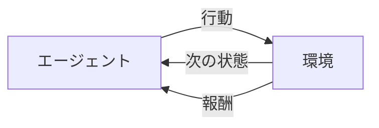

# 強化学習

「正解データ」を与えるのではなく、**試行錯誤を通じて報酬を最大化する行動を学ぶ**手法です。ゲーム AI・ロボット制御・推薦システム・LLM のファインチューニング（RLHF）などに使われます。

---

## はじめて読む人へ

教師あり学習は「正解ラベルからの学習」、教師なし学習は「データの構造発見」でした。強化学習は「環境との相互作用から、より良い行動を学ぶ」という第三のパラダイムです。

### 読む前に押さえること

- [教師あり学習](教師あり学習.md) の基本的な学習の枠組み
- Python の基本的なクラス・ループの書き方

### 読み終えたら説明できること

- エージェント・環境・状態・行動・報酬の関係を図で説明できる
- Q 学習が何を更新しているかを説明できる
- 強化学習の応用例を 3 つ挙げられる

---

## 基本の枠組み

強化学習は「エージェントが環境と相互作用しながら学習する」プロセスです。



| 概念 | 説明 | 例（ゲームAI）|
|------|------|-------------|
| **エージェント** | 意思決定する主体 | ゲームのキャラクター |
| **環境** | エージェントが作用する世界 | ゲームのフィールド |
| **状態 $s$** | 現在の状況を表す情報 | 自分・敵・アイテムの位置 |
| **行動 $a$** | エージェントが取れる操作 | 上下左右・攻撃 |
| **報酬 $r$** | 行動の良さを示すスカラー | +1（敵撃破）、-1（ゲームオーバー）|
| **方策 $\pi$** | 状態 → 行動のマッピング | 「状態 $s$ のとき行動 $a$ を選ぶ確率」 |

---

## マルコフ決定過程（MDP）

強化学習の数学的な枠組みです。「現在の状態 $s_t$ と行動 $a_t$ だけで次の状態 $s_{t+1}$ が決まる（過去は不要）」という仮定を **マルコフ性** と呼びます。

$$
\text{MDP} = (S, A, P, R, \gamma)
$$

- $S$：状態の集合
- $A$：行動の集合
- $P(s'|s, a)$：遷移確率（行動 $a$ をとると状態 $s$ から $s'$ に移る確率）
- $R(s, a)$：報酬関数
- $\gamma \in [0, 1)$：割引率（未来の報酬をどれだけ重視するか）

---

## 累積報酬と割引率

エージェントが最大化したいのは「今後得られる報酬の合計」です。ただし遠い未来の報酬は不確かなので割引きます。

$$
G_t = r_t + \gamma r_{t+1} + \gamma^2 r_{t+2} + \cdots = \sum_{k=0}^{\infty} \gamma^k r_{t+k}
$$

$\gamma = 0.9$ なら 10 ステップ後の報酬は現在の $0.9^{10} \approx 0.35$ 倍の価値に割り引かれます。

---

## Q 学習（Q-Learning）

状態 $s$ で行動 $a$ を取ったときの「期待累積報酬」を表す **Q 値**（行動価値）を学習します。

$$
Q(s, a) \leftarrow Q(s, a) + \alpha \left[ r + \gamma \max_{a'} Q(s', a') - Q(s, a) \right]
$$

- $\alpha$：学習率（どれだけ Q 値を更新するか）
- $r + \gamma \max_{a'} Q(s', a')$：TD ターゲット（実際に得た報酬 + 次状態での最大 Q 値）
- $\big[\cdots - Q(s, a)\big]$：TD 誤差（予測と実績のずれ）

Q 値が収束すれば、各状態で「Q 値が最大の行動を選ぶ」ことで最適な方策が得られます。

### グリッドワールドで実装

```python
import numpy as np

# 4x4 グリッド: 0=通常, -1=壁, +10=ゴール
GRID = np.array([
    [0, 0, 0, 0],
    [0, -1, 0, -1],
    [0, 0, 0, -1],
    [-1, 0, 0, 10],
])
ACTIONS = [(-1, 0), (1, 0), (0, -1), (0, 1)]  # 上下左右
n_states = 16
n_actions = 4

Q = np.zeros((n_states, n_actions))
alpha, gamma, epsilon = 0.1, 0.9, 0.1

def state_to_idx(r, c):
    return r * 4 + c

def step(r, c, a):
    dr, dc = ACTIONS[a]
    nr, nc = r + dr, c + dc
    if 0 <= nr < 4 and 0 <= nc < 4 and GRID[nr, nc] != -1:
        r, c = nr, nc
    reward = GRID[r, c]
    done = (reward == 10)
    return r, c, reward, done

# 学習ループ
for episode in range(2000):
    r, c = 0, 0
    for _ in range(100):
        s = state_to_idx(r, c)
        # ε-greedy: ε の確率でランダム行動（探索）
        a = np.random.randint(n_actions) if np.random.rand() < epsilon else np.argmax(Q[s])
        nr, nc, reward, done = step(r, c, a)
        ns = state_to_idx(nr, nc)
        # Q 値の更新
        Q[s, a] += alpha * (reward + gamma * np.max(Q[ns]) - Q[s, a])
        r, c = nr, nc
        if done:
            break
```

---

## Deep Q-Network（DQN）

状態数が膨大（ゲーム画面のピクセル値など）になると Q テーブルが使えません。Q 関数をニューラルネットワークで近似するのが **DQN** です。

!!! info ""
    ```
    入力: 状態 s（ゲームの画面 = 84×84×4 フレーム）
       ↓ CNN
       ↓ 全結合層
    出力: 各行動の Q 値（例: 右=2.3, 左=1.8, ジャンプ=3.1）
    ```

DQN の主要なテクニック：

| テクニック | 目的 |
|----------|------|
| Experience Replay | 過去の経験をランダムに再利用（相関を断つ）|
| Target Network | Q 値更新の安定化（定期コピー）|
| ε-greedy | 探索と活用のバランス |

```python
# Gymnasium（旧 OpenAI Gym）でのCartPole
import gymnasium as gym

env = gym.make("CartPole-v1")
obs, _ = env.reset()
# obs = [cart_pos, cart_vel, pole_angle, pole_vel]

for _ in range(1000):
    action = env.action_space.sample()   # ランダム行動（未学習）
    obs, reward, terminated, truncated, _ = env.step(action)
    if terminated or truncated:
        obs, _ = env.reset()

env.close()
```

---

## 方策勾配法（Policy Gradient）

Q 学習が「価値関数を学ぶ」のに対し、方策勾配法は「方策 $\pi_\theta$ を直接学ぶ」アプローチです。

$$
\nabla_\theta J(\theta) = \mathbb{E}_\pi \left[ \nabla_\theta \log \pi_\theta(a|s) \cdot G_t \right]
$$

「うまくいった行動の確率を上げ、うまくいかなかった行動の確率を下げる」という直感です。

**PPO（Proximal Policy Optimization）** は方策勾配法の改善版で、現在最も広く使われます。ChatGPT の RLHF（人間フィードバックからの強化学習）でも PPO が使われています。

---

## 応用例

| 分野 | タスク | 手法 |
|------|--------|------|
| ゲーム AI | Atari・囲碁・チェス | DQN, AlphaGo（MCTS+RL）|
| ロボット | 歩行・把持・操作 | PPO, SAC |
| 推薦システム | 長期的なユーザー満足度最適化 | 方策勾配 |
| LLM | 人間フィードバックに沿った応答 | RLHF（PPO） |
| 自動運転 | 走行計画・車線変更 | 連続行動空間の方策勾配 |

---

## 確認問題

1. ε-greedy 法の「ε」が大きいとどうなりますか？小さいとどうなりますか？
2. Q 学習の更新式にある「$\gamma \max_{a'} Q(s', a')$」の役割を説明してください。
3. RLHF（人間フィードバックからの強化学習）では「報酬」として何を使っていますか？

---

## 関連ページ

- [教師あり学習](教師あり学習.md) — 三分類の比較対象
- [機械学習理論](機械学習理論.md) — 最適化・損失関数の理論的背景
- [深層学習入門](深層学習入門.md) — DQN の基盤となるニューラルネットワーク
- [LLM活用入門](LLM活用入門.md) — RLHF で調整された LLM の活用
