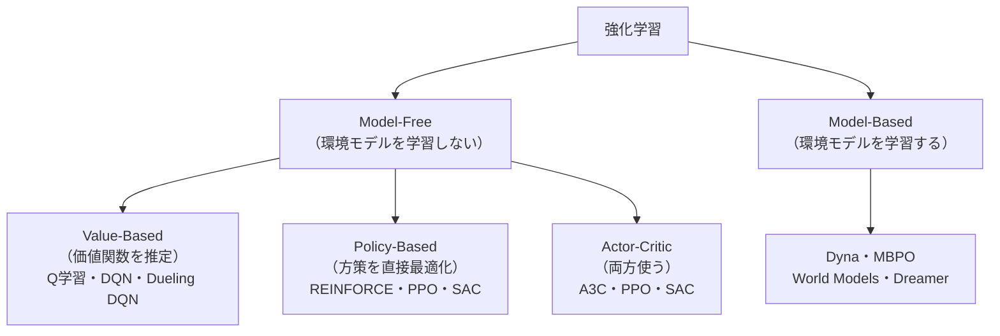

# 強化学習詳解

[強化学習](強化学習) で学んだ Q 学習・DQN を超え、連続行動空間・実環境への適用・LLM との接続まで扱います。Policy Gradient・Actor-Critic・PPO・SAC・Model-Based RL の数学的基礎と実装指針を整理します。

---

## はじめて読む人へ

DQN は「離散行動（上下左右など）」に有効ですが、ロボットアームの関節角度制御や自動運転のハンドル操作のような「連続行動」には対応できません。PPO（ChatGPT の RLHF で使われたアルゴリズム）と SAC（ロボット制御の事実上の標準）を中心に学びます。

### 読む前に押さえること

- [強化学習](強化学習) — MDP・Q 学習・DQN の基礎
- [微分・最適化基礎](微分・最適化基礎) — 勾配計算
- [確率・統計基礎](確率・統計基礎) — 期待値・確率分布

### 読み終えたら説明できること

- Policy Gradient が「方策のパラメータを直接最適化する」仕組みを説明できる
- PPO のクリッピングが「大きな更新を防ぐ」理由を説明できる
- SAC のエントロピー正則化が「探索と活用のバランス」を取る仕組みを説明できる

---

## 強化学習の分類



---

## Policy Gradient（REINFORCE）

### 方策勾配定理

価値関数を推定する代わりに、**方策 $\pi_\theta$ のパラメータを直接勾配上昇で最適化**します。

目的関数（期待累積報酬）：

$$
J(\theta) = \mathbb{E}_{\tau \sim \pi_\theta}\left[\sum_{t=0}^T \gamma^t r_t\right]
$$

**方策勾配定理：**

$$
\nabla_\theta J(\theta) = \mathbb{E}_{\tau \sim \pi_\theta}\left[\sum_{t=0}^T \nabla_\theta \log \pi_\theta(a_t|s_t) \cdot G_t\right]
$$

$G_t = \sum_{t'=t}^T \gamma^{t'-t} r_{t'}$：時刻 $t$ 以降の割引累積報酬。

**直感：** $G_t$ が大きかった（報酬が多かった）行動 $a_t$ の対数確率 $\log \pi_\theta(a_t|s_t)$ を増やします。悪い報酬だった行動の確率を下げる。これが「試行錯誤から学ぶ」の数学的表現です。

### REINFORCE の問題

- **高分散：** エピソードが長いと $G_t$ が大きく変動し、学習が不安定
- **サンプル効率が悪い：** 集めたエピソードを 1 回しか使えない（On-policy）
- **対策：** ベースライン $b(s_t)$ を引いて分散を下げる

$$
\nabla_\theta J(\theta) \approx \sum_t \nabla_\theta \log \pi_\theta(a_t|s_t) \cdot (G_t - b(s_t))
$$

---

## Actor-Critic

Policy（Actor）と価値関数（Critic）を**同時に学習**します。Critic が「今の行動がどれくらい良いか」を教えることで、Policy Gradient の分散を下げます。

### 優位関数（Advantage Function）

$$
A(s, a) = Q(s, a) - V(s)
$$

「行動 $a$ を取ることが、その状態の平均的な行動と比べてどれだけ良いか」。$A > 0$ なら平均より良い行動、$A < 0$ なら平均より悪い行動。

### TD 誤差を使った推定

実際には $Q(s,a)$ を直接計算するのでなく、Critic（価値関数 $V_\phi$）の TD 誤差で近似します：

$$
\hat{A}(s_t, a_t) = r_t + \gamma V_\phi(s_{t+1}) - V_\phi(s_t) \quad \text{（1 ステップ TD)}
$$

または GAE（Generalized Advantage Estimation）で複数ステップを組み合わせます。

---

## PPO（Proximal Policy Optimization）

OpenAI が 2017 年に提案。ChatGPT の RLHF で使われたアルゴリズムです。

### TRPO からの動機

**TRPO（Trust Region Policy Optimization）：** 方策の更新量を KL ダイバージェンスで制限します：

$$
\max_\theta \hat{\mathbb{E}}\left[\frac{\pi_\theta(a|s)}{\pi_{\theta_{\text{old}}}(a|s)} \hat{A}\right] \quad \text{s.t.} \quad \mathbb{E}[D_{\text{KL}}(\pi_{\theta_{\text{old}}} \| \pi_\theta)] \leq \delta
$$

制約付き最適化が複雑なため、PPO はより単純なクリッピングで近似します。

### PPO-Clip 損失

確率比 $r_t(\theta) = \frac{\pi_\theta(a_t|s_t)}{\pi_{\theta_{\text{old}}}(a_t|s_t)}$ を使います：

$$
\mathcal{L}^{\text{CLIP}}(\theta) = \hat{\mathbb{E}}_t\!\left[\min\!\left(r_t(\theta)\hat{A}_t,\; \text{clip}(r_t(\theta), 1-\varepsilon, 1+\varepsilon)\hat{A}_t\right)\right]
$$

**クリッピングの意味：**

!!! info ""
    ```
    Advantage > 0 の場合（良い行動）:
      r_t = 1.2 → min(1.2×A, 1.1×A) = 1.1×A で上限クリップ
      → 良い行動への確率を増やしすぎない
    
    Advantage < 0 の場合（悪い行動）:
      r_t = 0.8 → min(0.8×A, 0.9×A) = 0.8×A で下限クリップ
      → 悪い行動への確率を減らしすぎない
    ```

$\varepsilon = 0.2$ が一般的。更新前後の方策が大きく離れることを防ぎ、学習を安定させます。

### PPO の学習ループ

```python
for iteration in range(total_iterations):
    # 1. 現在の方策でデータ収集（On-policy）
    rollouts = collect_trajectories(env, policy, n_steps=2048)

    # 2. Advantage 推定（GAE）
    advantages = compute_gae(rollouts, value_net, gamma=0.99, lam=0.95)

    # 3. 複数エポック（4〜10 回）同じデータで更新
    for epoch in range(n_epochs):
        for minibatch in get_minibatches(rollouts, batch_size=64):
            loss = ppo_clip_loss(policy, minibatch, advantages, clip_eps=0.2)
            loss += value_loss + entropy_bonus
            optimizer.step()
```

**重要：** On-policy なので集めたデータを数エポックしか使えません（多すぎると古いデータで更新して不安定になる）。

---

## SAC（Soft Actor-Critic）

連続行動空間での最高性能を持つ Off-policy アルゴリズムです。

### エントロピー正則化（最大エントロピー RL）

通常の RL 目標に**方策のエントロピー**を加えます：

$$
J(\pi) = \sum_t \mathbb{E}_{(s_t, a_t) \sim \rho_\pi}\!\left[r(s_t, a_t) + \alpha \underbrace{\mathcal{H}(\pi(\cdot|s_t))}_{\text{エントロピーボーナス}}\right]
$$

$\alpha$：温度パラメータ（探索と活用のバランス）、$\mathcal{H}(\pi) = -\mathbb{E}[\log \pi(a|s)]$。

**エントロピー正則化の効果：**
- ランダムな方策（エントロピー大）を維持しようとする → 探索を促進
- 報酬が高い行動に集中する（エントロピー小）とペナルティ → 局所最適に嵌りにくい

### Soft Q 関数と Soft Bellman 方程式

$$
Q(s_t, a_t) = r_t + \gamma \mathbb{E}_{s_{t+1}}\!\left[V(s_{t+1})\right]
$$

$$
V(s_t) = \mathbb{E}_{a_t \sim \pi}\!\left[Q(s_t, a_t) - \alpha \log \pi(a_t|s_t)\right]
$$

### SAC のアーキテクチャ

| コンポーネント | 役割 |
|-------------|------|
| Actor（方策 $\pi_\phi$）| Gaussian 方策：平均と分散を出力し、行動をサンプリング |
| Critic 1, 2（$Q_{\theta_1}, Q_{\theta_2}$）| 二重 Critic でポジティブバイアスを低減 |
| ターゲットネットワーク | 学習安定化のため EMA で緩やかに更新 |
| Replay Buffer | Off-policy で過去の経験を再利用 |

**二重 Critic（Double Q）：** $\min(Q_{\theta_1}, Q_{\theta_2})$ を使うことで Q 値の過大推定を防ぎます。

---

## Model-Based RL

環境の**遷移モデル** $\hat{P}(s_{t+1} | s_t, a_t)$ を学習して、仮想的な経験（rollout）を生成します。

### Dyna アーキテクチャ

!!! info ""
    ```
    実環境   → 少量のデータを収集 → モデルを更新
               ↓
    学習済みモデル → 仮想 rollout を大量生成 → 価値関数/方策を更新
    ```

実環境のサンプルを増幅できるため**サンプル効率が大幅に向上**します。

### MBPO（Model-Based Policy Optimization）

モデルのエラーが蓄積する問題（Compounding Error）に対処するため、**短い rollout**（$k=1〜5$ ステップ）だけ使って実データと混合します。

### World Models・Dreamer

Latent Dynamics Model（潜在空間での遷移モデル）を使って、**夢の中で学習**します。

!!! info ""
    ```
    実環境 → エンコーダ → 潜在状態 z
                                  ↓ 遷移モデル（RSSM）
                        潜在状態 z' → デコーダ → 仮想画像
                                  ↓
                        方策の更新（潜在空間内で完結）
    ```

---

## RLHF（Reinforcement Learning from Human Feedback）

[ファインチューニング詳解](ファインチューニング詳解) で学んだ RLHF の RL 部分（PPO）をここで接続します。

!!! info ""
    ```
    報酬モデル rm(x, y):
      プロンプト x, 応答 y のペアに報酬を付与
    
    PPO による最適化:
      J(θ) = E_{x,y~π_θ}[rm(x,y)] - β·D_KL(π_θ || π_ref)
    
      KL ペナルティで元の言語モデルから離れすぎないよう制約
    ```

$\beta$：KL ペナルティ係数。大きいほど元のモデルに近い応答を保つ。

---

## 数学的導出

### 方策勾配定理の証明

$$
\nabla_\theta J(\theta) = \nabla_\theta \mathbb{E}_{\tau \sim \pi_\theta}[R(\tau)]
$$

対数微分トリック（$\nabla_\theta \log p(\tau|\theta) = \nabla_\theta p(\tau|\theta) / p(\tau|\theta)$）を使います：

$$
= \mathbb{E}_{\tau \sim \pi_\theta}\left[\nabla_\theta \log p(\tau|\theta) \cdot R(\tau)\right]
$$

軌跡の確率 $p(\tau|\theta) = p(s_0) \prod_t \pi_\theta(a_t|s_t) p(s_{t+1}|s_t, a_t)$ の対数を取ると、環境の遷移確率 $p(s_{t+1}|s_t, a_t)$ は $\theta$ に依存しないため消え：

$$
\nabla_\theta \log p(\tau|\theta) = \sum_t \nabla_\theta \log \pi_\theta(a_t|s_t)
$$

したがって：

$$
\nabla_\theta J(\theta) = \mathbb{E}_{\tau}\!\left[\sum_t \nabla_\theta \log \pi_\theta(a_t|s_t) \cdot R(\tau)\right]
$$

因果性（時刻 $t$ の行動は時刻 $t$ 以前の報酬に影響しない）を使ってさらに精緻化すると $R(\tau) \to G_t$ になります。

---

## 確認問題

1. REINFORCE の分散が大きい理由と、ベースラインで分散を下げられる理由を説明してください。
2. PPO のクリッピング $\text{clip}(r_t, 1-\varepsilon, 1+\varepsilon)$ が「大きな更新を防ぐ」理由を説明してください。
3. SAC のエントロピーボーナス $\alpha \mathcal{H}(\pi)$ が探索を促進する理由を説明してください。
4. RLHF で PPO を使うとき、KL ペナルティが必要な理由を「報酬ハッキング」の観点から説明してください。

---

## 関連ページ

- [強化学習](強化学習) — MDP・Q 学習・DQN の基礎
- [ファインチューニング詳解](ファインチューニング詳解) — RLHF・DPO での RL の使われ方
- [微分・最適化基礎](微分・最適化基礎) — 勾配計算・最適化アルゴリズム
- [確率過程](確率過程) — マルコフ決定過程の数学的基礎

---

[← ホームへ](Home)
